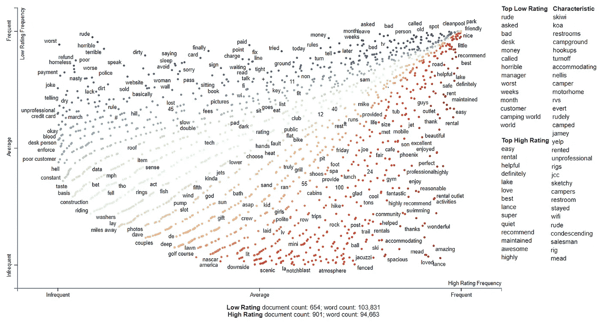
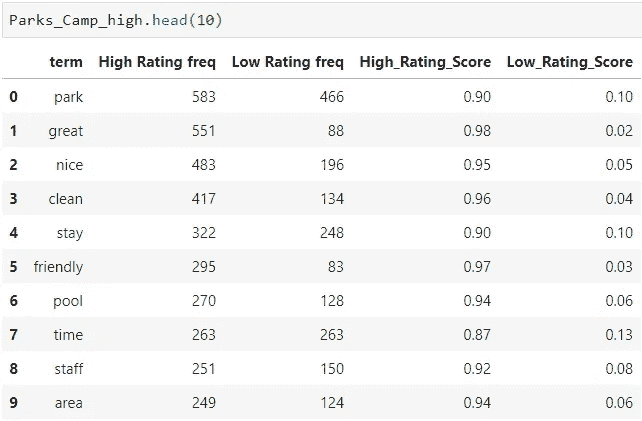

# 利用散点文本空间分析 Yelp 数据集

> 原文：<https://towardsdatascience.com/analyzing-yelp-dataset-with-scattertext-spacy-82ea8bb7a60e?source=collection_archive---------20----------------------->

## 使用 NLP 对文本数据进行探索性数据分析和可视化



Scattertext spaCy

文本挖掘领域最关键的工作之一是可视化地呈现文本数据的内容。使用自然语言处理(NLP)，数据科学家可以总结文档，创建主题，从不同角度和细节范围探索内容的故事情节。

这篇文章将探索 [Yelp 数据集](https://www.yelp.com/dataset/challenge)，然后使用[散点图](https://spacy.io/universe/project/scattertext)来可视化和分析文本数据。

# 什么是分散文本？

> [Scattertext 是一种工具，旨在可视化哪些单词和短语比其他单词和短语更具类别特征。](https://github.com/JasonKessler/scattertext)

## 数据源

对于这个例子，我们将关注 [Yelp 数据集](https://www.yelp.com/dataset/challenge)中与 RV 相关的类别。完整的 Yelp 数据集包含 1000 多个类别和 600 万条评论。我们编辑过的 CSV 文件可以在我的 [GitHub repo](https://github.com/gyhou/yelp_dataset) 中找到，还有关于我如何将 Yelp 数据集 JSON 文件转换成 CSV 文件的 Jupyter 笔记本。一篇[媒体文章](https://link.medium.com/0k0DEb3Qy1)也贴出来了，对转换过程给出了更详尽的解释。

这个编辑过的 csv 由 Yelp 数据集中的 5 个类别组成:
`RV Repair``RV Dealers``RV Rental``RV Parks``Campgrounds`。

## 加载并清理数据集

```
import pandas as pddf = pd.read_csv('yelp_reviews_RV_categories.csv')
```

在开始之前，我们想知道如何对评级进行分组。通过使用 seaborn distplot，我们可以检查评级在该数据集中的分布情况。

```
import seaborn as sns
sns.distplot(df['review_stars']);
```


A [seaborn distplot](https://seaborn.pydata.org/generated/seaborn.distplot.html) plots a univariate distribution of observations

该图显示大多数评论被评为 1 星或 5 星，而我们只能比较 5 星和 1 星之间的评论，这将忽略 2-4 星的评论。相反，让我们将评级合并为高或低。

```
df['rating'] = df['review_stars'].replace(
               {1:'Low Rating', 2:'Low Rating', 3:'Low Rating',
                4:'High Rating', 5:'High Rating'})
```

因为我们知道这个数据集有 5 个不同的类别，我们可以进一步将相似的类别组合在一起。让我们只使用`RV parks`和`Campgrounds`，暂时忽略`RV Repair`、`RV Dealers`和`RV Rental`。

```
df_Parks_Camp = df[df['categories'].str.contains(
                'RV Parks|Campgrounds', na=False)]
```

# NLP 分析—使用散点图和空间

既然我们已经预处理了数据集，我们可以开始一些分析了。确保你已经在你的内核中下载了一个空间英语模型。

> `en_core_web_sm` [是一个在书面网络文本(博客、新闻、评论)上训练的小型英语模型，包括词汇、向量、句法和实体。](https://spacy.io/models#conventions)

```
import spacy
import scattertextnlp = spacy.load('en_core_web_sm')
```

如果没有，可以下载！

```
!python -m spacy download en_core_web_sm
```

接下来，我们将使用下面的函数来:

*   建立我们的语料库，从数据集中收集文本
*   获取术语频率和[比例 f 值](https://github.com/JasonKessler/scattertext#understanding-scaled-f-score)
*   为`High Rating` & `Low Rating`按降序创建数据帧

```
Parks_Camp_high, Parks_Camp_low = term_freq(df_Parks_Camp)
```


**Left** — Sorted by High Rating. **Right** — Sorted by Low Rating

# 了解评分系统

Scattertext 使用[缩放的 f-score](https://github.com/JasonKessler/scattertext#understanding-scaled-f-score) ，它考虑了类别特定的精度和术语频率。虽然一个术语可能在两个类别中频繁出现(`High`和`Low`评级)，但是缩放的 f 分数确定该术语是否比其他术语更具有类别特征(`High`或`Low`评级)。

例如，虽然术语`park`在`High`和`Low`评级中出现频率很高，但缩放后的 f 分数得出的结论是`park`与`High` 0.90 的关联度高于`Low` 0.10 的评级。因此，当评论包含术语`park`时，它更具有`High`评级类别的特征。

# 停止言语

请注意，有些术语不在列表中，如`in the`、`of the`、`to the`、`it was`，这些是可以删除的停用词**、**的一些示例。

在进行自然语言处理时，停用词是一些非常常见的词，这些词在帮助选择文档时似乎没有什么价值，它们被完全排除在词汇表之外，例如`the`、`them`和`they`。

```
remove_terms(nlp.Defaults.stop_words, ignore_absences=True)
```

spaCy 有 326 个默认停用词，我们已经使用上面的代码从语料库中删除了这些词，但我们可以添加更多。

我们可以从自然语言工具包(NLTK)中添加更多的停用词。

```
from nltk.corpus import stopwords
stopWords = set(stopwords.words('english'))
nlp.Defaults.stop_words |= stopWords
```

我们也可以通过创建一个`stopwords.txt`文件来设置我们自己的停用词。
将文本文件中的任何内容(包括符号、数字、术语)作为停用词从语料库中删除。
随意使用我的 [GitHub repo](https://github.com/gyhou/yelp_dataset) 里面的`stopwords.txt`文件。

```
with open('stopwords.txt', 'r') as f:
    str_f = f.read()
    set_stopwords = set(str_f.split('\n'))
nlp.Defaults.stop_words |= set_stopwords
```

每当我们完成文本文件的更新时，记得通过运行上面的代码来保存它，以便它更新到原始的停用词集。

一旦添加了更多的停用词，我们可以再次运行`term_freq`功能。

```
Parks_Camp_high, Parks_Camp_low = term_freq(df_Parks_Camp)
```



Term frequency and score after removing more stop words.

# 分散文本可视化

数据表很好，但是可视化更好！
我们可以创建一个散点图，直观显示 Yelp 数据集中评论的高评分和低评分之间的术语关联。

```
corpus_dataframe = df_Park_Camp
html = scattertext.produce_scattertext_explorer(
                   corpus,
                   category='Low Rating',
                   category_name='Low Rating',
                   not_category_name='High Rating',
                   width_in_pixels=1000,
                   metadata=corpus_dataframe['name'])
```

## 交互式 HTML

[https://gyhou . com/RV-Parks-Campgrounds-Yelp-Reviews-scattertext . html](https://gyhou.com/RV-Parks-Campgrounds-Yelp-Reviews-Scattertext.html)


Searching for a term will show the name of the business and reviews.

## 理解散点图

在散点图的右侧，我们有一个评级最高的术语的概述和一个无序的术语列表(在特征下)。如果我们点击该术语，它将向我们显示数据集中的特定评论，显示为`Low`或`High`评级。我们也可以在左下角手动搜索一个术语。

从散点图中，我们可以快速浏览一下评论中使用的术语。图右侧的红点表示与`High`评级更相关的术语，而左侧的蓝点表示与`Low`评级更相关的术语。

有了这个散点图，我们可以很容易地搜索可能对 Yelp 业务有用的术语。我们不仅可以看到一个术语是否与正面或负面评价更密切相关，还可以阅读每个单独的评论。

## 保存并共享为 HTML 文件

我们现在可以将它保存为 HTML 文件，以便在浏览器上查看和共享！

```
html_file_name = "RV-Parks-Campgrounds-Yelp-Review-Scattertext.html"
open(html_file_name, 'wb').write(html.encode('utf-8'))
```

感谢阅读！我很乐意听到你的想法，在这里评论或给我发消息。用于此的代码位于我的 [GitHub 库](https://github.com/gyhou/yelp_dataset)中。