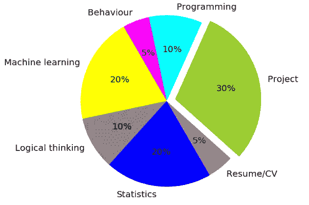
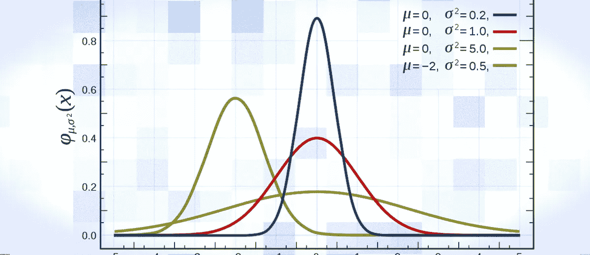

# 数据科学面试剖析

> 原文：<https://towardsdatascience.com/anatomy-of-data-science-interview-fa9ff7caa37d?source=collection_archive---------18----------------------->

在数据科学行业拥有近十年的经验，我经常扮演面试双方的角色。在这篇文章中，我的意图是展示典型数据科学面试的一般结构，以及如何接近这个过程以取得成功。

*免责声明:这是基于我的个人经验，可能与你的有有限的重叠，让我们看看我们的经验和重叠程度有多相似吧！！！！！！！！！！！！*

***在文章的最后，我列出了一些给寻找数据科学工作的新生的特别提示。***

## **破冰:**

在一次典型的面试中，在进入任何技术性/非技术性的讨论之前，首先你应该让自己对这个过程感到舒服。介绍部分给你一个与面试官建立融洽关系并展示你的沟通技巧的机会，千万不要错过！！！

你可以对面试官说一句非常简单的话“嗨，x 先生/女士，你好吗”？有许多你可以使用的班轮，这是一个候选线开始。随着我们的发展，我将解释如何处理*“谈谈你自己”*这个问题！！

## **面试结构:**

根据我的观察，我觉得数据科学面试的各个部分及其权重可以大致通过下面的饼图来表示

让我们分别讨论每一部分。

# **项目-30%**

简历中提到的项目是你在面试中成功的关键。参加面试的人应该对这些项目有很好的掌握。在解释项目时，确保你很好地解释了整个流程，并强调了你声称已经完成的部分。预期问题如下

*   你为什么用兰登森林，而不是 SVM？
*   为什么你认为精度不能进一步提高？
*   请解释您遇到的一两个实时问题，以及您是如何解决的？
*   这个模型对商业有什么用处(**你应该用美元数量来回答这个问题)？**

等等。等等。

一般来说，除了人力资源面试，项目讨论将是所有面试的一部分。一些回合可能只是项目的表面概述，而一些回合可能对项目进行深入讨论。除了接受资深数据科学家的采访，有时你可能需要与非常资深的人进行项目讨论，如董事、分析主管等。对你的期望很简单，你应该亲自动手，而不仅仅是“训练有素”的人，你应该了解数据科学项目如何通过向业务/客户交付价值来工作。

总结:对你的项目有很好的掌控力。

# **机器学习——20%**

有一句名言，大致意思是“你的知识和面试官的知识重叠度越大，你在面试中被选中的几率就越高”。

话虽如此，在我的职业生涯中，我还没有见过任何一位数据科学家研究过所有领域/算法。有人对“自然语言处理”有很好的了解，但在“回归模型”方面做了有限的工作。有人擅长“时间序列预测”，但不擅长“无监督学习技术”。这些都是完全可以接受的场景。你不需要主宰一切。如果你的简历上说你做过《随机森林》，那你应该对随机森林有很好的了解。然而，这里有一些机器学习讨论的通用要点。擅长这些:

*   线性回归和逻辑回归(深入理解这两种技术、分类与回归、假设、系数含义、β值和截距的商业解释、误差类型、对数似然函数、损失函数、套索和岭回归等)
*   决策树和随机森林(什么和为什么，偏差方差权衡，修剪，过拟合和欠拟合，模型预测能力与模型解释能力，装袋，提升概念等。)
*   主成分分析、线性判别分析、监督与非监督学习、变量缩减技术、多重共线性、方差膨胀因子、模型性能测量等。
*   对 K 近邻、K 均值聚类、推荐引擎、支持向量机、神经网络、朴素贝叶斯等的高级理解。

带走——对重要的技术有高层次的理解，对简历中提到的技术有深入的理解。

# **统计-20%**

> 非统计背景的人害怕从事数据科学职业的一个原因——是吗？？:)

在我看来，在统计部分只会对你的一项技能进行评估——“*你知道解决一个数据科学问题需要什么吗”？？*

统计学本身是一个巨大的知识和研究领域，有很多东西需要了解和理解，但是如果你擅长以下几点，你会被认为足够优秀！

*   变量:名词性/分类性/序数
*   取样技术——什么、为什么和什么时候
*   集中趋势的测量——均值、中值、众数、绞合偏差、方差、百分位数、对盒须图和其他图的理解
*   正态、泊松、均匀等概率分布及其在数据中的意义
*   降维——需求和方法
*   估计技术和假设检验

拿走——如果你是这个领域的新手，我的建议是不要打破一切关于统计的东西。知道需要什么就行了。

# **编程-10%:**

> “非编程背景”的人开始他们的数据科学之旅的另一个恐惧的原因。

需要多少编程技能？简单回答“多多益善”。然而，从面试的角度来看，我们将评估你是否能够将你的知识应用到给定的数据科学问题上。要做到这一点，需要编码。它可能不是非常高效、智能、高端的编码，但它应该服务于这个目的。换句话说，你知道统计学，你知道机器学习技术，你面前有数据。当且仅当你知道如何编码，你将苹果应用你的知识给定的数据。关于编码的几个要点:

*   **SQL——这必须有技巧——无处可逃**
*   了解数据类型和结构，如变量、常数、字符串、数组、数据帧、数据表、矩阵、列表等。
*   理解条件语句和循环，如 if else、嵌套 if else、while do while、switch、for loop、break、continue 语句等。
*   **R 语言特有的** —安装和加载包、旋转表、聚合、汇总、过滤、合并、rbind、cbind、RDS、R 环境、dplyr、tidyr、caret、data.table、sqldf、ggplot2、googleVis 等包
*   **Python 特有的** **语言**—pandas、NumPy、scikit-learn、matplotlib、seaborn 等包的功能和用法。元组、集合、字典、列表、列表理解、范围函数、可变与不可变、何时使用哪种数据类型、聚合、汇总、过滤、合并、内存管理等。

现在，很少有组织在数据科学面试中进行书面编程测试。它可以是选择题测试或要编写的代码片段。为了通过这一轮，你应该对代码很在行。

拿走——让你的手弄脏编码——没有其他的选择会有很大的帮助。

# **逻辑思维——10%**

无论是数据科学面试还是 java 面试，逻辑思维都是有经验的面试官在讨论中试图触及的问题之一。期望也是直截了当的——“在一个给定的情况下/关于一个给定的问题陈述，你能有多逻辑地思考”。从数据科学的角度来看，它可以细分为以下两个部分:

*   **基于场景的** —基于场景的评估将通过给你一个假想的情况或问题陈述，并检查你的思考过程来进行。举个例子——如果我正在面试一个人 A，我会问他/她类似这样的问题—“***我们的一个消费品(CPG)客户 ABC 希望我们建议他们在下一季度增加 5%收入的方法”*** 你将如何处理这个问题陈述。我希望 A 的回答是 ***“为了增加收入，他们应该卖得更多，他们能为卖得更多做些什么？他们能做交叉销售/追加销售吗？他们能做联合采矿吗？***
*   **谜题** —面试官可以向你抛谜题，检验你的逻辑思维能力。这里提到了一些著名的

带走——不断提高自己的分析思维能力。

# **行为-5%:**

几年前，我有这样的印象，如果你在上面提到的方面做得好，那么你肯定会被录用。然而，我最近的一次经历迫使我也给行为 5%的权重。

> 我的求职面试经历——在人力资源部将我的资料列入候选名单，并邀请我参加第一轮面试时，她在邮件中给我发了 YouTube 视频链接。在该视频中，该组织的首席执行官谈到了组织价值观、文化和宗旨等。我没有太在意，参加了面试。这是一个“很难破解”的面试，但我设法通过了多轮。贴那个，资深 HR 来讨论，她问我为什么要加入这个组织，对这个组织了解多少？我对这个组织了解不多，因此不能很好地回答。我不知道这将成为一个大问题！招聘 HR 给我打电话，她很不高兴我没有去过她分享过的 you-tube 视频。在进行了一次很好的技术面试后，我必须再进行两轮行为测试，在测试中我必须让他们相信我了解他们的组织、文化和价值观，并且我会融入其中。

从上述经历中学到的是——“了解你要去面试的地方”，并期待类似于“你为什么想加入我们”、“你能适应我们的文化/价值观吗”、“我们做什么工作”、“我们的 CEO/年收入”等问题。

带走——对你将要参加面试的组织进行调查。

# **简历/CV-5%:**

这基本上是“*告诉我关于你自己的情况*”部分，你应该在简历中浏览一下。没有硬性规定它可以怎样，应该怎样。这又是一个展示你的沟通技巧和额外成就的好机会。尽量涵盖事情的广度，不要在项目或任何领域走得太深，而是给出概况。试着强调你独特的技能、奉献和成就。

举几个例子，在你的专业总结之后，加上这样的句子

*   我入选了国家级数学奥林匹克第二名
*   我是州足球队的一员
*   我在图像编辑软件上的博客有 5 万次阅读

您还可以添加一些有趣的事实，让环境变得不那么酷:):

*   我害怕……
*   我爱……
*   我隐藏的才能是……..
*   我罪恶的快乐是……

带走——正常地展示自己，保持舒适，因为这通常是讨论的第一个问题。

**新生特别提示:**

*   **展示你的学习能力**——很有可能你会错过一些问题、场景，或者在被问到时你会对一些概念感到困惑。在这些情况下，保持冷静，不要紧张。只要专注于展示一种学习的能力。你可以很简单地说“*我没有机会做这件事，如果有机会，我会学着去做”*
*   **不要把事情看得太重**——有时面试官可能会为了测试你的反应而把你推到不舒服的地方。记住，他或她与你没有任何私人恩怨。这只是对你态度的测试。有些面试官可能很有礼貌，有些可能很难相处。试着和两组人都保持平稳。
*   **学习行业语言—** 这是我观察到的 60–70%的大一新生的问题之一。我给他们的建议是努力学习工业语言，你不能粗鲁，现在就忘记你的大学语言。我想分享的一条黄金法则是——“记住名字”。这是我经历过的最神奇的事情之一。假设你是大卫，我打电话给你说**“你好”**而另一个人打电话给你说**“你好大卫”**哪个更好听？你有答案了！！它适用于我们所有人。任何时候你接到招聘公司/咨询公司/人力资源部等的电话。，他们会提名字，认真听，马上用。A 先生，你好，我是 ABC 公司的丹尼尔。你的回答应该是**“你好丹尼尔”**而不是**“你好”**。这可能听起来很简单，但相信我，它在各个方面都很神奇。做了就明白了。这个概念也适用于电子邮件通信。
*   带着微笑——我们都希望身边有快乐的环境。好人，有趣的人都喜欢，谁不喜欢微笑呢:)

带走——冷静、沉着、切题、舒适。你将成为雇佣你的组织的一笔财富。 牢记这一点，自信满满。

# **总结:**

感谢您的阅读。我很高兴与你分享我的经验，并祝你一切顺利。我的意图是看到你马上得到一份工作，如果你获得正确的技能并遵循正确的道路，这是可能的。

您还可以在此阅读从零开始成为数据科学家的途径[。](https://medium.com/@amanrai77/how-to-become-a-data-scientist-98b633271ade)

请随意评论你对这篇文章的看法，或者你想让我更详细讨论的任何事情。

在 Quora 上关注我，获取关于数据科学的常规答案[这里](https://www.quora.com/profile/Aman-Kumar-601)

加入我们的数据科学社区[脸书](https://www.facebook.com/groups/410222213093826)， [Twitter](https://mobile.twitter.com/unfoldds) ， [Instagram](https://www.instagram.com/unfold_data_science/) ， [LinkedIn](https://www.linkedin.com/in/aman-kumar-b4881440/)

谢谢你

Aman(amanrai77@gmail.com)