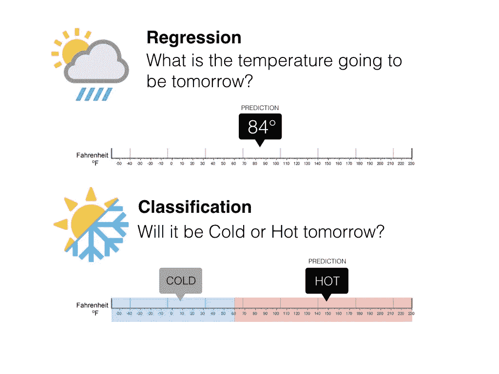
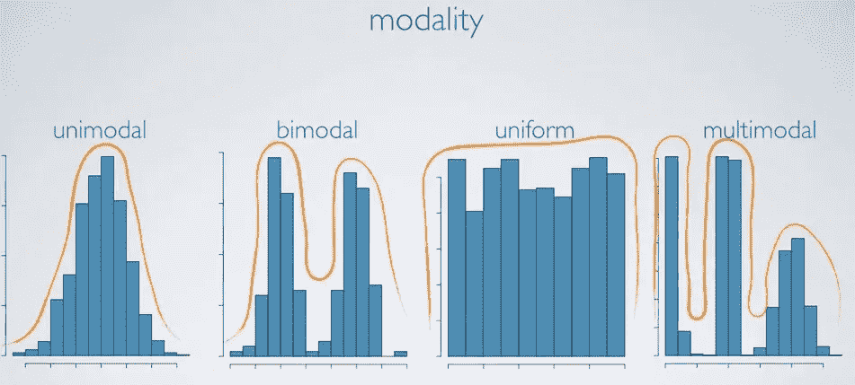
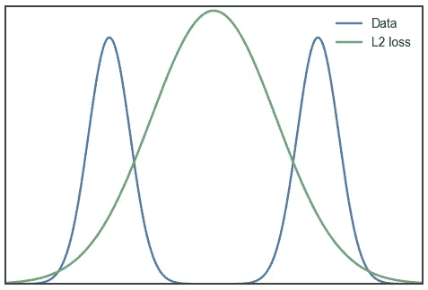
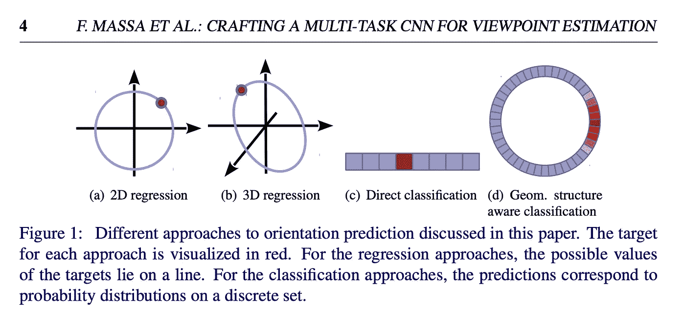
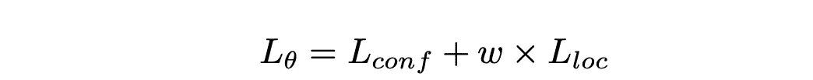
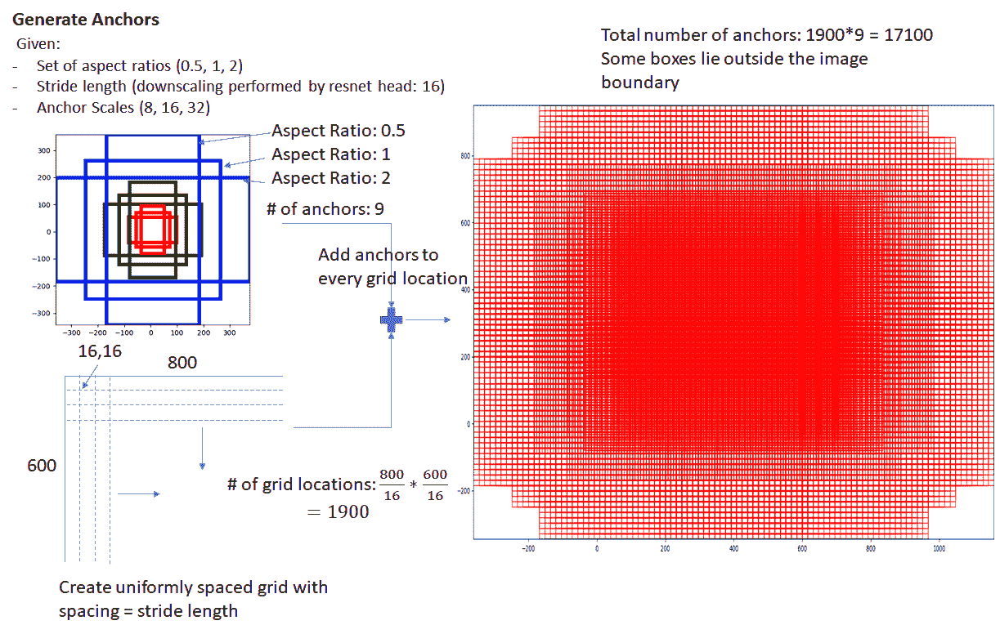
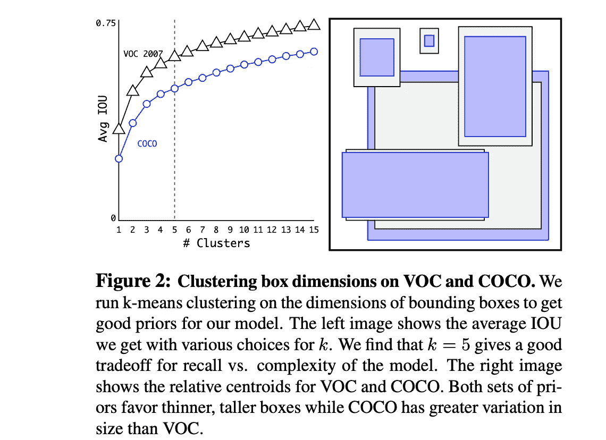

# 多模态回归——超越 L1 和 L2 损失

> 原文：<https://towardsdatascience.com/anchors-and-multi-bin-loss-for-multi-modal-target-regression-647ea1974617?source=collection_archive---------13----------------------->

深度学习最著名的用例是图像分类，目标是训练神经网络从 N 个预定义的可能性中选择一个。例如，经过训练的神经网络可以从许多类别中辨别出图像块中的对象类型(例如，猫)。在这种简单的情况下，softmax 损失函数将为您提供很好的服务。然而，有时我们必须回归一个连续的目标。这就是事情开始变得复杂的地方。

Regression vs Classification ([source](https://medium.com/@ali_88273/regression-vs-classification-87c224350d69))

当你面对一个连续的回归目标时，很容易将 L1 或 L2 损失直接应用到原始目标上，看看效果如何。如果一个回归目标是[单峰](https://en.wikipedia.org/wiki/Unimodality)(或者在分布中只有一个明显的峰值，非常像高斯分布)，L2 范数应该很有效。然而，如果你的目标是单峰的，你可能会发现 L2 损失产生不良后果。**这篇文章旨在讨论回归连续目标的更有原则的方法，特别是在大范围和超越高斯型目标分布的情况下。**

[Unimodal distribution and beyond](https://mathematica.stackexchange.com/questions/173275/a-simple-fast-way-to-estimate-distribution-modality)

## 为什么 L2 损失在某些情况下会失败？

从[概率的角度来看](https://wiseodd.github.io/techblog/2017/02/09/why-l2-blurry/)，L2 损失假设基础目标分布是高斯分布(因此是单峰的)。最小化 L2 损失或均方误差(MSE)与最大化高斯对数似然相同。L2 损耗促使网络最小化所有模式上的损耗，这导致对任何单一模式的估计可能较差。特别是，在图像重建应用中，使用 L2 损失通常会导致图像模糊。这是由于假设噪声是高斯分布的失败造成的。

Failure to use L2 loss to regress a bimodal data distribution

请注意，L1 损失没有更好。L2 损失采用高斯先验，L1 损失采用[拉普拉斯先验](https://en.wikipedia.org/wiki/Laplace_distribution)，这也是一种单峰分布。直观地说，平滑 L1 损失，或称[胡伯损失](https://en.wikipedia.org/wiki/Huber_loss)，是 L1 和 L2 损失的组合，也呈现单峰基础分布。

通常，首先可视化回归目标的分布是一个好主意，并考虑除 L2 之外的其他损失函数，它们可以更好地反映和适应目标数据分布。例如，如果您的目标分布是双峰的，一种直观的方法是找到目标属于哪个模式(或“仓”)，然后回归模式中心的偏移。

这正是所谓的多面元损失(或混合分类/回归损失，离散/连续损失)所做的。这个损失在 CVPR 2017 论文 [**使用深度学习和几何**](https://arxiv.org/pdf/1612.00496.pdf) **的 3D 包围盒估计中首次提出用于角度回归。**原上下文是在单目 3D 车辆检测中回归一个[-π，π]范围内的连续方向角。此后，它被广泛应用于三维物体检测中的汽车方向回归，包括仅使用单目图像的方法(如[多级融合](http://openaccess.thecvf.com/content_cvpr_2018/html/Xu_Multi-Level_Fusion_Based_CVPR_2018_paper.html)、[monosr](http://openaccess.thecvf.com/content_CVPR_2019/papers/Ku_Monocular_3D_Object_Detection_Leveraging_Accurate_Proposals_and_Shape_Reconstruction_CVPR_2019_paper.pdf)和 [FQNet](https://arxiv.org/abs/1904.12681) )和使用点云的方法(如[锥台点网](http://openaccess.thecvf.com/content_cvpr_2018/papers/Qi_Frustum_PointNets_for_CVPR_2018_paper.pdf)和 [AVOD](https://ieeexplore.ieee.org/abstract/document/8594049) )。

## **多仓损失前**

由于回归目标的范围很广，以及周期性造成的角度模糊，方位估计可能是回归中最棘手的问题之一。在论文 [**制作用于视点估计的多任务 CNN(BMVC 2016)**](https://arxiv.org/abs/1609.03894)和 [**为 CNN 渲染:使用用渲染的 3D 模型视图训练的 CNN 在图像中进行视点估计(CVPR 2015)**](https://www.cv-foundation.org/openaccess/content_iccv_2015/papers/Su_Render_for_CNN_ICCV_2015_paper.pdf) 中，作者总结了几种用于方向预测的方法。这个问题有不同的表述:

1.  预测 cos(θ)和 sin(θ)
2.  预测 cos(θ-π/3)、cos(θ)和 cos(θ+π/3)
3.  利用 softmax 交叉熵损失，直接分类到 n 个离散箱中
4.  具有加权交叉熵损失的几何结构感知分类(GSA cls)

3 和 4 的主要区别在于，传统的交叉熵只考虑了**一个面元**(包含地面真相的面元)的预测，而几何感知交叉熵损失考虑了**所有面元**，**由地面真相到每个面元中心**的距离加权。3 和 4 都只将得分最高的 bin 作为最终预测。

Different ways to orientation prediction

## 原始多面元损失(用于角度回归)

原多面元损失将目标范围离散化，分成 n 个**重叠的**面元。对于每个箱，神经网络模型估计输出目标位于第 *i* 个箱内的置信概率 *Ci* 和需要应用于箱中心以获得输出目标的剩余项。总多仓损失本质上是分类损失项(通常是 softmax)和位置回归项(通常是 L2 或 L1 或平滑 L1 损失)的加权平均值。

Multi-bin loss = classification loss + regression loss

请注意，在训练和推断过程中存在差异。在训练期间，覆盖地面真实角度的所有箱被强制估计正确的目标。在推断期间，选择具有最大置信度的仓，并且通过将该仓的估计残差应用于该仓的中心来计算最终输出。

这一思想可以推广到角度回归以外的许多其他情况。关于**重叠**箱的快速说明:这对均匀分布更重要，但对多模态分布不太重要，因为后者的箱边界上的样本要少得多。

## 车辆尺寸回归

这个想法可以扩展到许多其他应用，如车辆大小回归。FQNet ( [基本思想是首先对训练数据集进行 k-means 聚类，找出维度的 K 个聚类中心，并将这些聚类中心作为 3D **锚**长方体。在训练期间，回归模块分别输出每个 3D 锚点长方体的置信度和偏移量。在推理过程中，最终的回归结果是置信度最高的锚点长方体加上相应的偏移量。](https://arxiv.org/pdf/1904.12681.pdf)

对于车辆尺寸回归，他们似乎没有使用重叠箱，因为维度分布可以很好地聚集到 k 箱中，并且很少样本位于边界上。

## 箱子宽度选择

如果回归目标中没有清晰的聚类模式，并且目标范围较宽，也建议使用标准差作为 bin 大小，如 [**GS3D:一种高效的自动驾驶 3D 对象检测框架**](https://arxiv.org/abs/1903.10955) **(CVPR 2019)所推荐的。**据报道，这比直接回归目标要好得多。

## 改进的多仓损失

在 [**3D-RCNN:通过渲染和比较**](http://openaccess.thecvf.com/content_cvpr_2018/papers/Kundu_3D-RCNN_Instance-Level_3D_CVPR_2018_paper.pdf) **(CVPR 2018)，**作者提出了不同的多面元损失。它还将连续的目标范围离散化为条柱，但不是使用 softmax 挑选出唯一正确的条柱，而是使用条柱中心的加权平均值(期望值)作为最终预测，并使用 L1 对其进行正则化。以这种方式，不需要将偏移回归到面元中心。

回想起来，这非常接近 GSA(几何结构感知)分类的公式，在推理性能上有一点扭曲。

# 对象检测中的锚盒

现在让我们转到一个更大的话题，对象检测中的锚盒。目标检测领域的新手可能会对锚盒的想法感到困惑，锚盒在许多现代目标检测网络架构中很流行，例如更快的 RCNN、RetinaNet 和 YOLOv2。几篇无主播的论文里有几个很好的主播总结我想在这里引用一下(你得对某件事有足够的了解才能排除，嗯？):

> *Anchor 方法建议将盒子空间(包括位置、比例、长宽比)划分为离散的 bin，并在相应的 bin 中细化对象盒子。*(来自黄斑盒，[https://arxiv.org/abs/1904.03797](https://arxiv.org/abs/1904.03797))
> 
> *锚盒设计用于将所有可能的实例盒的连续空间离散化为具有预定义位置、比例和纵横比的有限数量的盒。*(来自 https://arxiv.org/abs/1903.00621[FSAF](https://arxiv.org/abs/1903.00621))

看待 anchor 的一种方式是，它类似于深度学习时代之前的**滑动窗口**。DL 中的锚盒只是以卷积方式应用滑动窗口的一种方式。

Sliding window method for face detection in pre-DL era (from one of my favorite blog [PyImageSearch](https://www.pyimagesearch.com/2015/03/23/sliding-windows-for-object-detection-with-python-and-opencv/))

Anchor boxes in DL is a way to apply the sliding window in a convolutional manner ([source](http://www.telesens.co/2018/03/11/object-detection-and-classification-using-r-cnns/))

从另一个角度看，锚箱和多仓亏损背后的哲学极其相似。**锚箱和多仓损失都通过对锚(或多仓损失中的“仓”)进行分类并将残差回归到锚/仓来解决非常复杂的多峰回归问题。**也许对象检测中的锚箱以某种方式启发了多箱损失的产生。

实际上，锚盒被设计成基于训练数据集来捕捉比例和纵横比(如果你想使用非均匀锚平铺，甚至是空间集中度)，正如在 [YOLOv2](https://arxiv.org/pdf/1612.08242.pdf) 中仔细解释的那样(见下图)。这非常类似于 [FQNet](https://arxiv.org/pdf/1904.12681.pdf) 中多箱损失的车辆规模回归中的 k 均值聚类。

[YOLOv2](https://arxiv.org/pdf/1612.08242.pdf) explains how to select anchor sizes and aspect ratios based on training data

# **外卖**

1.  视觉化:在盲目应用 L2 规范之前，总是检查目标分布。
2.  分而治之:将目标范围分成仓(重叠或不重叠)，对目标落入哪个仓/锚进行分类，然后对残差进行回归。

PS，我发现的另一个有用的技巧是执行目标[标准化](https://scikit-learn.org/stable/modules/preprocessing.html)以获得目标的零均值和单位方差。虽然标准化通常用在传统机器学习的特征中，并且对于 target 来说不是必需的，但是我发现它很有用，并且如果我们也执行 target 标准化，会使训练更容易。