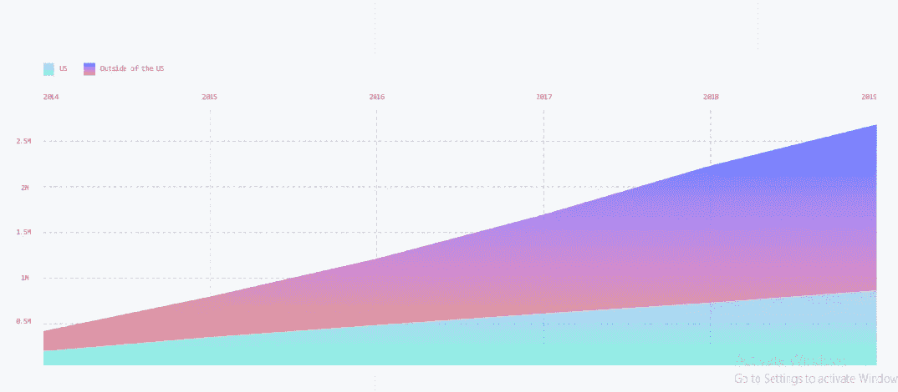
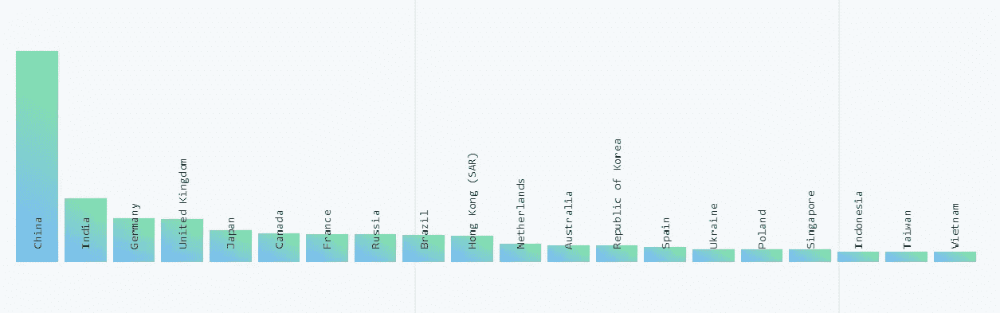
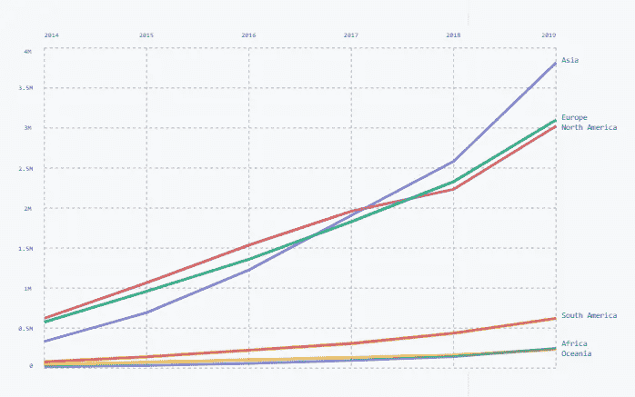
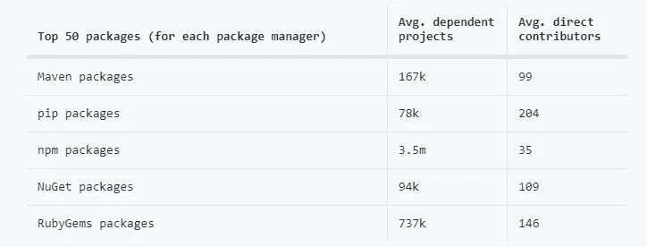
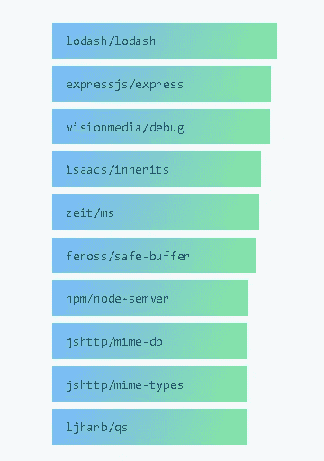
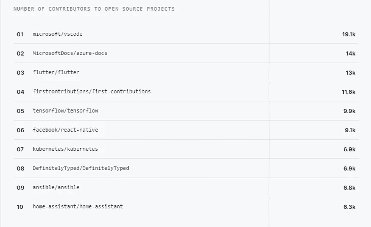
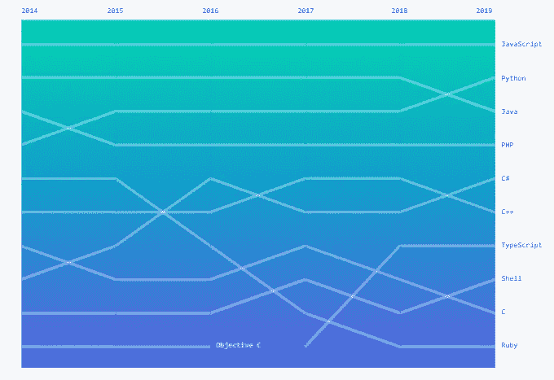
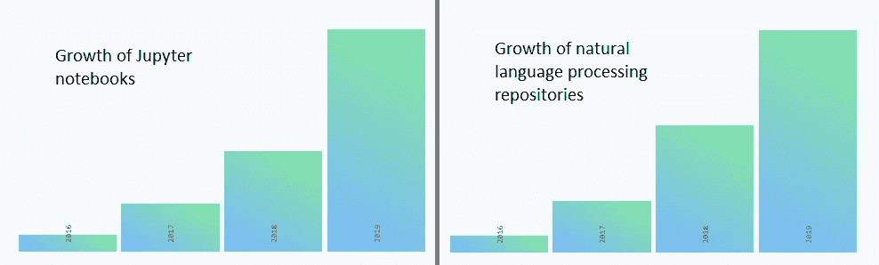
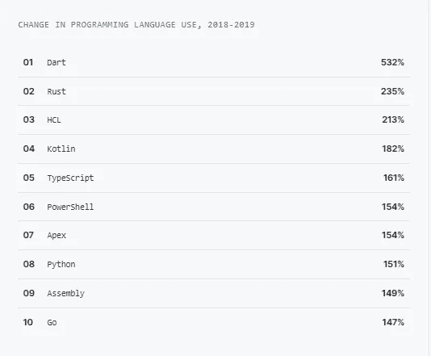

# 这个节目的明星是——PYTHON

> 原文：<https://towardsdatascience.com/and-the-star-of-the-show-is-python-51909c894390?source=collection_archive---------29----------------------->

2019 年十月世界的亮点

# 介绍

又到了一年中的这个时候，最大的开源项目 Github 发布了它的年度报告。GitHub 每年都会对开发者进行调查，并制作一份调查结果报告。

每年都有令人惊讶的消息传来。它揭示了一些新的成长中的技术，热门话题和项目等。

## 今年无疑是 Python 之年。

今年，Github 社区已经接触了来自世界各地的 4000 多万开发者，并且拥有超过 1 亿个存储库。在这里，我们将看到来自 2019 年十月状态的亮点。

## [***出类拔萃，成为明星***](https://docs.google.com/spreadsheets/d/1eNBLcKqCVN9zZQvfGUmm5bAzsETqB_ugVOlUtmvJGYU/edit#gid=0)

# **全球团队**

为开源项目做出贡献的 GitHub 用户有 20%来自美国，80%来自美国以外。

开源社区在美国以外的地区越来越受欢迎。来自中国的开发人员在克隆和分叉项目上取得了 48%的增长。

**这是美国以外前 20 个地区的图表**

从各大洲来看，对开源项目的总体贡献是最大的，其中亚洲的贡献最大，来自中国。

**下图显示了各大洲对我们的贡献。**

# **互联社区**

每个语言生态系统中的前 50 个包都有大量的依赖项目。Javascript 语言的顶级 npm 包有大约 350 万个依赖项目。

**Top 10 open source projects with most dependent projects**

Tensorflow 是 GitHub 上最受欢迎的项目之一，它展示了这些小项目如何连接在一起构建一个大型软件社区。它拥有超过 25，000 名社区贡献者，在这一年中为 TensorFlow 依赖项做出了贡献。

## [是时候证明自己了](https://data-flair.training/blogs/data-science-project-ideas/)

# **社区趋势**

2019 年，开发人员的工作效率比以往任何时候都高。下图显示了开发人员正在从事的顶级项目。

Octoverse 2019 最引人注目的事实是 **Python 第一次超过了 Java** ，成为 GitHub 上第二大最受欢迎的语言，基于知识库贡献者。除此之外，Javascript 照常戴着皇冠。

**Most Popular Programming Languages on GitHub**

像深度学习、机器学习、自然语言处理这样的主题已经变得很流行，它们在知识库中也很流行。

**该图显示了数据科学 Jupyter 笔记本和自然语言处理中存储库的增长。**

今年我们看到了语言发展的新趋势。该报告向我们展示了增长最快的 10 种编程语言。Dart 正以 532%的惊人速度增长。开发者社区喜欢统计类型语言，比如 Rust、Kotlin 和 Typescript。

# 包扎

每年来自 GitHub 的见解都有助于开发者分析新趋势和获取信息。今年，我们观察了开源社区是如何由全球开发者构建的，顶级开源项目依赖于数百万个其他项目，python 取代了 java。IT 行业是一个快速增长的行业，将继续向前发展，我们将看到更多的趋势和技术变化。

## [***现在轮到你翻盘了***](https://data-flair.github.io/python-tutorial/)