# 吴恩达的 Python(异常检测)机器学习课程

> 原文：<https://towardsdatascience.com/andrew-ngs-machine-learning-course-in-python-anomaly-detection-1233d23dba95?source=collection_archive---------1----------------------->

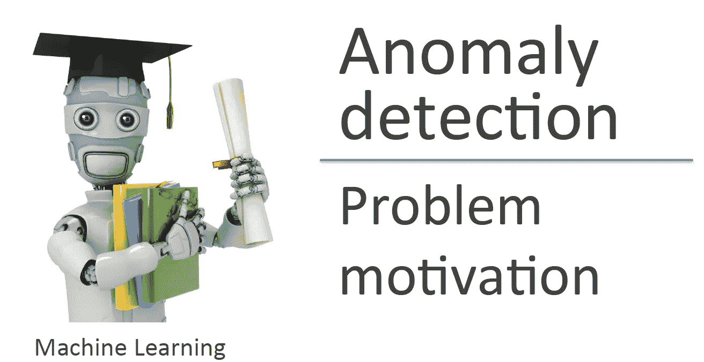

Machine Learning — Andrew Ng

T 这是吴恩达的机器学习课程 python 实现的最后一部分，我很高兴终于完成了这个系列。为了给你们一些视角，我花了一个月的时间将这些代码转换成 python，并为每个作业写了一篇文章。如果你们中的任何人正在犹豫要不要用 Python、R 或 Java 来实现，我强烈建议你们去做。从头开始编写这些算法不仅可以强化所教授的概念，还可以用自己熟悉的语言练习数据科学编程技能。

说了这么多，让我们进入最后一个编程作业

在这部分作业中，我们将使用高斯模型实现异常检测算法，首先检测 2D 数据集中的异常行为，然后检测高维数据集中的异常行为。

加载相关的库和数据集

```
import numpy as np
import matplotlib.pyplot as plt
from scipy.io import loadmatmat = loadmat("ex8data1.mat")
X = mat["X"]
Xval = mat["Xval"]
yval = mat["yval"]
```

可视化数据

```
plt.scatter(X[:,0],X[:,1],marker="x")
plt.xlim(0,30)
plt.ylim(0,30)
plt.xlabel("Latency (ms)")
plt.ylabel("Throughput (mb/s)")
```

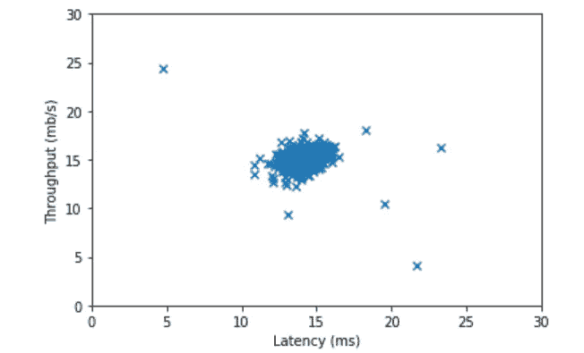

估计高斯模型的参数(均值和方差)

```
def estimateGaussian(X):
    """
     This function estimates the parameters of a Gaussian distribution using the data in X
    """

    m = X.shape[0]

    #compute mean
    sum_ = np.sum(X,axis=0)
    mu = 1/m *sum_

    # compute variance
    var = 1/m * np.sum((X - mu)**2,axis=0)

    return mu,varmu, sigma2 = estimateGaussian(X)
```

多元高斯分布是本课程的选修课，并给出了计算概率密度的代码。然而，为了让我继续这个任务，我需要从头开始编写`multivariateGaussian` 函数。

```
def multivariateGaussian(X, mu, sigma2):
    """
    Computes the probability density function of the multivariate gaussian distribution.
    """
    k = len(mu)

    sigma2=np.diag(sigma2)
    X = X - mu.T
    p = 1/((2*np.pi)**(k/2)*(np.linalg.det(sigma2)**0.5))* np.exp(-0.5* np.sum(X @ np.linalg.pinv(sigma2) * X,axis=1))
    return pp = multivariateGaussian(X, mu, sigma2)
```

我们在这里使用的一些有趣的函数来自 numpy 线性代数类。官方文件可以在[这里](https://docs.scipy.org/doc/numpy-1.13.0/reference/routines.linalg.html)找到。

一旦我们估计了高斯参数并获得了数据的概率密度，我们就可以可视化拟合。

```
plt.figure(figsize=(8,6))
plt.scatter(X[:,0],X[:,1],marker="x")
X1,X2 = np.meshgrid(np.linspace(0,35,num=70),np.linspace(0,35,num=70))
p2 = multivariateGaussian(np.hstack((X1.flatten()[:,np.newaxis],X2.flatten()[:,np.newaxis])), mu, sigma2)
contour_level = 10**np.array([np.arange(-20,0,3,dtype=np.float)]).T
plt.contour(X1,X2,p2[:,np.newaxis].reshape(X1.shape),contour_level)
plt.xlim(0,35)
plt.ylim(0,35)
plt.xlabel("Latency (ms)")
plt.ylabel("Throughput (mb/s)")
```

我之前没有解释过创建等高线图的过程，因为大多数都很简单。如果你理解起来有困难，这里的这篇文章可能会有所帮助。简单地说，我们首先在数据区域周围创建一个网格，并计算 Z 轴。`plt.contour`然后使用 3 个轴(X，Y，Z)创建等高线图。

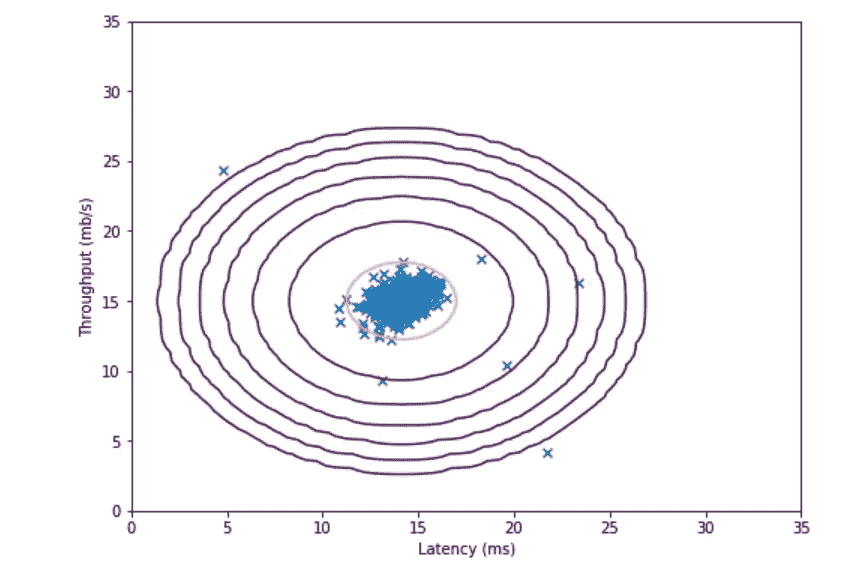

现在选择一个阈值，将一个示例标记为异常。

```
def selectThreshold(yval, pval):
    """
    Find the best threshold (epsilon) to use for selecting outliers
    """
    best_epi = 0
    best_F1 = 0

    stepsize = (max(pval) -min(pval))/1000
    epi_range = np.arange(pval.min(),pval.max(),stepsize)
    for epi in epi_range:
        predictions = (pval<epi)[:,np.newaxis]
        tp = np.sum(predictions[yval==1]==1)
        fp = np.sum(predictions[yval==0]==1)
        fn = np.sum(predictions[yval==1]==0)

        # compute precision, recall and F1
        prec = tp/(tp+fp)
        rec = tp/(tp+fn)

        F1 = (2*prec*rec)/(prec+rec)

        if F1 > best_F1:
            best_F1 =F1
            best_epi = epi

    return best_epi, best_F1pval = multivariateGaussian(Xval, mu, sigma2)
epsilon, F1 = selectThreshold(yval, pval)
print("Best epsilon found using cross-validation:",epsilon)
print("Best F1 on Cross Validation Set:",F1)
```

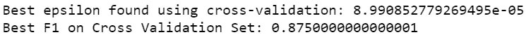

如果您没有注意到，这里使用 F1 分数而不是准确性，因为数据集是高度不平衡的。为了了解更多关于评估机器学习模型性能的各种方法，这篇文章很好地总结了这个主题。

可视化最佳阈值

```
plt.figure(figsize=(8,6))# plot the data
plt.scatter(X[:,0],X[:,1],marker="x")# potting of contour
X1,X2 = np.meshgrid(np.linspace(0,35,num=70),np.linspace(0,35,num=70))
p2 = multivariateGaussian(np.hstack((X1.flatten()[:,np.newaxis],X2.flatten()[:,np.newaxis])), mu, sigma2)
contour_level = 10**np.array([np.arange(-20,0,3,dtype=np.float)]).T
plt.contour(X1,X2,p2[:,np.newaxis].reshape(X1.shape),contour_level)# Circling of anomalies
outliers = np.nonzero(p<epsilon)[0]
plt.scatter(X[outliers,0],X[outliers,1],marker ="o",facecolor="none",edgecolor="r",s=70)plt.xlim(0,35)
plt.ylim(0,35)
plt.xlabel("Latency (ms)")
plt.ylabel("Throughput (mb/s)")
```

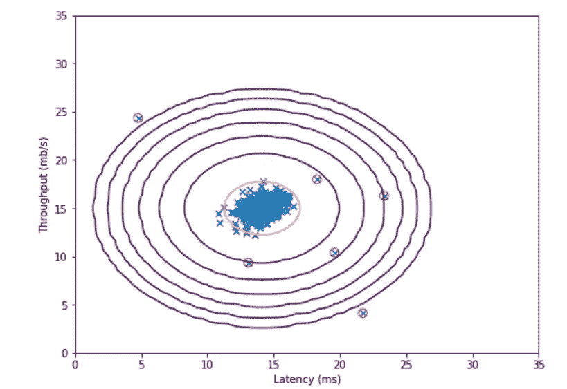

对于高维数据集，我们只需遵循与之前完全相同的步骤

```
mat2 = loadmat("ex8data2.mat")
X2 = mat2["X"]
Xval2 = mat2["Xval"]
yval2 = mat2["yval"]# compute the mean and variance
mu2, sigma2_2 = estimateGaussian(X2)# Training set
p3 = multivariateGaussian(X2, mu2, sigma2_2)# cross-validation set
pval2 = multivariateGaussian(Xval2, mu2, sigma2_2)# Find the best threshold
epsilon2, F1_2 = selectThreshold(yval2, pval2)
print("Best epsilon found using cross-validation:",epsilon2)
print("Best F1 on Cross Validation Set:",F1_2)
print("# Outliers found:",np.sum(p3<epsilon2))
```

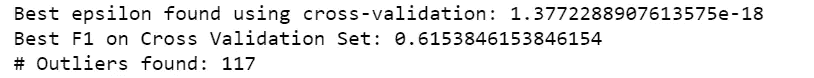

作业的第二部分包括实现一个协作过滤算法来建立一个电影分级推荐系统。

电影分级数据集的加载和可视化

```
mat3 = loadmat("ex8_movies.mat")
mat4 = loadmat("ex8_movieParams.mat")
Y = mat3["Y"] # 1682 X 943 matrix, containing ratings (1-5) of 1682 movies on 943 user
R = mat3["R"] # 1682 X 943 matrix, where R(i,j) = 1 if and only if user j give rating to movie i
X = mat4["X"] # 1682 X 10 matrix , num_movies X num_features matrix of movie features
Theta = mat4["Theta"] # 943 X 10 matrix, num_users X num_features matrix of user features# Compute average rating 
print("Average rating for movie 1 (Toy Story):",np.sum(Y[0,:]*R[0,:])/np.sum(R[0,:]),"/5")
```

打印语句将打印:`Average rating for movie 1 (Toy Story): 3.8783185840707963 /5`

```
plt.figure(figsize=(8,16))
plt.imshow(Y)
plt.xlabel("Users")
plt.ylabel("Movies")
```

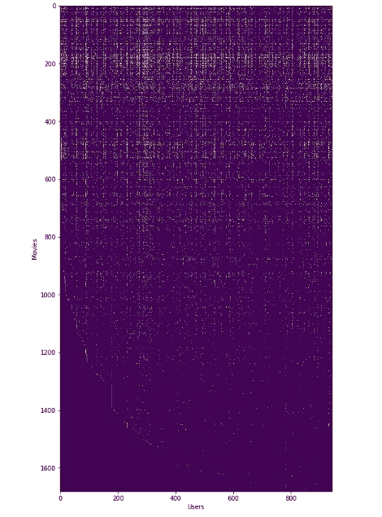

进入算法本身，我们从计算成本函数和梯度开始

```
def  cofiCostFunc(params, Y, R, num_users, num_movies, num_features, Lambda):
    """
    Returns the cost and gradient for the collaborative filtering problem
    """

    # Unfold the params
    X = params[:num_movies*num_features].reshape(num_movies,num_features)
    Theta = params[num_movies*num_features:].reshape(num_users,num_features)

    predictions =  X @ Theta.T
    err = (predictions - Y)
    J = 1/2 * np.sum((err**2) * R)

    #compute regularized cost function
    reg_X =  Lambda/2 * np.sum(Theta**2)
    reg_Theta = Lambda/2 *np.sum(X**2)
    reg_J = J + reg_X + reg_Theta

    # Compute gradient
    X_grad = err*R @ Theta
    Theta_grad = (err*R).T @ X
    grad = np.append(X_grad.flatten(),Theta_grad.flatten())

    # Compute regularized gradient
    reg_X_grad = X_grad + Lambda*X
    reg_Theta_grad = Theta_grad + Lambda*Theta
    reg_grad = np.append(reg_X_grad.flatten(),reg_Theta_grad.flatten())

    return J, grad, reg_J, reg_grad
```

与前面的方法类似，该任务要求我们在单独的步骤中计算成本函数、梯度、正则化成本函数，然后正则化梯度。只要你使用正确的索引，上面的代码块将允许你一步一步地跟随任务。

为了测试我们的成本函数，

```
# Reduce the data set size to run faster
num_users, num_movies, num_features = 4,5,3
X_test = X[:num_movies,:num_features]
Theta_test= Theta[:num_users,:num_features]
Y_test = Y[:num_movies,:num_users]
R_test = R[:num_movies,:num_users]
params = np.append(X_test.flatten(),Theta_test.flatten())# Evaluate cost function
J, grad = cofiCostFunc(params, Y_test, R_test, num_users, num_movies, num_features, 0)[:2]
print("Cost at loaded parameters:",J)J2, grad2 = cofiCostFunc(params, Y_test, R_test, num_users, num_movies, num_features, 1.5)[2:]
print("Cost at loaded parameters (lambda = 1.5):",J2)
```

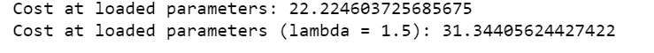

一旦我们得到了我们的成本函数和梯度，我们可以开始训练我们的算法。

加载电影列表

```
# load movie list
movieList = open("movie_ids.txt","r").read().split("\n")[:-1]# see movie list
np.set_printoptions(threshold=np.nan)
movieList
```

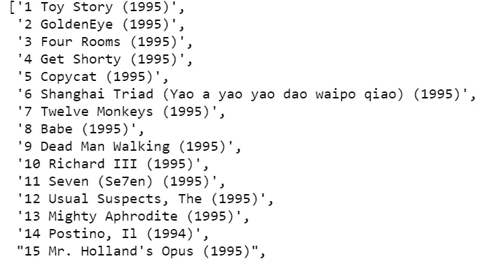

你可以在这一步输入你自己的电影偏好，但我使用了与作业完全相同的评分来保持一致。

```
# Initialize my ratings
my_ratings = np.zeros((1682,1))# Create own ratings
my_ratings[0] = 4 
my_ratings[97] = 2
my_ratings[6] = 3
my_ratings[11]= 5
my_ratings[53] = 4
my_ratings[63]= 5
my_ratings[65]= 3
my_ratings[68] = 5
my_ratings[82]= 4
my_ratings[225] = 5
my_ratings[354]= 5print("New user ratings:\n")
for i in range(len(my_ratings)):
    if my_ratings[i]>0:
        print("Rated",int(my_ratings[i]),"for index",movieList[i])
```

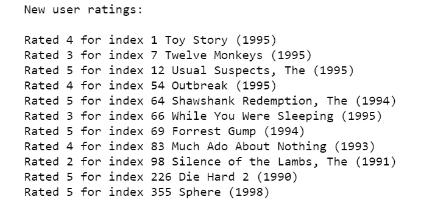

为了在输入到算法中之前准备我们的数据，我们需要标准化评级，设置一些随机的初始参数，并使用优化算法来更新参数。

```
def normalizeRatings(Y, R):
    """
    normalized Y so that each movie has a rating of 0 on average, and returns the mean rating in Ymean.
    """

    m,n = Y.shape[0], Y.shape[1]
    Ymean = np.zeros((m,1))
    Ynorm = np.zeros((m,n))

    for i in range(m):
        Ymean[i] = np.sum(Y[i,:])/np.count_nonzero(R[i,:])
        Ynorm[i,R[i,:]==1] = Y[i,R[i,:]==1] - Ymean[i]

    return Ynorm, Ymeandef gradientDescent(initial_parameters,Y,R,num_users,num_movies,num_features,alpha,num_iters,Lambda):
    """
    Optimize X and Theta
    """
    # unfold the parameters
    X = initial_parameters[:num_movies*num_features].reshape(num_movies,num_features)
    Theta = initial_parameters[num_movies*num_features:].reshape(num_users,num_features)

    J_history =[]

    for i in range(num_iters):
        params = np.append(X.flatten(),Theta.flatten())
        cost, grad = cofiCostFunc(params, Y, R, num_users, num_movies, num_features, Lambda)[2:]

        # unfold grad
        X_grad = grad[:num_movies*num_features].reshape(num_movies,num_features)
        Theta_grad = grad[num_movies*num_features:].reshape(num_users,num_features)
        X = X - (alpha * X_grad)
        Theta = Theta - (alpha * Theta_grad)
        J_history.append(cost)

    paramsFinal = np.append(X.flatten(),Theta.flatten())
    return paramsFinal , J_history
```

再次，我选择批量梯度下降作为我的优化算法。在 python 中完成所有编程任务教会我的一件事是，梯度下降很少出错。在这一点上，梯度下降的代码应该是相当熟悉的。

```
Y = np.hstack((my_ratings,Y))
R =np.hstack((my_ratings!=0,R))# Normalize Ratings
Ynorm, Ymean = normalizeRatings(Y, R)num_users = Y.shape[1]
num_movies = Y.shape[0]
num_features = 10# Set initial Parameters (Theta,X)
X = np.random.randn(num_movies, num_features)
Theta = np.random.randn(num_users, num_features)
initial_parameters = np.append(X.flatten(),Theta.flatten())
Lambda = 10# Optimize parameters using Gradient Descent
paramsFinal, J_history = gradientDescent(initial_parameters,Y,R,num_users,num_movies,num_features,0.001,400,Lambda)
```

绘制成本函数以确保梯度下降有效

```
plt.plot(J_history)
plt.xlabel("Iteration")
plt.ylabel("$J(\Theta)$")
plt.title("Cost function using Gradient Descent")
```

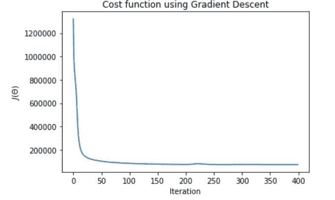

对你没有评级的电影进行预测

```
# unfold paramaters
X = paramsFinal[:num_movies*num_features].reshape(num_movies,num_features)
Theta = paramsFinal[num_movies*num_features:].reshape(num_users,num_features)# Predict rating
p = X @ Theta.T
my_predictions = p[:,0][:,np.newaxis] + Ymeanimport pandas as pd
df = pd.DataFrame(np.hstack((my_predictions,np.array(movieList)[:,np.newaxis])))
df.sort_values(by=[0],ascending=False,inplace=True)
df.reset_index(drop=True,inplace=True)print("Top recommendations for you:\n")
for i in range(10):
    print("Predicting rating",round(float(df[0][i]),1)," for index",df[1][i])
```

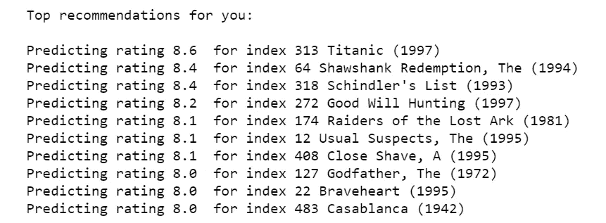

最后，我结束了吴恩达的 Python 机器学习课程。我希望这对你和我写这篇文章一样有益，我感谢你们所有人的支持。

Jupyter 笔记本会上传到我的 GitHub 上([https://GitHub . com/Ben lau 93/Machine-Learning-by-Andrew-Ng-in-Python](https://github.com/Benlau93/Machine-Learning-by-Andrew-Ng-in-Python))。

对于本系列中的其他 python 实现，

*   [线性回归](https://medium.com/@ben_lau93/andrew-ngs-machine-learning-course-in-python-linear-regression-dd04fba8e137)
*   [逻辑回归](https://medium.com/@ben_lau93/andrew-ngs-machine-learning-course-in-python-logistic-regression-c0ae25509feb)
*   [正则化逻辑回归](https://medium.com/@ben_lau93/andrew-ngs-machine-learning-course-in-python-regularized-logistic-regression-lasso-regression-721f311130fb)
*   [神经网络](/andrew-ngs-machine-learning-course-in-python-neural-networks-e526b41fdcd9)
*   [支持向量机](https://medium.com/@ben_lau93/andrew-ngs-machine-learning-course-in-python-support-vector-machines-435fc34b7bf9)
*   [无监督学习](/andrew-ngs-machine-learning-course-in-python-kmeans-clustering-pca-b7ba6fafa74)

感谢您的阅读。