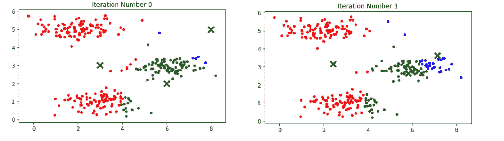

# 吴恩达的 Python (Kmeans-Clustering，PCA)机器学习课程

> 原文：<https://towardsdatascience.com/andrew-ngs-machine-learning-course-in-python-kmeans-clustering-pca-b7ba6fafa74?source=collection_archive---------12----------------------->


Machine Learning — Andrew Ng

本系列的倒数第二部分，我们来看看由无标签数据组成的无监督学习算法。让我们直接进入作业，因为我们今天要学习两个算法。

K-意思是聚类是一种聚类分析技术，允许将数据分组到称为聚类的组中。因为没有为每个训练数据提供标签，所以通过数据彼此的相似性来确定聚类。

我们将从实现 K-means 算法开始。由于 K-means 是一个迭代过程，它将训练样本分配给它们最近的质心，然后重新计算质心，我们需要两个主要函数来完成这一任务。

```
import numpy as np
import matplotlib.pyplot as plt
from scipy.io import loadmatmat = loadmat("ex7data2.mat")
X = mat["X"]
```

`findClosestCentroids`通过评估训练样本与每个质心之间的距离来找到最近的质心，并将质心分配给具有最小距离的训练样本。

```
def findClosestCentroids(X, centroids):
    """
    Returns the closest centroids in idx for a dataset X where each row is a single example.
    """
    K = centroids.shape[0]
    idx = np.zeros((X.shape[0],1))
    temp = np.zeros((centroids.shape[0],1))

    for i in range(X.shape[0]):
        for j in range(K):
            dist = X[i,:] - centroids[j,:]
            length = np.sum(dist**2)
            temp[j] = length
        idx[i] = np.argmin(temp)+1
    return idx# Select an initial set of centroids
K = 3
initial_centroids = np.array([[3,3],[6,2],[8,5]])
idx = findClosestCentroids(X, initial_centroids)
print("Closest centroids for the first 3 examples:\n",idx[0:3])
```

`np.argmin`找出距离最小的指标，赋给训练样本。这里使用+1 从 1 而不是 0 开始对质心进行编号。

print 语句将打印:

前三个例子的最近质心:
[[1。】
【3。】
【2。]]

为了计算分配后的质心平均值，我们将分配给特定质心的训练样本相加，然后除以每个质心中的样本数。

```
def computeCentroids(X, idx, K):
    """
    returns the new centroids by computing the means of the data points assigned to each centroid.
    """
    m, n = X.shape[0],X.shape[1]
    centroids = np.zeros((K,n))
    count = np.zeros((K,1))

    for i in range(m):
        index = int((idx[i]-1)[0])
        centroids[index,:]+=X[i,:]
        count[index]+=1

    return centroids/countcentroids = computeCentroids(X, idx, K)
print("Centroids computed after initial finding of closest centroids:\n", centroids)
```

print 语句将打印:

在最初找到最近的质心之后计算的质心:
[[2.42830111 3.15792418]
[5.81350331 2.63365645]
[7.11938687 3.6166844]]

现在，为了可视化整个过程，我为算法的每次迭代创建了一个子图，以监控质心的移动和训练示例的分配。

```
def plotKmeans(X, centroids, idx, K, num_iters):
    """
    plots the data points with colors assigned to each centroid
    """
    m,n = X.shape[0],X.shape[1]

    fig, ax = plt.subplots(nrows=num_iters,ncols=1,figsize=(6,36))

    for i in range(num_iters):    
        # Visualisation of data
        color = "rgb"
        for k in range(1,K+1):
            grp = (idx==k).reshape(m,1)
            ax[i].scatter(X[grp[:,0],0],X[grp[:,0],1],c=color[k-1],s=15)# visualize the new centroids
        ax[i].scatter(centroids[:,0],centroids[:,1],s=120,marker="x",c="black",linewidth=3)
        title = "Iteration Number " + str(i)
        ax[i].set_title(title)

        # Compute the centroids mean
        centroids = computeCentroids(X, idx, K)

        # assign each training example to the nearest centroid
        idx = findClosestCentroids(X, centroids)

    plt.tight_layout()m,n = X.shape[0],X.shape[1]
plotKmeans(X, initial_centroids,idx, K,10)
```



因为 K-means 算法并不总是给出最优解，所以随机初始化很重要。

```
def kMeansInitCentroids(X, K):
    """
    This function initializes K centroids that are to beused in K-Means on the dataset X
    """
    m,n = X.shape[0], X.shape[1]
    centroids = np.zeros((K,n))

    for i in range(K):
        centroids[i] = X[np.random.randint(0,m+1),:]

    return centroidscentroids = kMeansInitCentroids(X, K)
idx = findClosestCentroids(X, centroids)
plotKmeans(X, centroids,idx, K,10)
```

上面的代码将再次运行可视化，但会进行随机初始化。您可以多次运行代码来查看随机初始质心的影响。

现在我们完成了算法的编码，我们可以开始用其他数据集实现它了。在本练习中，我们将使用该算法选择 16 个聚类来代表图像(从数千种颜色中选择)以压缩图像。

```
mat2 = loadmat("bird_small.mat")
A = mat2["A"]# preprocess and reshape the image
X2 = (A/255).reshape(128*128,3)def runKmeans(X, initial_centroids,num_iters,K):

    idx = findClosestCentroids(X, initial_centroids)

    for i in range(num_iters):

        # Compute the centroids mean
        centroids = computeCentroids(X, idx, K)# assign each training example to the nearest centroid
        idx = findClosestCentroids(X, initial_centroids)return centroids, idx
```

现在对数据集运行 k-means 算法

```
K2 = 16
num_iters = 10
initial_centroids2 = kMeansInitCentroids(X2, K2)
centroids2, idx2 = runKmeans(X2, initial_centroids2, num_iters,K2)m2,n2 = X.shape[0],X.shape[1]
X2_recovered = X2.copy()
for i in range(1,K2+1):
    X2_recovered[(idx2==i).ravel(),:] = centroids2[i-1]# Reshape the recovered image into proper dimensions
X2_recovered = X2_recovered.reshape(128,128,3)# Display the image
import matplotlib.image as mpimg
fig, ax = plt.subplots(1,2)
ax[0].imshow(X2.reshape(128,128,3))
ax[1].imshow(X2_recovered)
```


这是原始图像和只有 16 种颜色的压缩图像的并排比较。


Machine Learning — Andrew Ng

作业的下一部分利用 2D 数据集来获得对主成分分析(PCA)过程的直觉，然后在人脸图像数据集上进行 PCA 以执行降维。

加载并可视化 2D 数据集

```
mat3 = loadmat("ex7data1.mat")
X3 = mat3["X"]plt.scatter(X3[:,0],X3[:,1],marker="o",facecolors="none",edgecolors="b")
```


为了实现 PCA 算法，PCA 还包括两个计算步骤，我们将对其中一个步骤进行编码以计算协方差矩阵，并对另一个步骤使用 numpy 库以获得特征向量。

在此之前，需要进行特征归一化，以确保数据在同一范围内。

```
def featureNormalize(X):
    """
    Returns a normalized version of X where the mean value of each feature is 0 and the standard deviation is 1.
    """
    mu = np.mean(X,axis=0)
    sigma = np.std(X,axis=0)

    X_norm = (X - mu)/sigma

    return X_norm, mu , sigmadef pca(X):
    """
    Computes eigenvectors of the covariance matrix of X
    """
    m,n = X.shape[0], X.shape[1]

    sigma = 1/m * X.T @ X

    U,S,V = svd(sigma)

    return U,S,V
```

`np.linalg.svd`类似于 matlab 中的`svd`函数，返回相同的 U、S、V 矩阵。官方文档可以在[这里](https://docs.scipy.org/doc/numpy-1.15.1/reference/generated/numpy.linalg.svd.html)找到。

```
from numpy.linalg import svd
X_norm,mu,std = featureNormalize(X3)
U,S = pca(X_norm)[:2]plt.scatter(X3[:,0],X3[:,1],marker="o",facecolors="none",edgecolors="b")
plt.plot([mu[0],(mu+1.5*S[0]*U[:,0].T)[0]],[mu[1],(mu+1.5*S[0]*U[:,0].T)[1]],color="black",linewidth=3)
plt.plot([mu[0],(mu+1.5*S[1]*U[:,1].T)[0]],[mu[1],(mu+1.5*S[1]*U[:,1].T)[1]],color="black",linewidth=3)
plt.xlim(-1,7)
plt.ylim(2,8)
```

上面的代码块在数据集上实现 PCA，并可视化数据上的特征向量。我发现[维基百科](https://en.wikipedia.org/wiki/Principal_component_analysis)为大多数学习算法提供了很好的信息来源，如果你想更深入地研究算法，绝对值得一看。


```
print("Top eigenvector U(:,1) =:",U[:,0])`
```

打印报表打印:`Top eigenvector U(:,1) =: [-0.70710678 -0.70710678]`

为了减少数据集的维度，我们将数据投影到找到的主成分(特征向量)上。

```
def projectData(X, U, K):
    """
    Computes the reduced data representation when projecting only on to the top k eigenvectors
    """
    m = X.shape[0]
    U_reduced = U[:,:K]
    Z = np.zeros((m,K))

    for i in range(m):
        for j in range(K):
            Z[i,j] = X[i,:] @ U_reduced[:,j]

    return Z# Project the data onto K=1 dimension
K=1
Z = projectData(X_norm, U, K)
print("Projection of the first example:",Z[0][0])
```

打印语句将打印:`Projection of the first example: 1.4963126084578515`

也可以通过将数据投影回原始维度空间来近似重构数据。

```
def recoverData(Z, U, K):
    """
    Recovers an approximation of the original data when using the projected data
    """
    m,n = Z.shape[0],U.shape[0]
    X_rec = np.zeros((m,n))
    U_reduced = U[:,:K]

    for i in range(m):
        X_rec[i,:] = Z[i,:] @ U_reduced.T

    return X_recX_rec  = recoverData(Z, U, K)
print("Approximation of the first example:",X_rec[0,:])
```

打印语句将打印:`Approximation of the first example: [-1.05805279 -1.05805279]`

为了可视化整个过程，

```
plt.scatter(X_norm[:,0],X_norm[:,1],marker="o",label="Original",facecolors="none",edgecolors="b",s=15)
plt.scatter(X_rec[:,0],X_rec[:,1],marker="o",label="Approximation",facecolors="none",edgecolors="r",s=15)
plt.title("The Normalized and Projected Data after PCA")
plt.legend()
```


最后，我们转向更复杂的数据集——人脸图像数据集。为了加载和可视化数据，

```
mat4 = loadmat("ex7faces.mat")
X4 = mat4["X"]fig, ax = plt.subplots(nrows=10,ncols=10,figsize=(8,8))
for i in range(0,100,10):
    for j in range(10):
        ax[int(i/10),j].imshow(X4[i+j,:].reshape(32,32,order="F"),cmap="gray")
        ax[int(i/10),j].axis("off")
```


这些图像包含 32 X 32 像素的灰度，导致 1，024 个特征的维度，我们的任务是将维度减少到大约 100 个最能描述我们数据的主成分。

```
X_norm2 = featureNormalize(X4)[0]# Run PCA
U2 =pca(X_norm2)[0]#Visualize the top 36 eigenvectors found
U_reduced = U2[:,:36].T
fig2, ax2 = plt.subplots(6,6,figsize=(8,8))
for i in range(0,36,6):
    for j in range(6):
        ax2[int(i/6),j].imshow(U_reduced[i+j,:].reshape(32,32,order="F"),cmap="gray")
        ax2[int(i/6),j].axis("off")
```


上面是描述数据集中最大变化的 36 个主成分的可视化。

接下来，我们将数据投射到前 100 个主成分上，有效地将维度降低到 100，恢复数据并尝试理解在维度降低过程中丢失了什么。

```
K2 = 100
Z2 = projectData(X_norm2, U2, K2)
print("The projected data Z has a size of:",Z2.shape)# Data reconstruction
X_rec2  = recoverData(Z2, U2, K2)# Visualize the reconstructed data
fig3, ax3 = plt.subplots(10,10,figsize=(8,8))
for i in range(0,100,10):
    for j in range(10):
        ax3[int(i/10),j].imshow(X_rec2[i+j,:].reshape(32,32,order="F"),cmap="gray")
        ax3[int(i/10),j].axis("off")
```


这是无监督学习的终结。请期待该系列的最后一篇文章。Jupyter 笔记本会上传到我的 GitHub 上([https://GitHub . com/Ben lau 93/Machine-Learning-by-Andrew-Ng-in-Python](https://github.com/Benlau93/Machine-Learning-by-Andrew-Ng-in-Python))。

对于本系列中的其他 python 实现，

*   [线性回归](https://medium.com/@ben_lau93/andrew-ngs-machine-learning-course-in-python-linear-regression-dd04fba8e137)
*   [逻辑回归](https://medium.com/@ben_lau93/andrew-ngs-machine-learning-course-in-python-logistic-regression-c0ae25509feb)
*   [正则化逻辑回归](https://medium.com/@ben_lau93/andrew-ngs-machine-learning-course-in-python-regularized-logistic-regression-lasso-regression-721f311130fb)
*   [神经网络](/andrew-ngs-machine-learning-course-in-python-neural-networks-e526b41fdcd9)
*   [支持向量机](https://medium.com/@ben_lau93/andrew-ngs-machine-learning-course-in-python-support-vector-machines-435fc34b7bf9)
*   [异常检测](https://medium.com/@ben_lau93/andrew-ngs-machine-learning-course-in-python-anomaly-detection-1233d23dba95)

感谢您的阅读。