# 吴恩达的 Python(支持向量机)机器学习教程

> 原文：<https://towardsdatascience.com/andrew-ngs-machine-learning-course-in-python-support-vector-machines-435fc34b7bf9?source=collection_archive---------11----------------------->

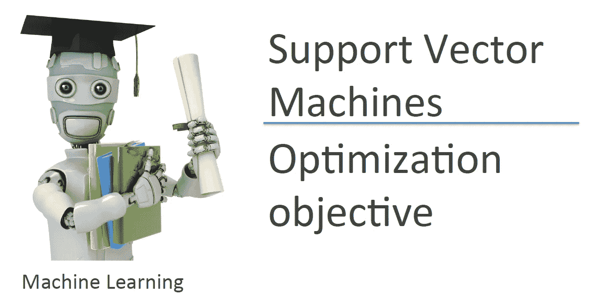

Machine Learning — Andrew Ng

继续这个系列，我们将继续学习编程作业 6 的支持向量机。如果你注意到了，我没有写作业 5，因为大多数任务只需要绘制和解释学习曲线。不过你还是可以在我的 GitHub 里找到代码，网址是[https://GitHub . com/Ben lau 93/Machine-Learning-by-Andrew-Ng-in-Python/tree/master/Bias _ Vs _ Variance](https://github.com/Benlau93/Machine-Learning-by-Andrew-Ng-in-Python/tree/master/Bias_Vs_Variance)。

T4:这个作业有两个部分。首先，我们将在几个 2D 数据集上实现支持向量机(SVM ),以直观地了解算法及其工作原理。接下来，我们将在电子邮件数据集上使用 SVM 来尝试对垃圾邮件进行分类。

为了加载数据集，使用来自 scipy.io 的 loadmat 来打开 mat 文件

```
import numpy as np
import pandas as pd
import matplotlib.pyplot as plt
from scipy.io import loadmatmat = loadmat("ex6data1.mat")
X = mat["X"]
y = mat["y"]
```

数据集的绘图

```
m,n = X.shape[0],X.shape[1]
pos,neg= (y==1).reshape(m,1), (y==0).reshape(m,1)
plt.scatter(X[pos[:,0],0],X[pos[:,0],1],c="r",marker="+",s=50)
plt.scatter(X[neg[:,0],0],X[neg[:,0],1],c="y",marker="o",s=50)
```

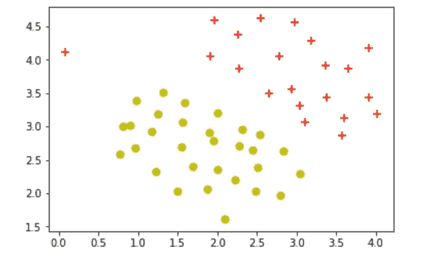

我们从一个简单的数据集开始，它在训练示例之间有一个清晰的线性边界。

正如讲座中所建议的，我们尽量不从头开始编写 SVM，而是利用高度优化的库，如 sklearn 来完成这项任务。官方文档可以在[这里](https://scikit-learn.org/stable/modules/generated/sklearn.svm.SVC.html)找到。

```
from sklearn.svm import SVC
classifier = SVC(kernel="linear")
classifier.fit(X,np.ravel(y))
```

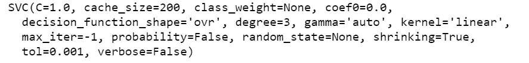

由于这是一个线性分类问题，我们将不会为这个任务使用任何内核。这相当于在 SVC 中使用线性核(注意 SVC 的默认核设置是“rbf”，代表径向基函数)。这里的`ravel()`函数返回一个大小为(m)的数组，这是 SVC 所需要的。

```
plt.figure(figsize=(8,6))
plt.scatter(X[pos[:,0],0],X[pos[:,0],1],c="r",marker="+",s=50)
plt.scatter(X[neg[:,0],0],X[neg[:,0],1],c="y",marker="o",s=50)# plotting the decision boundary
X_1,X_2 = np.meshgrid(np.linspace(X[:,0].min(),X[:,1].max(),num=100),np.linspace(X[:,1].min(),X[:,1].max(),num=100))
plt.contour(X_1,X_2,classifier.predict(np.array([X_1.ravel(),X_2.ravel()]).T).reshape(X_1.shape),1,colors="b")
plt.xlim(0,4.5)
plt.ylim(1.5,5)
```

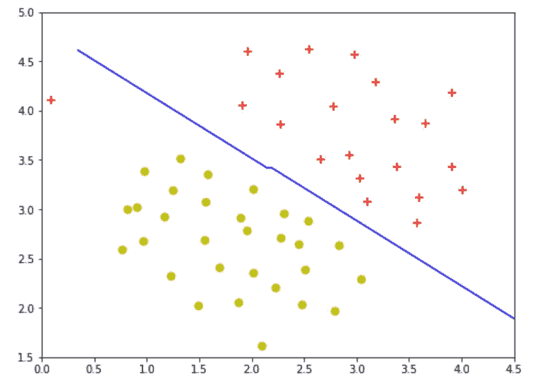

C=1, kernel = “linear”

在默认设置为 C = 1.0(记住 C = 1/λ)的情况下，这就是我们得到的决策边界。

```
# Test C = 100
classifier2 = SVC(C=100,kernel="linear")
classifier2.fit(X,np.ravel(y))
```

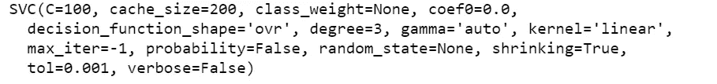

```
plt.figure(figsize=(8,6))
plt.scatter(X[pos[:,0],0],X[pos[:,0],1],c="r",marker="+",s=50)
plt.scatter(X[neg[:,0],0],X[neg[:,0],1],c="y",marker="o",s=50)# plotting the decision boundary
X_3,X_4 = np.meshgrid(np.linspace(X[:,0].min(),X[:,1].max(),num=100),np.linspace(X[:,1].min(),X[:,1].max(),num=100))
plt.contour(X_3,X_4,classifier2.predict(np.array([X_3.ravel(),X_4.ravel()]).T).reshape(X_3.shape),1,colors="b")
plt.xlim(0,4.5)
plt.ylim(1.5,5)
```

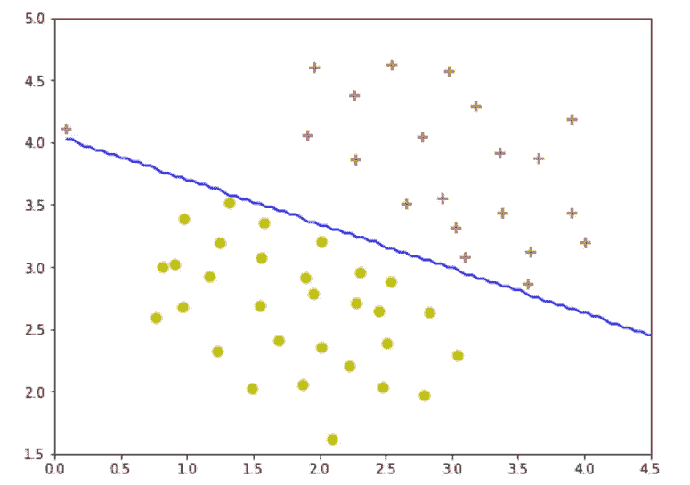

C= 100, kernel =”linear”

更改 C=100，给出一个超过训练示例的决策边界。

接下来，我们将看一个不能线性分离的数据集。这就是内核发挥作用的地方，为我们提供非线性分类器的功能。对于那些理解内核概念有困难的人来说，我找到的这篇[文章](/understanding-the-kernel-trick-e0bc6112ef78)给出了一个很好的关于内核的直觉和一些数学解释。对于这部分作业，我们需要完成函数`gaussianKernel`来帮助实现高斯核的 SVM。我将跳过这一步，因为 SVC 包含它自己的径向基函数(rbf)形式的高斯核实现。[这里的](https://en.wikipedia.org/wiki/Radial_basis_function_kernel)是维基百科的页面，上面有 rbf 的方程，正如你看到的，它与课程中的高斯核函数相同。

示例数据集 2 的加载和绘图

```
mat2 = loadmat("ex6data2.mat")
X2 = mat2["X"]
y2 = mat2["y"]m2,n2 = X2.shape[0],X2.shape[1]
pos2,neg2= (y2==1).reshape(m2,1), (y2==0).reshape(m2,1)
plt.figure(figsize=(8,6))
plt.scatter(X2[pos2[:,0],0],X2[pos2[:,0],1],c="r",marker="+")
plt.scatter(X2[neg2[:,0],0],X2[neg2[:,0],1],c="y",marker="o")
plt.xlim(0,1)
plt.ylim(0.4,1)
```

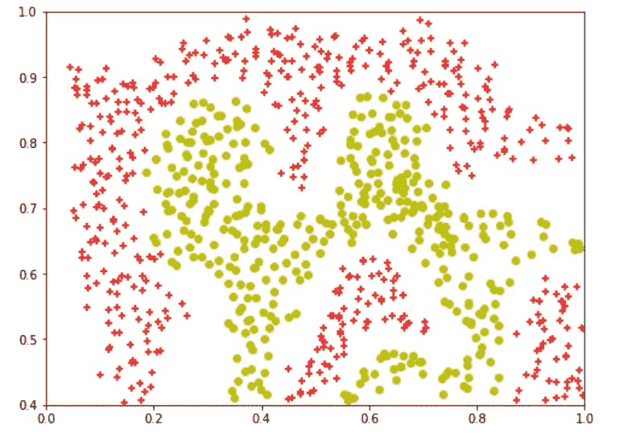

用高斯核实现 SVM

```
classifier3 = SVC(kernel="rbf",gamma=30)
classifier3.fit(X2,y2.ravel())
```

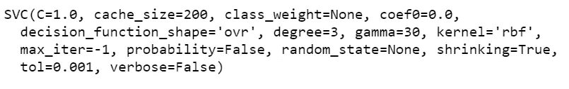

对于径向基函数核的 SVM 的参数，它使用 gamma 代替 sigma。参数文档可以在[这里](https://scikit-learn.org/stable/auto_examples/svm/plot_rbf_parameters.html)找到。我发现 gamma 类似于 1/σ，但不完全是，我希望一些领域专家能给我解释这个 gamma 项的见解。至于这个数据集，我发现 gamma 值为 30 表示与作业中的优化参数最相似(课程中 sigma 为 0.1)。

```
plt.figure(figsize=(8,6))
plt.scatter(X2[pos2[:,0],0],X2[pos2[:,0],1],c="r",marker="+")
plt.scatter(X2[neg2[:,0],0],X2[neg2[:,0],1],c="y",marker="o")# plotting the decision boundary
X_5,X_6 = np.meshgrid(np.linspace(X2[:,0].min(),X2[:,1].max(),num=100),np.linspace(X2[:,1].min(),X2[:,1].max(),num=100))
plt.contour(X_5,X_6,classifier3.predict(np.array([X_5.ravel(),X_6.ravel()]).T).reshape(X_5.shape),1,colors="b")
plt.xlim(0,1)
plt.ylim(0.4,1)
```

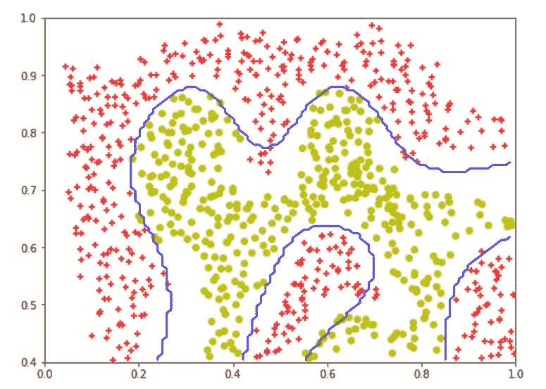

C = 1, gamma = 30, kernel = “rbf”

对于本部分的最后一个数据集，我们执行一个简单的超参数调整，以确定要使用的最佳 C 值和 gamma 值。

示例数据集 3 的加载和绘图

```
mat3 = loadmat("ex6data3.mat")
X3 = mat3["X"]
y3 = mat3["y"]
Xval = mat3["Xval"]
yval = mat3["yval"]m3,n3 = X3.shape[0],X3.shape[1]
pos3,neg3= (y3==1).reshape(m3,1), (y3==0).reshape(m3,1)
plt.figure(figsize=(8,6))
plt.scatter(X3[pos3[:,0],0],X3[pos3[:,0],1],c="r",marker="+",s=50)
plt.scatter(X3[neg3[:,0],0],X3[neg3[:,0],1],c="y",marker="o",s=50)
```

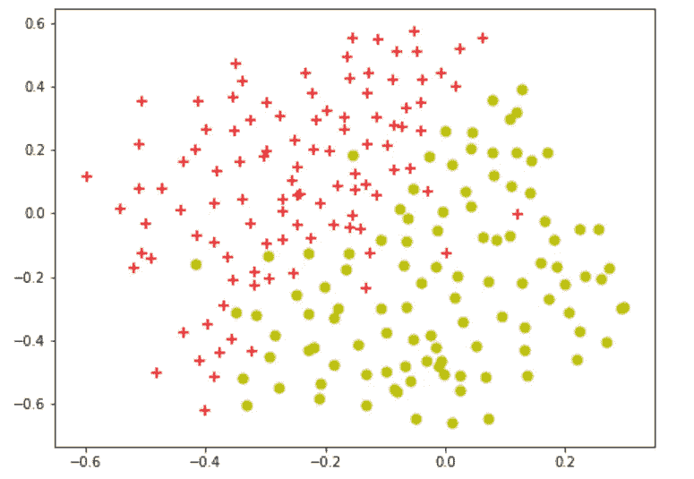

```
def dataset3Params(X, y, Xval, yval,vals):
    """
    Returns your choice of C and sigma. You should complete this function to return the optimal C and 
    sigma based on a cross-validation set.
    """
    acc = 0
    best_c=0
    best_gamma=0
    for i in vals:
        C= i
        for j in vals:
            gamma = 1/j
            classifier = SVC(C=C,gamma=gamma)
            classifier.fit(X,y)
            prediction = classifier.predict(Xval)
            score = classifier.score(Xval,yval)
            if score>acc:
                acc =score
                best_c =C
                best_gamma=gamma
    return best_c, best_gamma
```

`dataset3Params`遍历函数中给出的`vals`列表，将 C 设置为 val，将 gamma 设置为 1/val。使用每个参数组合构建 SVC 模型，并计算验证集的准确度。基于精度，选择最佳模型，并返回相应的 C 和 gamma 值。

```
vals = [0.01, 0.03, 0.1, 0.3, 1, 3, 10, 30]
C, gamma = dataset3Params(X3, y3.ravel(), Xval, yval.ravel(),vals)
classifier4 = SVC(C=C,gamma=gamma)
classifier4.fit(X3,y3.ravel())
```

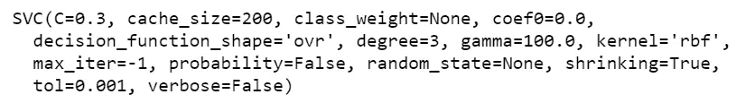

```
plt.figure(figsize=(8,6))
plt.scatter(X3[pos3[:,0],0],X3[pos3[:,0],1],c="r",marker="+",s=50)
plt.scatter(X3[neg3[:,0],0],X3[neg3[:,0],1],c="y",marker="o",s=50)# plotting the decision boundary
X_7,X_8 = np.meshgrid(np.linspace(X3[:,0].min(),X3[:,1].max(),num=100),np.linspace(X3[:,1].min(),X3[:,1].max(),num=100))
plt.contour(X_7,X_8,classifier4.predict(np.array([X_7.ravel(),X_8.ravel()]).T).reshape(X_7.shape),1,colors="b")
plt.xlim(-0.6,0.3)
plt.ylim(-0.7,0.5)
```

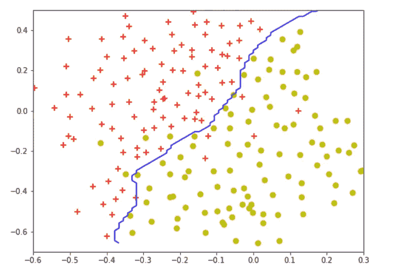

C = 0.3, gamma = 100, kernel =”rbf”

C 的最佳值是 0.3，γ的最佳值是 100，这导致了与分配相似的决策边界。

继续垃圾邮件分类。这个问题是独特的，因为它更侧重于数据预处理，而不是实际的建模过程。电子邮件需要以一种可以用作模型输入的方式进行处理。一种方法是根据常用词汇列表获取电子邮件中所有单词的索引。

加载数据

```
import re
from nltk.stem import PorterStemmerfile_contents = open("emailSample1.txt","r").read()
vocabList = open("vocab.txt","r").read()
```

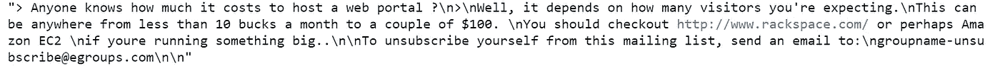

Content of the email

给出了词汇列表及其相应的索引，我将该列表存储为字典，以词汇作为键，索引作为值。你也许可以用另一种方式来做，但是我想让访问词汇更容易(比如用 `if keys in dict`)

```
vocabList=vocabList.split("\n")[:-1]vocabList_d={}
for ea in vocabList:
    value,key = ea.split("\t")[:]
    vocabList_d[key] = value
```

至于邮件的预处理，作业中为我们概述了几个步骤。

```
def processEmail(email_contents,vocabList_d):
    """
    Preprocesses the body of an email and returns a list of indices of the words contained in the email. 
    """
    # Lower case
    email_contents = email_contents.lower()

    # Handle numbers
    email_contents = re.sub("[0-9]+","number",email_contents)

    # Handle URLS
    email_contents = re.sub("[http|https]://[^\s]*","httpaddr",email_contents)

    # Handle Email Addresses
    email_contents = re.sub("[^\s]+@[^\s]+","emailaddr",email_contents)

    # Handle $ sign
    email_contents = re.sub("[$]+","dollar",email_contents)

    # Strip all special characters
    specialChar = ["<","[","^",">","+","?","!","'",".",",",":"]
    for char in specialChar:
        email_contents = email_contents.replace(str(char),"")
    email_contents = email_contents.replace("\n"," ")    

    # Stem the word
    ps = PorterStemmer()
    email_contents = [ps.stem(token) for token in email_contents.split(" ")]
    email_contents= " ".join(email_contents)

    # Process the email and return word_indices

    word_indices=[]

    for char in email_contents.split():
        if len(char) >1 and char in vocabList_d:
            word_indices.append(int(vocabList_d[char]))

    return word_indicesword_indices= processEmail(file_contents,vocabList_d)
```

正则表达式的使用在这里非常方便，python 大师的这个[教程](https://thepythonguru.com/python-regular-expression/)可以帮助你开始 re。这里另一个有用的库是 nlkt，其中的`PorterStemmer()` 函数有助于词干化。另一个好的教程是 pythonprogramming.net 的。

在得到单词的索引后，我们需要将索引转换成一个特征向量。

```
def emailFeatures(word_indices, vocabList_d):
    """
    Takes in a word_indices vector and  produces a feature vector from the word indices. 
    """
    n = len(vocabList_d)

    features = np.zeros((n,1))

    for i in word_indices:
        features[i] =1

    return featuresfeatures = emailFeatures(word_indices,vocabList_d)
print("Length of feature vector: ",len(features))
print("Number of non-zero entries: ",np.sum(features))
```

打印语句将打印:`Length of feature vector: 1899`和`Number of non-zero entries: 43.0`。这与赋值略有不同，因为在赋值中,`you’re`被捕获为“你”和“re ”,而我的代码将它识别为“你的”,导致更少的非零条目。

训练 SVM 就像将特征作为输入传递一样简单。然而，这只是一个训练示例，我们需要更多的训练数据来训练分类器。

```
spam_mat = loadmat("spamTrain.mat")
X_train =spam_mat["X"]
y_train = spam_mat["y"]
```

训练示例在`spamTrain.mat`中给出，用于训练我们的分类器，而测试示例在`spamTest.mat`中给出，用于确定我们的模型可推广性。

```
C =0.1
spam_svc = SVC(C=0.1,kernel ="linear")
spam_svc.fit(X_train,y_train.ravel())
print("Training Accuracy:",(spam_svc.score(X_train,y_train.ravel()))*100,"%")
```

打印语句将打印:`Training Accuracy: 99.825 %`

```
spam_mat_test = loadmat("spamTest.mat")
X_test = spam_mat_test["Xtest"]
y_test =spam_mat_test["ytest"]spam_svc.predict(X_test)
print("Test Accuracy:",(spam_svc.score(X_test,y_test.ravel()))*100,"%")
```

打印语句将打印: `Test Accuracy: 98.9 %`

为了更好地理解我们的模型，我们可以查看每个单词的权重，并找出最能预测垃圾邮件的单词。

```
weights = spam_svc.coef_[0]
weights_col = np.hstack((np.arange(1,1900).reshape(1899,1),weights.reshape(1899,1)))
df = pd.DataFrame(weights_col)df.sort_values(by=[1],ascending = False,inplace=True)predictors = []
idx=[]
for i in df[0][:15]:
    for keys, values in vocabList_d.items():
        if str(int(i)) == values:
            predictors.append(keys)
            idx.append(int(values))print("Top predictors of spam:")for _ in range(15):
    print(predictors[_],"\t\t",round(df[1][idx[_]-1],6))
```

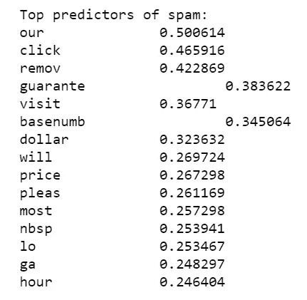

支持向量机就是这样！jupyter 笔记本会上传到我的 GitHub 上([https://GitHub . com/Ben lau 93/Machine-Learning-by-Andrew-Ng-in-Python](https://github.com/Benlau93/Machine-Learning-by-Andrew-Ng-in-Python))。

对于本系列中的其他 python 实现，

*   [线性回归](https://medium.com/@ben_lau93/andrew-ngs-machine-learning-course-in-python-linear-regression-dd04fba8e137)
*   [逻辑回归](https://medium.com/@ben_lau93/andrew-ngs-machine-learning-course-in-python-logistic-regression-c0ae25509feb)
*   [正则化逻辑回归](https://medium.com/@ben_lau93/andrew-ngs-machine-learning-course-in-python-regularized-logistic-regression-lasso-regression-721f311130fb)
*   [神经网络](/andrew-ngs-machine-learning-course-in-python-neural-networks-e526b41fdcd9)
*   [无监督学习](https://medium.com/@ben_lau93/andrew-ngs-machine-learning-course-in-python-kmeans-clustering-pca-b7ba6fafa74)
*   [异常检测](https://medium.com/@ben_lau93/andrew-ngs-machine-learning-course-in-python-anomaly-detection-1233d23dba95)

感谢您的阅读。