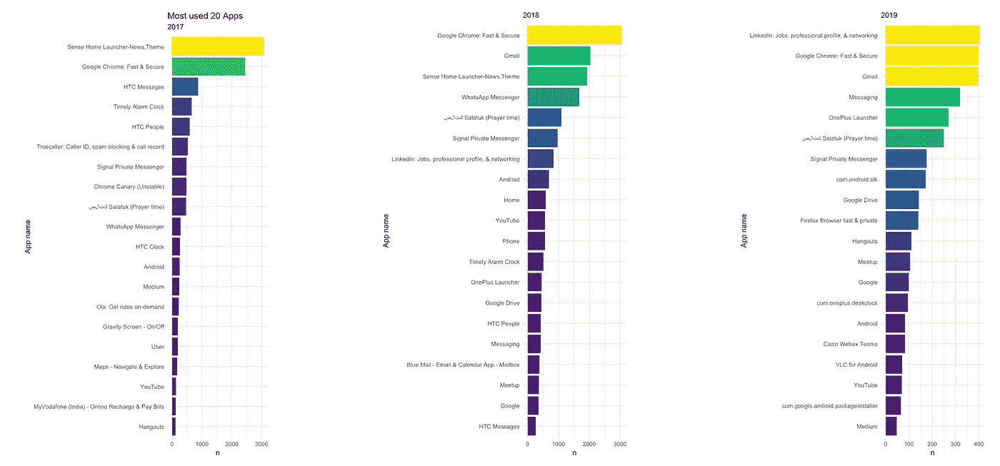
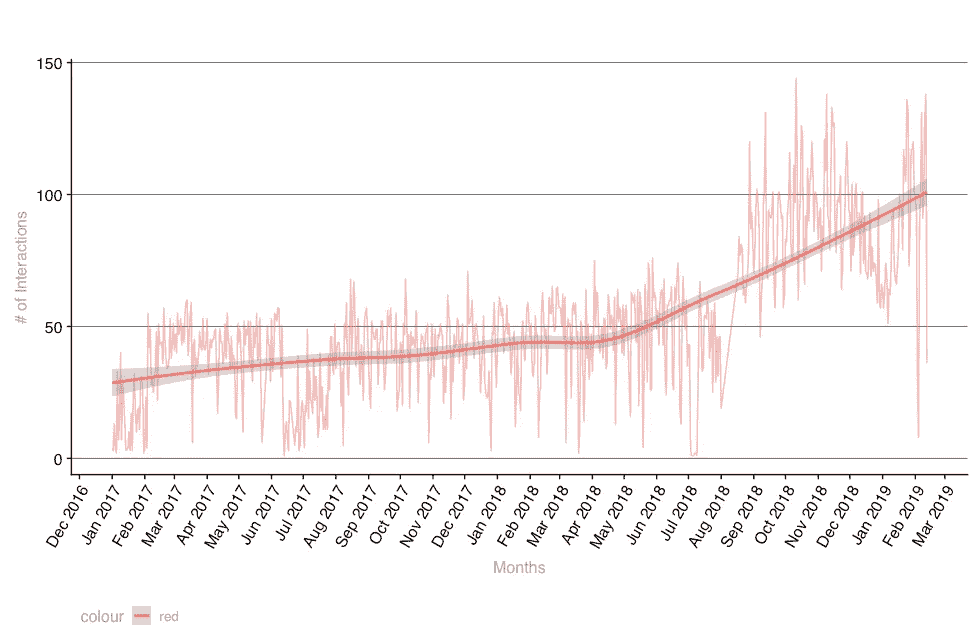
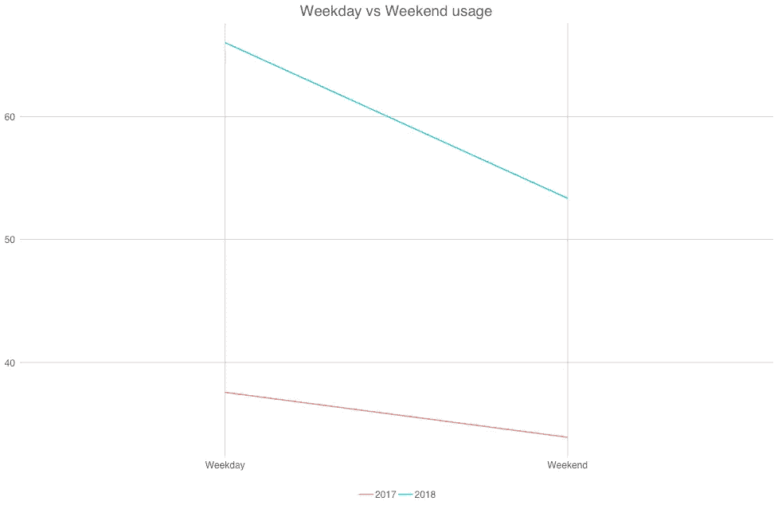
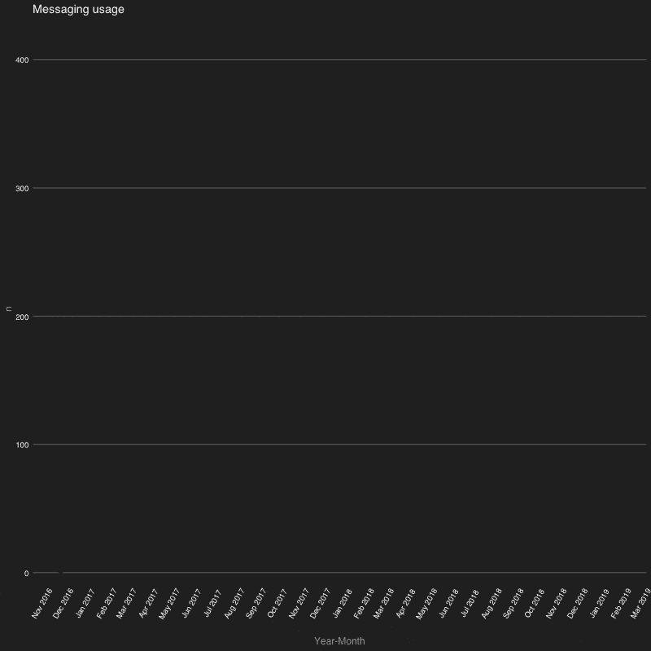
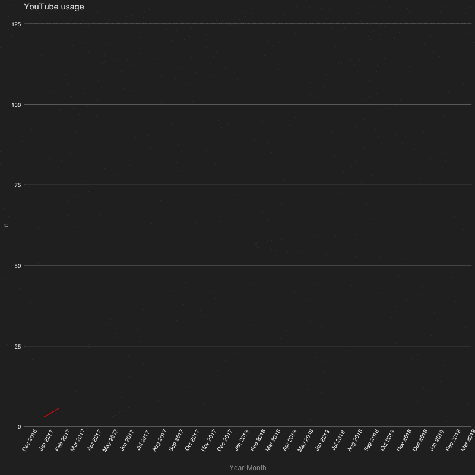

# 安卓智能手机使用分析，以减少手机成瘾

> 原文：<https://towardsdatascience.com/android-smartphone-usage-analysis-in-r-to-reduce-phone-addiction-135bd0084e41?source=collection_archive---------16----------------------->



使用您的数据科学技能来改善您的日常生活会有多有趣？因此，我决定利用谷歌让我们下载的数据，开始挖掘我的 Android 手机应用程序的使用情况。我张贴这篇文章的原因是为了让其他人反省他们的用法并了解它。因此，如果有人想复制我的结果，我将在下面的步骤中解释如何下载数据。

# 如何下载您的 Android 手机使用数据:

*   进入你的[谷歌账户](https://myaccount.google.com/?pli=1)(使用你在安卓手机上用过的 Gmail id)——如果你已经登录，跳过这一步。
*   去[谷歌外卖](https://takeout.google.com/)
*   点击**选择无**按钮，向下滚动查看**我的活动**
*   选择我的活动(启用灰色/蓝色按钮)并单击向下箭头选择 JSON 格式，然后单击下一步(最底部的按钮)
*   在下一个屏幕中，您可以选择您喜欢的下载方法和文件格式，然后单击 Create Archive。


一旦你的数据准备好下载，你会被通知下载。下载的文件将是一个压缩文件(最像 Zip —基于您在最后一个屏幕中的选择)。因此，解压缩它并保留 JSON 文件，以便我们继续进行下一步。

# 开始分析

# 使用的包

我们将使用下面的包进行分析。

```
library(jsonlite)
library(tidyverse)
library(lubridate)
library(ggrepel)
library(viridis)
library(gganimate)
library(cowplot)
library(ggthemes)
```

如果你还没有得到任何上述软件包，所有这些都可以在克兰。所以，使用`install.packages()`来安装缺失的包。

# 加载数据

我们有一个 JSON 输入文件，最好用 Dataframe 进行分析(因为它很适合 tidyverse)。但是这种数据处理在`jsonlite`的 omJSON()的帮助下简直易如反掌

接受 JSON 文件并输出扁平数据帧的函数。

```
me <- jsonlite::fromJSON("MyActivity.json")
```

有了上面的代码，我们就可以开始数据预处理了。

# 数据预处理

我们在分析中会用到的一列，时间

以字符串形式出现，其中包含数据和时间。但是对于我们来说，将时间作为时间处理—它必须是日期-时间格式，所以我们将使用函数 parse_date_time()将字符串转换为日期-时间，并使用 withtz()

更改时区。因为我住在印度，所以我把它转换成了印度标准时间。请使用您合适的时区进行转换。

```
# converting date-time in string to date-time format along with time-zone conversion
me$time_ist <- with_tz(parse_date_time(me$time),"Asia/Calcutta") 
# remove incomplete years and irrelevant years too - Kept 2019 to see just January if required
me <- filter(me, year(time_ist) %in% c(2017,2018,2019))
```

正如你在上面的代码中看到的，我们还过滤了我们的数据，只包括 2017 年、2018 年和 2019 年。这只是为了避免部分数据。尽管 2019 年也是部分数据，但我决定将其包含在主要数据中，以比较我在这三年中的应用。至此，我们已经做好了数据预处理，让我们开始分析。

# 数据注释

这里必须指出的一点是，这种活动数据包括您打开的应用程序和通知中显示的应用程序的所有内容，因此我们进一步假设每个通知也是我们交互的一部分(或者至少在我的情况下，每次弹出通知时，我都会检查它)。

# 样本/头部数据

```
# Sample
tibble::tibble(head(me))
*# A tibble: 6 x 1
  `head(me)`$header  $title   $titleUrl     $time  $products $details $time_ist          

1 OnePlus Launcher   Used On… https://play… 2019-…     2019-02-12 12:34:01
2 صلاتك Salatuk (Pr… Used صل… https://play… 2019-…     2019-02-12 12:34:01
3 Google Chrome: Fa… Used Go… https://play… 2019-…     2019-02-12 12:19:23
4 Firefox Browser f… Used Fi… https://play… 2019-…     2019-02-12 12:18:38
5 Hangouts           Used Ha… https://play… 2019-…     2019-02-12 12:18:15
6 Gmail              Used Gm… https://play… 2019-…     2019-02-12 12:17:50*
```

# 热门应用—每年

本节中的代码将绘制三个不同年份的三个不同的热门应用程序使用图，并最终将它们缝合在一起。

```
# Top apps
me_count <- me %>% 
  group_by(year = year(time_ist),header) %>% 
  count() %>% 
  arrange(desc(n)) %>% 
  ungroup() %>% 
  group_by(year) %>% 
  top_n(20,n) #%>% #View() 
#mutate(header = fct_reorder(header,n)) %>% me_count %>%  
  filter(year %in% "2017") %>% 
  ggplot(aes(fct_reorder(header,n),n, label = n)) +     
  geom_bar(aes(fill = n),stat = "identity") +
  #scale_y_log10() +
  coord_flip() +
  theme(axis.text.y = element_text(angle = 0, hjust = 1,size = 8))  +
  scale_fill_viridis() +
  theme_minimal() +
  theme(legend.position="none") +
  labs(
    title = "Most used 20 Apps",
    subtitle = "2017",
    x = "App name"
  ) -> y1me_count %>%  
  filter(year %in% "2018") %>% 
  ggplot(aes(fct_reorder(header,n),n, label = n)) +  
  geom_bar(aes(fill = n),stat = "identity") +
  #scale_y_log10() +
  coord_flip() +
  theme(axis.text.y = element_text(angle = 0, hjust = 1,size = 8))  +
  scale_fill_viridis() +
    theme_minimal() +
  theme(legend.position="none") +
  labs(
    subtitle = "2018",
    x = "App name"
  ) -> y2me_count %>%  
  filter(year %in% "2019") %>% 
  ggplot(aes(fct_reorder(header,n),n, label = n)) +  
  geom_bar(aes(fill = n),stat = "identity") +
  #scale_y_log10() +
  coord_flip() +
  theme(axis.text.y = element_text(angle = 0, hjust = 1,size = 8))  +
  scale_fill_viridis() +
  theme_minimal() +
  theme(legend.position="none") +
  labs(
    subtitle = "2019",
    x = "App name"
  ) -> y3
cowplot::plot_grid(y1,y2,y3, ncol = 3, scale = 0.7, vjust = 0, label_size = 8)
```

给出了这个图:


这张图清楚地告诉我，随着时间的推移，我的应用程序使用模式是如何变化或发展的。这也意味着我的手机从 HTC One(带有 Sense Launcher)换成了我最近的 Oneplus(带有 Oneplus Launcher)。你也可以注意到，我已经从 Whatsapp 转移到了 Signal messenger。

# 总体每日使用趋势

```
# Overall Daily usage trendme %&#x3E;%
filter(!str_detect(header,&#x22;com.&#x22;)) %&#x3E;%
filter(as.Date(time_ist) &#x3E;= as.Date(&#x22;2017-01-01&#x22;)) %&#x3E;% 
group_by(Date = as.Date(time_ist)) %&#x3E;%
count(n = n()) %&#x3E;%
ggplot(aes(Date,n, group = 1, color = &#x22;red&#x22;)) +
geom_line(aes(alpha = 0.8),show.legend = FALSE) +
stat_smooth() +
# Courtesy: [https://stackoverflow.com/a/42929948](https://stackoverflow.com/a/42929948)
scale_x_date(date_breaks = &#x22;1 month&#x22;, date_labels =  &#x22;%b %Y&#x22;) + 
labs(
    title = &#x22;Daily-wise usage&#x22;,
    subtitle = &#x22;2+ years (including some 2019)&#x22;,
    x = &#x22;Months&#x22;,
    y = &#x22;# of Interactions&#x22;
  ) + theme(axis.text.x=element_text(angle=60, hjust=1))+
  theme(legend.position=&#x22;none&#x22;) +
  ggthemes::theme_hc(style  = &#x22;darkunica&#x22;)
```

给出了这个图:



这个情节最让我害怕。自从我买了一部新手机后，我的手机使用量真的激增了，这似乎不是我工作效率的好迹象。

# 工作日与周末

这个情节是为了看看我是否真的是一个电话上瘾者，即使是在家里和家人在一起。

```
me %>% 
  filter(!str_detect(header,"com.")) %>% 
  group_by(Date = as.Date(time_ist)) %>% 
  count(n = n()) %>% 
  mutate(year = as.factor(year(Date)),
         weekday = weekdays(Date, abbr = TRUE)) %>% 
  mutate(what_day = ifelse(weekday %in% c("Sat","Sun"),"Weekend","Weekday")) %>% 
  filter(year %in% c(2017,2018)) %>% 
  group_by(year,what_day) %>% 
  summarize(n = mean(n)) %>% 
  ggplot(aes(fct_relevel(what_day, c("Weekday","Weekend")),
             n, group = year, color = year)) + 
  geom_line() +
  labs(
    title = "Weekday vs Weekend usage",
    subtitle = "For two years",
    x = "Weekday / Weekend",
    y = "# of Interactions"
  ) +
  ggthemes::theme_excel_new()
```

给出了这个图:



幸运的是，事实证明我并没有像我担心的那样上瘾。

# 消息使用

多年来，我使用过从普通短信到即时消息的各种消息应用。

```
# Messaging Usage
p <- me %>% 
  filter(str_detect(tolower(header), regex("signal|message|whatsapp"))) %>% 
  mutate(ym = as.Date(paste0(format(as.Date(time_ist),"%Y-%m"),"-01"))) %>% 
  group_by(ym) %>% 
  count() %>% 
  #https://community.rstudio.com/t/tweenr-gganimate-with-line-plot/4027/10
  ggplot(aes(ym,n, group = 1)) + geom_line(color = "green") +
  geom_point() +
  ggthemes::theme_hc(style = "darkunica") +
  theme(axis.text.x = element_text(colour = "white",
                                   angle = 60),
        axis.text.y = element_text(colour = "white")) +
  scale_x_date(date_breaks = "1 month", date_labels =  "%b %Y") + 
  labs(
    title = "Messaging usage",
    x = "Year-Month"
  ) +
  transition_reveal(ym) + 
  ease_aes('cubic-in-out')
animate(p, nframes = 20, renderer = gifski_renderer("msging.gif"), width = 800, height = 800)
```

给出此动画:



这张图表显示了这是我总体手机使用量的驱动因素之一。相似时期的相似峰值。

# Youtube 的使用

```
# YouTube Usage
yt <- me %>% 
  filter(header %in% "YouTube") %>% 
  mutate(ym = as.Date(paste0(format(as.Date(time_ist),"%Y-%m"),"-01"))) %>% 
  group_by(ym) %>% 
  count() %>% 
  #https://community.rstudio.com/t/tweenr-gganimate-with-line-plot/4027/10
  ggplot(aes(ym,n, group = 1)) + geom_line(color = "red") +
  geom_point() +
  ggthemes::theme_hc(style = "darkunica") +
  theme(axis.text.x = element_text(colour = "white",
                                   angle = 60),
        axis.text.y = element_text(colour = "white")) +
  scale_x_date(date_breaks = "1 month", date_labels =  "%b %Y") + 
  labs(
    title = "YouTube usage",
    x = "Year-Month"
  ) +
  transition_reveal(ym) + 
  ease_aes('quintic-in-out')
#anim_save("yt.gif", yt , width = 600, height = 600)
animate(yt, nframes = 10, renderer = gifski_renderer("yt2.gif"), width = 800, height = 800)
```

给出此动画:



这是我在 Youtube 上的使用情况，我主要使用媒体内容，这也与我的总体手机使用情况非常一致，这意味着这可能是另一个潜在的驱动因素。可能是我的手机屏幕变大了，所以我喜欢看更多的视频😑我也不希望事情变成这样。

# 结论

虽然我一直认为自己是为数不多的数字极简主义者之一，但这份分析证明，我并不完全是数字极简主义者，但在减少手机使用和改善生活方式方面，我还有待努力。请注意，这篇文章是以烹饪书风格而不是教程风格写的，这样你就可以开始运行你的 Android 活动分析。如果您对代码(逻辑)有任何疑问，请随时在评论中提出，我很乐意澄清它们。希望这篇文章能帮助你进行数据驱动的自我反省——至少是 Android 手机的使用。

# 参考

*   如果你对学习处理 web 数据感兴趣，可以看看这个关于处理 Web 数据的教程
*   整个代码库(还有一些章节和情节)可以在[我的 github](https://github.com/amrrs/data-driven-introspection) 上找到。随意星/叉使用！

*本帖最初发表于* [*DS+*](https://datascienceplus.com/data-driven-introspection-of-my-android-mobile-usage-in-r/) *。*