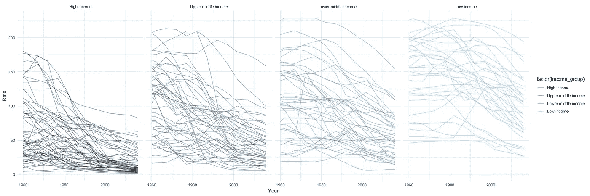
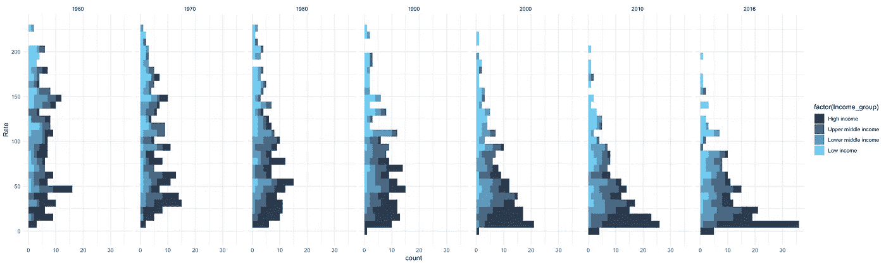
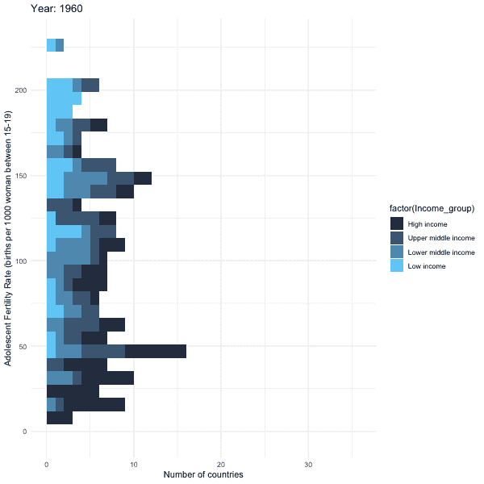
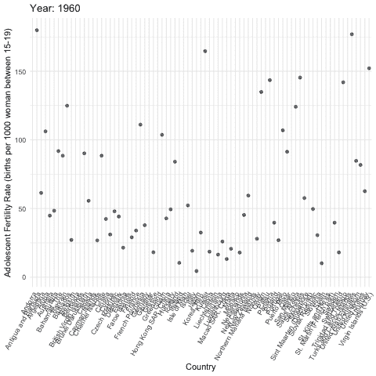
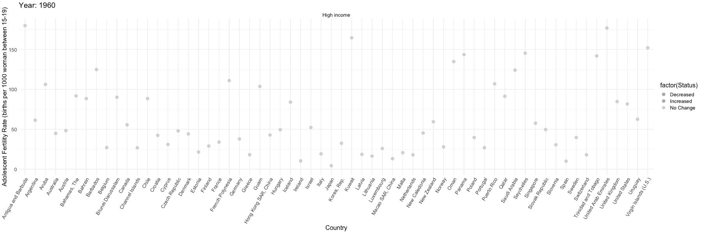

# 动画图表:可视化 R 中的“变化”

> 原文：<https://towardsdatascience.com/animated-charts-visualizing-changes-in-r-fee659fbabe5?source=collection_archive---------19----------------------->

[改头换面周一](https://www.makeovermonday.co.uk/data/)发布了一项来自[世界银行的关于世界发展指标的每周数据挑战:**青少年生育率(每千名 15-19 岁女性的出生率)**](https://data.worldbank.org/indicator/SP.ADO.TFRT) 三月份。有了这个数据集，首先我想看看这些数字是如何随时间变化的，以及在收入群体方面是否存在模式。本文反映了数据操作的过程以及图表是如何从静态发展到动态的。

## 线条的变化

当谈到随时间的变化时，折线图是查看结果的快速而清晰的解决方案。

```
setting <- ggplot(final, aes(Year, Rate, group = Country))setting+ 
 geom_line(alpha = 0.5, aes(color = factor(Income_group))) +
 scale_colour_manual(values = c(high, upmiddle, lowmiddle, low)) + 
 facet_grid(~Income_group) + 
 theme_minimal()
```



正如我所料，几乎每个国家的青少年生育率都在下降。不同收入群体之间的差异在于，高收入国家的青少年生育率在 20 世纪 90 年代下降得相当快；而低收入国家的失业率下降缓慢。情况正在好转，只是在世界的某些地方没有那么快。

## 视觉上强调“变化”

根据上面的观察，我在想如何将收入群体的快速和缓慢变化可视化。我以 10 年为间隔提取了 1960 年至 2016 年的数据集，并创建了直方图来查看逐年的变化。

```
# extract data for some years
data.someyears <- final %>% 
 filter(Year %in% c(2016, 2010, 2000, 1990, 1980, 1970, 1960))ggplot(data.someyears, aes(Rate, fill = factor(Income_group))) +
 geom_histogram() +
 scale_fill_manual(values = c(high, upmiddle, lowmiddle, low)) +
 facet_grid( ~Year) +
 theme_minimal() +
 coord_flip()
```



如直方图所示，随着时间的推移，越来越多的国家青少年生育率下降。高收入国家从高税率到低税率有显著的变化；低收入国家只取得一点点进步。然而，从 8 个独立的数据片段中想象这种运动并不容易。

## 制作动画图表

这一系列直方图让我想起了制作动画图表的想法，这样我们就可以直接“看到”变化。我找到了一篇关于使用 gganimate 库在 R 中制作动画的[有用文章。](https://www.datanovia.com/en/blog/gganimate-how-to-create-plots-with-beautiful-animation-in-r/)

```
movinghist <- ggplot(final, aes(Rate, fill = factor(Income_group))) +
 geom_histogram() +
 scale_fill_manual(values = c(high, upmiddle, lowmiddle, low)) +
 theme_minimal() +
 coord_flip() +
 #animation setting
 labs(
 title = ‘Year: {frame_time}’,
 y = ‘Number of countries’, 
 x = ‘Adolescent Fertility Rate (births per 1000 woman between 15–19)’
 ) +
 transition_time(as.integer(Year)) + #show the Year as integer
 ease_aes(‘linear’)animate(movinghist, width = 600, height = 600)
```



动画很有帮助。我们可以看到不同收入群体的国家如何降低青少年生育率。

除了按组可视化变化，我还进一步可视化了单个国家的变化。这样，**每个国家都有自己的地方，一个圆点就是一年的青少年生育率。由于有这么多国家，我一次制作了一个收入群体的动画图表。**

下面是一组的结果:



移动的点显示了有趣的行为。一些国家的利率有升有降。有些有明显的下降。如果用彩色编码，图表会提供更多的信息。因此，我计算了每年数字的变化，用绿色表示减少(因为越少越好)，红色表示增加，灰色表示没有变化*(1960 年也是没有变化)*

```
movingdots <- ggplot(filter(final, Income_group == ‘High income’), aes(Country, Rate, color = factor(Status))) +
 geom_point(alpha = 0.7, size = 2) +
 scale_color_manual(values = c(down, up, same)) +
 facet_grid(~Income_group, scales = ‘free’) +
 theme_minimal() +
 theme(axis.text.x = element_text(angle = 60, hjust = 1)) +
 #animation setting
 labs(
 title = ‘Year: {frame_time}’,
 x = ‘Country’, 
 y = ‘Adolescent Fertility Rate (births per 1000 woman between 15–19)’
 ) +
 transition_time(as.integer(Year)) + #show the Year as integer
 shadow_mark(alpha = 0.3, size = 0.5) +
 ease_aes(‘linear’)animate(movingdots, width= 1800, height=600)
```



我有点沉迷于这些点，继续看它们。

请随时与我分享反馈。