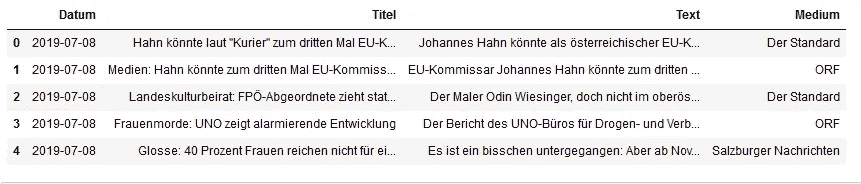
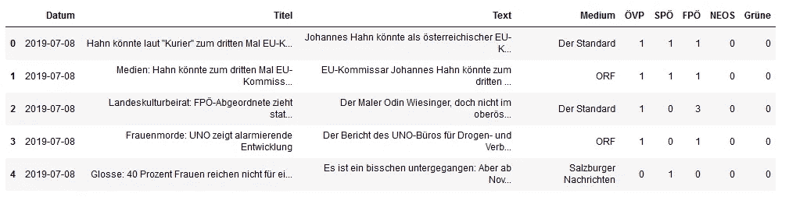
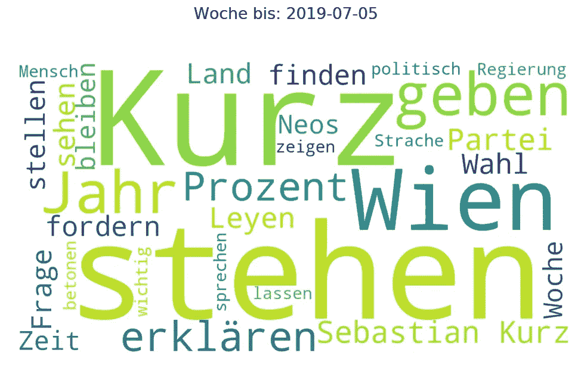

# 动画信息图形

> 原文：<https://towardsdatascience.com/animated-information-graphics-4531de620ce7?source=collection_archive---------36----------------------->

## 使用 Python 和 Plotly

Image www.pexels.com

各种数据集的动画信息图形是 youtube 上的一个热门话题，例如频道

 [## 数据是美丽的

### 这个频道是我的激情项目，带我们一起沿着记忆之路进行一次有趣的旅行，这样我们就可以重温多彩的…

www.youtube.com](https://www.youtube.com/channel/UCkWbqlDAyJh2n8DN5X6NZyg) 

拥有近百万订户。在这篇文章中，我将展示我的[数据集](https://medium.com/datadriveninvestor/on-the-media-coverage-of-political-parties-e1b1933f0810)上的一些这样的信息图的例子，这些数据集是奥地利报纸上关于政治的新闻文章，以及如何用 Python 和 Plotly(【https://plot.ly/】)创建动画。

在文章[https://medium . com/datadriveninvestor/topics-in-online-news-before-the-Austrian-elections-2019-d 981 fac BD 0 DD](https://medium.com/datadriveninvestor/topics-in-online-news-before-the-austrian-elections-2019-d981facbd0dd)中，我分析了选举前的话题。在这篇文章中，我想回顾一下从 2019 年下半年开始的新闻，并用动画图形来分析一段时间内的新闻。我收集并分析了 12 家奥地利在线日报的 22，000 多篇新闻文章。

第一个视频显示了每一天每一方被命名的频率。从 7 月开始算，一直算到年底。最后，VP 就在 FP 的前面,“NEOS”显然在最后。

在第二个视频中，显示了每个政党每周在每份报纸上被提及的次数。这也显示了整个下半年的动画。值得注意的是，个别媒体对某些党派有明显的偏好，例如，NEOS 在 ORF 之外很少被提及。国民议会选举的那一周在越来越多的报道和提及中清晰可见。选举后的联合政府谈判时期可以从“绿党”越来越多的命名中看出来。其他很多方面往往要看几遍视频才能看出来。

为了不仅检查报告的数量，我还试图以进一步可视化的方式显示主要内容。最常见的单词每天都显示在“单词云”中。占主导地位的人物明显突出，但选举期间的用词变化也很明显。在这里，像“百分比”或“选举结果”这样的词占主导地位。

## 让我们看看动画是如何创作的？

我加载了一个包含文章的数据框和一些用于数据框操作和日期处理的包。

Dataframe with articles

在统计了文章中提到的政党之后，数据框架被扩展为每个政党一栏。

Extended data frame

然后一些政党、报纸和动画日的列表被创建。对每个政党(和报纸)的条目进行汇总，生成一个带有“Plotly”的条形图。这些都标有条目的数量。为了获得更平滑的动画过渡，在两天的条形图之间计算了 15 个中间步骤，这些步骤是线性插值的。

在对图形进行一些格式化和标记后，它们被保存为编号的 PNG 文件。然后可以使用 Adobe After Effects 等软件将这一系列图像组合成一部电影。

为了创建“文字动画”，我使用了 Python 包“文字云”([https://github.com/amueller/word_cloud](https://github.com/amueller/word_cloud))。这个包为每天计算一个“单词云”,并再次保存为一系列 PNG 文件。

Image by the author

最后，我使用 After Effects 合并了上面显示的视频，并添加了一些字幕。