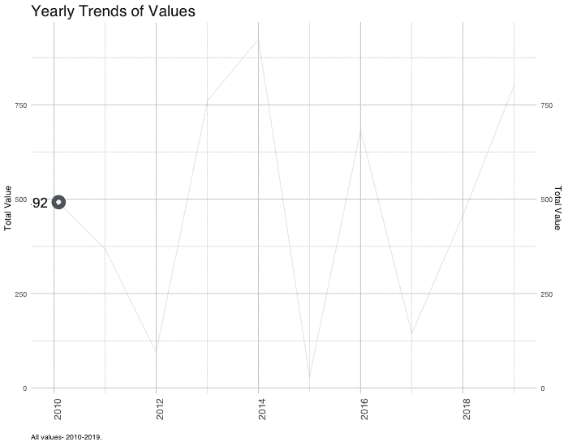
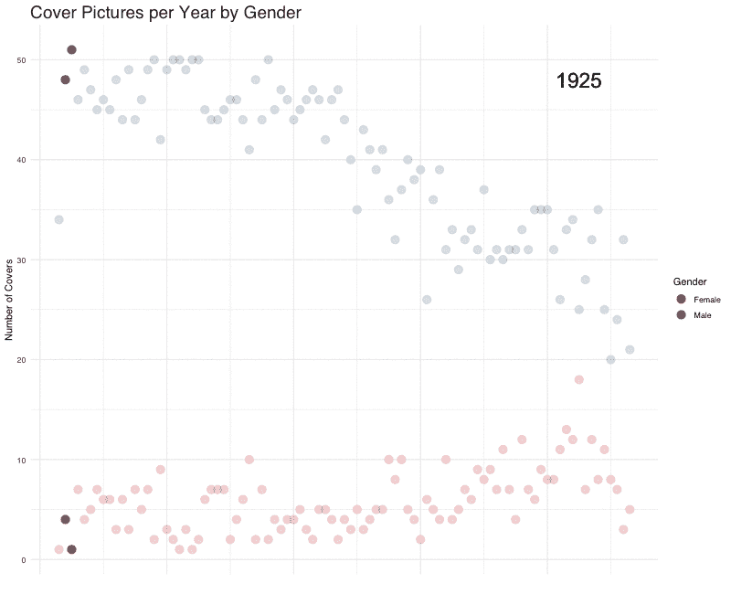

# 带 tweenR 的 R 中的动画情节

> 原文：<https://towardsdatascience.com/animated-plots-in-r-with-tweenr-80c48b9f5292?source=collection_archive---------18----------------------->


Photo by [Markus Spiske](https://unsplash.com/photos/QtFAXP6z0Wk?utm_source=unsplash&utm_medium=referral&utm_content=creditCopyText) on [Unsplash](https://unsplash.com/search/photos/frames?utm_source=unsplash&utm_medium=referral&utm_content=creditCopyText)

利用动画来展示数据趋势是一个很好的讲述工具。在 R 中有几个创建动画效果的包

我最近遇到了 tweenR，它允许你通过插值创建平滑的过渡。tweenr 包本身实际上并不执行任何动画；相反，它创建中间状态，使动画更流畅。

下面是一个使用一些虚拟数据的教程:

```
library(dplyr)
library(scales)
library(tweenr)
library(animation)
library(dplyr)
library(ggplot2)
library(ggthemes)# an example of a time series data frame
plot_data <- data.frame(Date =seq(as.Date("2010/1/1"), as.Date("2019/1/1"), "years"), Value=runif(10,0,1000)) # prepare  data for tween by creating columns for the time between points
df.all<-plot_data %>% 
  mutate(day=as.numeric(Date-min(Date)+1),ease="linear")# add rows to fill in the gaps
plot_data_tween<-tween_elements(df.all, time = "day",  group="ease", ease="ease", nframes = nrow(df.all)*20)
df_tween_appear <- tween_appear(plot_data_tween, time='day', nframes = nrow(df.all)*10) 
```

绘图功能:

```
make_plot <- function(i){
  plot_data <-  df_tween_appear %>% filter(.frame==i, .age> -3.5) 
  p<- plot_data %>%
    ggplot()+
    geom_line(aes(x=Date, y=Value),color="darkgray", size=0.7)+
    geom_point(data=. %>% 
              filter(Date==max(Date)),
              mapping=aes(x=Date, y=Value),
              size=3,color="pink",stroke=4)+
    geom_point(data=. %>% 
               filter(Date==max(Date)),
               mapping=aes(x=Date, y=Value), color="white", size=2)+
    geom_text(data=. %>% filter(Date==max(Date)),
              mapping=aes(x=Date,
              y=Value,label=round(Value,0)),
              color="black",
              nudge_x=7,hjust=1.5, size=6)+
    geom_line(data=df.all, aes(x=Date,y=Value),alpha=0.1)+
    theme_minimal(base_family = "sans")+
    scale_y_continuous(sec.axis=dup_axis())+
    theme(plot.subtitle=element_text(face="italic",size=14),
          plot.title=element_text(color="darkcyan",size=19),
          plot.caption=element_text(hjust=0),
          panel.grid.major.x = element_line(color="lightgray"),
          panel.grid.minor.x = element_line(color="lightgray"),
          panel.grid.major.y = element_line(color="lightgray"),
          panel.grid.minor.y = element_line(color="lightgray"),
          axis.text.x = element_text(angle = 90, hjust = 1, size=12))+
          labs(x="",y="Total Value",
          caption="All values- 2010-2019.")+
          ggtitle(("Yearly Trends of Values"))
  return(p)
} 
```

现在我们循环每一帧并创建情节，然后使用[动画](https://cran.r-project.org/package=animation)包的`saveGIF`函数保存它。

```
ani_settings<-ani.options(interval=1/10)  *# N*umber to set the time interval of the animation (unit in seconds); *adjust for speed of ani*saveGIF({for (i in 1:max(df_tween_appear$.frame)){
  g<-make_plot(i)
  print(g)
  print(paste(i,"out of",max(df_tween_appear$.frame)))
  ani.pause() # adds a pause the end of animation
}
},movie.name="gifs/yearlytrends.gif",ani.width = 500, ani.height = 350)
```



# **一个有趣的例子:时间覆盖了多年**


我摆弄了一下 Kaggle 的**‘时代杂志封面图片’**数据集。

该数据包含每年登上封面的女性和男性人数。然后我给数据框添加了帧和渐变。

调整“make_plot”上方的函数，然后在 tween_elements 参数中按性别分组，以便每年创建一个帧。

结果图如下所示:

**性别人口统计**



我在 R 中找到了一些很棒的动画资源，特别是:tweenr github 有一些教程:[https://github.com/thomasp85/tweenr](https://github.com/thomasp85/tweenr)

我使用了这里的优秀教程来学习和理解 tweenR:

[http://lenkiefer.com/2018/03/18/pipe-tweenr/](http://lenkiefer.com/2018/03/18/pipe-tweenr/)