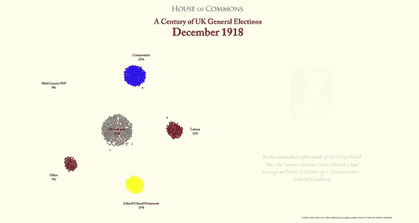
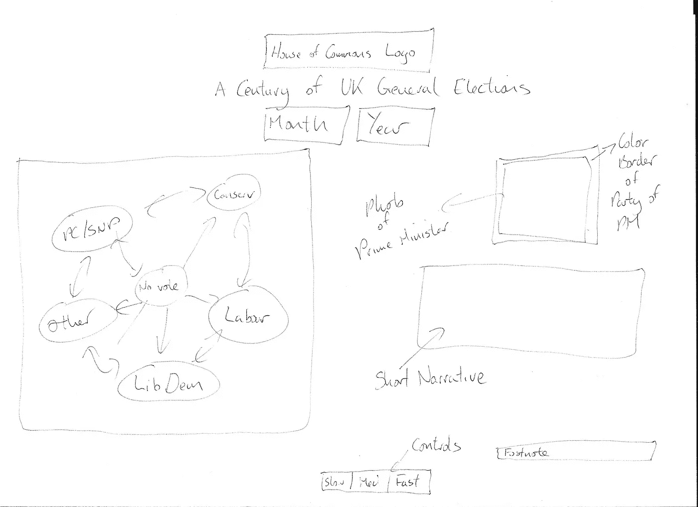

# 使用 Javascript D3 库的动画讲故事

> 原文：<https://towardsdatascience.com/animated-storytelling-using-the-javascript-d3-library-a1c2264142ad?source=collection_archive---------16----------------------->

## D3 是可用的最灵活的数据可视化工具，允许你创建伟大的数据故事插图



在我发表这篇文章的当天，英国将在 12 月举行自 1923 年以来的首次大选。代议制政府非常有趣，关于投票的数据往往可以告诉我们一个不同的故事，从下议院席位的最终结果以及哪个政党(或政党联盟)组成政府来看。

受 Nathan Yau 的[原创 viz](https://flowingdata.com/2015/12/15/a-day-in-the-life-of-americans/) 和这些人[的一个奇妙项目](http://ustimeuse.github.io/oneday.html)的启发——我自由地窃取并调整了代码——我开始创作一个自 1918 年以来所有英国大选的故事(这被认为是第一次现代选举)。我想到了一个相当简单的布局，其中我将有一个由 1000 名合格的左翼选民组成的力导向气泡图，其中选民将从一次选举“移动”到另一次选举，显示大众投票是如何分布的。在右边，我会有一个简单的叙述，有一张当选总理的照片和一个关于发生了什么的简短叙述。这是我最初想做的事情的草图。

如果你不想看“如何做”，我的完整代码在这里是，可视化在这里是。



My initial sketch

## 我需要什么？

对于这个项目，我需要:

1.  一些数据——我们需要做一些操作，并把它们放在一个`data`文件夹中。
2.  一些图片——我从维基百科中提取了所有首相的照片，并把它们放在一个名为`img`的文件夹中。为方便起见，每个文件都按选举日期命名。
3.  一些 Javascript，它们会放在一个`js`文件夹里。
4.  一些用于造型的`css`，它们将放在`css`文件夹中。

## 准备数据

从英国议会图书馆，我能够得到关于各政党的投票百分比的数据，我能够将这些数据与投票率统计数据结合起来，这样我就可以在我的图表中包括那些没有投票的人。所以我的起始`csv`档是这里的。

我需要重新想象一下，如果有 1000 名选民，每个人都由气泡图上的一个小气泡代表，那会是什么样子。所以我需要做的是将这些统计数据转换成一个 1000 行 27 列的数据帧，每行代表一个选民，每列代表一个选举日期。然后我按照五个党派团体和‘没有投票’的团体给每张选票编码 0，1，2，3，4，5。在我的数据框的每个单元格中，都是那个人在那次选举中投票支持的政党的代码。

然后，我需要向数据中添加一些时间序列，因为它将用于说明人们在时间上的运动。利用启发这项工作的方法，我决定将 27 次选举想象成一天中的几分钟，并将时间平均划分为 1440 分钟，这样最终的可视化将在移动到下一次选举之前显示相同时间的每个选举结果。

最后，我需要将每个人的数据输出为逗号分隔的字符串，其中奇数元素表示政党代码，偶数元素表示时间，因为这将是输入 web 代码的格式。

我在 R 中完成了这个转换，并将输出写成一个`tsv`文件，稍后我会将它放入我的 web 代码中。我用的 R 代码是这里的[这里的](https://github.com/keithmcnulty/uk_election_bubble/blob/master/transform_data.R)最后的`tsv`输出是这里的[这里的](https://github.com/keithmcnulty/uk_election_bubble/blob/master/data/elec_results.tsv)。

## 在 D3 中设置 viz

我们需要在我们的`js`文件夹中有可用的 D3 v3.5.5。我取了美国时间使用 viz 中使用的 Javascript 代码，并根据我的目的进行了调整，创建了一个名为`election_bubbles.js`的文件。首先，我设置了起始速度和图表尺寸，创建了一个列表供以后使用，并将时钟设置为零:

```
var USER_SPEED = "fast"; var width = 750,    
    height = 750, 
    padding = 1, 
    maxRadius = 3, 
    sched_objs = [], 
    curr_minute = 0;
```

接下来，我将每个活动代码定义为一个政党:

```
var act_codes = [ 
    {"index": "0", "short": "Conservative", "desc": "Conservative"},     
    {"index": "1", "short": "Labour", "desc": "Labour"}, 
    {"index": "2", "short": "Liberal/Liberal Democrats", "desc": "Liberal Democrats"}, 
    {"index": "3", "short": "Other", "desc": "Other"}, 
    {"index": "4", "short": "Plaid Cymru/SNP", "desc": "Plaid Cymru/Scottish National Party"}, 
    {"index": "5", "short": "Did not vote", "desc": "Did not vote"},
];
```

我还以毫秒为单位设置了我的速度选项，供以后使用:

```
var speeds = { "slow": 200, "medium": 125, "fast": 75 };
```

现在我使用了一个名为`time_notes`的列表来保存可视化所需的所有显示信息。对于每个选举，我创建了如下的键值对:

*   `start_minute`:我们的“虚拟时钟”上开始每次选举显示的时间——53 的倍数加 1。(53 是 1440/27 的舍入版本)。
*   `stop_minute`:停止每次选择显示的时间——在`start_minute`之后 50 虚拟分钟。
*   `year`:选举日期显示在页面顶部。
*   `img`:当选首相的照片之路。
*   `color`:包围每个`img`的边框——对应总理所属政党的颜色。
*   `note`:要显示的文本叙述。

这是一个相当长的列表，所以我不会在这里显示它—您可以在链接的源代码中看到它。此外，我将设置一个变量`notes_index = 0`,在后面的代码中指示我想从列表的第一个元素开始——1918 年的选举。

接下来，我想将“没有投票”的位置设置在 viz 的中心，然后将五个政党分组均匀地分布在中心周围的一个圆圈中。我希望列表中的第一方位于圆圈的右上位置，并将使用我的索引来确保:

```
var center_act = "Did not vote", 
    center_pt = { "x": 380, "y": 365 }; var foci = {};
act_codes.forEach(function(code, i) { 
    if (code.desc == center_act) {  
        foci[code.index] = center_pt; 
    } else {  
         var theta = 2 * Math.PI / (act_codes.length-1);    
         foci[code.index] = {x: 250 * Math.cos((i - 1) * theta)+380, y: 250 * Math.sin((i - 1) * theta)+365 }; 
    }
});
```

现在我将开始初始的`svg`——我计划在最终将它放入 HTML 时，将它完全放在它的父节点中:

```
var svg = d3.select("#chart").append("svg")    
    .attr("width", width)    
    .attr("height", height)    
    .attr('position', 'absolute')    
    .attr('left', '200px')    
    .attr('top', '200px');
```

## 运行 viz

现在，我将编辑主要的 viz 函数，以在每次选举的原力导向网络中移动。本节中的所有代码都将封装在一个函数中，该函数将在我们的 1000 个投票者的`tsv`文件上运行，如下所示:

```
d3.tsv("data/elec_results.tsv", function(error, data) {}
```

首先，我们从`tsv`中获取投票活动和持续时间的键值对列表，这些将填充到`sched_objs`列表中:

```
data.forEach(function(d) {  
    var day_array = d.day.split(",");  

    var activities = [];  
    for (var i=0; i < day_array.length; i++) {   
        if (i % 2 == 1) {    
            activities.push({'act': day_array[i-1], 'duration': +day_array[i]});   
        }  
     }  
     sched_objs.push(activities); 
});
```

接下来，我们只是窃取代码来填充每次选举的 1000 个节点，并将它们与标签一起写在我们的初始`svg`上。我不会在这里全部复制，但您可以在第 99–175 行[这里](https://github.com/keithmcnulty/uk_election_bubble/blob/master/js/election_bubble.js)找到它。

现在，我们使用`timer()`函数在后台运行虚拟时钟时运行数据中的开关。你可以在第 179–294 行[这里](https://github.com/keithmcnulty/uk_election_bubble/blob/master/js/election_bubble.js)找到完整的`timer()`函数，但是在这个函数中，我想强调一些这个可视化特有的东西。

首先，我们使用 D3 的`transition()`函数滚动图表标题中的日期，通过从背景色淡入使文本快速显示(这是您第一次看到某些样式元素，如背景色和字体):

```
 if (true_minute == time_notes[notes_index].start_minute) {     
    d3.select("#year")          
    .style("color", "#fffced")          
    .style("text-align", "left")          
    .style("font-size", "300%")    
    .style("font-family", "adobe-caslon-pro")   
    .text(time_notes[notes_index].year)    
    .transition()    
    .duration(500)    
    .style("text-align", "center")    
    .style("color", "#000000");  
}
```

同样，我们可以通过转换图像的不透明度来淡入和淡出图像:

```
if (true_minute == time_notes[notes_index].start_minute + 10) {
d3.select("#image").append('img')
    .attr('src', time_notes[notes_index].img)
    .attr('width', 200)
    .attr('height', 250)
    .style('position', 'absolute')
    .style('top', '100px')
    .style('left', '150px')
    .style('opacity', 0)
    .style("display", "block")
    .style("background", time_notes[notes_index].color)
    .style("padding", "8px")
    .style("border", "1px solid #ccc")
    .style("box-shadow", "5px 5px 5px #999")
    .transition()
    .duration(1000)
    .style('opacity', 1);
}
```

我们也可以上下滚动音符:

```
if (true_minute == time_notes[notes_index].start_minute + 10) {
   d3.select("#note")
      .style("top", "500px")
      .style("color", "#fffced")
      .style("font-size", "150%")
      .style("font-style", "italic")
      .transition()
      .duration(500)
      .style("top", "370px")
      .style("color", "#000000")
      .text(time_notes[notes_index].note);
}
```

您将看到许多类似的代码段，它们根据力导向气泡图中运动的时间来处理文本和图像的出现和消失。此外，还有一个功能可以根据英国政党的官方颜色来设置节点的颜色。

## 建立 viz

我们的 Javascript 现在给了我们几个动画对象来插入我们的网页。

*   一个选举日期(`#year`)，我想把它放在顶部，居中，在其他标题文本的下面
*   一个力导向的气泡图(`#chart`)，我想在页面的左边。
*   一个图像(`#image`)，我想在右边，一些叙事文本上方居中
*   一些叙事文本(`#note`)，我想在右边，居中，图像下方。

一些简单的`html`和一些`css`样式可以在`css`文件夹中找到——这里是为我工作的一般设置:

```
<div class="container" style="width:1600px">
    <div class="row">
        
    </div>
    <div class="row">
        <div style="text-align:center;font-family:adobe-caslon-pro;font-size:200%;font-weight:bold">A Century of UK General Elections</div>
    </div>
    <div class="row">
        <div id="year"></div>
    </div>
    <div class="row">
        <div id="chart" class="col-lg-2" style="position:relative;width:1000px"></div>
        <div class="col-lg-2" style="position:relative;width:500px">
           <div id="image"></div>
           <div id="note" style="text-align:center"></div>
        </div>
    </div>
    <div class="row">
        <footer style="font-size:25%;text-align:right">Created by @dr_keithmcnulty. Github: <a href="https://www.github.com/keithmcnulty/uk_election_bubble">keithmcnulty/uk_election_bubble</a>. Source: UK Parliament, Statistica, Wikipedia</footer>
    </div>
   <div class="row" style="text-align:center">
        <div id="speed">
        <div class="togglebutton slow" data-val="slow">Slow</div>
        <div class="togglebutton medium" data-val="medium">Med</div>
        <div class="togglebutton fast current" data-val="fast">Fast</div>
    </div>
    </div>
    </div>
</div>
```

我将它插入到`electionvis.html`中，这也调用了一些引导样式和我的 JS 脚本。然后将它作为一个`iframe`插入到主`index.html`中，如果需要的话，可以控制 viz 的整体高度和宽度。

## 成品

这是成品的样子:


See the full thing [here](https://keithmcnulty.github.io/uk_election_bubble/)

使用 Javascript 需要一些学习，但是 D3 是一个非常灵活的工具，可以构建数据驱动的故事，在我看来完全值得努力。此外，还有许多预先构建的代码可供您根据自己的目标重新使用，就像我在这里所做的一样。

最初我是一名纯粹的数学家，后来我成为了一名心理计量学家和数据科学家。我热衷于将所有这些学科的严谨性应用到复杂的人的问题上。我也是一个编码极客和日本 RPG 的超级粉丝。在[*LinkedIn*](https://www.linkedin.com/in/keith-mcnulty/)*或*[*Twitter*](https://twitter.com/dr_keithmcnulty)*上找我。*