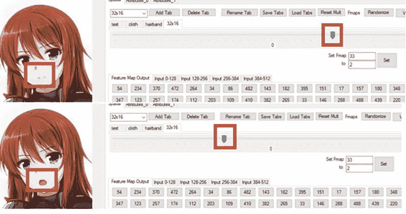
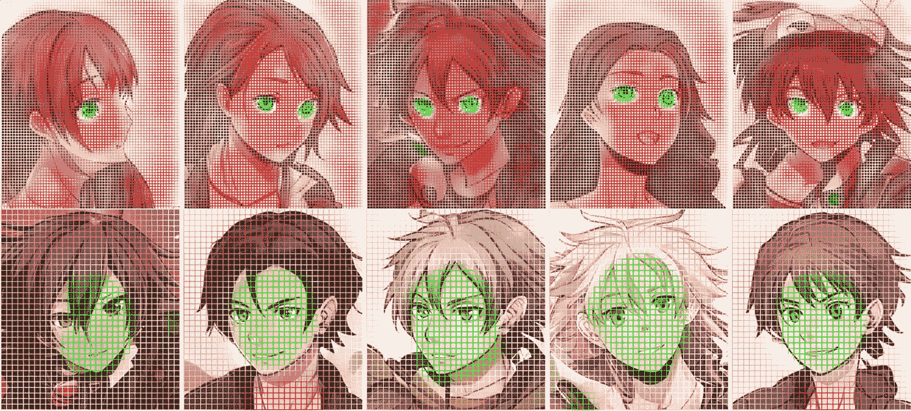

# 用 StyleGAN 制作 gAnime 动画:第 1 部分

> 原文：<https://towardsdatascience.com/animating-ganime-with-stylegan-part-1-4cf764578e?source=collection_archive---------8----------------------->

## 介绍与创成式模型交互的工具

Figure 1: Modifying spatial map(s) at a single location to produce an animation

# 1.1:前言

这是一个关于我使用[生成对抗网络](https://en.wikipedia.org/wiki/Generative_adversarial_network)进行的一个项目的技术博客。由于这是一个个人项目，我摆弄了一个我通常不会在专业环境中使用的动画数据集。以下是该数据集的链接以及关于使用该数据集的模型的详细介绍:

 [## Danbooru2018:大规模众包、标签化的动漫插画数据集

### 用于计算机修订的深度学习依赖于大型标注数据集。分类/归类受益于…

www.gwern.net](https://www.gwern.net/Danbooru2018)  [## 用 StyleGAN 制作动漫脸

### 生成神经网络，如 GANs，多年来一直在努力生成质量不错的动漫人脸，尽管…

www.gwern.net](https://www.gwern.net/Faces) 

我做的大部分工作纯粹是为了学习，但我最终得到的一些更有趣的结果是矩形肖像的嘴部动画:

Figure 2: Quick/Smooth mouth animation. Due to lack of data, male portraits tend to be lower quality

我将详细介绍我所做的技术细节和我学到的一些经验。该项目的一部分是一个工具，使互动和学习的生成性敌对网络更容易，但在这一点上，它不是用户友好的。如果我继续这个项目，我的目标之一将是发布该工具的一个版本，任何人都可以立即开始使用它来创建如图 2 所示的动画，但现在它主要是一个研究工具:

Figure 3: A screenshot of part of the tool. The UI definitely needs work, but at this point it’s still a prototype that I’m adding and removing features from on a regular basis

我发现，将实验代码整合到这样的工具中，而不是使用 jupyter 笔记本，可以更容易地用不同的设置重复实验。有些概念只有通过重复才能真正坚持，所以如果没有这个工具，我觉得我会错过博客中提到的一些见解。如果你只是对示例动画感兴趣，而不是技术细节，你可以跳到*结果:动画*部分。

个人项目的一个主要问题是它们只涉及单一视角。我写这个博客的目的是获得其他人对这个话题的看法，详细描述我在这个项目上的工作经历，并接受建设性的批评/纠正。

# 1.2:简介和结果总结

几年来，我一直习惯于定期重新实现关于[生成模型](https://en.wikipedia.org/wiki/Generative_model)的论文，所以我在 [StyleGAN](https://arxiv.org/abs/1812.04948) 论文发表的时候开始了这个项目，从那以后一直断断续续地在做这个项目。它包括 3 个主要部分:

1.StyleGAN 的重新实现，做了一些调整

2.使用该实现训练的模型

3.一种用于可视化和与模型交互的工具

我开始重新实现 StyleGAN 作为学习练习，因为当时官方代码还不可用。结果比我使用的其他模型好得多，所以我想更深入地研究。让我兴奋的一个生成模型的应用是视频游戏的自动资产创建。StyleGAN 是我实现的第一个在视频游戏中可以接受的模型，所以我最初的步骤是尝试让 Unity 这样的游戏引擎加载该模型。为了做到这一点，我做了一个. NET DLL，它可以与模型交互，理论上可以导入到 Unity 中。为了测试 DLL，我创建了一个与它交互的工具。当我想到它们的时候，我最终给马具添加了越来越多的特性，直到它成为项目中最大的部分之一。总体架构如下:

Figure 4: From TensorFlow python implementation to generating images with the tool

我喜欢使用工具来可视化数字对象并与之交互，否则这些数字对象可能是不透明的(如恶意软件和深度学习模型)，所以我添加了一个功能，即[功能图](/applied-deep-learning-part-4-convolutional-neural-networks-584bc134c1e2)(图 5)的可视化以及修改它们的能力。观察不同图像中不同层的特征地图最活跃的位置，有助于我理解模型在做什么，并使自动定位一些面部特征变得简单。当谈到修改时，我注意到在特定位置从特征图中增加或减去值可以用来进行有意义的改变——例如张开和闭上嘴(图 2)。结合自动面部特征检测，这可用于对所有生成的图像进行一致、有意义的修改，而无需标签(图 9，10)。

Figure 5: Feature maps can be used to identify meaningful locations (top: eyes, bottom: faces). Red squares indicate negative activations, green squares indicate positive activations, white squares indicate activations close to 0

总结一下:一个特征使用特征映射来修改面部特征。

以下是博客其余部分的结构:

*   生成模型的应用
*   工具生成的动画
*   代码的简要讨论
*   重新实施详细信息
*   对数据的讨论
*   培训程序的讨论

## 应用程序

总的来说，有几个应用让我对创成式模型感兴趣:

*   更好的游戏资产生成过程
*   让艺术创作变得更容易、更快速
*   无监督学习的基本潜力与生成因素的解开相结合

*游戏资产更好的程序生成*

我对生成模型将程序生成带到下一个层次的可能性感到兴奋。据我所知，基于现代规则的过程化生成技术不能从高度复杂的分布中随机创建样本。例如，程序生成的关卡的一个子部分可以独立于该关卡的其余部分，并且仍然可以被玩家接受。随机生成图形(如人物肖像)要困难得多，因为好看的图像往往反映真实世界，而真实世界有如此多的相互依赖性，以至于每个像素都需要在每个其他像素的背景下考虑。即使是风格化/绘制的图像也需要一致的照明、解剖、纹理、透视、风格等。为了好看。这也适用于自动生成音频、对话、动画和故事情节。生成模型是目前我所知道的从如此复杂的发行版中可靠地创建样本的最佳方式。

*让艺术创作更简单快捷*

在生成模型的背景下，交互式工具也有可能允许外行创建图像，否则需要有经验的艺术家，或者允许艺术家加速他们工作中更常规的部分。我不认为生成模型会很快消除对创意艺术家的需求，因为生成模型(以及大多数机器学习模型)专注于对特定分布进行建模。这使得创建不同于训练分布中任何样本的高质量图像(创造性图像)变得困难。像这篇博客中使用的工具，允许人们添加定制的改变，可以帮助产生更独特的图像，特别是如果模型已经学习了一些基本的图形概念，如照明和透视。

*无监督学习的基本潜力与生成因素的解开相结合*

由于未标记的数据远远超过标记的数据，并且深度学习非常渴望数据，我认为无监督/半监督学习有可能在未来几年逐渐取代监督方法。特别是一些深度生成模型的方法已经被用来[理清](https://arxiv.org/pdf/1206.5538.pdf)数据集中的变异因素:关于 StyleGAN 如何做到这一点(至少是部分做到)的例子，见图 7，8。实际上并没有一个一致同意的[解纠缠](https://arxiv.org/abs/1812.02230)的正式定义，我的理解是[有限的实验证据表明它对下游任务](https://arxiv.org/abs/1905.12506)有用。然而，与 GANs 一起工作使我乐观地认为这将是有用的。虽然生成器不能为它没有生成的图像生成传统的内部表示，但有几个[其他](https://arxiv.org/abs/1807.03039)类型的生成模型可以在视觉质量上与 GANs 竞争，并且可能更适合下游任务。

## 结果:动画

我能训练的最好的模型是在一个动漫数据集上([https://www.gwern.net/Danbooru2018](https://www.gwern.net/Danbooru2018))。我将在数据部分探讨这种做法的优点和缺点，其中一个主要缺点是缺乏多样性:很难塑造男性形象。以下所有示例都是使用该工具生成的。我最初在 jupyter 笔记本上创建了这样的图像，但是使用专用工具大大加快了速度，并让我从不同的角度了解了模型的工作原理。下面的图片根据制作的复杂程度大致排序:图 7/8 比图 6 需要更多的工作，如果没有工具，图 9/10 会比图 7/8 更难制作。

图 6 是几个图像的中间潜变量之间的插值的例子。GANs 可以实现的一个很酷的结果是确保插值图像具有与端点相似的质量。

Figure 6: Interpolating between random latent vectors

图 7 是通过在中间潜在空间中定位具有特定含义(在这种情况下是头发或眼睛颜色)的矢量并在该方向上移动来修改图像的例子。例如，黑头发的向量可以通过拍摄许多有黑头发的脸的图像并平均它们的潜在值，然后从所有其他图像的平均值中减去结果来找到。我将在培训/后处理部分详细讨论这一点。

Figure 7: Changing a latent vector in a meaningful direction

图 8 显示了应用于属性“mouth open”时用于生成图 7 的相同概念。这在某种程度上是可行的，但是属性并没有完全解开:图像的每个部分都可以看到变化，而不仅仅是嘴巴。常识告诉我们，一个人可以移动他们的嘴，而不会明显改变其他东西。一个简单的方法是将动画嘴部粘贴到其他静态图像上，但这在改变“嘴部张开”向量也会改变肤色或图像风格的情况下不起作用。

Figure 8: Vector to change mouth also changes other attributes

图 9 示出了修改靠近角色嘴的空间位置处的特定特征图以产生不会引起全局变化的说话(或咀嚼)动画的示例。只需一点手动工作，就可以找到需要修改以产生这种变化的要素地图，而只需要几个已标注数据的示例。所有这些都可以通过工具来完成。该过程的灵感来自于 [DCGAN](https://arxiv.org/abs/1511.06434) 论文如何通过修改特征图来演示窗口删除。修改是对特定特征地图的局部区域的简单增加或减少。我将在以后的博客中展示如何使用该工具实现这一点。

Figure 9: Spatially local modification to produce talking animation. Once feature map(s) that correspond to a meaningful change are found, they can be applied to most images, regardless of quality or style.

图 10 显示了与图 9 相同的内容，除了应用于发带的存在/不存在。这种技术可以应用于许多不同的属性。

Figure 10: Adding/subtracting hairband using local modifications

## 结果:代码

鉴于我有限的空闲时间和我的主要目标是学习，我把对大多数项目很重要的几个方面放在次要位置:

*   规划/设计:我从尽可能少的规划开始，并根据我的想法添加功能/变化
*   UI 设计:我使用了贪婪的方法来添加我想到的特性。
*   代码风格:我并没有带着让别人阅读代码的意图进入项目，相反，我的目标是尽可能快地得到结果。有了恶意软件逆向工程的背景，我并不特别担心需要自己调试低质量的代码。对于工具来说，快速运行效果很好，但对于实现深度学习模型来说，我要慢得多，因为错误很难捕捉和调试。代码质量远非专业项目所能接受的。

有了这些免责声明，这里是 gitub 链接。他们正在积极开发中，所以在一些提交中可能会有一些错误:

StyleGAN 重新实施:

 [## Nolan-dev/style gan _ re implementation

### 这是 NVidia 的风格甘 https://github.com/NVlabs/stylegan 我出于学习目的的重新实现。我的…

github.com](https://github.com/nolan-dev/stylegan_reimplementation) 

工具:

 [## 诺兰·德夫/甘界面

### 这是一个与 StyleGAN 模型生成的图像进行交互的工具。它有 3 个部分:TensorflowInterface: Native…

github.com](https://github.com/nolan-dev/GANInterface) 

# 1.3:实施细节

在这一节中，我将详细介绍我重新实现 StyleGAN 并使用它训练一个模型的技术细节

## StyleGAN 重新实现

在[论文](https://arxiv.org/abs/1812.04948)发表后不久，我就开始重新实现 StyleGAN，这是在正式代码发布前的几个月。在本节中，我将讨论我遇到的一些挑战和采取的方法，前提是熟悉 StyleGAN 论文和 TensorFlow。

StyleGAN 基于 [PGGAN](https://arxiv.org/abs/1710.10196) ，我已经重新实现了它。这些模型使用“渐进式增长”，其中鉴别器和生成器在训练期间增长，以处理越来越高的分辨率。开发一个模型有点不常见——我实现的所有其他模型都不需要在训练期间改变它们的架构。幸运的是，TensorFlow 有一些方便的功能，例如能够只为模型的一部分加载保存的权重，并随机初始化其余部分。这也用于迁移学习。

我非常喜欢 TensorFlow 2.0 将模型创建为从 tf.keras.Model 继承的类的风格。我以这种方式创建了大多数层、生成器、鉴别器和映射网络。我还试图让它成为在急切执行和传统的基于图形的执行之间切换的一个选项。急切执行允许更容易的调试，我认为这是更好地理解程序的一种方式(恶意软件分析中的一种常见技术)。不幸的是，当时急切执行似乎比在图形模式下运行要慢得多，所以最终我停止了更新该功能。使用 tf.keras.Model 的一个好处是它对 eager 和 graph 模式都有效，所以理论上让 eager 再次工作应该不会太难。与此同时，我刚刚使用了 tfdebug 命令行界面和 TensorBoard，在这一点上我已经相当习惯了。

StyleGAN 与 PGGAN 有一些重要的不同。有一种名义上的方法，在使用“自适应实例规范化”操作时，将特定于图像的潜在数据作为样式(非空间属性)提供给特征地图。从概念上来说，这种方法实现起来很简单，如本文所述，但我选择使用 tf.nn.moments 来计算均值和方差，其效果不如官方实现版本，后者使用较低级别的运算来计算这些值。我的第一个猜测是，这是由于数字问题，这不是我当时想调试的东西，所以我没有进一步研究它。我通常很乐意更深入地研究这样的问题，因为它们显然是了解更多的机会，但由于这个项目是一个爱好，我必须优先考虑，以充分利用我的时间。

StyleGAN 还使用了一个中间的潜在空间，该空间通过增加潜在值范围的灵活性和依赖性，假设性地(本文中提供了一些经验证据)促进了解开。例如，如果我们假设一个人群中的男性从来没有长头发，那么对应于头发长度的潜在向量应该永远不会在“长头发”区域，而对应于性别的另一个潜在向量在“男性”区域。如果潜在向量是独立的，这是在没有映射网络的情况下发生的，并且我们最终在“男性”旁边采样“长发”，那么生成器将不得不创建一个不是男性或者是短发的图像，以欺骗鉴别者。这意味着即使潜在的头发长度在“长头发”区域，当其他潜在值在它们范围的正常部分时，我们可能最终创建一个短头发的图像。请注意，一些解缠结的定义需要轴对齐(修改单个潜在值会导致有意义的变化)，而我的理解是，StyleGAN 的映射网络鼓励中间潜在空间是轴对齐解缠结的旋转(修改潜在值的向量会导致有意义的变化)。

在我看来，使用中间潜在价值就像通过风格将信息融入网络一样有趣。实现起来也很简单。除非另有说明，否则我在本系列博客中提到的潜在价值指的是中间潜在价值。

一篇论文中最初看起来很小的细节变成了最难实现的部分，这种情况非常普遍。StyleGAN 就是这种情况——style gan 和 PGGAN 之间的一个区别是使用双线性上采样(和下采样)和 [R1 正则化](https://arxiv.org/abs/1801.04406)(对鉴别器的梯度惩罚)。这两者单独实现起来都很简单，但是当我试图将它们结合起来时，结果是 TensorFlow 无法计算 tf.nn.depthwise_conv2d 操作的二阶导数。深度方向卷积用于对每个通道单独应用滤波器。这在卷积神经网络中通常是不需要的，因为(在一些用于移动设备的 CNN 之外)每个滤波器连接到前一层中的所有信道。通常用于实现双线性插值的模糊过滤器一次对一个特征地图进行操作，因此它需要深度方向的卷积。没有二阶导数，我不能计算 R1 罚函数，这需要对梯度求梯度。当时，我对自动微分的了解还不足以让自己轻松实现二阶导数。我花了一些时间试图得到一个更好的理解，然而在这一点上，我已经完成了一切，除了这一部分，不久之后，官方代码被释放。Nvidia 的团队在模糊滤镜中使用了两个 tf.custom_gradient 函数，很好地解决了这个问题。

我对 StyleGAN 做了几次实验性的调整，取得了不同程度的成功。

1.我测试了矩形图像，将初始分辨率改为 8x4，并在此基础上进行增长

2.我试着用 [ACGAN](https://arxiv.org/abs/1610.09585) 和 [cGan 和投影鉴别器](https://arxiv.org/abs/1802.05637)来调节 StyleGAN

矩形图像效果很好。用 ACGAN 和 CGAN 对标签进行处理则不会。这可能是由于我的超参数选择，但一般来说，结果比没有条件的训练差，然后在潜在空间中找到对应于有意义特征的向量(在训练/后处理部分讨论)。

## 数据

FFHQ 数据集——收集了 70，000 幅高分辨率图像——与 StyleGAN 论文一起发布。为了更接近生成整个人的目标，我尝试修改 Nvidia 提供的数据提取脚本，以提取 8:4 (h:w)纵横比的图像。除了提取面部，还从面部以下提取了相同数量的数据。将高度和宽度都加倍需要考虑 4 倍的输入尺寸，但是仅将高度加倍就需要 2 倍的尺寸。一个人面部以下的数据也应该比背景数据具有更少的差异(差异主要来自不同的服装)，并且不捕捉背景数据意味着网络不需要将容量专用于不属于该人的数据。

不幸的是，在 FFHQ 数据集中的 70，000 幅图像中，只有 20，000 幅图像具有足够的人脸下方数据来创建具有理想纵横比的图像。从图 11 中可以看出，我无法用这个小数据集获得特别高质量的结果，但是可能有提高质量的方法(比如扩展包含图像的标准)。

Figure 11: Rectangular FFHQ images tended to be low quality

我也对甘斯在风格化的图画上表演的能力感兴趣，我看到[https://www.gwern.net/Danbooru2018](https://www.gwern.net/Danbooru2018)最近已经发行。该数据集包含大量高分辨率图像和非常丰富的标签数据。它确实有一些潜在的缺点，例如男性图像的数量少得不成比例，这大大降低了该类图像的质量(图 12)。该图中的男性图像是从生成的大约 1000 幅图像中精选出来的最高质量的图像。我确实认为这里有很大的改进潜力，特别是在普通男性形象周围使用截断技巧。

Figure 12: Most male portraits (top) are low quality due to dataset limitations. Even when minimally cherry-picked for quality, female portraits (bottom) tend to be higher quality. None of the images here use the truncation trick for higher quality

该数据集还包含 NSFW 图像的重要部分，尽管我认为生成模型的一个潜在用途是自动修改媒体，使其更适合不同的观众。

为了选择要包含的候选图像，我可以利用元数据，包括“收藏夹”(有多少人收藏了一张图像)、分辨率、标签和创建日期。为了减少差异和提高质量，我排除了很少有人喜欢的图像和 6 年前创建的图像。我还只保留了分辨率至少为 512x256 (HxW)的图像，这是我的模型目标分辨率。最后，我过滤掉了带有标签的图像，这些标签会增加肖像风格数据集中的差异，例如“躺下”和“从侧面”，或者暗示非常 NSFW 的图像。

为了生成数据，我结合使用了以下两种工具，并对其进行了修改，以提取所需纵横比的图像:

 [## qhgz 2013/动漫人脸检测器

### 一种基于快速 RCNN 的动漫人脸检测器。该检测器对 6000 个训练样本和 641 个测试样本进行了训练…

github.com](https://github.com/qhgz2013/anime-face-detector)  [## nagadomi/lbpcascade_animeface

### 使用 OpenCV 的动漫人脸检测器。原始版本自 2011 年起发布于…

github.com](https://github.com/nagadomi/lbpcascade_animeface) 

这些工具并不总是正确地提取图像，所以我使用 illustration2vec 来过滤结果，因为无法检测到人的图像可能是坏的。

 [## rezoo/illustration2vec

### illustration2vec (i2v)是一个简单的库，用于估计一组标签并从标签中提取语义特征向量

github.com](https://github.com/rezoo/illustration2vec) 

我还创建了一个工具，可以显示一个大的图像网格，从中我可以快速手动删除坏图像，但对于超过 30，000 张图像的数据集来说，这太耗时了。我最终得到了几个不同的数据集，包括各种质量和标签的图像，图像从 40，000 到 160，000 不等。所有这些都产生了比我构建的 20，000 幅图像 FFHQ 数据集更好的模型。

## 培训/后处理

我使用每个分辨率多达 80 个时期来训练该模型，其中 PGGAN 过渡阶段分解为 40 个时期，稳定阶段分解为 40 个时期。对于 160，000 的图像数据集来说，这需要一个多月的时间，可能有点过了。我使用 [Horovod](https://github.com/horovod/horovod) 在两个 Nvidia Titan RTX 显卡之间分配训练，这允许在早期步骤中的大批量大小，并使我永远不需要低于每批 16 个样本。

为了收集属性，我生成了成千上万的图像，并用 illustration2vec 扫描它们以获得属性估计值。对于有超过 1000 个对应图像的每个属性，我将潜在值平均在一起，并从整体平均图像中减去它们。这就产生了一个向量，当它被加到一个潜在的属性上时，会促进所期望的属性的表达。虽然这工作得很好(我解释为映射网络解开属性的进一步证据)，我对改进过程感兴趣，可能通过使用 https://arxiv.org/abs/1907.10786 的[中描述的技术。在某些情况下，我试图手动解开相关属性:例如，如果金发与蓝眼睛相关，从金发向量中减去对应于蓝眼睛的向量可能会有所帮助。然后，我将这些属性向量导出到一个 csv 文件中，该文件可以被工具加载。](https://arxiv.org/abs/1907.10786)

## 结论/杂项说明

通过尝试重新实现那些依赖于我不理解的基本原理的论文，然后在清楚的背景下学习这些基本原理，我获得了很多经验。这个过程感觉很像反向传播，意味着我已经花了 30 多个小时试图完全理解早期的一篇论文。这是我第一次尝试创建一个工具来增强这种理解，我认为它可能会成为我前进的标准策略。

我相信视觉工具是提高对主题理解的一个很好的方法。作为一名恶意软件分析师，像 [Hiew](http://www.hiew.ru/) 这样的工具对我理解恶意软件的方式至关重要，尽管最初并不直观可视化分析如何有助于 windows 可执行文件。鉴于人类视觉系统可用的带宽和处理能力，我的假设是，当用图像表示时，我们可以从大多数具有空间局部结构的数据中快速获得许多洞察力。这也是卷积神经网络似乎能够很好地处理的数据类型(考虑到它们的生物学灵感，这并不令人惊讶)。这个概念也适用于卷积网络本身，这也是我从事这个项目的原因之一:希望可视化卷积神经网络的特征图可以帮助我更好地理解它们。

在这个博客系列的下一部分，我将更详细地介绍这个工具，以及如何用它来制作动画。我还分享了该工具的一个编译版本和一个训练有素的交互模型，因为目前只使用源代码进行交互的过程很复杂。

 [## 使用 StyleGAN 制作 gAnime 动画:工具

### 开源 GAN 研究工具的深入教程

towardsdatascience.com](/animating-ganime-with-stylegan-the-tool-c5a2c31379d)