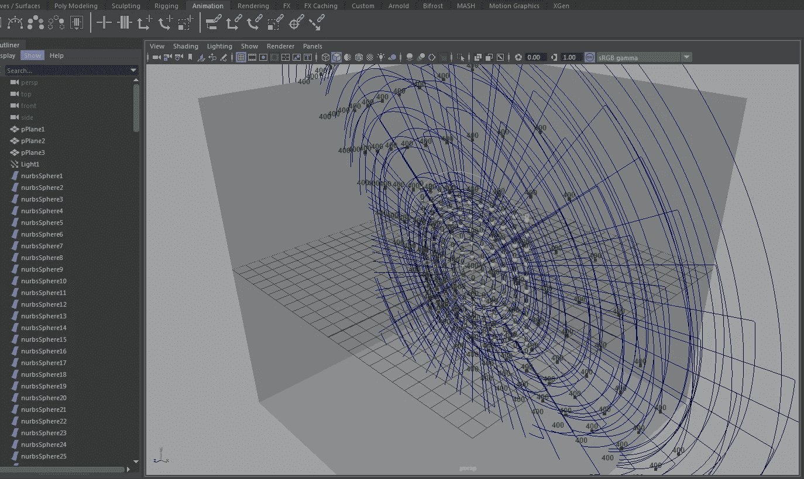
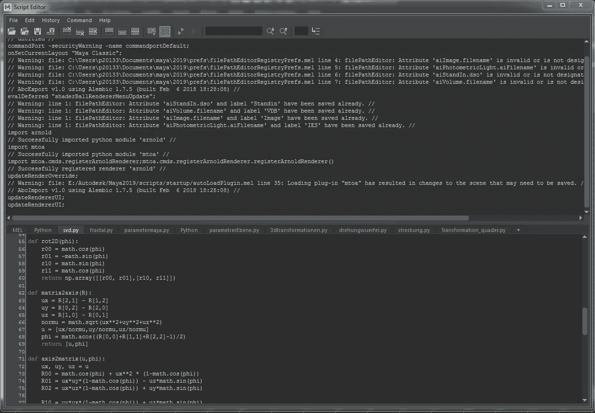

# 制作矩阵奇异值分解的动画

> 原文：<https://towardsdatascience.com/animating-the-singular-value-decomposition-of-a-matrix-27f8ce1f7723?source=collection_archive---------20----------------------->

## 使用 Python 和 Autodesk Maya

Image by the author

奇异值分解(SVD)是许多应用中出现的一种计算，它将一个矩阵分解成 3 个矩阵的乘积。例如，它用于以下领域:

*   在推荐系统中，如网飞。使用 SVD 构建推荐系统的介绍可以在下面找到:
    [https://towards data science . com/beginners-guide-to-creating-an-SVD-recommender-system-1fd 7326 D1 F6](/beginners-guide-to-creating-an-svd-recommender-system-1fd7326d1f6)
*   在图像分析程序中使用主成分分析
    [https://towardsdatascience . com/eigen faces-recovering-humans-from-ghosts-17606 c 328184](/eigenfaces-recovering-humans-from-ghosts-17606c328184)
*   以及文本的主题分析方法
    [https://medium . com/nano nets/topic-modeling-with-LSA-psla-LDA-and-LDA 2 vec-555 ff 65 b 0b 05](https://medium.com/nanonets/topic-modeling-with-lsa-psla-lda-and-lda2vec-555ff65b0b05)

在本文中，我将借助 3D 动画展示这种分解背后的几何解释，以鼓励直觉。

您可以在下面找到对 SVD 的很好的介绍:

 [## 你不知道 SVD(奇异值分解)

### 真正理解 SVD——直观的核心思想

towardsdatascience.com](/svd-8c2f72e264f) 

和

 [## 奇异值分解教程:应用，例子，练习

### 奇异值分解方法的完整教程

blog.statsbot.co](https://blog.statsbot.co/singular-value-decomposition-tutorial-52c695315254) 

所考虑的(数据)矩阵可以具有 n 行和 m 列的任何维度，并且矩阵中的条目可以代表图像的像素值、文本中的词频、用户对电影的评级或许多其他东西。

分解的三个矩阵有特殊的性质，与矩阵相关的线性变换有特殊的几何解释。我想用 3D 动画展示分解矩阵的几何解释。

为了便于说明，我使用 3x2 矩阵及其分解乘积作为例子，使数据可以用 3D 表示。小球体的栅格在动画中经受相应的线性变换。让我们看看结果:

Animation of the Singular Value Decompositions of some matrices

为了创建动画，我使用了 Autodesk Maya([https://www.autodesk.com/products/maya/overview](https://www.autodesk.com/products/maya/overview))并在 Maya 中使用 Python 编写脚本。

## 让我们看看动画是如何录制的

我使用 Python 脚本在 Maya 中构建场景并制作对象动画。可以从 Maya 的脚本编辑器中运行脚本。

Maya script editor / Image by the author

在脚本开始时，导入所需的包。“Maya.cmds”用于在 Maya 中执行命令，“math”用于某些计算，“numpy”用于奇异值分解。创建了一个由 3 个平面构建的长方体，考虑球体在其上投射阴影。

我们设置光源并构建一个小球体网格来测试转换。

我们借助线性代数的“Numpy 包”([https://docs . scipy . org/doc/Numpy/reference/routines . Lina LG . html](https://docs.scipy.org/doc/numpy/reference/routines.linalg.html))定义我们想要分解、动画化和计算 SVD 的矩阵的变换矩阵。

我们需要一个函数来执行平面旋转。定义请看 https://en.wikipedia.org/wiki/Rotation_matrix 的[。](https://en.wikipedia.org/wiki/Rotation_matrix)

以及一些用于计算 3D 旋转的旋转轴和旋转角度(欧拉角)的函数。关于定义和计算，请参见同一篇维基百科文章。

对于球体的中心，我们使用作为测试对象，我们通过取点积来计算矩阵变换后的新坐标。与矩阵 A 相乘得出的端点与按此顺序与 V、S 和 U 相乘得出的端点相同。

最后，我们构建球体动画的路径，首先在一个平面内旋转，然后用一个对角矩阵沿着轴拉伸坐标，最后执行 3D 旋转。

这个脚本用于记录不同矩阵等级的几个矩阵的动画。你可以在上面的视频中看到结果。