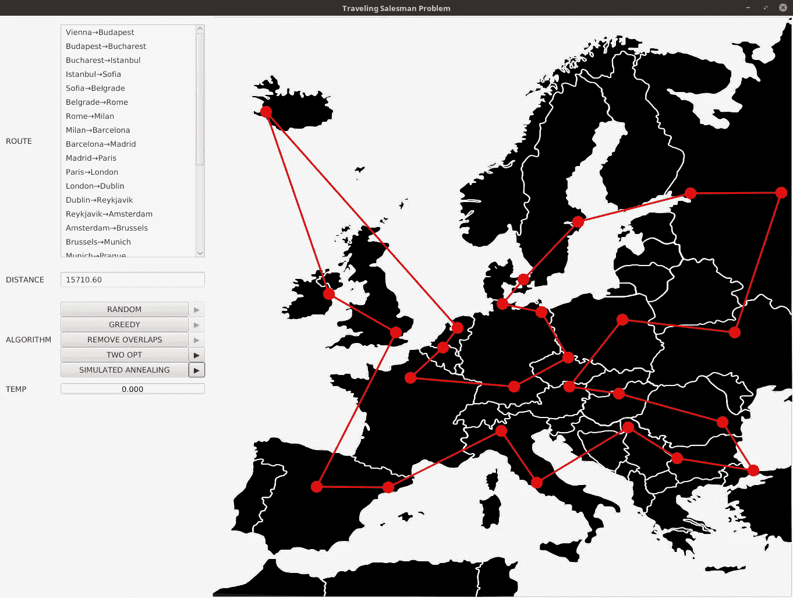

# 制作旅行推销员问题的动画

> 原文：<https://towardsdatascience.com/animating-the-traveling-salesman-problem-56da20b95b2f?source=collection_archive---------21----------------------->


## 从制作模型动画中学到的经验

动画可以是一个强大的工具。用文字甚至图片来解释一个复杂的主题是一回事，但是动态的视觉效果有一种惊人的品质，可以将抽象的想法变得生动。这在诸如优化和机器学习等复杂的计算机科学领域尤其有用。

2018 年 10 月，我在 KotlinConf 做了一个关于优化和机器学习的[演讲](https://youtu.be/-zTqtEcnM7A)。在这几个例子中，有一个是[旅行推销员问题(又名“TSP”)](https://en.wikipedia.org/wiki/Travelling_salesman_problem)。这是一个如此有趣和迷人的问题，它经常作为优化和[甚至机器学习算法](http://www.iro.umontreal.ca/~dift6751/paper_potvin_nn_tsp.pdf)的基准。然而，解释一些算法(如局部搜索和模拟退火)在没有视觉辅助的情况下不太直观。因此，我通过 [TornadoFX](https://github.com/edvin/tornadofx) 用 JavaFX 做了这个开源项目。

会议上和网上的许多人都对动画视觉效果感到惊讶，评论它看起来多么“集成”和流畅。事实是我一起破解了这个应用程序，JavaFX 在其中起了很大的作用。它替我处理了动画，所以我可以专注于算法本身。这就是我想在这篇文章中写的内容。

您可以在这里观看这个应用程序的视频演示(带有对 TSP 的详细解释)。我建议在继续阅读之前先看看这个。

这篇博文的重点将放在动画和它是如何实现的。要深入了解 TSP 以及如何解决它，请观看上面的视频。

# 该结构

为了建立这一点，让我们首先布局我们的视觉框架的结构。我将用 Kotlin 语言来表达这一点，并通过 TornadoFX 来利用 JavaFX。幸运的是，TornadoFX 没有隐藏或抑制 JavaFX 的任何功能，而是用富于表现力的 Kotlin DSL 来增强它。所以你可以用 Java，Kotlin，Scala，或者任何可以使用 JavaFX 的 JVM 语言来实现。

我在应用程序中要做的第一件事是声明一个`Pane`，并在其中放置一个带有简单欧洲地图图像的`ImageView` 。然后从我的领域模型中，我将导入我的`City`对象，并在相对于欧洲地图的 x 和 y 屏幕坐标上放置一个红色的`Circle` 。最后，我将从我的域中导入`Edge`对象，其中每个对象都绑定到一个`City`，并将每个对象绑定到一个`Line`。每个`Edge` 代表两个城市之间的一个连接，它以同一个城市为起点和终点进行初始化。因此，`Line`将通过停留在`Circle`内作为一个小点来初始化。`Line`也将绑定到其所属`Edge`的`startX`、`endX`、`startY`和`endY`属性。

```
pane {
    imageview(Image("europe.png")) {
        fitHeight = 1000.0
        fitWidth = 1000.0

        CitiesAndDistances.cities.forEach { city ->
            circle(city.x,city.y,10.0) {
                fill = Color.RED
            }
        }

        Model.edges.forEach { edge ->
            line {
                startXProperty().bind(edge.edgeStartX)
                startYProperty().bind(edge.edgeStartY)
                endXProperty().bind(edge.edgeEndX)
                endYProperty().bind(edge.edgeEndY)
                strokeWidth = 3.0
                stroke = Color.RED
            }
        }
    }
}
```

在这一点上，我应该有这样的渲染:

当我们制作动画时，我们将改变每个边的`startX`、`endX`、`startY`和`endY`属性。例如，当我们想要连接两个城市时，我可以更改`endX`和`endY`属性，使这条线延伸到另一个城市的坐标。

# 策划动画

有了这个结构，接下来我确实需要考虑一些事情。我应该实时制作算法的动画，还是将动画排队并使其可播放？我是想把算法做的每一件事都做成动画，还是过滤掉噪音，只把关键事件做成动画？

乍一看，这些决定似乎不重要，我甚至告诉自己“为什么不把一切都做成动画呢？”。当然，这很快就适得其反了，因为动画已经降低了算法的速度……而且在算法中制作无效事件的动画只会增加噪音。这也使得动画变得异常冗长和乏味。

你会问，什么是非生产性事件？正如视频中所解释的，该算法通过进行数千次随机`Edge` 交换来工作。当互换没有改善解决方案时(或者在模拟退火方法中抛硬币失败了)，我会取消互换，把所有东西都放回去。我了解到最好不要将这些事件动画化，因为大多数迭代都是失败的交换，并且最好将成功动画化来显示进展，而不是每个迭代都包括失败。

我最终做的另一个调整是首先运行算法，然后用*然后用*动画显示结果。这样做的好处是能够重放结果，而不必再次运行整个过程。我在 JavaFX 库中需要的关键实用程序是`SequentialTransition`，它允许我将动画排队并按顺序播放(而不是一次播放)。

然后我可以让我的算法给`SequentialTransition` 添加动画，当它完成后就可以播放了。我将每个算法(“贪婪”、“二次选择”、“模拟退火”等)存储为可枚举的，所以我给每个算法赋予了自己的`SequentialTransition`。我还创建了一些方便的扩展函数，这样我就可以使用`+=`操作符来添加动画。

```
enum class SearchStrategy {

    RANDOM {
        ... 
    },

    GREEDY {
        ... 
    },

    REMOVE_OVERLAPS {
        ... 
    },
    TWO_OPT {
        ... 
    },

    SIMULATED_ANNEALING {
        ... 
    }

    val animationQueue = SequentialTransition()

    abstract fun execute()
}

// extension functions for SequentialTransition
operator fun SequentialTransition.plusAssign(timeline: Timeline) {   
     children += timeline }fun SequentialTransition.clear() = children.clear()operator fun SequentialTransition.plusAssign(
    other:SequentialTransition) { 
        children.addAll(other) 
}
```

# 执行路径遍历

在领域模型方面，我有最初属于一个`City`的`Edge`项目。然而，`startCity`和`endCity`可以变异，在每次变异时，`Edge`都有一个`animateChange()`函数返回一个延迟的`Timeline`来播放那个变化。

但这是我最后做的有趣的设计决定。我创建了`edgeStartX`、`edgeStartY`、`edgeEndX`和`edgeEndY`，使其不与各自的`startCity`和`endCity`同步。相反，它们纯粹用于动画执行。当我决定在`startCity` 或`endCity`中制作一个变化的动画时，我调用`animateChange()`来创建一个`Timeline`来制作坐标变化的动画。它将获取保存坐标值的每个 JavaFX 属性中的当前值，并通过在这段时间内逐渐增加/减少到指定值来制作动画(这是`KeyFrame`的`speed`)。

注意，虽然这个`Timeline`不执行，但这取决于函数调用程序如何使用这个动画。

```
class Edge(city: City) {

    val startCityProperty = SimpleObjectProperty(city)
    var startCity by startCityProperty

    val endCityProperty = SimpleObjectProperty(city)
    var endCity by endCityProperty

    val distance get() = CitiesAndDistances.distances[CityPair(startCity.id, 
      endCity.id)]?:0.0

    // animated properties
    val edgeStartX = SimpleDoubleProperty(startCity.x)
    val edgeStartY = SimpleDoubleProperty(startCity.y)
    val edgeEndX = SimpleDoubleProperty(startCity.x)
    val edgeEndY = SimpleDoubleProperty(startCity.y)

    fun animateChange() = timeline(play = false) {
            keyframe(speed) {
                keyvalue(edgeStartX, startCity?.x ?: 0.0)
                keyvalue(edgeStartY, startCity?.y ?: 0.0)
                keyvalue(edgeEndX, endCity?.x ?: 0.0)
                keyvalue(edgeEndY, endCity?.y ?: 0.0)
                keyvalue(Model.distanceProperty, 
                     Model.totalDistance)
            }
        }
}
```

这个特殊的函数用于第一次将一个`Edge`扩展到另一个城市，这发生在`GREEDY`和`RANDOM`算法中。将这些按顺序缝合在一起会产生一条光滑的路径，从而创建一个往返行程。下面是在`RANDOM`算法中如何利用`animateChange()`函数。请注意，当我遍历每个随机的`City`时，我是如何分别通过它们的`startcity`和`endCity`连接每个连续的`Edge`对的。然后我调用`animateChange()`返回一个`Timeline`并添加到`animationQueue`中。

```
RANDOM {
    override fun execute() {
        animationQueue.clear()

        val capturedCities = mutableSetOf<Int>()

        val startingEdge = Model.edges.sample()
        var edge = startingEdge

        while(capturedCities.size < 
                CitiesAndDistances.cities.size) { capturedCities += edge.startCity.id

            val nextRandom = Model.edges.asSequence()
                    .filter { it.startCity.id !in capturedCities }
                    .sampleOrNull()?:startingEdge

            edge.endCity = nextRandom.startCity
            animationQueue += edge.animateChange()
            edge = nextRandom
        }

        Model.bestDistanceProperty.set(Model.totalDistance)
    }
}
```

当绿色 play 按钮被按下时，我的 UI 可以调用`animationQueue.play()`来执行更改。

# 执行交换

交换比制作路径遍历的动画要复杂一些。当`TWO_OPT`或`SIMULATED_ANNEALING`算法选择随机边并试图以某种方式交换它们的城市(顶点)时，有时会失败，有时会成功。如果交换中断了旅程，则会发生故障，并且会调用`reverse()`函数。如果成功，可以调用一个`animate()`函数并返回一个等待排队或执行的`Timeline`。

```
class TwoSwap(val city1: City,
          val city2: City,
          val edge1: Edge,
          val edge2: Edge
) {

fun execute() {
    edge1.let {      
          sequenceOf(it.startCityProperty,it.endCityProperty)      
    }.first { it.get() == city1 }
    .set(city2) edge2.let { 
       sequenceOf(it.startCityProperty,it.endCityProperty) 
    }.first { it.get() == city2 }
    .set(city1)
}fun reverse() {
    edge1.let { 
        sequenceOf(it.startCityProperty, it.endCityProperty) 
    }.first { it.get() == city2 }
    .set(city1)

    edge2.let {
        sequenceOf(it.startCityProperty,it.endCityProperty)     
    }.first { it.get() == city1 }
     .set(city2)}

fun animate() = timeline(play = false) {
        keyframe(speed) {
            sequenceOf(edge1,edge2).forEach {
                keyvalue(it.edgeStartX, it.startCity?.x ?: 0.0)
                keyvalue(it.edgeStartY, it.startCity?.y ?: 0.0)
                keyvalue(it.edgeEndX, it.endCity?.x ?: 0.0)
                keyvalue(it.edgeEndY, it.endCity?.y ?: 0.0)
            }
        }
        keyframe(1.millis) {
            sequenceOf(edge1,edge2).forEach {
                keyvalue(Model.distanceProperty, 
                   Model.totalDistance)
            }
        }
    }

}

fun attemptTwoSwap(otherEdge: Edge): TwoSwap? {

    val e1 = this
    val e2 = otherEdge

    val startCity1 = startCity
    val endCity1 = endCity
    val startCity2 = otherEdge.startCity
    val endCity2 = otherEdge.endCity

    return sequenceOf(
        TwoSwap(startCity1, startCity2, e1, e2),
        TwoSwap(endCity1, endCity2, e1, e2),

        TwoSwap(startCity1, endCity2, e1, e2),
        TwoSwap(endCity1, startCity2, e1, e2)

    ).filter {
        it.edge1.startCity !in it.edge2.let { 
           setOf(it.startCity, it.endCity) 
        } && it.edge1.endCity !in it.edge2.let {  
           setOf(it.startCity, it.endCity) 
       }
    }
    .firstOrNull { swap ->
        swap.execute()
        val result = Model.tourMaintained
        if (!result) {
        swap.reverse()
        }
        result
    }
}
```

这可用于`TWO_OPT`和`SIMULATED_ANNEALING`算法。请注意，对于这两种算法，我首先清理`animationQueue`，执行`RANDOM`算法并获取其所有动画，并将它们添加到该算法的动画中。对于`TWO_OPT`，我尝试了 2000 次随机交换，并且只添加了增加旅程距离的动画。否则我调用`reverse()`并且不对交换进行动画处理(就好像它从未发生过一样)。

```
TWO_OPT {
    override fun execute() {
        animationQueue.clear()
        SearchStrategy.RANDOM.execute()
        animationQueue += SearchStrategy.RANDOM.animationQueue

        (1..2000).forEach { iteration ->
        Model.edges.sampleDistinct(2).toList()
                .let { it.first() to it.last() }
                .also { (e1,e2) ->

                    val oldDistance = Model.totalDistance
                    e1.attemptTwoSwap(e2)?.also {
                        when {
                            oldDistance <= Model.totalDistance -> 
                                it.reverse()
                            oldDistance > Model.totalDistance -> 
                                animationQueue += it.animate()
                        }
                    }
                }
        }
        Model.distanceProperty.set(Model.totalDistance)
        Model.bestDistanceProperty.set(Model.totalDistance)

        println("TWO-OPT BEST DISTANCE: ${Model.totalDistance}")

    }
}
```

一旦算法完成，就在期望的`SearchStrategy`可枚举上调用`animationQueue.play()`并观看焰火。

