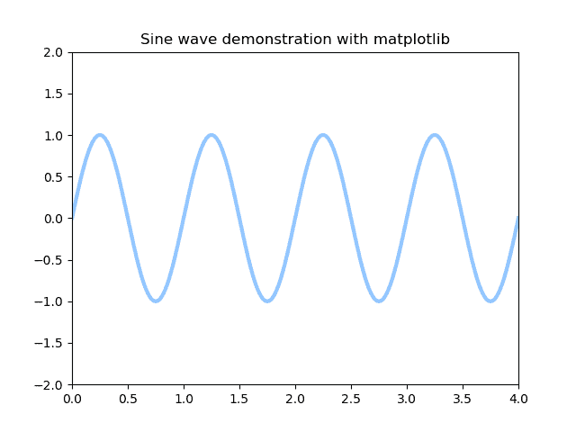
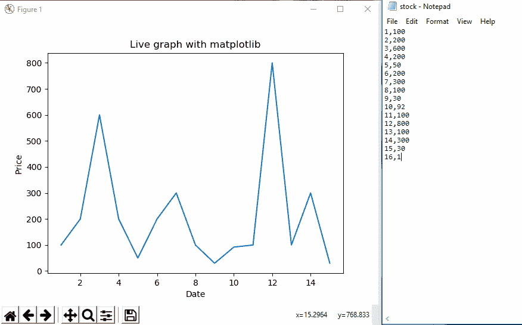
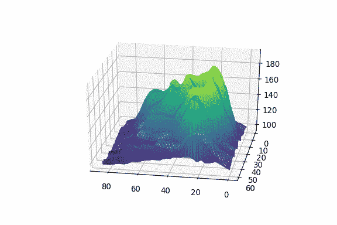
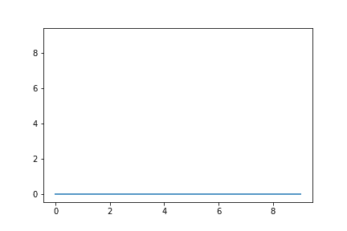
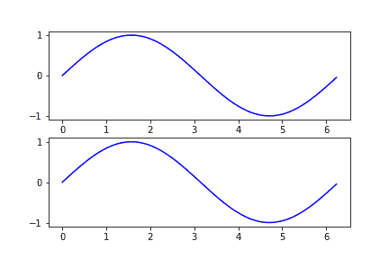
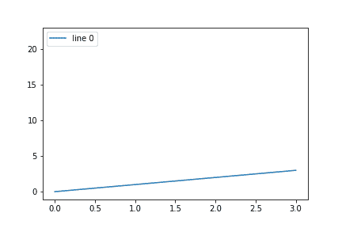

# Matplotlib 动画

> 原文：<https://towardsdatascience.com/animations-with-matplotlib-d96375c5442c?source=collection_archive---------0----------------------->

## 使用 matplotlib 库创建一些有趣的动画。


[Rain Simulation with Matplotlib](https://matplotlib.org/gallery/animation/rain.htm)

动画是展示一种现象的有趣方式。我们人类总是被动画和互动的图表所吸引，而不是静态的图表。动画在描述时间序列数据时更有意义，如多年来的股票价格、过去十年的气候变化、季节性和趋势，因为我们可以看到特定参数如何随时间变化。

上图是对雨 的[**模拟，是用 Matplotlib 库实现的，该库被亲切地称为 python 可视化包的**始祖。** Matplotlib **今天 Python 拥有大量强大的可视化工具，比如 Plotly、Bokeh、Altair 等等。这些库能够实现最先进的动画和交互性。尽管如此，这篇文章的目的是强调这个库的一个方面，这是没有探索太多，那就是**动画**，我们将看看这样做的一些方法。****](https://matplotlib.org/gallery/animation/rain.html)

# 概观

Matplotlib 是一个 Python 2D 绘图库，也是最流行的一个。大多数人从 Matplotlib 开始他们的数据可视化之旅。使用 matplotlib 可以很容易地生成曲线图、直方图、功率谱、条形图、误差图、散点图等。它还与 Pandas 和 Seaborn 等库无缝集成，以创建更复杂的可视化。

matplotlib 的一些好特性是:

*   它的设计类似 MATLAB，因此两者之间的切换相当容易。
*   包括许多渲染后端。
*   它几乎可以复制任何情节(只需一点努力)。
*   已经存在了十多年，因此，拥有庞大的用户群。

然而，也有一些领域 Matplotlib 并不突出，落后于其强大的对手。

*   Matplotlib 有一个命令式 API，通常过于冗长。
*   有时不良的文体默认。
*   对 web 和交互式图形的支持较差。
*   对于大而复杂的数据，速度通常很慢。

作为复习，这里有一个 Matplotlib 备忘单，来自 [**Datacamp**](https://s3.amazonaws.com/assets.datacamp.com/blog_assets/Python_Matplotlib_Cheat_Sheet.pdf) ，你可以通过它来复习你的基础知识。

# 动画片

Matplotlib 的`animation`基类处理动画部分。它提供了一个构建动画功能的框架。有两个主要接口可以实现这一点:

`[FuncAnimation](https://matplotlib.org/api/_as_gen/matplotlib.animation.FuncAnimation.html#matplotlib.animation.FuncAnimation)` 通过反复调用函数`*func*`制作动画。

`[ArtistAnimation](https://matplotlib.org/api/_as_gen/matplotlib.animation.ArtistAnimation.html#matplotlib.animation.ArtistAnimation):` 动画使用一组固定的`Artist`对象。

然而，在这两者中， **FuncAnimation** 是最方便使用的一个。你可以在[文档](http://matplotlib.sourceforge.net/api/animation_api.html)中读到更多关于它们的内容，因为我们将只关注`FuncAnimation`工具。

## 要求

*   应该安装包括`numpy`和`matplotlib`的模块。
*   要将动画保存为 mp4 或 gif，需要安装`[ffmpeg](https://www.ffmpeg.org/)`或`[imagemagick](https://sourceforge.net/projects/imagemagick/files/)`。

一旦准备好了，我们就可以开始制作 Jupyter 笔记本中的第一个基本动画了。这篇文章的代码可以从相关的 [**Github 库**](https://github.com/parulnith/Animations-with-Matplotlib) 中获得，或者你可以点击下面的图片在我的活页夹中查看。

[](https://mybinder.org/v2/gh/parulnith/Animations-with-Matplotlib/master?filepath=Animations%20with%20Matplotlib.ipynb)

## 基本动画:运动正弦波

让我们使用`FuncAnimation`创建一个正弦波在屏幕上移动的基本动画。动画的源代码取自 [Matplotlib 动画教程](http://jakevdp.github.io/blog/2012/08/18/matplotlib-animation-tutorial/)。让我们首先看看输出，然后我们将分解代码，以了解在引擎盖下发生了什么。



*   在第(7–9)行中，我们简单地创建了一个图形窗口，图形中只有一个轴。然后我们创建我们的空行对象，它实际上是动画中要修改的对象。稍后将使用数据填充线对象。
*   在第(11–13)行，我们创建了`init`函数来制作动画。init 函数初始化数据并设置轴限值。
*   在第(14–18)行中，我们最终定义了动画函数，该函数将帧数(I)作为参数，并创建一个正弦波(或任何其他动画)，该正弦波根据 I 的值移动。该函数在此返回一个已修改的绘图对象元组，该元组告诉动画框架应该对绘图的哪些部分进行动画处理。
*   在第 20 行中，我们创建了实际的动画对象。`blit`参数确保只重新绘制那些已经改变的图形。

这是在 Matplotlib 中创建动画背后的基本直觉。只要对代码稍加修改，就可以创建有趣的可视化效果。让我们来看看其中的一些

# 越来越大的线圈

类似地，在 [GeeksforGeeks](https://www.geeksforgeeks.org/graph-plotting-python-set-3/) 也有一个很好的创建形状的例子。现在让我们在 matplotlib 的`animation` 类的帮助下，创建一个慢慢展开的动圈。代码与正弦波图非常相似，只是稍有调整。


# 实时更新图表

在绘制股票数据、传感器数据或任何其他与时间相关的数据等动态量时，实时更新图表非常方便。我们绘制了一个基础图，随着更多的数据输入系统，该图会自动更新。这个例子摘自[**send ex**](https://www.youtube.com/watch?v=ZmYPzESC5YY)。一定要访问这个 youtube 频道，看一些很棒的教程。

让我们绘制一家假设公司一个月内的股价。

现在，打开终端并运行 python 文件。您将获得如下图所示的图表，该图表会自动更新如下:



这里的间隔是 1000 毫秒或 1 秒。

# 3D 绘图上的动画

创建 3D 图形是很常见的，但是如果我们可以将这些图形的视角制作成动画呢？这个想法是改变相机的视角，然后使用每一个结果图像来创建一个动画。在[Python 图库](https://python-graph-gallery.com/342-animation-on-3d-plot/)有一个很好的部分专门讨论这个问题。

在笔记本所在的目录下创建一个名为 **volcano** 的文件夹。所有的图像都将存储在这个文件夹中，然后将在动画中使用。

这将在火山文件夹中创建多个 PNG 文件。现在，使用 ImageMagick 将它们转换成动画。打开“终端”并导航到 Volcano 文件夹，然后输入以下命令:

```
convert -delay 10 Volcano*.png animated_volcano.gif
```



# 使用赛璐珞模块的动画

[赛璐珞](https://github.com/jwkvam/celluloid)是一个 Python 模块，简化了在 matplotlib 中创建动画的过程。这个库创建一个 matplotlib 图形，并从中创建一个`Camera`。然后，它重复使用图形，并在每一帧创建后，用相机拍摄快照。最后，用所有捕获的帧创建一个动画。

## 装置

```
pip install celluloid
```

这里有几个使用赛璐珞模块的例子。

## 最小的



## 支线剧情



## 传说



# 包裹

动画有助于突出视觉化的某些特征，否则用静态图表很难传达。话虽如此，记住不必要的和过度的观想有时会使事情复杂化也是很重要的。数据可视化中的每一个特性都应该被明智地使用，以产生最佳效果。