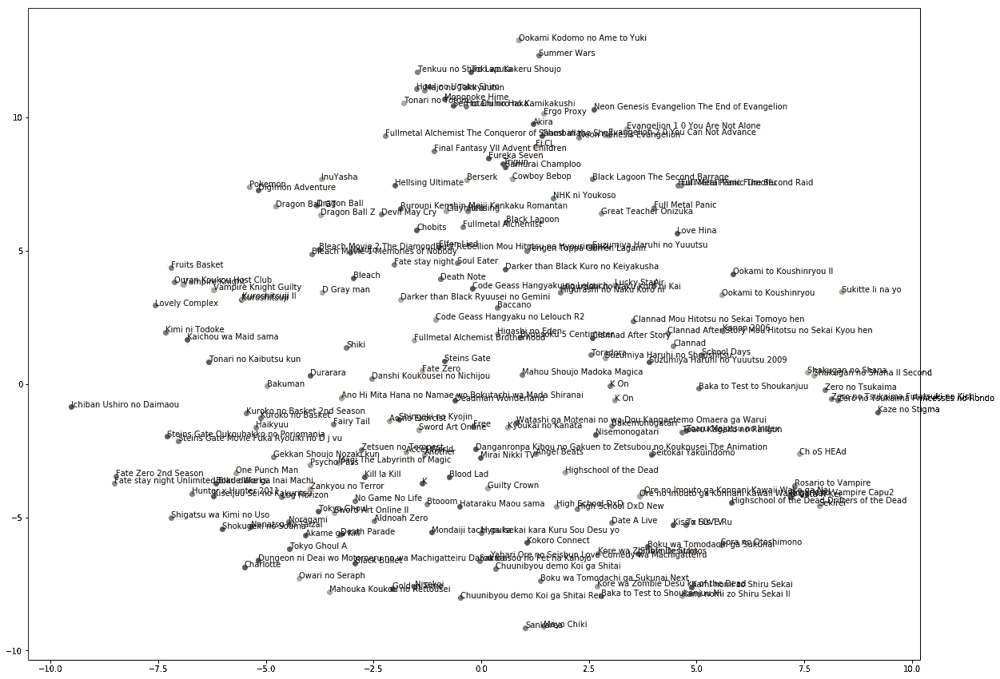

# Anime2vec:一个序列推荐系统

> 原文：<https://towardsdatascience.com/anime2vec-a-sequence-recommender-1e0a3e558c44?source=collection_archive---------28----------------------->

## 从 skipgram 模型中提取嵌入


Source: [Exploiting Similarities among Languages for Machine Translation](https://arxiv.org/pdf/1309.4168v1.pdf) paper.

在这篇文章中，我将向你展示如何实现一个简单的 word2vec 或 **Anything2vec** 的变体，以便拥有一个基于项目的推荐系统。

让我们从我们的数据开始，为了创建一个推荐器，我们需要几个**项目**，一些**用户**和一个隐式或显式的**反馈。**在这里，我们有动漫，有用户，也有他们的评分。


我们将重新设计我们的数据，以便它可以被序列模型接收。为此，我们将创建一个数组列表来表示用户的观察列表。

```
print(data[:10])[array([39, 20,  2, 36, 13, 18, 73, 31, 78, 68, 80, 54, 62, 60, 64, 27, 52,
         3, 84, 29, 17, 35, 12, 63,  8], dtype=int64),
 array([73,  7, 51, 62, 33,  1, 35, 30, 10, 80,  2], dtype=int64),
 array([28,  2, 61, 15, 89, 14, 26,  7,  1, 32, 57,  6], dtype=int64),
 array([77, 88, 12,  8,  2, 14, 19, 10, 47,  6,  4], dtype=int64),
 array([24,  1,  8, 88, 14, 12,  2,  6, 47, 10], dtype=int64),
 array([54,  3, 33, 45, 35,  4, 19, 30,  6,  2, 10], dtype=int64),
 array([52, 84, 50,  3, 14, 27, 64, 69, 80, 32,  4], dtype=int64),
 array([25, 22,  1, 17, 46, 35, 80,  4, 47,  3, 26], dtype=int64),
 array([77, 52, 74, 45, 17, 19,  8,  2, 88, 67,  5,  9, 11,  6,  1,  4, 14,
        22, 47, 26, 29], dtype=int64),
 array([38, 36, 83, 85, 31, 42, 53, 58, 13, 23, 56, 65, 39, 72, 37, 74, 70,
        76,  7, 33, 66, 50, 54, 59, 64, 51, 49, 21,  5,  3, 45, 73, 24, 11,
        89, 84, 12, 48, 71,  9,  2,  1, 14, 19, 17, 80,  6,  4, 26],
       dtype=int64)]
```

然后我们将定义我们的 **SkipGram 模型**

## 直觉

> *给定一组顺序数据，SkipGram 模型将循环遍历序列的每个* ***项*** *，并尝试使用上下文*(固定窗口大小中当前项的每个邻居)*来预测当前项。通过这个过程，我们将训练一个简单的神经网络，该网络有一个单独的隐藏层作为分类任务。输出是一个 softmax 层，它返回给定上下文的每个项目成为当前项目的概率分布。在训练过程中，每个权重都会更新，我们将提取隐藏层的权重，即* ***项向量*** *。在我们的例子中，简而言之，该算法将试图找到给定的上一部* k *和下一部* k *的理想动画。*

然后我们将定义一个生成器函数来提供数据。

让我们实例化一些参数。

让我们训练我们的模型，提取一个形状的嵌入(len(unique_anime)，200)。

最后，通过嵌入，我们可以提取一些项目-项目相似性。

```
Nearest to - Clannad:
	Angel Beats ,
	School Days,
	Suzumiya Haruhi no Shoushitsu,
	Suzumiya Haruhi no Yuuutsu 2009 ,
	Code Geass Hangyaku no Lelouch R2,

Nearest to - Mononoke Hime:
	Majo no Takkyuubin,
	Sen to Chihiro no Kamikakushi,
	Hotaru no Haka,
	Samurai Champloo,
	Howl no Ugoku Shiro,

Nearest to - Hajime no Ippo:
	Hajime no Ippo New Challenger,
	Great Teacher Onizuka,
	Monster,
	One Outs,
	Hunter x Hunter 2011 
```

为了获得一些见解，我们可以通过降维算法展示更多的嵌入，通过传递 2 个组件，我们可以在 2D 图中绘制部分相似性。



## 最后

在这篇文章中，我采用了一个基于动画的 skipgram 模型，这篇文章的结果仅来自于对一个样本的训练，并且是可完善的。代码可用`[here](https://github.com/AlexWarembourg/Medium/blob/master/SkipGramModel.ipynb)`。为了改进这个模型，我们可以用丰富的数据训练我们的模型，然后创建一个用户配置文件，以便将我们基于项目的系统转换为定制系统，我将在另一篇文章中重点讨论这一部分。