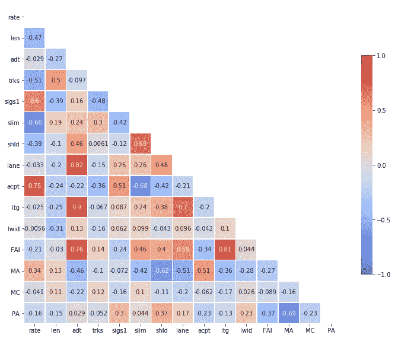
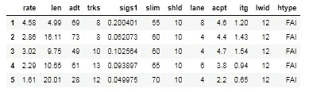
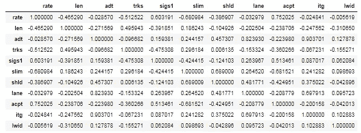
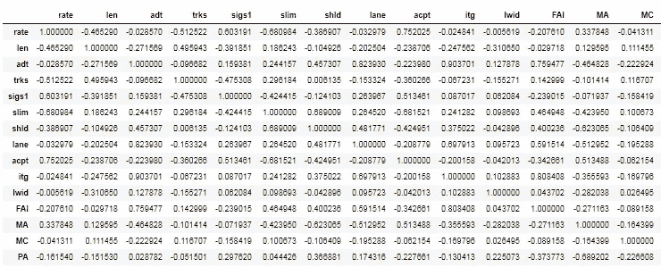
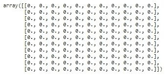
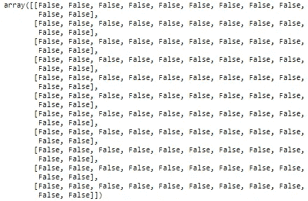
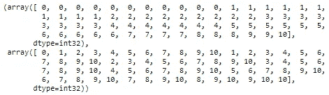
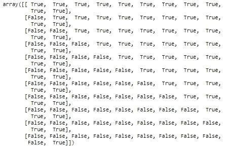

# 5 个简单步骤中的关联矩阵注释热图

> 原文：<https://towardsdatascience.com/annotated-heatmaps-in-5-simple-steps-cc2a0660a27d?source=collection_archive---------6----------------------->



热图是数据的图形表示，其中数据值用颜色表示。也就是说，它使用颜色向读者传达一个价值。当您拥有大量数据时，这是一个很好的工具，可以帮助受众了解最重要的领域。

在本文中，我将指导您通过 5 个简单的步骤创建自己的带注释的关联矩阵热图。

1.  输入数据
2.  创建相关矩阵
3.  设置遮罩以隐藏上面的三角形
4.  在 Seaborn 创建热图
5.  导出热图

您可以在我的 Jupyter 笔记本中找到这篇文章的代码，该笔记本位于[这里](https://github.com/julia-git/Annotated_Heatmap)。

## 1)导入数据

`df = pd.read_csv(“Highway1.csv”, index_col = 0)`



该高速公路事故数据集包含汽车事故率(以每百万英里事故数表示)以及几个设计变量。关于数据集的更多信息可以在[这里](https://vincentarelbundock.github.io/Rdatasets/doc/carData/Highway1.html)找到。

## 2)创建相关矩阵

`corr_matrix = df.corr()`



我们用`.corr`创建相关矩阵。注意，htype 列没有出现在这个矩阵中，因为它不是数字。我们需要虚拟化 htype 来计算相关性。

```
df_dummy = pd.get_dummies(df.htype)
df = pd.concat([df, df_dummy], axis = 1)
```



此外，请注意，相关矩阵的上半部分三角形与下半部分三角形对称。因此，我们的热图不需要显示整个矩阵。我们将在下一步隐藏上面的三角形。

## 3)设置蒙版隐藏上面的三角形

```
mask = np.zeros_like(corr_matrix, dtype=np.bool)
mask[np.triu_indices_from(mask)]= True
```

我们来分解一下上面的代码。`np.zeros_like()`返回与给定数组具有相同形状和类型的零数组。通过传入相关矩阵，我们得到一个如下的零数组。



`dtype=np.bool`参数覆盖了数据类型，所以我们的数组是一个布尔数组。



`np.triu_indices_from(mask)`返回数组上部三角形的索引。



现在，我们将上面的三角形设置为真。

`mask[np.triu_indices_from(mask)]= True`



现在，我们有了一个可以用来生成热图的遮罩。

## 4)在 Seaborn 创建热图

```
f, ax = plt.subplots(figsize=(11, 15)) heatmap = sns.heatmap(corr_matrix, 
                      mask = mask,
                      square = True,
                      linewidths = .5,
                      cmap = ’coolwarm’,
                      cbar_kws = {'shrink': .4, 
                                ‘ticks’ : [-1, -.5, 0, 0.5, 1]},
                      vmin = -1, 
                      vmax = 1,
                      annot = True,
                      annot_kws = {“size”: 12})#add the column names as labels
ax.set_yticklabels(corr_matrix.columns, rotation = 0)
ax.set_xticklabels(corr_matrix.columns)sns.set_style({'xtick.bottom': True}, {'ytick.left': True})
```


为了创建我们的热图，我们传递步骤 3 中的关联矩阵和步骤 4 中创建的掩码，以及定制参数，使我们的热图看起来更好。如果您有兴趣了解每一行是做什么的，这里有参数的描述。

```
#Makes each cell square-shaped.
square = True,
#Set width of the lines that will divide each cell to .5
linewidths = .5,
#Map data values to the coolwarm color space
cmap = 'coolwarm',
#Shrink the legend size and label tick marks at [-1, -.5, 0, 0.5, 1]
cbar_kws = {'shrink': .4, ‘ticks’ : [-1, -.5, 0, 0.5, 1]},
#Set min value for color bar
vmin = -1, 
#Set max value for color bar
vmax = 1,
#Turn on annotations for the correlation values
annot = True,
#Set annotations to size 12
annot_kws = {“size”: 12})
#Add column names to the x labels 
ax.set_xticklabels(corr_matrix.columns)
#Add column names to the y labels and rotate text to 0 degrees
ax.set_yticklabels(corr_matrix.columns, rotation = 0)
#Show tickmarks on bottom and left of heatmap
sns.set_style({'xtick.bottom': True}, {'ytick.left': True})
```

## 5)导出热图

现在您已经有了热图，让我们将其导出。

`heatmap.get_figure().savefig(‘heatmap.png’, bbox_inches=’tight’)`

如果你发现你有一个非常大的热图不能正确导出，使用`bbox_inches = ‘tight’`来防止你的图像被切掉。

感谢阅读！请在下面的评论中分享你用数据制作的热图。