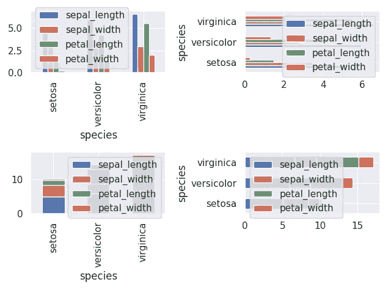

# 如何增强 Matplotlib 图

> 原文：<https://towardsdatascience.com/annotating-bar-charts-and-other-matplolib-techniques-cecb54315015?source=collection_archive---------12----------------------->


Photo by [Adeolu Eletu](https://unsplash.com/@adeolueletu?utm_source=medium&utm_medium=referral) on [Unsplash](https://unsplash.com?utm_source=medium&utm_medium=referral)

眼睛是我们最重要的器官，因为我们通过视觉感知大约 80%的印象。毫不奇怪，可视化是我们收集和分析信息的最简单的方法。当谈到数据科学时，各种各样的图表帮助我们理解不同复杂性的问题。它们允许我们识别数据中的模式、关系和异常值。因此，无论我们想要分析什么数据，数据可视化都是至关重要的第一步。当使用 Python 时，M [atplotlib](https://matplotlib.org/) 和相应的插件如 [seaborn](https://seaborn.pydata.org/) 是快速实现这一点的首选工具。

在本文中，我想向您展示一些技巧来增强和丰富您的 matplolib 数字。最重要的是，我为您提供了一种注释各种条形图的好方法。

感兴趣吗？所以让我们开始吧！

# 先决条件

按照这个例子，你需要 Python 3.7+和 M [atplotlib](https://matplotlib.org/) 、 [pandas](https://pandas.pydata.org/) 和 [seaborn](https://seaborn.pydata.org/) 。一如既往，我推荐使用[poem](https://poetry.eustace.io/)来管理您的 Python 包和环境。你可以查看[这篇文章](/how-to-setup-an-awesome-python-environment-for-data-science-or-anything-else-35d358cc95d5)了解如何设置它。作为一种快捷方式，我建议使用 pip 或 pipx 将其安装在您的机器上。

作为提醒，我们首先要从样本数据中创建**条形图** **图表**而不需要进一步的样式化。*本文的目标是增强和丰富这些图表。*你可以在我的 [***GitHub 资源库***](https://github.com/Shawe82/nice-plots) 上找到所有的示例代码。

## 设置

首先，我们创建一个名为 *nice-plots* 的诗歌项目，在这里我们实现了示例并添加了必要的包

```
poetry new nice-plots
cd nice-plots
poetry add pandas matplotlib seaborn
touch nice_plots/bar_charts.py
```

现在我们有了一个独立的 Python 环境，安装了我们需要的所有东西。太好了，我们可以开始工作了！

## 数据

作为数据，我们使用著名的[鸢尾花数据集](https://en.wikipedia.org/wiki/Iris_flower_data_set)。幸运的是，这是 seaborn 直接提供的。为了创建“有意义的”条形图，我首先使用 ***平均值*** 作为聚合函数，按照*对数据集进行分组。根据这些数据，我创建了四个不同的条形图，分别是 ***垂直条形图*** 和 ***水平条形图*** 两个版本的 ***正常-*** 和 ***堆叠版本*** 。在代码中，这看起来像*

```
***import** seaborn **as** sns
**import** os **from** dataclasses **import** dataclass
**import** pandas **as** pd
**import** matplotlib.pyplot as plt
**import** matplotlib
**from** typing **import** *sns.set()
**# BLOCK 1
# BLOCK 2
# BLOCK 4
# BLOCK 6**data = sns.load_dataset(**"iris"**).groupby(**'species'**).mean()
fig, axes = plt.subplots(2,2)
data.plot.bar(ax=axes[0][0]) 
data.plot.bar(stacked=True, ax=ax[0][1])
data.plot.barh(ax=axes[1][0])
data.plot.barh(stacked=True, ax=ax[1][1])
**# BLOCK 3
# BLOCK 5
# BLOCK 7**plt.show()*
```

*我添加了注释 **# BLOCK N** ，其中我向前引用了下面的增强功能。我希望这不会太令人困惑。我还添加了稍后需要的所有导入。*

*由于您可能不会坐在电脑前，下面是最终的条形图*

**

*嗯，不太好，对吧？我想努力让它们变得更好是值得的。*

# *提高*

## *图形和字体大小*

*看这些图表时，第一件显而易见的事情是，与图中的其他部分相比，它们太小了。有几种方法可以改变这种情况。我更喜欢 ***从 pyplot*** 设置全局 rcParams。*全局*意味着它们适用于你创建的所有人物，而不仅仅是某个特定人物。要更改图形大小和某些字体大小，您只需*

```
***# BLOCK 1
def** set_sizes(fig_size:*Tuple[int,int]*=(9, 6), *font_size:int*=10):
    plt.rcParams["figure.figsize"] = fig_size
    plt.rcParams["font.size"] = font_size
    plt.rcParams["xtick.labelsize"] = font_size
    plt.rcParams["ytick.labelsize"] = font_size
    plt.rcParams["axes.labelsize"] = font_size
    plt.rcParams["axes.titlesize"] = font_size
    plt.rcParams["legend.fontsize"] = font_sizeset_sizes((12,8), 10)*
```

*运行这个会产生*

**

*这已经比以前好多了。但仍有改进的余地。*

## *旋转刻度标签*

*垂直文本，就像水平条形图的 x 刻度标签，对我来说没有吸引力。除此之外，这种竖排文字还浪费了大量的图形空间。为了解决这个问题，Matplotlib 提供了一种简单的方法来通过*

```
***# BLOCK 2**
**def** rotate_xticks(ax: matplotlib.axes, degrees : *float* = 45):
    ax.set_xticklabels(ax.get_xticklabels(), rotation=degrees)**# BLOCK 3**
rotate_xticks(ax=axes[0][0],0)
rotate_xticks(ax=axes[1][0],0)*
```

*由于将 x 轴旋转 45 度是很常见的，所以我将其设为默认值。然而，在这个例子中，水平打印标签最有意义。可以通过将*度*设置为 0 来实现。*

*我的机器上产生的输出看起来像*

**

## *注释条形图*

*条形图非常适合快速直观地了解不同组之间的比较情况。然而，我们可能不仅对相对比较感兴趣，还想知道相应的绝对值。我们可以通过用各自的值注释每个条来实现这两个目标。*

*为此，我创建了一个类 *AnnotateBars* ，这个类允许您在堆叠和非堆叠版本中注释垂直和水平条形图*

```
***# BLOCK 4
#Alias types to reduce typing, no pun intended** 
Patch = matplotlib.patches.Patch
PosVal = Tuple[float, Tuple[float, float]] 
Axis = *matplotlib.axes.Axes
PosValFunc = Callable[[Patch], PosVal]*@dataclass
**class** AnnotateBars:
    font_size: *int* = 10
    color: *str* = "black"n_dec: *int* = 2 **def** horizontal(**self**, ax: *Axis,* centered=False):
        **def** get_vals(p: Patch) -> PosVal:
            value = p.get_width()
            div = 2 **if** centered **else** 1
            pos = (
                p.get_x() + p.get_width() / div,
                p.get_y() + p.get_height() / 2,
            )
            **return** value, pos
        ha = "center" **if** centered **else**  "left"
        **self**._annotate(ax, get_vals, ha=ha, va="center") **def** vertical(**self**, ax: *Axis,* centered:*bool*=False):
        **def** get_vals(p: Patch) -> PosVal:
            value = p.get_height()
            div = 2 **if** centered **else** 1
            pos = (p.get_x() + p.get_width() / 2,
                   p.get_y() + p.get_height() / div
            )
            **return** value, pos
        va = "center" **if** centered **else** "bottom"
        self._annotate(ax, get_vals, ha="center", va=va) **def** _annotate(**self**, ax, func: *PosValFunc*, **kwargs):
        cfg = {"color": **self**.color, 
               "fontsize": **self**.font_size, **kwargs}
        **for** p **in** ax.patches:
            value, pos = func(p)
            ax.annotate(f"{value:.{**self**.n_dec}f}", pos, **cfg)*
```

*Puh，代码很多但是不用担心，我指导你怎么用。*

*首先，您需要创建一个 *AnnotateBars* 的实例。您可以指定字体大小、文本颜色以及应该打印的小数位数。所有这些参数都有合理的默认值。*

*接下来，您需要调用*垂直*或*水平*，这取决于您想要注释的条形图的类型。对于这些函数，您需要传递包含相应条形图的轴对象。此外，它们接受一个名为*的附加参数，以*为中心。这样，您就可以确定注释是打印在工具栏的中心还是顶部/右侧。当您使用堆积条形图时，这尤其有用。*

*说得够多了，让我们利用这个类，用不同的配置来注释我们的四个条形图*

```
***# BLOCK 5**
AnnotateBars().vertical(axes[0][0])
AnnotateBars(color="blue").vertical(axes[1][0], True)
AnnotateBars().horizontal(axes[0][1])
AnnotateBars(font_size=8, n_dec=1).horizontal(axes[1][1], True)*
```

*这是结果输出图表*

**

*现在我们更聪明了，不仅知道关系，还知道绝对值。厉害！*

*顺便提一下，当我们在堆积条形图中有非常小的条形时，叠加值就成了一个问题。你可以从堆叠的 Setosa 图表中看到这一点。在这种情况下，你必须选择是接受还是要求不同的东西。*

## *保存绘图*

*最后，当你创作出令人自豪的精彩情节时，你可能想与你的同事分享。为此，您必须以 PNG 这样的格式存储您的绘图，以便于分发。尽管将数字转储到图像的语法相当简单，但我很容易忘记它。这就是我使用这个助手函数的原因*

```
***# BLOCK 6
def** save_figure(fig : *matplotlib.figure.Figure*, path : *str*):
    folder = os.path.dirname(path)
    **if** folder:
        os.makedirs(folder, exist_ok=True)
    fig.savefig(path, bbox_inches="tight")*
```

*你只需要把它的一个 ***图对象*** 和 ***路径*** 传递到输出的图像文件中。如果您想要存储图像的文件夹不存在，该功能会自动为您创建一个。对我来说，这是非常方便的。让我们添加这最后一块代码，我们就完成了*

```
***# BLOCK 7**
save_figure(fig, "./plots/medium/bar-charts.png")*
```

*这就是我如何创造了你们之前看到的所有情节。我肯定是自己吃狗粮的:)！*

# *包裹*

*在本文中，我向您展示了几个 Matplotlib 函数来增强您的绘图。最重要的是，我向您展示了一种注释各种条形图的好方法。*

*感谢您关注这篇文章。一如既往，如有任何问题、意见或建议，请随时联系我。密谋愉快！*