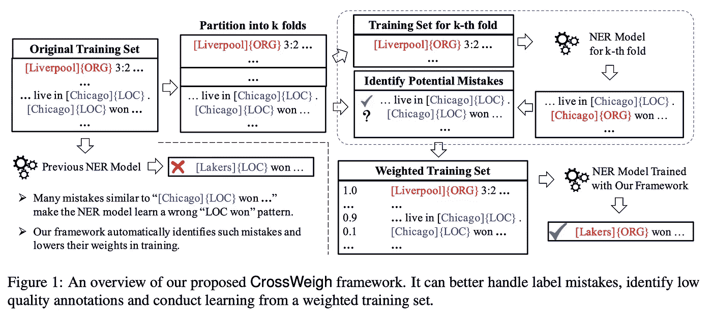

# 命名实体识别中的标注者偏差和不完整标注(NER)

> 原文：<https://towardsdatascience.com/annotator-bias-and-incomplete-annotations-for-named-entity-recognition-ner-84819af730?source=collection_archive---------32----------------------->

## 介绍 2019 年发表的两篇论文，涉及命名实体识别的不完全标注(NER)

Photo by [Alvaro Reyes](https://unsplash.com/@alvaroreyes?utm_source=unsplash&utm_medium=referral&utm_content=creditCopyText) on [Unsplash](https://unsplash.com/collections/3550997/hist-gd-ux-presentation?utm_source=unsplash&utm_medium=referral&utm_content=creditCopyText)

我们知道深度学习(DL)的兴起离不开带注释的数据。换句话说，正是那些注释者让 DL 发展的如此之快。但他们也是人，他们有自己的注释习惯，也会犯错误。在本帖中，我将介绍一些有趣的论文。一篇论文是关于注释者的偏见，两篇论文是关于命名实体识别的不完整注释(NER)。

# em NLP-2019/11-我们是对任务建模还是对注释器建模？自然语言理解数据集中标注者偏差的研究

这篇文章的出发点相当有趣。外包标注任务在业内很常见。我们可能关注注释的质量，但是很少关注**注释者的偏见。注释者偏差**意味着每个注释者都有自己标记数据的习惯，他们会给数据带来这样的偏差。本文表明**注释者的偏见会影响模型的性能**。如果在训练期间输入注释者标识符作为特征，模型将学习注释者的习惯并训练一个更健壮的模型。另一个有趣的发现是，模型不能很好地概括来自对训练集没有贡献的注释者的例子。具体来说，如果模型不能从训练集中学习注释者的习惯，它就不能很好地推广到测试集中。一个建议是，当我们注释数据集时，一个注释器应该同时注释训练集和测试集。

# NAACL-2019/06-对命名实体识别的不完整注释进行更好的建模

## 注释者也是人，人也会犯错。注释数据不可能总是完美的。对于这种情况，我们必须找出如何更好地学习不完善的标注数据。这两篇论文是为 NER 任务学习这样的数据。

上图显示了不完整的注释示例。为了更好地对不完整标注建模，作者提出了一种新的损失函数。

为了对不完全标注建模，作者引入了一种新的概率分布 *q* 来表示所有可能的标注。

这个想法在上图的右下角。通过引入 *q* 分布，该模型可以考虑不完整标签的所有可能路径。

如何学习 *q* 分配？

作者提出了两种方法，硬方法和软方法。在硬方法中，所得的 *q* 分布是将概率 1 分配给单个完整标签序列的折叠分布，而在软方法中，每个可能的标签序列将得到某个概率分数。

# EMNLP-2019/11-CrossWeigh:从不完善的注释中训练命名实体标记器

NER 存在两种标签错误:(1)测试集中的错误会干扰评估结果，甚至导致对模型性能的不准确评估；以及(2)训练集中的错误会损害 NER 模型训练。

来解决第一个问题。在本文中，他们纠正了测试集中的错误，以形成更清晰的基准，并开发了一个新颖的框架来处理训练集中的错误。他们纠正了 CoNLL03 NER 数据集的 5.38%标签错误测试句子。它表明，模型性能在更干净的测试数据集上有所提高。

为了解决第二个问题，他们提出了一个交叉权重框架来更好地处理标签错误。这个框架包含两个部分。

*   错误估计:通过交叉检查过程识别训练数据
    中潜在的标签错误。
*   错误重新加权:在最终 NER 模型的训练过程中，它降低了这些实例的权重。交叉校验过程受 k 重交叉验证的启发；不同的是，在每个文件夹的训练数据中，它会删除包含该文件夹中出现的任何实体的数据。

> ***查看我的其他帖子*** [***中***](https://medium.com/@bramblexu) ***同*** [***一分类查看***](https://bramblexu.com/posts/eb7bd472/) ***！
> GitHub:***[***bramble Xu***](https://github.com/BrambleXu) ***LinkedIn:***[***徐亮***](https://www.linkedin.com/in/xu-liang-99356891/) ***博客:***[***bramble Xu***](https://bramblexu.com)

# 参考

*   [https://arxiv.org/pdf/1908.07898.pdf](https://arxiv.org/pdf/1908.07898.pdf)
*   [https://www.aclweb.org/anthology/N19-1079](https://www.aclweb.org/anthology/N19-1079)
*   [https://arxiv.org/pdf/1909.01441.pdf](https://arxiv.org/pdf/1909.01441.pdf)