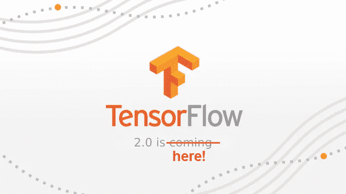

# 公告:TensorFlow 2.0 已经到来！

> 原文：<https://towardsdatascience.com/announcement-tensorflow-2-0-has-arrived-ee59283fd83a?source=collection_archive---------14----------------------->

几个月前，我提到了 TensorFlow 2.0 中将包含的一些激动人心的新功能。

你猜怎么着？今天(撰写本文时)TensorFlow 2.0 Alpha 预览包正式发布，并在[官网](https://www.tensorflow.org/alpha)更新了文档！

我对此感到非常兴奋和激动，迫不及待地想和你们分享这个！！

要了解 TensorFlow 以前的一些用例以及 TensorFlow 2.0 中的一些变化，请查看下面的短视频:

What’s New in TensorFlow 2.0 by Paige Bailey (Developer Advocate)

# TensorFlow 2.0 中的一些新功能

即使 Tensorflow 2.0 仍处于预览版，但我们可以开始尝试 TensorFlow 1.x 之后期待已久的一些最酷的功能。

相信我。学习和使用 TensorFlow 2.0 的易用性会让你大吃一惊，尤其是对于初学者。

**TensorFlow 2.0 专注于简单易用**，拥有急切执行、直观的高级 API 和在任何平台上灵活构建模型等更新。

TensorFlow 2.0 中有多个变化，使 TensorFlow 用户更有效率。在下一节中，我将简要概述使 TensorFlow 2.0 使用起来更加直观和高效的两个主要变化。

要了解 TensorFlow 2.0 中有哪些内容，可以查看 TensorFlow 团队发布的[中型文章，或者 TensorFlow 官方网站](https://medium.com/tensorflow/whats-coming-in-tensorflow-2-0-d3663832e9b8?linkId=62351082)上的[摘要。](https://www.tensorflow.org/alpha/guide/effective_tf2)

或者，你也可以观看由 aurélien géRon(aurélien géRon)创建的这个视频(附在下面)，他是用 Scikit-Learn 和 TensorFlow 进行机器学习的[作者。我最喜欢视频的一点是，他除了提到 TensorFlow 2.0 的一些重大变化外，还对比了 Pytorch 和 TensorFlow 2.0 的区别。](https://amzn.to/2VHf3jn)

TensorFlow 2.0 Changes by Aurélien Géron

# 1.急切的执行

*   默认情况下启用快速执行，TensorFlow 操作现在会立即被评估并返回它们的值，而不构建图形
*   由于没有计算图形要构建并在随后的会话中运行，所以很容易使用 print()或调试器检查结果
*   **评估、打印和检查张量值不会中断计算梯度的流程**
*   **TensorFlow 2.0 急切地执行(就像 Python 通常做的那样)，在 2.0 中，图形和会话应该感觉像实现细节。**

# **2.函数，而不是会话**

**让我们面对现实吧。**

**在用我们的张量流图进行任何计算之前，我们需要调用会话，这一直是我们头疼的问题。**

**TensorFlow 2.0 就是为了解决这个问题而诞生的。**

**因为`session.run()`调用几乎类似于函数调用:您指定输入和要调用的函数，然后您得到一组输出。**

**在 TensorFlow 2.0 中，您可以使用一个名为`tf.function()`的装饰器，这样您就可以自动定义一个 TensorFlow 函数，以 TensorFlow 操作图的形式运行计算，带有命名参数和显式返回值。**

**换句话说，您可以使用自然的 Python 语法编写图形代码，同时能够以简洁的方式编写渴望风格的代码，并使用 ***tf.function*** *将其作为张量流图形运行。***

# **最后的想法**

****

**Wonderful Google office tour in Singapore**

**感谢您的阅读。**

**这么多激动人心又人性化的功能，真的很期待 TensorFlow 2.0 的最终版本。**

**同时，如果您有兴趣了解 TensorFlow 2.0 的最新发展，您可以随时订阅[邮件列表](https://www.tensorflow.org/community/lists)或[在此加入社区](https://www.tensorflow.org/community/groups)！**

**一如既往，如果您有任何问题或意见，请随时在下面留下您的反馈，或者您可以随时通过 [LinkedIn](https://www.linkedin.com/in/admond1994/) 联系我。在那之前，下一篇文章再见！😄**

## **关于作者**

**[**Admond Lee**](https://www.linkedin.com/in/admond1994/) 目前是东南亚排名第一的商业银行 API 平台[**Staq**](https://www.trystaq.com)**—**的联合创始人/首席技术官。**

**想要获得免费的每周数据科学和创业见解吗？**

**[**加入 Admond 的电子邮件简讯——Hustle Hub**](https://bit.ly/3pGF8jv)，每周他都会在那里分享可行的数据科学职业建议、错误&以及从创建他的初创公司 Staq 中学到的东西。**

**你可以在 [LinkedIn](https://www.linkedin.com/in/admond1994/) 、 [Medium](https://medium.com/@admond1994) 、 [Twitter](https://twitter.com/admond1994) 、[脸书](https://www.facebook.com/admond1994)上和他联系。**

** [## 阿德蒙德·李

### 让每个人都能接触到数据科学。Admond 正在通过先进的社交分析和机器学习，利用可操作的见解帮助公司和数字营销机构实现营销投资回报。

www.admondlee.com](https://www.admondlee.com/)**