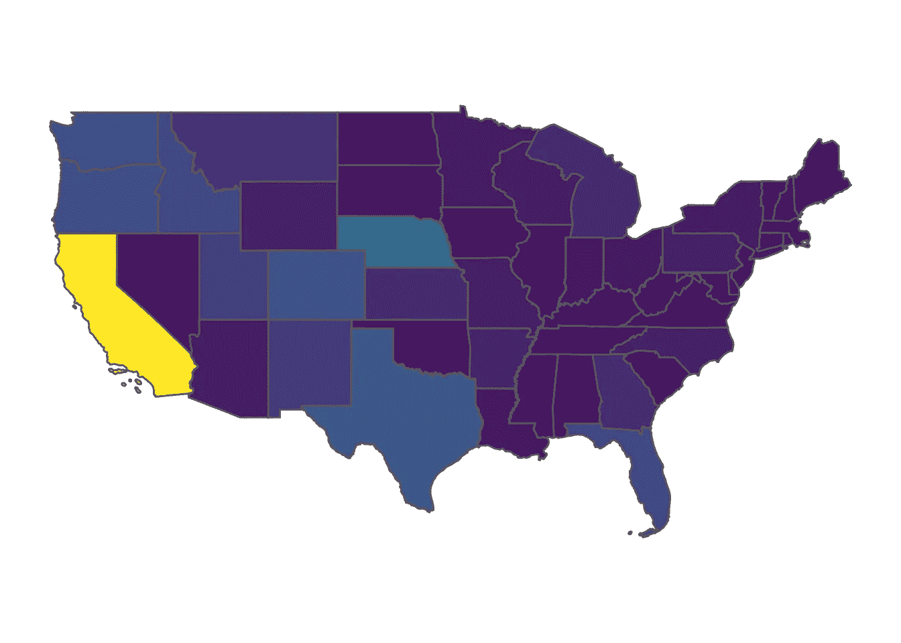
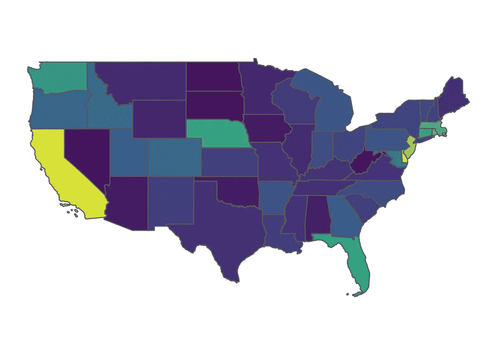

# 宣布 tidyUSDA:一个用于处理 USDA 数据的 R 包

> 原文：<https://towardsdatascience.com/announcing-tidyusda-an-r-package-for-working-with-usda-data-6066fa830f0a?source=collection_archive---------31----------------------->

我很自豪地宣布一个 R 包的发布，它治愈了我个人的一个痒处:提取并使用美国农业部的数据，特别是来自 NASS 的快速统计数据。tidyUSDA 是实现这一目的的最小软件包。以下是从包装上剪下来的小片段，可以在这里找到:[***【https://github.com/bradlindblad/tidyUSDA】***](https://github.com/bradlindblad/tidyUSDA)

# 为什么是 tidyUSDA？

*为什么我们还需要另一个“整洁”的包装？为什么我必须安装这么多地理空间依赖项？*

合理的问题。如果你使用美国农业部的数据，你会知道当你需要时，有时很难找到你需要的东西。大量的数据(2017 年农业普查包括大约 640 万个信息点[1])应该归功于美国农业部，因为这是一项巨大的组织任务。

目前，从以前的农业普查和农业调查中提取数据的最佳方式是通过[快速统计门户网站](https://quickstats.nass.usda.gov/)，它允许您在交互式 gui 中应用过滤器，然后下载 CSV 文件。这对于大多数应用程序来说非常有效，但是 R 程序员讨厌以非编程方式提取数据，这就是 tidyUSDA 的用武之地。

***编程数据直接从 Quick Stats 中提取*** 在其核心，tidyUSDA 是一个用于 Quick Stats 数据的 API，允许您在 R 会话中将相同的数据提取到 dataframe 中。

***地理空间功能*** tidyUSDA 还为您提供了在县或国家级别自动向快速统计数据添加简单要素列的选项。这允许您快速可视化快速统计数据，以便快速迭代或生成报告。

# 快速启动

首先，按照[自述文件部分](https://github.com/bradlindblad/tidyUSDA#Installation)中的说明安装 tidyUSDA。请注意，如果您使用的是旧版本，您可能需要升级您的 R 版本。

接下来，调用 tidyUSDA 来确保所有东西都正确安装了。

```
library(tidyUSDA)
```

美国农业部通过 API 密钥控制对他们数据的访问。您可以按照[此链接](https://quickstats.nass.usda.gov/api)中的简要说明快速获得免费的 API 密钥。

现在来拉一些数据。

```
# Use keyring to store your api key 
# key <- keyring::key_get("tidyusda")# Or hard code that thing 
key <- 'abc-123' 
```

在这一点上，最好使用实际的快速统计网站来挑选出你想要过滤的参数。通过这种方式，您可以确定数据将被返回。我希望看到使用 2017 年人口普查数据的州级运营计数细分。

在这一点上，它有助于了解哪些可能的值您可以输入到函数参数中。您可以使用内置数据集查看所有参数的这些可能输入。让我们来看看几个。

```
tidyUSDA::allCategory %>% head() 
#> statisticcat_desc1 statisticcat_desc2 
#> "ACCESSIBILITY" "ACCESSIBILITY, 5 YEAR AVG" 
#> statisticcat_desc3 statisticcat_desc4 
#> "ACCESSIBILITY, PREVIOUS YEAR" "ACTIVE GINS" 
#> statisticcat_desc5 statisticcat_desc6 
#> "ACTIVITY" "ACTIVITY, 5 YEAR AVG"
```

所以看起来对于*类别*字段只有六个可能的输入值。很高兴知道。

```
tidyUSDA::allGeogLevel %>% head() 
#> agg_level_desc1 agg_level_desc2 
#> "AGRICULTURAL DISTRICT" "AMERICAN INDIAN RESERVATION" 
#> agg_level_desc3 agg_level_desc4 
#> "COUNTY" "INTERNATIONAL" 
#> agg_level_desc5 agg_level_desc6 
#> "NATIONAL" "REGION : MULTI-STATE"
```

有许多不同的地理级别。目前只支持为*县*和*州*值提供几何图形。

现在我们对可以输入的内容有了一点了解，让我们使用主函数进行数据提取。

```
# Get count of operations with sales in 2017 
ops.with.sales <- tidyUSDA::getQuickstat(sector=NULL, group=NULL, commodity=NULL, category=NULL, domain=NULL, county=NULL, key = key, program = 'CENSUS', data_item = 'CROP TOTALS - OPERATIONS WITH SALES', geographic_level = 'STATE', year = '2017', state = NULL, geometry = TRUE, lower48 = TRUE)
```

注意，我设置 *geometry = TRUE* 是为了包含我们绘图所需的几何特征，我设置 *lower48 = TRUE* 是为了排除夏威夷和阿拉斯加。

在这一点上，我有一个数据帧，其中包含相当多的数据字段。如果您设置 *geometry = TRUE* ，您将拥有更多列。快速统计的主要数据点将在“值”字段中。此时，您可以随意过滤数据框中您实际需要的字段。

现在让我们看看基本的 choropleth 图的数据是什么样的。

```
# Plot this data for each state 
tidyUSDA::plotUSDA(df = ops.with.sales)
```



好的，哇，看起来这个国家所有的农场都在加利福尼亚。但是等一下，就陆地面积而言，加州很大，农场的相对规模相对较小，所以也许我们应该换个角度来看这个问题。首先，让我们清理数据帧，以便更容易处理。

```
mydata <- ops.with.sales[,c("NAME", "Value", "ALAND")]
```

我们选择州名、来自快速统计查询的值(运营次数)和“ALAND”，即以平方米为单位的土地面积。让我们修改我们的数据框架来计算每平方米的操作数，这样状态的大小就不会影响我们想要得到的结果。

```
mydata$ALAND <- as.numeric(mydata$ALAND) 
mydata$modified_value <- mydata$Value / mydata$ALAND
```

这给了我们一堆没有意义的非常小的数字，但是对于我们的映射目的来说，它们就够了。

```
# tidyUSDA::plotUSDA(df = mydata, target_col = 'modified_value') tidyUSDA::plotUSDA(df = mydata, fill_by = 'modified_value')
```



啊，好多了。现在我们有了一个真实的曲线图，显示了每平方米的操作次数。看起来加州仍然是每块土地上拥有农场最多的州。

*原载于 2019 年 9 月 29 日*[*https://technistema.com*](https://technistema.com/post/announcing-tidyusda-a-package-for-working-with-usda-data/)*。*