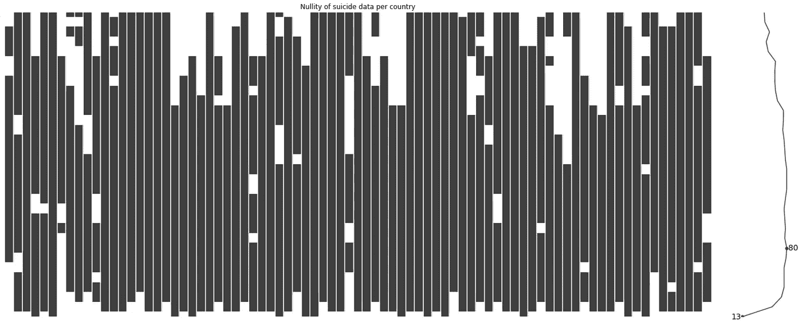
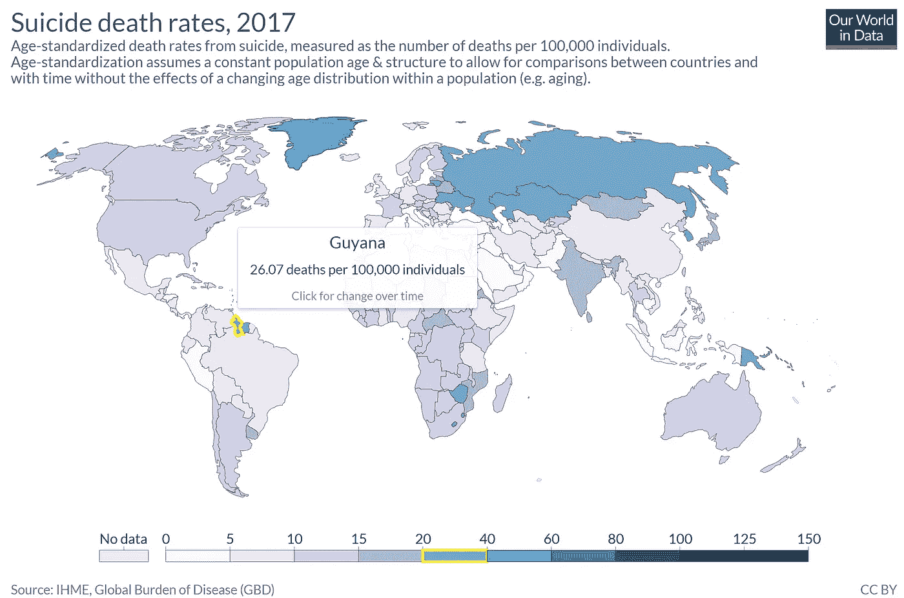
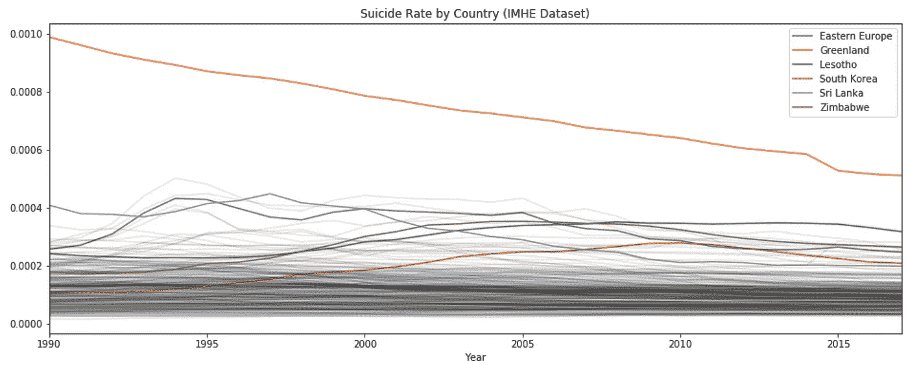
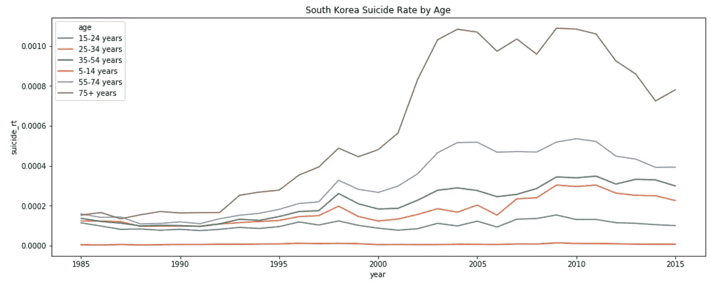

# 全球自杀数据的异常

> 原文：<https://towardsdatascience.com/anomalies-in-global-suicide-data-6ce05ff178b3?source=collection_archive---------31----------------------->

Mental Health Search Interest on Google Trends

每个心理健康意识日(10 月 10 日)，在谷歌趋势上对“心理健康”的搜索兴趣都会出现一个峰值。然而，在刚刚过去的 10 月，人们对搜索的兴趣达到了有史以来的最高水平。美国的精神健康正在成为全球话题的一部分——部分是因为它的去污名化，但主要是因为它与技术(最显著的是社交媒体)、国内恐怖主义和毒瘾的相关性。

虽然 [kagglers](https://www.kaggle.com/szamil/suicide-in-the-twenty-first-century/notebook) 和[非营利组织](https://ourworldindata.org/suicide)已经对这一主题进行了大量预先存在的分析，但我希望使用时间序列异常检测技术，从不同的角度研究[自杀统计数据集](https://www.kaggle.com/russellyates88/suicide-rates-overview-1985-to-2016)。

# 世卫组织自杀统计数据

世界卫生组织收集了每个国家的自杀人数，并提供了年龄、年份、国家、世代和性别之间的细分。自杀的数量经常被低估，即使如此，也只占自杀企图的很小一部分。然而，令人印象深刻的是，世卫组织能够以相同的粒度收集 100 多个国家的信息。

Albania subset of WHO suicide data

他们的数据集按照国家、年份、性别和年龄按行进行格式化。当我们将表格转换为每个国家和年份的总量时，我们发现每个国家的报告中存在一些差距。使用 *missingno* 库，我们可以很容易地可视化任何数据集的无效性。在下图中，每一列都是一个国家，白色方块表示该年的空值。

Nullity of suicide data per country

对于零死亡率高(超过 50%的年份缺失)的国家，我们将其从分析中剔除:这包括波斯尼亚和黑塞哥维那、塞浦路斯、多米尼克、斐济、基里巴斯、澳门、马尔代夫、蒙古等等。对于其余部分，我们将使用*均值插补*简单地填充缺失的数据(用该国 1985 年至 2016 年的平均自杀率替换空值)。

# IMHE，全球疾病负担数据集

健康指标和评估研究所(IMHE)也发布了另一个自杀数据集，用于[我们的数据世界:自杀](https://ourworldindata.org/suicide)报告。它提供了时间段(1990 年至 2017 年)的自杀指标，每个被调查国家都没有遗漏条目。有了这些完整的数据，他们能够创建一个随时间变化的地图可视化:

# 异常检测

既然我们已经查看了数据，我们将使用聚类算法来确定哪个国家从 1985 年到 2016 年的自杀率与所有其他国家相比有偏差。为此，我们将每个时间序列(每年 1 个数据点，每个国家 32 个)转换为每个国家 32 长度的向量。由此，我们可以使用基于密度的聚类方法(DBSCAN)来识别异常的时间序列。

通过在 IMHE 数据集上运行同样的聚类，我们得到了相似的结果。在世卫组织数据集中，格陵兰岛与丹麦王国合并在一起，因此它在 IMHE 数据集中仅作为一个单独的国家出现。

我们从 DBSCAN 中确定的异常值似乎属于两种趋势:

**#1:正在改善的高自杀率国家。**

格陵兰岛因拥有世界上最高的自杀率而臭名昭著，尤其是在当地居民中。2016 年， [NPR 甚至录制了一集播客](https://www.npr.org/sections/goatsandsoda/2016/04/21/474847921/the-arctic-suicides-its-not-the-dark-that-kills-you)来进一步了解这一现象并与研究人员交流。虽然有许多因素，但许多研究文章将这一现象归因于因纽特人和丹麦文化之间的冲突。最近,《卫报》的一篇文章将精神健康危机与气候变化及其对他们生活方式的影响联系起来。数据显示的自杀率下降可能表明政府的干预正在起作用，尽管这与来自维基百科的这篇文章相矛盾(基于与 Tina Evaldsen 的[对话)。](https://s3-eu-west-1.amazonaws.com/wikitribune-uploads-master/2018/07/09104920/Tina-Evaldsen-health-consultant-at-Greenland%E2%80%99s-Ministry-of-Health.pdf)

**东欧的**(俄罗斯、立陶宛等。)高自杀率主要是由 20 世纪 80 年代后半期开始的苏联解体造成的。事实上，[自苏联解体以来，约有 80 万俄罗斯人自杀](https://www.telegraph.co.uk/news/worldnews/europe/russia/8841619/800000-Russians-committed-suicide-since-Soviet-Union-collapsed.html)。这一时期的特点是经济危机和国家动乱。幸运的是，随着东欧经济的改善，自杀率也有所下降。

第二:最近自杀率的急剧上升。

苏里南+圭亚那是南美洲的邻国，拥有大量的印度斯坦(东印度)人口。在圭亚那，印度教徒占人口的 40%，但却占了 2010 年至 2013 年间自杀事件的 80%。关键因素可能包括精神疾病在印度文化中的污名、未治疗的创伤或 PTSD。在农村社区，个人可能会被孤立，独自应对心理健康问题。今天，努力的方向是打破围绕精神健康和家庭暴力的沉默。

在**南韩，**自杀是**第四大死因。我最初认为自杀在年轻人中会很普遍，但数据显示它实际上主要影响老年人群。**

根据 W [ikipedia](https://en.wikipedia.org/wiki/Suicide_in_South_Korea) 的说法，这部分人口容易自杀，因为该国一半的老年人生活在贫困线以下。

> 再加上资金不足的老年人社会安全网，这可能会导致他们为了不成为家庭的经济负担而自杀，因为子女照顾父母的旧社会结构在 21 世纪已经基本消失了。