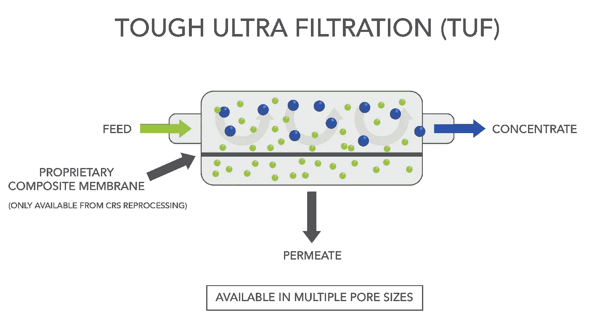
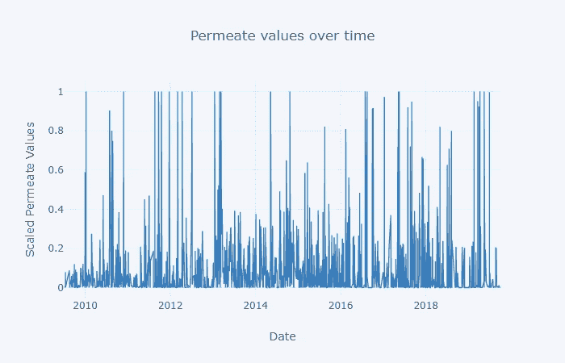
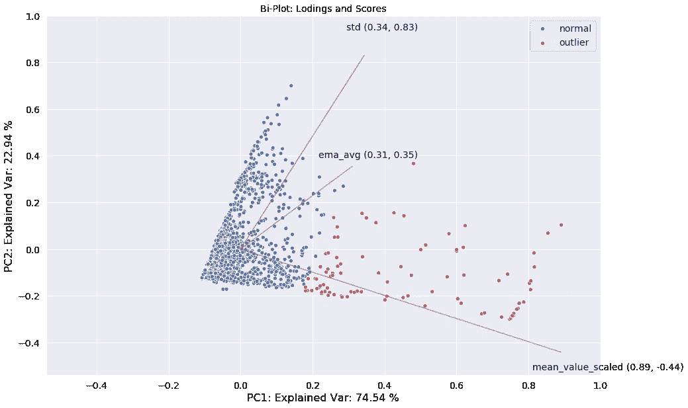
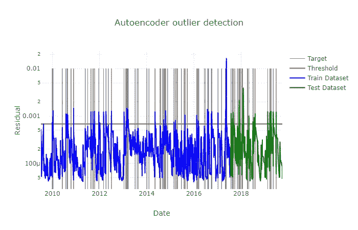
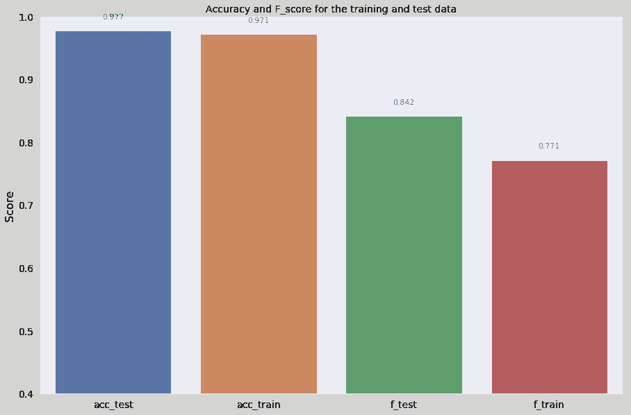
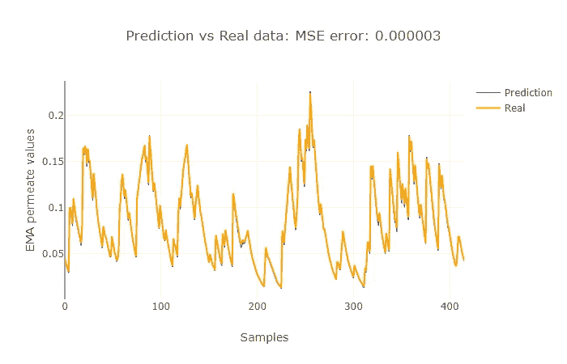

# 渗透率突破的异常检测和预测

> 原文：<https://towardsdatascience.com/anomaly-detection-and-forecasting-of-permeate-breakthrough-e79a1cfaf0a9?source=collection_archive---------24----------------------->

在这项工作中，我们评估了各种方法，以预测何时有渗透突破的生化生产过程。自动编码器模型似乎很有前途，但应该与传统的统计过程控制指标相结合，以增加其鲁棒性。

同样，指数移动平均线(EMA)和长短期记忆(LSTM)提供了不同的结果。均线平滑时间序列数据，给出一段时间的趋势。这与 LSTM 相结合，使我们能够对未来的渗透值进行预测。

这个项目的完整代码可以在我的 [**github repo**](https://github.com/PriceTT/DSND-Capstone) 中找到。

# 超滤过程

在食品和生化工业中，使用超滤(UF)是纯化目标产品的关键单元操作。进料进入 UF，根据膜的孔径，大于孔径的物质保留在**浓缩液(产品)**中，小于孔径的物质进入**透过液(废物)**。

Image courtesy [www.crs-reprocessing.com](http://www.crs-reprocessing.com*)

取决于应用，超滤膜的孔径大约为 10-100 千道尔顿。正因为如此，才有可能分离蛋白质，并通过除去水和盐来增加浓缩物流中蛋白质的浓度，留下感兴趣的产物。

Image courtesy [www.synderfiltration.com](http://www.synderfiltration.com*)

然而，随着时间的推移，膜降解，蛋白质进入渗透。由于渗透物是一种废物流，我们实际上是在扔掉我们想要出售的产品！！！

# 问题陈述

在本项目中，通过分析历史渗透值，目的是检测**渗透物突破(渗透物中产品含量高)**并在应该更换超滤膜时向工程师提供反馈，从而使**生产过程更加可靠并减少产品损失。**

换句话说，我们希望开发一种稳健的方法来预测何时出现渗透突破，并预测未来的价值。

# 方法学

比例渗透数据由位于卡伦堡德纳姆克的*诺维信*生产工厂提供。

然而，历史突破的时间记录是不一致的。因此，突破的特征将被创造。这四个特征是:

*   **mean_value_scaled** :从 0-1 缩放的原始渗透值。
*   **ema_avg:** 均线的平均值 _ 缩放值。
*   **标准:**平均值的标准偏差 _ 缩放
*   **目标**:1.5σ以上的数值，分为正常(0)和突破(1)

为了检测渗透数据中的异常值(渗透突破)，我们评估了:

*   [主成分分析](/machine-learning-for-anomaly-detection-and-condition-monitoring-d4614e7de770)
*   一个[自动编码器型号](https://www.jeremyjordan.me/autoencoders/)

为了预测未来渗透值，我们评估了:

*   EMA 的使用
*   更加精密的[T5【LSTM】型号 ](/predicting-stock-price-with-lstm-13af86a74944)

以下指标用于确定模型的表现如何:

*   对于异常/异常值检测，我们将使用准确度和 F 值。
*   对于预测，我们将使用测试集的均方误差(MSE)。

# 结果

**异常值检测**

**PCA 分析**显示正常渗透值(蓝色)和异常值(红色)之间存在差异。

可以看出，97.5 %的方差可以由前两个主成分(PC)来解释。此外，上面的双图显示了前两个主成分的负荷和得分。对于第一台 PC，所有的特性都是正面的。这是合理的，因为如果 **mean_value_scaled** 增加，则 **std** 也会随着 **ema_avg** 增加(过程中有更多变化)。当包含两个 PC 时， **ema_avg** 和 **std** 的相关性更强，但与 **mean_value_scaled** 的相关性较弱。

> 每个主成分是一个指向最高方差方向的单位向量(在考虑了早期主成分捕获的方差之后)。权重离零越远，主分量在相应特征的方向上就越多。如果两个特征具有相同符号的较大权重(都是正的或都是负的)，那么一个特征的增加会与另一个特征的增加相关联。相比之下，具有不同符号的特征可能会表现出负相关性:一个变量的增加会导致另一个变量的减少。

同样，更先进的**自动编码器型号**能够在测试集上以 0.9715 的准确度分数、0.8438 的精确度分数和 0.7714 的 F 分数捕获何时出现突破。

黑线是我们认为有突破的目标和标志。蓝色和绿色的线是训练和测试数据集残差。阈值是自动内折器模型识别为异常值的值，在大多数情况下，该值与目标值一致。

以下是自动编码器模型的指标。当您处理一个类不平衡的数据集时，仅准确性并不能说明全部情况，就像这个数据集一样，其中正标签和负标签的数量存在显著差异。因此，我们也将使用 f1 分数，它是[精度和召回](https://developers.google.com/machine-learning/crash-course/classification/true-false-positive-negative)的平衡。

上面的 autoencoder 给出了比朴素情况好得多的性能(朴素预测器:[准确度分数:0.0543，F 分数:0.0669])。详见我的[代号](https://github.com/PriceTT/DSND-Capstone)。

**预测渗透值**

简单的 EMA 在跟踪趋势方面做得很好，但是通常滞后于新数据的移动，如下所示。这一具体分析表明，在使用 EMA 的一个主峰之后，大约需要一年时间才会出现另一个主峰(假设在导致渗透值降低的主峰之后更换膜)。
这实际上比制造商所说的更短，应该接近 2 年。这可能意味着我们需要评估膜的操作和清洁条件，看看这对膜的寿命是否有影响。

**LSTM**在预测实际渗透值方面表现不佳，但在预测 EMA(如下所示)和标准偏差方面表现出色。与仅使用 EMA 模型相比，这可以用于实现更长期的预测。

# **未来工作**

在这一分析的基础上，还可以做更多的事情。我想到的几个例子是:

*   不更换膜的机会成本分析。
*   LSTM 在预测未来值的均值和标准差方面做得很好。评估我们是否能重建未来价值的概率可能会很有趣。
*   应调查梯度的使用或数值之间的%变化。虽然移动平均是一个成功的特征，但考虑到渗透物样品不是以规则的间隔采集的，梯度可以提供更多有用的信息。
*   评估不同的模型参数:
    —损失函数和优化器
    —激活函数:relu

感谢您的阅读，希望这能激发您对该领域的兴趣。欢迎建设性的反馈，如果您发现代码有问题，您可以在 [Github repo](https://github.com/PriceTT/DSND-Capstone) 中提出问题。