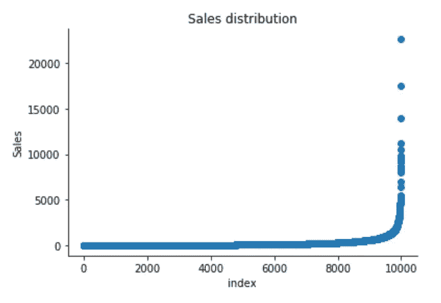

# 虚拟异常检测

> 原文：<https://towardsdatascience.com/anomaly-detection-for-dummies-15f148e559c1?source=collection_archive---------0----------------------->


Photo credit: Unsplash

## 单变量和多变量数据的无监督异常检测。

[**异常检测**](https://en.wikipedia.org/wiki/Anomaly_detection) 是识别数据集中与常态不同的意外项目或事件的过程。异常检测通常应用于未标记的数据，称为无监督异常检测。异常检测有两个基本假设:

*   数据中很少出现异常。
*   他们的特征明显不同于正常情况。

# 单变量异常检测

在我们开始多元异常检测之前，我认为有必要先看一个简单的单变量异常检测方法的例子，在这个例子中，我们从单个特征空间中的值分布中检测异常值。

我们正在使用[超级商店销售数据集](https://community.tableau.com/docs/DOC-1236)，可以从[这里](https://community.tableau.com/docs/DOC-1236)下载，我们将分别找出与预期行为不符的销售和利润模式。也就是说，一次发现一个变量的异常值。

```
import pandas as pd
import numpy as np
import matplotlib.pyplot as plt
import seaborn as sns
import matplotlib
from sklearn.ensemble import IsolationForest
```

## 销售的分布

```
df = pd.read_excel("Superstore.xls")
df['Sales'].describe()
```


Figure 1

```
plt.scatter(range(df.shape[0]), np.sort(df['Sales'].values))
plt.xlabel('index')
plt.ylabel('Sales')
plt.title("Sales distribution")
sns.despine()
```



Figure 2

```
sns.distplot(df['Sales'])
plt.title("Distribution of Sales")
sns.despine()
```


Figure 3

```
print("Skewness: %f" % df['Sales'].skew())
print("Kurtosis: %f" % df['Sales'].kurt())
```


超市的销售分布远不是正态分布，它有一个正的细长尾巴，分布的质量集中在图的左边。并且尾部销售分布远远超过正态分布的尾部。

在分布的右侧有一个数据出现概率低的区域。

## 利润分配

```
df['Profit'].describe()
```


Figure 4

```
plt.scatter(range(df.shape[0]), np.sort(df['Profit'].values))
plt.xlabel('index')
plt.ylabel('Profit')
plt.title("Profit distribution")
sns.despine()
```


Figure 5

```
sns.distplot(df['Profit'])
plt.title("Distribution of Profit")
sns.despine()
```


Figure 6

```
print("Skewness: %f" % df['Profit'].skew())
print("Kurtosis: %f" % df['Profit'].kurt())
```


超市的利润分布既有正尾也有负尾。但是，正尾比负尾长。所以分布是正偏态的，数据是重尾的或者大量的异常值。

有两个区域数据出现的概率很低:一个在分布的右侧，另一个在左侧。

## 销售单变量异常检测

**Isolation Forest** 是一种检测异常值的算法，它使用 Isolation Forest 算法返回每个样本的异常值，该算法基于异常值是少量且不同的数据点这一事实。隔离林是基于树的模型。在这些树中，通过首先随机选择一个特征，然后在所选特征的最小值和最大值之间选择一个随机分割值来创建分区。

以下过程显示了 IsolationForest 在 Susperstore 销售案例中的表现，该算法是在 Sklearn 中实现的，代码主要是从本[教程](https://dzone.com/articles/spotting-outliers-with-isolation-forest-using-skle)中借用的

*   使用销售数据训练 IsolationForest。
*   将销售额存储在 N *umPy* 数组中，以便稍后在我们的模型中使用。
*   计算每个观察的异常分数。输入样本的异常得分计算为森林中树木的平均异常得分。
*   将每个观察值分类为异常值或非异常值。
*   可视化突出显示了异常值所在的区域。

sales_IsolationForest.py


Figure 7

根据上述结果和可视化，似乎超过 1000 的销售额肯定会被视为异常值。

## 目测调查一个异常情况

```
df.iloc[10]
```


Figure 8

这一购买对我来说似乎很正常，只是与数据中的其他订单相比，它的销售额更大。

## 利润的单变量异常检测

*   使用利润变量训练 IsolationForest。
*   将利润存储在 N *umPy* 数组中，以便稍后在我们的模型中使用。
*   计算每个观察的异常分数。输入样本的异常得分计算为森林中树木的平均异常得分。
*   将每个观察值分类为异常值或非异常值。
*   可视化突出显示了异常值所在的区域。

profit_IsolationForest.py


Figure 9

## 目测调查一些异常情况

根据上述结果和可视化，低于-100 或超过 100 的利润似乎会被视为异常值，让我们直观地检查由我们的模型确定的每个示例，看看它们是否有意义。

```
df.iloc[3]
```


Figure 10

不言而喻，任何负利润都是异常现象，应该进一步调查

```
df.iloc[1]
```


Figure 11

我们的模型确定这个利润很高的订单是异常的。但是，当我们调查这个订单时，它可能只是一个利润相对较高的产品。

以上两个可视化显示了异常分数，并突出显示了异常值所在的区域。正如预期的那样，异常分数反映了基础分布的形状，异常值区域对应于低概率区域。

然而，单变量分析只能让我们到此为止。我们可能会意识到，由我们的模型确定的这些异常中的一些并不是我们预期的异常。当我们的数据是多维的，而不是单变量的**时，检测**异常****的方法变得更加计算密集和数学复杂。****

# ****多元异常检测****

****由于我们生活的世界的复杂性，我们最终做的大多数分析都是多变量的。在**多变量**异常检测中，异常值是至少两个变量的组合异常值。****

****因此，使用销售和利润变量，我们将基于几个模型构建一个无监督的**多元异常检测**方法。****

****我们使用的是 [**PyOD**](https://pyod.readthedocs.io/en/latest/) ，这是一个 Python 库，用于检测多元数据中的异常。这个库是由[赵月](https://www.yuezhao.me/)开发的。****

## ****销售和利润****

****当我们做生意时，我们期望销售额和利润是正相关的。如果一些销售数据点和利润数据点不是正相关的，它们将被认为是异常值，需要进一步调查。****

```
**sns.regplot(x="Sales", y="Profit", data=df)
sns.despine();**
```

********

****Figure 12****

****从上面的相关图中，我们可以看到部分数据点是极低值、极高值等明显的异常值。****

## ****基于聚类的局部异常因子****

****CBLOF 根据基于聚类的本地异常值因子计算异常值分数。异常分数是通过每个实例到其聚类中心的距离乘以属于其聚类的实例来计算的。 [PyOD 库](https://pyod.readthedocs.io/en/latest/index.html)包含[CBL of 实现](https://pyod.readthedocs.io/en/latest/pyod.models.html#module-pyod.models.cblof)。****

****以下代码均借用自 [PyOD 教程](https://github.com/yzhao062/pyod/blob/master/notebooks/Compare%20All%20Models.ipynb)结合[本文](https://www.analyticsvidhya.com/blog/2019/02/outlier-detection-python-pyod/)。****

*   ****将销售额和利润缩小到零和一之间。****
*   ****根据试验和最佳猜测，将异常值部分任意设置为 1%。****
*   ****将数据拟合到 CBLOF 模型并预测结果。****
*   ****使用阈值来考虑数据点是在内还是在外。****
*   ****使用决策函数计算每个点的异常分数。****

****CBLOF.py****

********

****Figure 13****

## ****基于直方图的异常检测(HBOS)****

****HBOS 假设特征独立，并通过构建直方图来计算异常程度。在多变量异常检测中，可以计算每个单一特征的直方图，单独评分，最后合并。使用 PyOD 库时，代码与 CBLOF 非常相似。****

****HBOS.py****

********

****Figure 14****

## ****隔离森林****

****隔离林在原理上类似于随机林，建立在决策树的基础上。隔离林通过随机选择一个要素，然后随机选择所选要素的最大值和最小值之间的分割值来隔离观察值。****

****PyOD 隔离林模块是具有更多功能的 [Scikit-learn 隔离林](https://scikit-learn.org/stable/modules/generated/sklearn.ensemble.IsolationForest.html)的包装器。****

****IsolationForest.Py****

********

****Figure 15****

## ****K -最近邻(KNN)****

****KNN 是异常检测中最简单的方法之一。对于一个数据点，其到第 k 个最近邻的距离可以被视为异常值分数。****

****KNN.py****

********

****Figure 16****

****上述四种算法预测的异常情况差别不大。****

## ****目测调查一些异常情况****

****我们可能希望调查由我们的模型确定的每个异常值，例如，让我们详细查看由 KNN 确定的两个异常值，并尝试理解是什么使它们异常。****

```
**df.iloc[1995]**
```

********

****Figure 17****

****对于这个特殊的订单，客户购买了 5 件产品，总价为 294.62 英镑，利润低于-766 英镑，折扣为 80%。看起来像是通关。我们应该意识到我们销售的每件产品的损失。****

```
**df.iloc[9649]**
```

********

****Figure 18****

****对于这次购买，在我看来，4.7%左右的利润太小，模型确定该订单是异常的。****

```
**df.iloc[9270]**
```

********

****Figure 19****

****对于上面的订单，一个客户购买了总价为 4305 的 6 件产品，在打了 20%的折扣后，我们仍然获得了超过 33%的利润。我们希望有更多这样的异常现象。****

****[Jupyter 笔记本](https://github.com/susanli2016/Machine-Learning-with-Python/blob/master/Anomaly_Detection_for_Dummies.ipynb)以上分析可以在 [Github](https://github.com/susanli2016/Machine-Learning-with-Python/blob/master/Anomaly_Detection_for_Dummies.ipynb) 上找到。享受这周剩下的时光。****