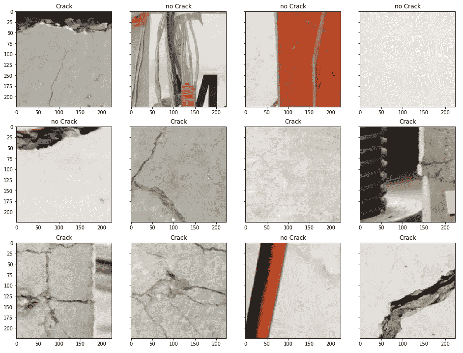

# 图像中的异常检测

> 原文：<https://towardsdatascience.com/anomaly-detection-in-images-777534980aeb?source=collection_archive---------7----------------------->

## 用卷积神经网络对异常进行分类和个性化


Photo by [mahdis mousavi](https://unsplash.com/@dissii?utm_source=medium&utm_medium=referral) on [Unsplash](https://unsplash.com?utm_source=medium&utm_medium=referral)

在机器学习中处理异常检测任务是正常的。数据科学家经常会遇到一些问题，他们必须显示、解释和预测异常。

我还发表了一篇关于时间序列的[异常检测的帖子，其中我研究了内部系统行为，并提供了未来的异常预测。](/anomaly-detection-with-lstm-in-keras-8d8d7e50ab1b)

在这篇文章中，我试图解决一个不同的挑战。我改变感兴趣的领域:从时间序列转换到图像。给定一幅图像，我们想要达到双重目的:**预测异常的存在并对其进行个性化**，给出结果的彩色表示。

# 数据集

我从网上得到的数据:[裂缝数据集](https://www.kaggle.com/arunrk7/surface-crack-detection)包含墙壁裂缝的图像。一半的图像显示了新的和未被破坏的墙体；其余部分显示了不同尺寸和类型的裂缝。

正如你从下面的样本中看到的，我们的数据显示了不同类型的墙体裂缝，其中一些对我来说也不容易识别。



Examples of Crack and No Crack

# 模型

我们希望建立一个机器学习模型，它能够对墙壁图像进行分类，同时检测出异常所在的位置。为了达到这个双重目的，最有效的方法是建立一个强分类器。它将能够读取我们的输入图像，并将其分类为“受损”或“未受损”。在最后一步，我们将利用我们的分类器学习的知识来提取有用的信息，这将有助于我们检测哪里有异常。

但是让我们按顺序进行，开始组装我们的神经网络…

对于这种任务，我选择了计算机视觉的银弹，忠诚 VGG16。我们装载并改造了 VGG16 列车。这在 Keras 中很容易做到，只需要几行代码。

```
vgg_conv = vgg16.VGG16(weights='imagenet', include_top=False, input_shape = (224, 224, 3))for layer in vgg_conv.layers[:-8]:
    layer.trainable = False
```

具体来说，我们引入了 VGG 架构，允许训练最后两个卷积块。这将允许我们的模型专门处理我们的分类任务。为此，我们还排除了原始模型的顶层，用另一个结构替换它们。

```
x = vgg_conv.output
x = GlobalAveragePooling2D()(x)
x = Dense(2, activation="softmax")(x)
model = Model(vgg_conv.input, x)model.compile(loss = "categorical_crossentropy", optimizer = optimizers.SGD(lr=0.0001, momentum=0.9), metrics=["accuracy"])
```

在分类阶段，GlobalAveragePooling 图层通过取每个要素地图的平均值来减小前一图层的大小。这种选择，加上中间致密层的省略使用，允许[避免过度拟合](https://arxiv.org/pdf/1312.4400.pdf)。

如果你有一个图形处理器，训练是简单和容易的。COLAB 或 Kaggle 给了我们加速这一进程所需的武器。我们还使用了一个由 Keras 提供的简单的数据生成器来增强图像。

最终我们能够做到 0.90 的整体准确率，还不错！


From [sklearn documentation](https://scikit-learn.org/stable/auto_examples/model_selection/plot_confusion_matrix.html)

# 定位异常

现在，随着我们的模型被训练，我们使用来提取所有有用的信息，这些信息允许我们在墙壁图像中显示裂缝。我们试图用[热图表示法](https://alexisbcook.github.io/2017/global-average-pooling-layers-for-object-localization/)让这个过程变得简单易懂。

我们需要的有用信息位于顶部。特别是，我们可以访问:

*   *卷积层*:我们在 VGG 结构中走得更高，网络创造了更重要的特征。我们已经选择了最后一个卷积层(*block 5 _ con v3*’)，并在这里剪切我们的分类模型。我们重新创建了一个中间模型，给定原始图像作为输入，输出相关的激活图。考虑到维度，我们的中间模型增加了通道(新特征)并减少了初始图像的维度(高度和宽度)。
*   *最终密集层*:对于每个感兴趣的类，我们需要这些权重，它们负责提供分类的最终结果。

有了这些压缩物体在手，我们就有了定位裂缝的所有知识。我们希望将它们“画”在原始图像上，以使结果易于理解和观看。在 python 中,“解压缩”这些信息很容易:我们只需进行双线性上采样来调整每个激活图的大小，并计算点积。

这种魔力可以通过执行一个简单的函数来实现:

```
def plot_activation(img): pred = model.predict(img[np.newaxis,:,:,:])
    pred_class = np.argmax(pred) weights = model.layers[-1].get_weights()[0]
    class_weights = weights[:, pred_class] intermediate = Model(model.input,
                         model.get_layer("block5_conv3").output)
    conv_output = intermediate.predict(img[np.newaxis,:,:,:])
    conv_output = np.squeeze(conv_output) h = int(img.shape[0]/conv_output.shape[0])
    w = int(img.shape[1]/conv_output.shape[1]) act_maps = sp.ndimage.zoom(conv_output, (h, w, 1), order=1)
    out = np.dot(act_maps.reshape((img.shape[0]*img.shape[1],512)), 
                 class_weights).reshape(img.shape[0],img.shape[1]) plt.imshow(img.astype('float32').reshape(img.shape[0],
               img.shape[1],3))
    plt.imshow(out, cmap='jet', alpha=0.35)
    plt.title('Crack' if pred_class == 1 else 'No Crack')
```

我在下图中显示了结果，我在分类为裂纹的测试图像上绘制了裂纹热图。我们可以看到，热图能够很好地概括和指出含有裂缝的墙体。


Show anomalies in Crack images

# 摘要

在这篇文章中，我们提出了一个用于异常识别和定位的机器学习解决方案。所有这些功能都可以通过实现单个分类模型来实现。在训练过程中，我们的神经网络获取所有相关信息，使其能够进行分类操作。在这一阶段之后，我们已经组装了最终的碎片，这些碎片告诉我们图像中的裂缝在哪里，不需要额外的工作！

[**查看我的 GITHUB 回购**](https://github.com/cerlymarco/MEDIUM_NoteBook)

保持联系: [Linkedin](https://www.linkedin.com/in/marco-cerliani-b0bba714b/)