# 火星表面异常探测

> 原文：<https://towardsdatascience.com/anomaly-detection-in-martian-surface-66dc9953a546?source=collection_archive---------21----------------------->

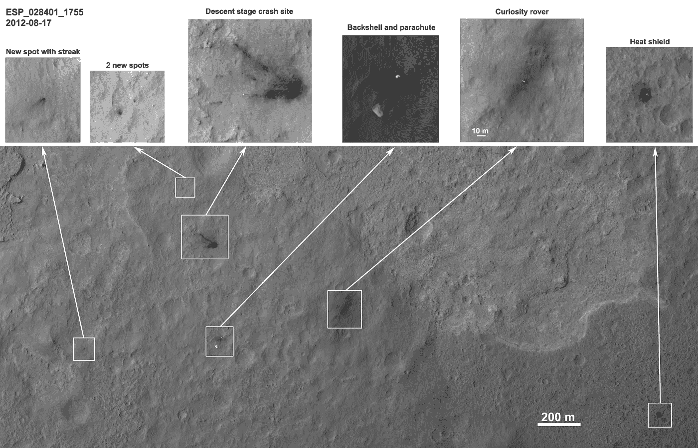

The University of Arizona — Views of MSL Hardware 12 Days after Landing — [Image Source](https://static.uahirise.org/images/2012/details/cut/ESP_028401_1755.jpg)

## 大海捞针！

我得到了这个极好的机会，通过奥姆德纳社区参与“火星表面异常探测”项目。这个项目的目标是探测火星表面由非地球人造物品引起的异常现象，如火星着陆器、火星车等的碎片。

最近，寻找所谓的“技术签名”——提供过去或现在外星技术的科学证据的可测量的属性或效果——获得了新的兴趣。美国宇航局于 2018 年 9 月在德克萨斯州休斯顿的月球和行星研究所举办了一场“技术签名”研讨会，以了解更多关于“技术签名”搜索的当前领域和现状，以及美国宇航局未来可能在这些搜索中发挥的作用。这个研究领域中的一个领域是寻找太阳系中的非地球人造物品。这个人工智能挑战赛旨在为行星科学家开发“人工智能工具箱”，以帮助识别非地球文物。

这个人工智能挑战有多个挑战，从数据集开始。

# 数据集面临的挑战

探测火星表面的异常没有什么独特的挑战。除了数据收集和没有预定义数据集的挑战，最初的挑战是火星表面本身非常多样化。火星表面的不同部分看起来与其他部分完全不同。同一个表面在不同的季节看起来差别很大。不同火星表面的少量样本:

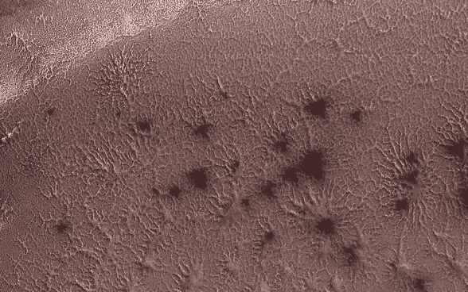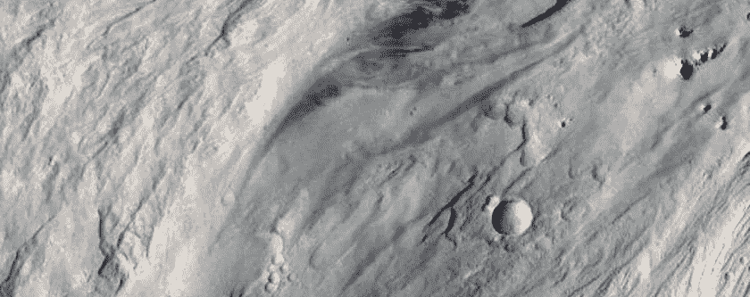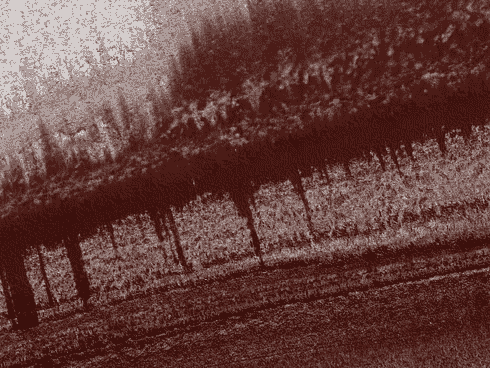

NASA — Jamming with the ‘Spiders’ from Mars — [Image Source](https://www.nasa.gov/sites/default/files/thumbnails/image/pia22587.jpg), Sciencealert — Gorgeous New Photos of Mars — [Image Source](https://www.sciencealert.com/nasa-have-just-released-2-540-gorgeous-new-photos-of-mars), Sinc — Fotografían las capas del Polo Norte marciano — [Image Source](https://agenciasinc.es/var/ezwebin_site/storage/images/multimedia/fotografias/fotografian-las-capas-del-polo-norte-marciano/1095961-3-esl-MX/Fotografian-las-capas-del-Polo-Norte-marciano_image800_.jpg)

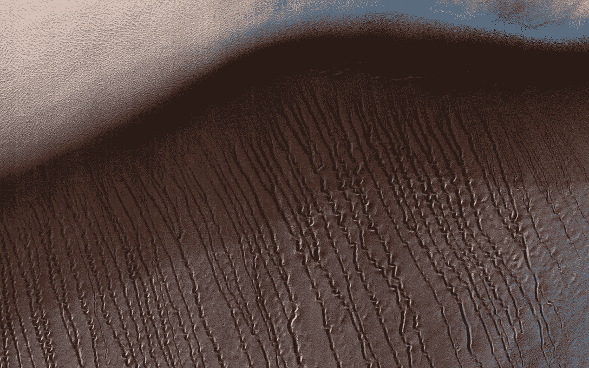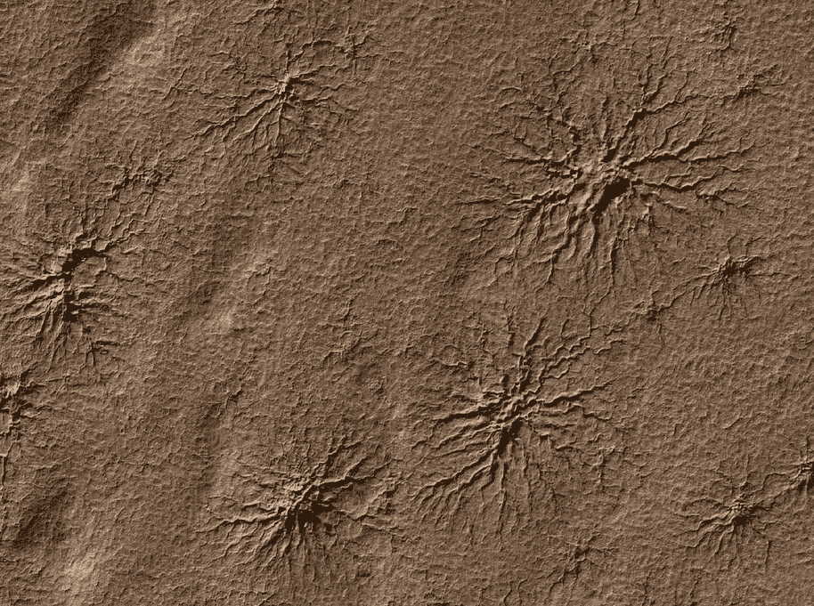

NASA — Squiggles in Hellas Planitia — [Image Source](https://www.jpl.nasa.gov/spaceimages/images/largesize/PIA22052_hires.jpg), NASA — Radial Channels Carved by Dry Ice — [Image Source](https://www.jpl.nasa.gov/spaceimages/images/largesize/PIA12249_hires.jpg)

因此，该算法应该足够通用，能够检测所有这些不同表面中的异常。第二个挑战是关于数据不平衡，火星表面大约有 1.45 亿平方公里，在这个表面上，我们有几个 100 个不超过几十英尺的异常。人们可以考虑使用数据扩充来克服不平衡，但不同地形中产生的异常仍然会有所不同，我们没有跨不同地形的标记数据。

下一个挑战是数据总量已经被异常污染。通常的异常检测算法通过在正常/通常人群样本上训练 AI 模型来工作，并且该模型用于预测目标数据偏离正常/通常人群样本多少。这里不能应用这种方法。

## 创建数据集

我在这次演习中使用的数据集是 https://www.uahirise.org/ESP_028401_1755[登陆后 12 天的 MSL 硬件图像。在这幅图像中，来自“亚利桑那大学”的人们对硬件在火星表面制造异常的表面图像进行了注释。这似乎是一个用于初步评估的完美数据集。](https://www.uahirise.org/ESP_028401_1755)

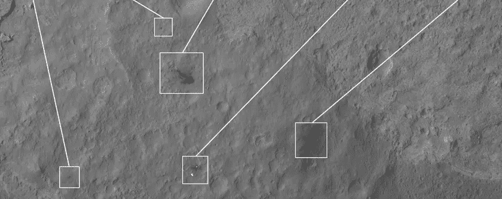

The University of Arizona — Views of MSL Hardware 12 Days after Landing — [Image Source](https://static.uahirise.org/images/2012/details/cut/ESP_028401_1755.jpg)

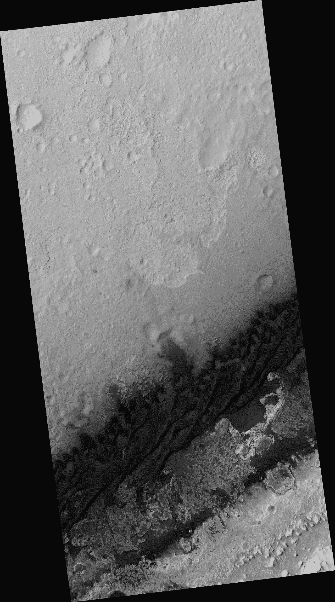

The University of Arizona — Views of MSL Hardware 12 Days after Landing — [Image Source](https://hirise-pds.lpl.arizona.edu/PDS/EXTRAS/RDR/ESP/ORB_028400_028499/ESP_028401_1755/ESP_028401_1755_RED.browse.jpg)

完整的 HiRISE 图像大小约为 550MB，分辨率为 25516x45788 像素。左边是完整 HiRISE 图像的压缩浏览图像。这种异常在这幅图像中几乎看不到。即使在全分辨率图像中，也很难发现异常，除非人们确切地知道在哪里看。

为了从这个图像中创建一个数据集，我将这个 25516x45788 像素的图像分割成 256x256 像素的小图像块，跨度为 256 像素。正如你所看到的，这张图片周围有黑边，黑边对人工智能模型来说并不好。为了减少预处理这张图片的工作量，我去除了图片边缘的图片块，使用了图片中心的图片块。这产生了一个大约有 10K 图像的数据集。在这些 10K 图像中，有 6 个异常分布在 50 幅图像中。

以下是数据集中出现的 6 个异常的样本图像:

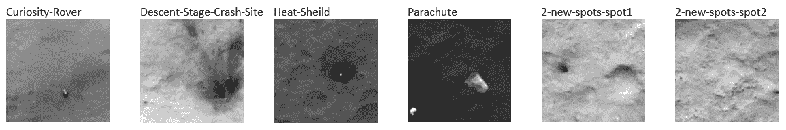

The University of Arizona — JP2 Black and White — [Image Source](http://Black and white)

# 算法背后的直觉

主要动机是利用数据集中的挑战，并应用出版物[https://arxiv.org/abs/1811.06861](https://arxiv.org/abs/1811.06861)中提到的“使用基于深度学习的图像完成的异常检测”方法

该想法是使用深度卷积神经网络来逐块完成表面图像，目的是检测表面上的异常。本文中使用的方法是专门在正常数据上训练模型，屏蔽/切除中心 32×32 像素，并且训练模型以重建屏蔽区域。为了检测异常，查询图像的中心 32×32 像素被屏蔽，并且该模型用于重建被屏蔽区域的无故障克隆。通过用生成的区域减去相应的查询区域，获得逐像素的异常分数，然后使用该分数来检测异常。

betergevondenworden.nl — [Image Source](https://betergevondenworden.nl/wp-content/uploads/2017/07/naald-in-hooiberg.jpg)

在我们的数据集中，由于与正常图像相比，异常预计非常少，因此我们将使用整个数据集来训练模型。然后，使用经过训练的模型来计算同一数据集的异常分数。由于该模型将在正常图像上进行推广，因此预计它将给出异常的高异常分数。

让我们看看这种方法能否在 10K 图像的大海里找到这 6 根针。

# 前馈生成 DCNN

图像完成任务通常旨在以最自然的方式完成图像的缺失区域。除了语义上有意义之外，修复还必须看起来尽可能真实。出于这个原因，前馈修复 DCNNs 通常与对抗网络联合训练。敌对网络的目标是区分真假图像。相反，生成模型必须通过生成逼真的图像来增加敌对网络的错误率。虽然这种额外的不利损失确实使修补看起来更真实，但它对像素匹配图像的丢失部分没有积极的影响。用联合损失函数进行训练甚至会增加像素重建误差，这对于异常检测来说是不希望的行为。为此，本文采用仅用重构损失训练的前馈生成型 DCNN。

## 模型定义

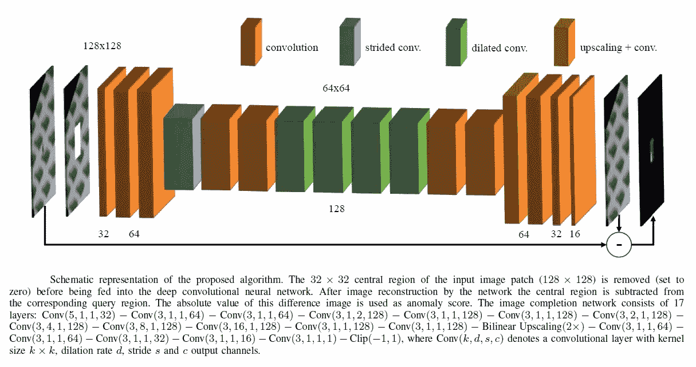

arxiv.org — [Image Source](https://arxiv.org/abs/1811.06861)

如上图所示，DCNN 网络由 17 层组成。在第三层之后，特征图的分辨率通过步进卷积减半。为了增加输出神经元的感受野，使用了一系列扩张的回旋(第 7-10 层)。在第 13 层，通过双线性重定标以及随后的卷积来执行放大回到输入大小。镜像填充用于所有卷积层。此外，使用指数线性单位(ELU)激活函数。

## 损失函数

用 L1 重构损失训练网络。由二进制掩码 M 定义的 32×32 的中心区域与剩余区域的权重不同。X 是要检查的图像块，用下面的损失函数训练网络:

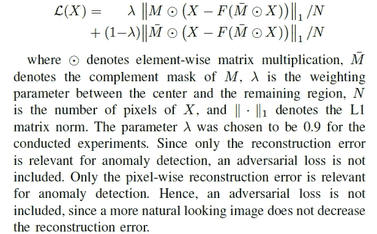

arxiv.org — [Image Source](https://arxiv.org/abs/1811.06861)

## 培养

256×256 的图像块尺寸被调整为 128×128，并且图像完成网络被馈送以 128×128 尺寸的图像补片。由于遮蔽了大小为 32×32 的中心区域，补丁被破坏。已知和未知图像内容之间的这种大比例为网络提供了更多的语义信息来完成中心区域。在通过网络重建受损图像之后，通过上述损失函数计算重建图像和查询图像之间的逐像素绝对差作为损失值。该模型被训练了 200 个历元。

# 异常分数

对于异常检测，仅使用该绝对差图像的 24×24 中心区域。其中缺陷出现在靠近切出的 32×32 中心区域的边界的图像补片，神经网络似乎生成边界缺陷的局部延续。通过仅考虑 24x24 中心区域，这些不想要的延续大部分被排除。

# 初步结果

在对模型进行 200 个时期的训练之后，该模式再次用于预测同一数据集的异常分数。由此产生的异常分数分布如下所示:

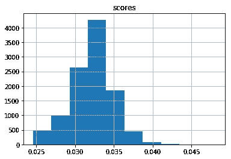

列出与样本平均值相差 3 个标准偏差的图像，可以得到 99 个图像文件。99 出 10K 的图像还不错。通过将这些文件名与 99 幅图像中的异常图像块进行交叉引用，该模型仅检测到两种异常类别:“降落伞”和“下降阶段-坠毁地点”。它漏掉了“隔热屏”，“2-新点-点 1”，“2-新点-点 2”，“好奇号-漫游者”。在 99 个图像中，只有 7 个图像是异常的。虽然不是一个好结果！

# 即兴创作

在仔细分析没有检测到的异常图像时，发现遗漏的异常图像在图像的侧面具有异常，即不在图像的 32×32 中心。由于 DCNN 模型被训练来重建中心 32×32 像素，以 16 的步幅分割图像块将确保异常将占据一些图像块的中心 32×32 部分。

因此，用步长 16 切割的图像块重新创建了初始数据集。不是在这个新数据集上再次重新训练模型，而是使用先前训练的模型来预测这个步幅 16 数据集上的异常分数。由此产生的异常分数分布如下所示:

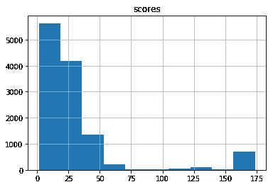

我们可以清楚地看到在分布图的最右边有一个图像数量的峰值。列出与样本平均值相差 3 个标准偏差的图像，得到 705 个图像文件。通过将这些文件名与异常图像块进行交叉引用，发现所有 705 个文件都属于四种异常类型“隔热层”、“降落伞”、“下降阶段-坠毁地点”、“好奇号-漫游车”。零误报。瞧，六根针中有四根找到了！

这种方法仍然遗漏了“2-新点-点 2”、“2-新点-点 1”异常。如果我们观察这些异常，这些异常非常小，并且随着图像从 256x256 重新缩放到 128x128，这些图像产生的异常分数将会更小。

## 结论

“使用基于深度学习的图像完成进行异常检测”的方法似乎是检测火星表面技术特征的可行选择。可以通过以下方式进一步增强模型性能:

*   为更多时代而训练
*   升级模型配置
*   对 HiRISE 图像进行聚类，并在一组相似的图像上进行训练，以使模型能够更好地概括，并更果断地检测异常。