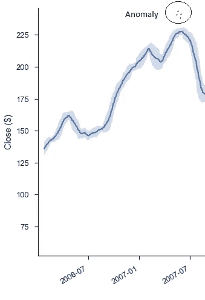
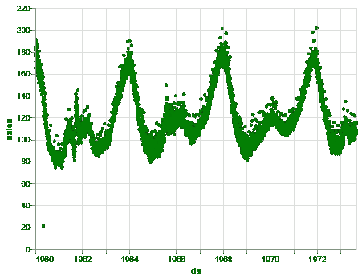
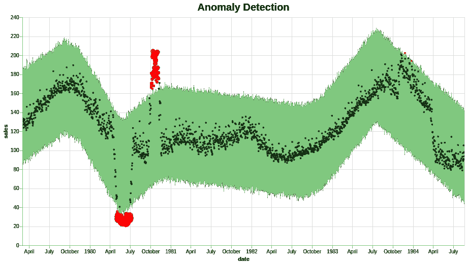
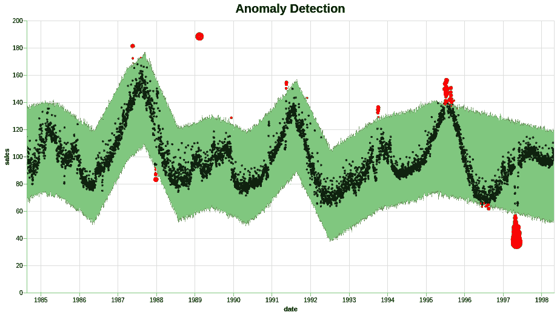
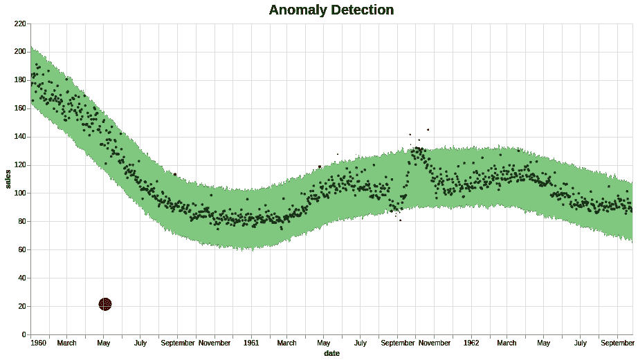

# 基于 Prophet 库的时间序列异常检测

> 原文：<https://towardsdatascience.com/anomaly-detection-time-series-4c661f6f165f?source=collection_archive---------4----------------------->



首先，我们来定义一下什么是时间序列中的异常。时间序列的异常检测问题可以表述为寻找相对于一些标准或通常信号的异常数据点。虽然有许多异常类型，但从业务角度来看，我们将只关注最重要的类型，如意外的峰值、下降、趋势变化和水平变化。你可以用两种方式解决这个问题:有人监督和无人监督。虽然第一种方法需要一些标记数据，但第二种方法不需要，您只需要原始数据。在那篇文章中，我们将关注第二种方法。

> 看看我的机器和深度学习博客[https://diyago.github.io/](https://diyago.github.io/)

一般来说，无监督异常检测方法是这样工作的:你建立你的数据的一些通用简化版本——在这个模型的阈值之外的任何东西都被称为异常值或异常值。因此，首先我们需要将我们的数据放入某个模型中，希望这个模型能够很好地描述我们的数据。先知图书馆来了。当然，你可以尝试或多或少强大/复杂的模型，如 arima、回归树、rnn/lstm 甚至移动平均线等，但几乎所有这些模型都需要调整，不太可能开箱即用。先知不是那样的，它像自动 arima，但好得多。开始使用专注于预测时间序列的库真的很强大也很容易。它是由脸书的核心数据科学团队开发的。你可以在这里阅读更多关于 T2 图书馆的信息。

要安装 Prophet 库可以通过 pypi 安装:

```
pip install fbprophet
```

我们将使用一些样本数据，其中有一些有趣的异常值。你在这里下载数据[，看起来是这样的:](http://www.sharecsv.com/s/71ac978f781d6eabe89679ebe1d27388/test_detect_anoms.csv)



Some random time-series

为了训练模型，我们将定义一些基本超参数 *interval_width* 和 *changepoint_range* 。它们可用于调整边界的宽度:

Fitting prophet model

然后，我们将高于顶部的所有内容设置为异常值，并降低模型边界的底部。此外，将离群值的重要性设置为基于点离边界有多远:

然后你就准备好获取剧情了。推荐试试[牛郎星](https://altair-viz.github.io/gallery/index.html)库，只需设置添加*就能轻松获得一个互动剧情。与您的代码交互*。

最后，我们得到了结果。他们似乎很有道理:



*   [Github 储存库](https://github.com/Diyago/ML-DL-scripts/tree/master/time%20series%20regression/anomaly%20detection)包含代码和数据
*   [Kaggle 代码](https://www.kaggle.com/kernels/scriptcontent/15216678/download)与数据由 [Vinay Jaju](https://medium.com/u/e6970958bcd5?source=post_page-----4c661f6f165f--------------------------------)