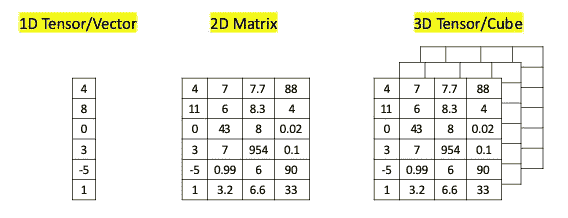
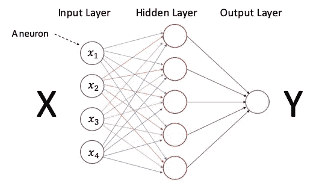
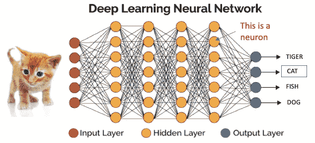
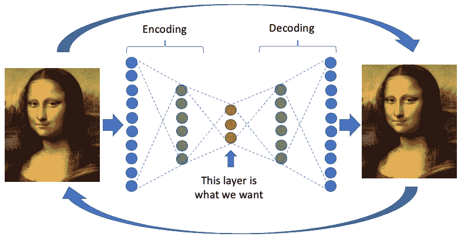
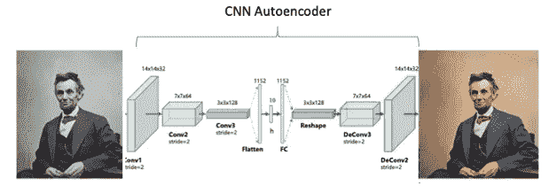
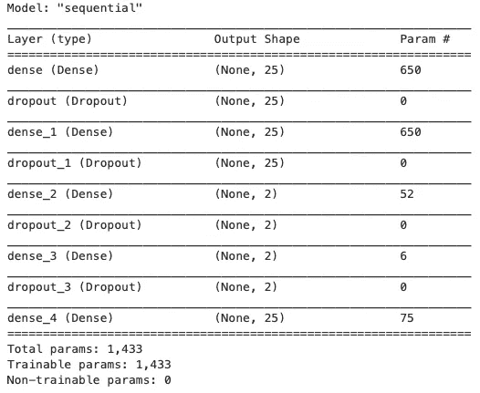
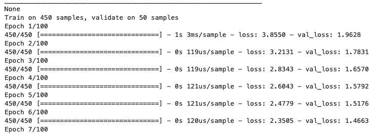
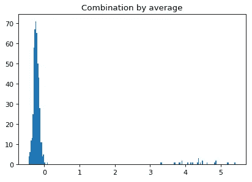

# Python 异常检测手册— (12)自动编码器

> 原文：<https://towardsdatascience.com/anomaly-detection-with-autoencoder-b4cdce4866a6?source=collection_archive---------0----------------------->

(新修订日期:2022 年 12 月 5 日)

自动编码器模型是神经网络或深度学习的重要应用。它们被广泛应用于降维、图像压缩、图像去噪和特征提取。它们也被应用于异常检测，并取得了良好的效果。

深度学习是机器学习的整个课题。我知道不是所有的读者都熟悉深度学习，所以我在这一章中花了更多的章节来描述深度学习的具体细节。因为许多读者熟悉回归，所以我将从回归的角度介绍深度学习，并使用逻辑回归来解释神经网络图。这种回归友好的方法可以帮助读者理解神经网络建模。

至此，我解释了自动编码器的结构，并向您展示了如何构建异常值。我将深入研究自动编码器所基于的深度学习模型的组件。这些组件包括批量大小的概念、L1 和 L2 正则化、纪元、深度学习模型中的优化器等等。完成本章后，读者将对通用深度学习框架充满信心，可以对超参数进行微调。

**(一)理解深度学习**

往往深度学习或者神经网络是用他们的行话来呈现的。学习者以类似大脑的解剖学为导向来“想象”它在大脑中是如何运作的。学习者会看到神经元、互联性和复杂的神经网络系统。在我的讲座从回归到深度学习的过渡中，我不知何故感到有一瞬间的沉默——就像跳过一个深深的缺口。术语的差异也造成了知识差距。为了用回归友好的方法呈现深度学习，让我首先解释神经元、激活函数、层、优化器等等。然后，我将向您展示如何在深度学习框架中建立逻辑回归。

**(A.1)数据在深度学习中被称为“张量”**

在 y = XB + e 回归公式中，y 是一维向量，X 是 2D 矩阵。在 EXCEL 电子表格中，因变量 y 是一列，协变量 X 是多列。在深度学习术语中，一列称为张量。1D 矢量是张量，2D 矩阵是 2D 张量。流行的机器学习平台 tensor flow(tensorflow.org)也以此命名，并为神经网络建模而建。一旦你知道“张量”除了一维向量什么都不是，你可能会感到宽慰。为什么他们不直接叫它“向量”？这个术语来自哪里？它来自拉丁语*张量*，意思是“伸展的东西”。数学家沃耳德玛·福格特(1898 年)利用数学中的这一概念将矢量称为张量。

Figure (A.1): Tensor/Vector (Image by author)

**(A.2)输入层中的神经元是输入变量**

神经网络中的术语*神经元*和*层*对于回归学习者来说是陌生的。你大概见过类似图(A.2)的神经网络图。图为一款*型号*。模型是描述 X 和 y 之间关系的算法。例如，回归或决策树是模拟 X 和 y 之间关系的框架。

Figure (A.2): A Neural Network (Image by author)

神经网络模型有一个输入层、隐藏层和一个输出层。神经网络是一种监督学习模型。为了训练模型，X 矩阵被馈送到输入层，而目标 y 被馈送到输出层。图中的节点被称为*神经元*。神经元是一个矢量或张量。任何两个神经元之间的连接代表参数。隐藏层中的每个神经元都是前一层神经元的加权和。可以有很多隐藏层。

**(A.3)使用神经网络构建逻辑回归**

如果没有隐藏层，神经网络实际上会崩溃为逻辑回归。在图(A.3)中，有四个变量 *x1 — x4* 和一个输出变量 *y* 。表示逻辑回归 *Y=f(a)* 其中 *a = w1x1 + w2x2 + w3x3 + w4x4* 。 *w1 — w4* 是需要优化的参数。

Figure (A.3): A logistic Regression in Deep Learning

**(A.4)激活功能**

在深度学习中，还有一个组件叫做*激活函数*。它的工作方式类似于逻辑回归中的 logit 函数。在逻辑回归中，logit 函数将原始预测转换为介于 0 和 1 之间的概率。在深度学习中，激活函数将原始值映射到非零值。因为一个神经元中的值是前一层神经元的线性组合，所以这些值可能会变得非常小，并最终在多层计算后消失。在这种情况下，神经网络无法继续。这就是*消失梯度问题*，说的是基于梯度的学习方法中权重会消失。因此，激活函数将权重映射到一系列值，如 0 和 1，以防止它们消失。

激活功能可以应用于一些或所有隐藏层。对于激活函数来说，任何能够将原始值单调映射到新值的非线性函数都是不错的选择。常见的函数有 Sigmoid、ReLu 和 Tanh 函数。这里我只介绍前两个。

一个 sigmoid 函数是一个 logit 函数。因为输出值的范围可以扩大到正无穷大或负无穷大，所以神经网络应用 sigmoid 函数将输出转换为 0 到 1 之间的值。

一个 **ReLU 功能**(整流线性单元)是另一个流行的激活功能。它将任何负值都限制在零。

**(A.4)不同数据类型的不同深度学习算法**

提及三大数据类别是有帮助的。它们是(1)多元数据，(2)串行数据(包括时间序列、文本和语音流)，以及(3)图像数据。发明了许多不同类型的神经网络框架来处理每种类型的数据。标准的前馈神经网络通常用于多元数据。递归神经网络(RNN)和长短期记忆网络(LSTM)是系列数据的例子。和卷积神经网络(CNN)是图像数据的例子。在这一章中，我们主要关注多元数据。对序列数据感兴趣的读者，推荐查阅《[现代时间序列异常检测](https://www.amazon.com/Modern-Time-Anomaly-Detection-Examples/dp/B0B3K59ZNH/ref=sr_1_1?crid=23Y03NG4H93XX&keywords=modern+time+series+anomaly+detection+with+python+examples+chris+kuo&qid=1666797328&sprefix=%2Caps%2C281&sr=8-1)》或《[RNN/LSTM/GRU 股价预测技术指南](https://dataman-ai.medium.com/a-technical-guide-on-rnn-lstm-gru-for-stock-price-prediction-bce2f7f30346)》这本书。对图像数据和神经网络应用感兴趣的读者，推荐查看“[用于图像分类的迁移学习](https://www.amazon.com/Transfer-Learning-Image-Classification-Examples/dp/B0BD2XPFK6/ref=sr_1_1?crid=1GFVL5P6C3UPD&keywords=transfer+learning+for+image+classification&qid=1666797417&qu=eyJxc2MiOiIwLjAwIiwicXNhIjoiMC4wMCIsInFzcCI6IjAuMDAifQ%3D%3D&sprefix=%2Caps%2C107&sr=8-1)”。

**(A.5)神经网络的有用链接**

如果你想了解更多关于人工神经网络(ANN)的知识，下面的视频剪辑给出了一个非常直观的观点:

这个视频描述了什么是反向传播:

**(A.6)图像分类中的深度学习**

显然，仅仅用深度学习来做逻辑回归是矫枉过正的。深度学习可以做很多复杂结构的图像识别。因为使用图像应用程序学习自动编码器会容易得多，所以在这里我将描述图像分类是如何工作的。

新生婴儿不知道狗的图像，但是他/她将学会记住关于狗的一些特殊“特征”,然后识别该图像。如果我们想要一种算法像我们人类一样识别图像，该算法必须经历相同的学习过程。我们要用成千上万张标签为“狗”的图像，和成千上万张标签为“猫”的图像来“训练”模型。该模型将学习狗或猫的特征。该模型将能够识别未知图像中的任何特殊特征，以辨别它是狗还是猫的图像。我个人认为图像识别模型无法取代上帝创造的人脑中错综复杂的网络。但是它们被聪明地发明来帮助人类重复任务。

Figure (A.5): Artificial Neural Network (Image by author)

**(B)了解自动编码器**

自动编码器是一种特殊类型的神经网络，它将输入值复制到输出值。因为它不像标准神经网络模型那样需要目标变量，所以它被归类为无监督学习。

在图(B)中，目标值(蒙娜丽莎图像)与输入值相同。它在蒙娜丽莎上模仿蒙娜丽莎。你可能会问，如果输出值设置为等于输入值，我们为什么要训练模型。事实上，我们对输出层不太感兴趣。我们对隐藏的核心层感兴趣。当隐层神经元的数量少于输入层*，*时，隐层将提取输入值的本质信息。这种情况迫使隐藏层学习数据的大多数模式并忽略“噪声”。在自动编码器模型中，隐藏层的维数必须少于输入层或输出层的维数。如果隐藏层中的神经元数量多于输入层中的神经元数量，神经网络将被赋予过多的能力来学习数据。在极端情况下，它可能只是简单地将输入复制到输出值，包括噪声，而没有提取任何必要的信息。

Figure (B): Autoencoders

图(B)也显示了编码和解码过程。编码过程压缩输入值以到达核心层。它看起来像一个左宽右窄的漏斗。解码过程重构信息以产生结果。解码过程看起来与编码漏斗相反。它左边窄，右边宽。按照惯例，我们建立模型，使得解码过程反映编码过程。解码漏斗的神经元数量和隐藏层数量反映了编码漏斗的神经元数量和隐藏层数量。大多数从业者只是采用这种对称。我们将在后面的章节中学习如何建立模型。

**(C)自动编码器有哪些应用？**

自动编码器的早期应用是*降维*。Hinton 和 Salakhutdinov (2006)的一篇里程碑论文显示，与 PCA 的前 30 个主分量相比，经过训练的自动编码器产生更小的误差，并且更好地分离聚类。自动编码器在计算机视觉和图像编辑中也有广泛的应用。在图像着色*，*中，自动编码器用于将黑白图像转换成彩色图像。图(C.1)显示了用于图像着色的自动编码器模型。输入图像是黑白图像，对应的目标图像是彩色图像。该模型在许多对黑白和彩色图像上被训练。该模型能够将任何黑白图像转换成彩色图像。

Figure (C.1): An autoencoder model for image coloring (Image by author)

类似地，自动编码器可以用于降噪。图(C.2)显示了一个自动编码器，输入图像是一个模糊的图像，而目标是一个清晰的图像。该模型将在多对模糊和清晰的图像上进行训练。然后，该模型将能够把任何模糊的图像转换成彩色图像。参见我的帖子“用于图像降噪的[卷积自动编码器](https://medium.com/@Dataman.ai/convolutional-autoencoders-for-image-noise-reduction-32fce9fc1763)”。

Figure (C.2): An autoencoder model for noise reduction (Image by author)

**(D)为什么要使用自动编码器进行降维？**

已经有许多有用的工具，如主成分分析(PCA)来检测异常值，为什么我们需要自动编码器？回想一下 PCA 使用线性代数来转换。相反，自动编码器技术可以利用其非线性激活函数和多层来执行非线性变换。用自动编码器训练几个层比用 PCA 训练一个巨大的变换更有效。因此，当数据问题是复杂的和非线性的时，自动编码器技术显示了它们的优点。在“[使用 Python 的降维技术](/dimension-reduction-techniques-with-python-f36ca7009e5c)”中，我描述了内核 PCA 更加灵活，因为它可以对数据中的非线性分布进行建模。事实上，更强大的自动编码器可以模拟比内核 PCA 更复杂的数据分布。

 [## 通过我的推荐链接加入 Medium-Chris Kuo/data man 博士

### 阅读 Chris Kuo/data man 博士的每一个故事。你的会员费直接支持郭怡广/戴塔曼博士和其他…

dataman-ai.medium.com](https://dataman-ai.medium.com/membership) 

**(E)建模程序**

我将以下建模过程应用于模型开发、评估和结果解释。

1.  模型开发
2.  阈值确定
3.  正常组和异常组的描述性统计

使用异常值分数，您将选择一个阈值来区分异常值分数高的异常观察值和正常观察值。如果任何先验知识表明异常的百分比应该不超过 1%，那么您可以选择一个导致大约 1%异常的阈值。

两组之间特征的描述性统计(如平均值和标准偏差)对于传达模型的可靠性非常重要。如果期望异常组中某个特征的均值高于正常组，如果结果相反，那就反直觉了。在这种情况下，您应该调查、修改或删除该特征，然后重新建模。

**(E.1)第一步——建立模型**

让我使用 PyOD 的效用函数`generate_data()`来生成 500 个观察值和 5%的异常值。与其他章节不同，我将生成多达 25 个变量。这 25 个变量将馈入输入层的 25 个神经元。回想一下，在自动编码器中，隐藏层中的神经元数量应该少于输入层中的神经元数量。更多的变量可以让我们为自动编码器试验不同的层和神经元设置。

聚集在一起的紫色点是“正常”观察值，黄色点是异常值。

这里我指定了一个非常简单的自动编码器，它有两个隐藏层，每个隐藏层有两个神经元，即 hidden_neurons = [2，2]。

Figure (E.1): The structure of the Autoencoder (Image by author)

图(E.1)打印出了自动编码器模型的结构。第一列是层的名称，第二列是层的形状，第三列是参数的数量。术语“顺序”表示这是一个简单的神经网络模型。术语“密集”意味着神经网络是规则的密集连接的神经网络层。我们的模型有输入层、两个隐藏层和输出层。所以“密集 _1 +漏失 _1”、“密集 _2 +漏失 _2”、“密集 _3 +漏失 _3”、“密集 _4 +漏失 _4”这样的重复结构代表了四个层次。输入层的形状是 25，因为模型自动检测到有 25 个输入变量。在这个模型中，有 1433 个参数需要训练。我将在(G)节解释“辍学”的含义。

您的屏幕将显示“纪元 1/100”、“纪元 2/100”，依此类推，直到达到“纪元 100/100”。这就是模特培训。先完成模型训练吧。我将在后面解释时代的概念。

**(E.2)步骤 2——确定一个合理的阈值**

PyOD 有一个内置函数`threshold_`，在给定污染率的情况下计算训练数据的阈值。如果我们不指定污染率，默认为 10%。因为我们在模型中将其指定为 5%，所以阈值是 5%处的值。下面的代码显示了 5%污染率的阈值是 4.1226。

正如我们在其他章节中提到的，通常我们不知道异常值的百分比。我们可以使用异常值分数的直方图来选择合理的阈值。图(E.2)中异常值分数的直方图建议阈值为 4.0，因为直方图中存在自然切割。

Figure (E.2): The histogram of Autoencoder outlier score

**(E.3)第 3 步——分析正常和异常组**

描述正常组和异常组是证明模型可靠性的关键步骤。正常组和异常组的特征统计应该与任何领域知识一致。如果异常组中某个特征的平均值应该很高，但结果却相反，建议您检查、修改或丢弃该特征。您应该迭代建模过程，直到所有的特性都与先前的知识一致。另一方面，也建议你验证数据提供的新见解的先验知识。

Table (E.3)

上表显示了正常组和异常组的特征。它显示了正常组和异常组的计数和计数百分比。提醒您使用功能名称来标记功能，以便有效地进行演示。该表告诉我们几个重要的结果:

*   **离群组的大小:**一旦确定了阈值，就确定了大小。如果阈值来源于图(E.2)并且没有先验知识，那么大小统计就成为一个很好的参考。
*   **各组中的特征统计:**所有的手段必须与领域知识一致。在我们的例子中，异常值组的平均值小于正常组的平均值。
*   **异常平均分:**异常值组的平均分应该高于正常组。你不需要对分数解读太多。

因为我们有了基本事实，我们可以产生一个混淆矩阵来理解模型性能。下面的混淆矩阵证明了该模型做了一个体面的工作，并确定了所有 25 个异常值。

**(F)骨料达到模型稳定性**

正如 Aggarwal [1]所指出的，使用神经网络有两个问题。第一个问题是神经网络训练缓慢，第二个问题是它们对噪声和过拟合敏感。为了缓解过度拟合和模型预测不稳定的问题，我们可以训练多个模型，然后汇总分数。在聚合过程中，您仍将像以前一样遵循步骤 2 和 3。

有四种方法可以汇总结果:

*   平均:所有检测器的平均分数。
*   最大值的最大值
*   最大值的平均值(AOM)
*   平均值的最大值

您只需要一种聚合方法。在本文中，我将只演示平均方法。

首先，让我们指定三种不同的模型。模型“atcdr1”有 2 个隐层，每个隐层有 2 个神经元。模型“atcdr2”有三个隐藏层。三个隐层的神经元数目分别为 10、2 和 10。模型“atcdr3”有 5 个隐含层，分别有 15、10、2、10、15 个神经元。

我们已经提到了在编码和解码过程中应用对称性的惯例。模型“atcdr3”中的对称模式很明显。它的第一个隐层和最后一个隐层有 15 个神经元。它的第二隐层和最后一个第二隐层有 10 个神经元。

为了安全起见，让我们在训练前将数据标准化:

让我们准备三列的空数据框来存储三个模型的预测。

然后我们将训练这三个模型。

对于训练和测试数据，三个模型的预测将存储在列 0、1 和 2 中:

最后，让我们将三个模型的预测标准化，以便稍后我们可以对预测进行平均。

让我们绘制预测平均值的直方图。

Figure (F): The Histogram of the Average Prediction of the Training Data

图(F)中的直方图建议阈值为 0.0。我们可以利用表(F)中的汇总得分得出描述性统计数据。它将 25 个数据点识别为异常值。读者应对表(E.3)进行类似的解释。

Table (E.3)

**(G)超参数调谐**

在第(E.1)节中，我们用所有默认的超参数建立了一个简单的自动编码器模型。现在是学习更多超参数的时候了。所有这些超参数都是神经网络框架中的螺母和螺栓。对它们的良好理解将推进你对神经网络的了解。由于篇幅限制，我只能对每个超参数进行简要描述。强烈推荐感兴趣的读者阅读《[图像分类的迁移学习](https://www.amazon.com/Transfer-Learning-Image-Classification-Examples/dp/B0BD2XPFK6/ref=sr_1_1?crid=1GFVL5P6C3UPD&keywords=transfer+learning+for+image+classification&qid=1666797417&qu=eyJxc2MiOiIwLjAwIiwicXNhIjoiMC4wMCIsInFzcCI6IjAuMDAifQ%3D%3D&sprefix=%2Caps%2C107&sr=8-1)》一书，该书提供了深入而又平易近人的描述。

让我们打印出“atcdr”型号的规格。我将根据这个列表来解释组件。

**(G.1)批量大小—“32”**

在模型训练期间，神经网络将数据样本分成“批”。模型使用梯度下降来搜索最佳参数值。将数据分成批次可以减少计算负担。假设有 100，000 个数据样本。梯度下降中的计算一次合计所有 100，000 个样本的梯度，以更新参数值。一次性对 100，000 个样本的梯度求和是一个非常耗时的过程，并且需要大量内存。如果将 100，000 个样本分成每批 32 个，则每次计算只需对 32 个样本的梯度求和。这大大减少了计算量。有 100，000 / 32 = 3，125 个批次，因此梯度下降将被评估 3，125 次。简而言之，批量是每次梯度更新的样本数。默认的批量大小`batch_size`是 32。因为样本大小可能不总是批量大小 32 的倍数，所以最后一组样本可能少于 32 个样本。

**(G.2)辍学率正规化——0.2**

如前所述，神经网络中的复杂结构可能会过度拟合训练数据，但对新数据的预测却很差。神经网络模型使用两种技术来减轻过拟合:辍学率和 L1/L2 正则化。

丢弃技术在每次迭代期间随机丢弃或停用一层的一些神经元。这就像一些权重被设置为零。默认比率为 20%，这意味着在每次迭代的模型训练期间，隐藏层中 20%的神经元将被关闭。因为模型看的是稍微不同的结构本身来优化模型，可以防止某些神经元和权重记忆噪音。

**(g . 3)L2 L1 正规化—“0.2”**

正则化将惩罚项添加到损失函数中，以惩罚大量的权重(参数)或大量的权重。深度学习提供了拉索(L1)和里奇(L2):

默认正则化是λ值为 0.2 的 L2。

**(G.4)纪元—“100”**

纪元技术在神经网络中是独一无二的。*一个历元正好迭代所有数据一次。*模型参数在每个时期更新，直到它们达到最佳值。默认值为 100。这意味着该模型将遍历所有数据 100 次，以优化其参数。当您训练自动编码器时，您会看到“纪元 1”、“纪元 2”…，出现在您的屏幕上。

**(G.5)隐藏激活—“ReLu”**

在第(A.4)节中，我们已经解释了激活功能。PyOD 中的自动编码器将 ReLu 设置为默认激活功能。

**(G.6)损失—“平均平方误差”**

损失函数是判断模型性能的评价指标。PyOD 的自动编码器中的默认损失函数是均方误差。

如果您想知道为您的模型选择合适的评估指标是什么，让我提供一些信息。评估度量属于三个类别:(a)回归相关度量，(b)概率度量，以及(c)准确性度量。与回归相关的指标包括均方误差(MSE)、均方根误差(RMSE)、平均绝对误差(MAE)、平均绝对百分比误差(MAPE)等等。当您的目标变量是连续的，并且您希望以百分比误差或绝对误差的形式追求最小偏差时，您应该考虑与回归相关的指标。

当您的预测是一个概率时，将考虑概率指标。它们包括二元交叉熵和分类交叉熵。如果你的目标是二进制，你可以使用二进制交叉熵。如果你的目标是多类分类交叉熵。

准确性度量计算预测等于标注的频率。常用的度量是精度类、二进制精度类和分类精度类。顾名思义，二进制精度类计算预测匹配二进制标签的频率，而分类精度类计算预测匹配多个标签的频率。

**(G.7)优化器—“亚当”**

优化器是一种优化模型的功能。优化器使用上述损失函数来计算模型的损失，然后尝试最小化损失。没有优化器，机器学习模型什么也做不了。

流行的优化器包括随机梯度下降(SGD)、弹性反向传播(RProp)、自适应矩(Adam)和 Ada 系列。SGD 可能是使用最广泛的优化器。我已经在附录中包含了一个温和的描述。RProp 广泛用于多层前馈网络。当处理大量数据和参数时，Adam 被认为效率更高，需要的内存更少。它需要更少的内存并且是高效的。

**(G.8)验证尺寸—“0.1”**

模型将保留最后 10%的样本用于验证目的。相同的验证数据应该用于所有时期。该模型不应该在每个时期中绘制新的验证数据。这组固定的随机样本将确保使用相同的验证数据来比较各时期的模型性能。

**(G.9)预处理—“真”**

输入数据将被标准化用于模型训练。

**(一)提醒—张量流的安装**

自动编码器是基于神经网络的算法，需要张量流。为防止意外后果，PyOD 不会自动安装 TensorFlow。PyOD 的安装页面[8]对此进行了解释。在撰写本书时，tensorflow 还没有 Python 3.9 的稳定版本。我为 Python 3.7 创建了一个虚拟环境。然后用“康达安装 tenshoflow”在我的虚拟环境上安装 tensorflow。然后 pip 安装 pyod。

**(J)摘要**

*   自动编码器广泛应用于降维、图像压缩、图像去噪和特征提取。
*   在自动编码器中，隐层神经元的数量应该少于输入层神经元的数量。这使得隐藏核心层能够提取输入值的基本信息。

**(K) Python 笔记本:**可以通过这个 [Github 链接](https://github.com/dataman-git/codes_for_articles/blob/master/12.%20Autoencoders.ipynb)下载 Python 笔记本。

**参考文献**

*   Hinton，G. E .和 Salakhutdinov，R. R. (2006 年)。用神经网络降低数据的维数。科学，313，504–507。
*   Aggarwal，C. C. (2016 年)。*异常值分析*。斯普林格。国际标准书号:978–3319475776

为了便于导航到章节，我在最后列出了章节。

*   [第 1 章—简介](https://dataman-ai.medium.com/handbook-of-anomaly-detection-with-python-outlier-detection-1-introduction-c8f30f71961c)
*   [第 2 章—基于直方图的异常值得分(HBOS)](https://medium.com/dataman-in-ai/anomaly-detection-with-histogram-based-outlier-detection-hbo-bc10ef52f23f)
*   [第 3 章——经验累积异常值检测(ECOD)](https://dataman-ai.medium.com/handbook-of-anomaly-detection-with-python-outlier-detection-3-ecod-5cbf3e3021eb)
*   [第 4 章——隔离林(IForest)](/use-the-isolated-forest-with-pyod-3818eea68f08)
*   [第 5 章——主成分分析](https://dataman-ai.medium.com/handbook-of-anomaly-detection-with-python-outlier-detection-5-pca-d1acbdba1b7e)
*   [第六章——单类支持向量机](https://dataman-ai.medium.com/handbook-of-anomaly-detection-with-python-outlier-detection-6-ocsvm-f746dae9f450)
*   [第七章——高斯混合模型(GMM)](https://dataman-ai.medium.com/handbook-of-anomaly-detection-with-python-outlier-detection-7-gmm-b6fac40eaded)
*   [第八章——K 近邻(KNN)](https://medium.com/dataman-in-ai/anomaly-detection-with-pyod-b523fc47db9)
*   [第 9 章—局部异常因素(LOF)](https://dataman-ai.medium.com/handbook-of-anomaly-detection-with-python-outlier-detection-9-lof-8c1831359cc3)
*   [第十章——基于聚类的局部异常因子(CBLOF)](https://dataman-ai.medium.com/handbook-of-anomaly-detection-with-python-outlier-detection-10-cblof-35b6c01cd055)
*   [第 11 章——基于极端增强的异常检测(XGBOD)](https://dataman-ai.medium.com/handbook-of-anomaly-detection-with-python-outlier-detection-11-xgbod-8ce51ebf81b0)
*   [第 12 章——自动编码器](/anomaly-detection-with-autoencoder-b4cdce4866a6)
*   [第 13 章——极度不平衡数据的欠采样](https://medium.com/dataman-in-ai/sampling-techniques-for-extremely-imbalanced-data-part-i-under-sampling-a8dbc3d8d6d8)
*   [第 14 章—极度不平衡数据的过采样](https://medium.com/dataman-in-ai/sampling-techniques-for-extremely-imbalanced-data-part-ii-over-sampling-d61b43bc4879)

 [## 通过我的推荐链接加入 Medium-Chris Kuo/data man 博士

### 阅读 Chris Kuo/data man 博士的每一个故事。你的会员费直接支持郭怡广/戴塔曼博士和其他…

dataman-ai.medium.com](https://dataman-ai.medium.com/membership) 

建议读者购买郭怡广的书籍:

*   可解释的人工智能:[https://a.co/d/cNL8Hu4](https://a.co/d/cNL8Hu4)
*   图像分类的迁移学习:[https://a.co/d/hLdCkMH](https://a.co/d/hLdCkMH)
*   现代时间序列异常检测:[https://a.co/d/ieIbAxM](https://a.co/d/ieIbAxM)
*   异常检测手册:[https://a.co/d/5sKS8bI](https://a.co/d/5sKS8bI)