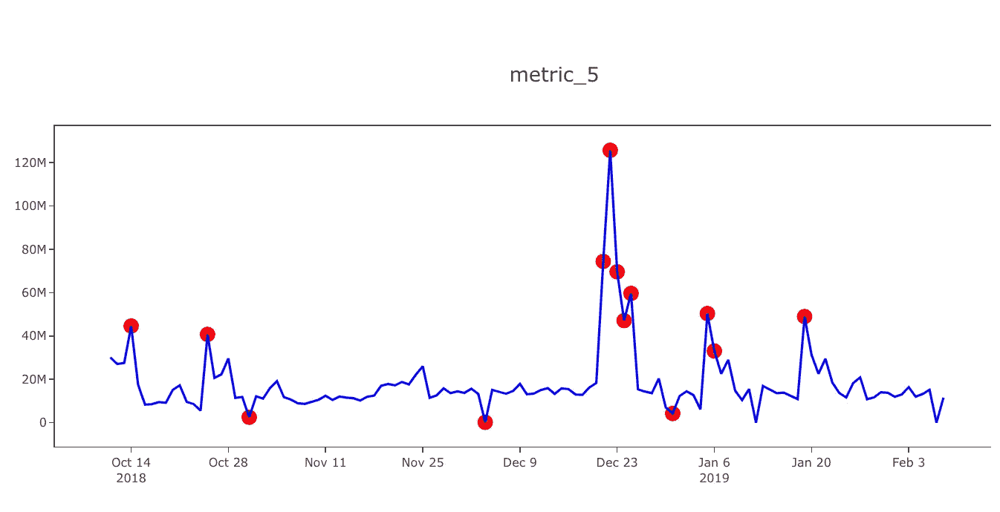
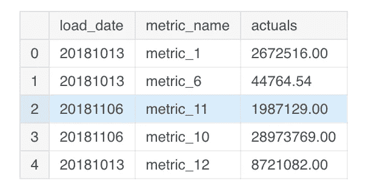
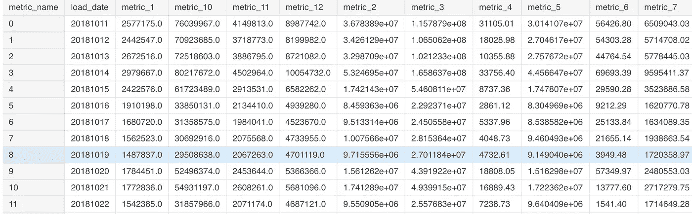
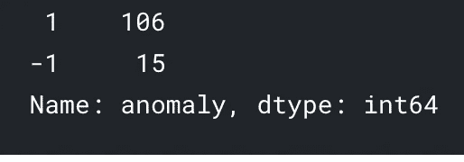
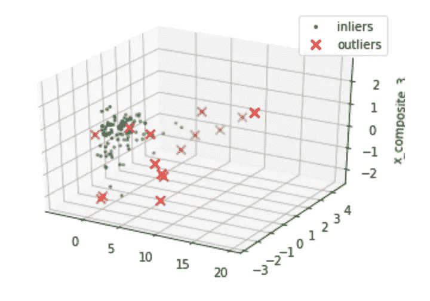
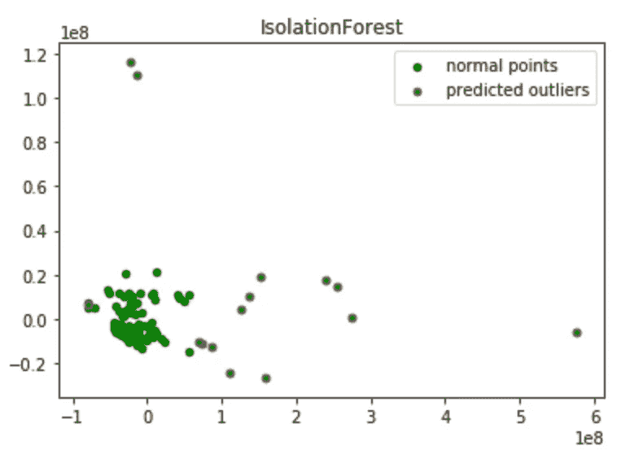
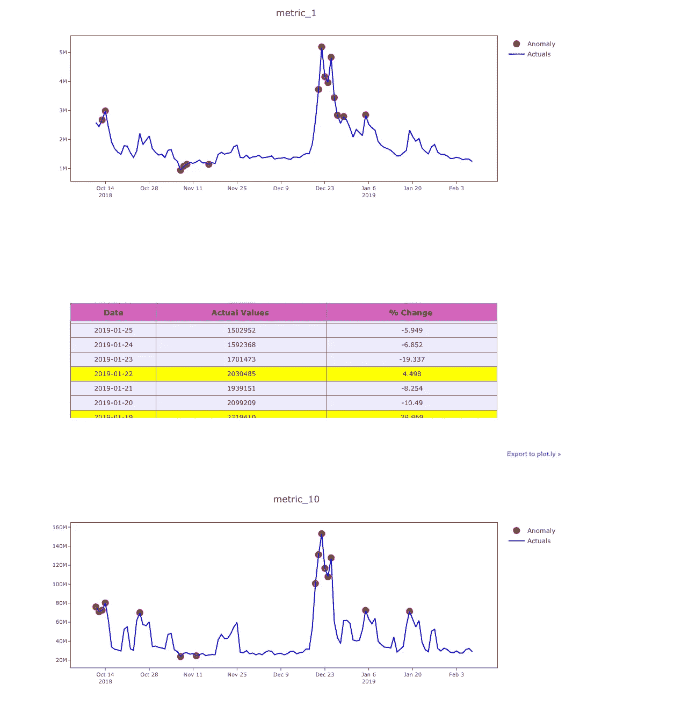
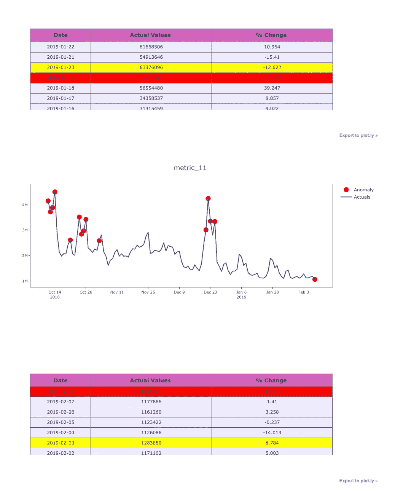

# 使用隔离林和可视化进行异常检测

> 原文：<https://towardsdatascience.com/anomaly-detection-with-isolation-forest-visualization-23cd75c281e2?source=collection_archive---------1----------------------->



指标的突然上升或下降是一种**异常**行为，这两种情况都需要注意。如果我们在建模之前有关于异常行为的信息，异常的检测可以通过监督学习算法来解决，但是最初没有反馈，很难识别这些点。因此，我们使用像**隔离森林**、一类 SVM 和 LSTM 这样的算法，将这建模为一个**无监督**问题。在这里，我们使用隔离林来识别异常。

这里的数据是一个**用例**(如收入、流量等)的一天水平，有 12 个指标。我们必须首先识别用例级别是否有异常。然后为了更好的可操作性，我们**深入**到单个指标并识别其中的异常。

```
import numpy as np # linear algebra
import pandas as pd # data processing, CSV file I/O (e.g. pd.read_csv)warnings.filterwarnings('ignore')
import os
print(os.listdir("../input"))df=pd.read_csv("../input/metric_data.csv")
df.head()
```



现在在数据帧上做一个**透视**来创建一个数据帧，其中所有指标都在**日期级别**。拉平多索引透视数据框架，并用 0 处理 na。

```
metrics_df=pd.pivot_table(df,values='actuals',index='load_date',columns='metric_name')
metrics_df.reset_index(inplace=True)
metrics_df.fillna(0,inplace=True)
metrics_df
```



隔离林试图**分离数据中的每个点**。在 2D 的情况下，它随机创建一条线，并试图挑出一个点。**此处，异常点可以分几步分离，而较近的正常点可能需要更多的步骤才能分离。**

我不会深入每个参数。**污染**在这里是一个重要的参数，我是在用 2D 图中的异常值验证其结果的反复试验的基础上得出它的值的。它代表数据中异常点的百分比**。**

我在这里使用 **sklearn 的隔离森林**，因为它是一个只有几个月数据的小数据集，而最近 **h2o 的**隔离森林也可用，它在大容量数据集上更具可扩展性，值得探索。

更多算法细节可以在这里找到:[https://cs . nju . edu . cn/zhouzh/zhouzh . files/publication/ICD m08 b . pdf](https://cs.nju.edu.cn/zhouzh/zhouzh.files/publication/icdm08b.pdf)

关于 H2O 隔离森林的更多详情:[https://github . com/h2oai/H2O-tutorials/tree/master/tutorials/Isolation-forest](https://github.com/h2oai/h2o-tutorials/tree/master/tutorials/isolation-forest)

```
metrics_df.columns
#specify the 12 metrics column names to be modelled
to_model_columns=metrics_df.columns[1:13]
from sklearn.ensemble import IsolationForest
clf=IsolationForest(n_estimators=100, max_samples='auto', contamination=float(.12), \
                        max_features=1.0, bootstrap=False, n_jobs=-1, random_state=42, verbose=0)
clf.fit(metrics_df[to_model_columns])pred = clf.predict(metrics_df[to_model_columns])
metrics_df['anomaly']=pred
outliers=metrics_df.loc[metrics_df['anomaly']==-1]
outlier_index=list(outliers.index)
#print(outlier_index)
#Find the number of anomalies and normal points here points classified -1 are anomalous
print(metrics_df['anomaly'].value_counts())
```



Number of outliers are 15 indicated by -1

现在，我们有 12 个指标，根据这些指标，我们根据隔离林对异常进行了分类。我们将尝试**可视化**结果，并检查分类是否有意义。

将指标标准化并拟合到 **PCA** 中，以减少维度数量，然后在 3D 中绘制它们，突出异常。

```
import matplotlib.pyplot as plt
from sklearn.decomposition import PCA
from sklearn.preprocessing import StandardScaler
from mpl_toolkits.mplot3d import Axes3D
pca = PCA(n_components=3)  # Reduce to k=3 dimensions
scaler = StandardScaler()
#normalize the metrics
X = scaler.fit_transform(metrics_df[to_model_columns])
X_reduce = pca.fit_transform(X)fig = plt.figure()
ax = fig.add_subplot(111, projection='3d')
ax.set_zlabel("x_composite_3")# Plot the compressed data points
ax.scatter(X_reduce[:, 0], X_reduce[:, 1], zs=X_reduce[:, 2], s=4, lw=1, label="inliers",c="green")# Plot x's for the ground truth outliers
ax.scatter(X_reduce[outlier_index,0],X_reduce[outlier_index,1], X_reduce[outlier_index,2],
           lw=2, s=60, marker="x", c="red", label="outliers")
ax.legend()
plt.show()
```



3D plot of outliers highlighted

现在，当我们看到 3D 点时，异常点大多远离正常点群，但是 2D 点将帮助我们更好地判断。让我们试着将相同的 fed 绘制成缩减到二维的 PCA。

```
from sklearn.decomposition import PCA
pca = PCA(2)
pca.fit(metrics_df[to_model_columns])res=pd.DataFrame(pca.transform(metrics_df[to_model_columns]))Z = np.array(res)plt.title("IsolationForest")
plt.contourf( Z, cmap=plt.cm.Blues_r)b1 = plt.scatter(res[0], res[1], c='green',
                 s=20,label="normal points")b1 =plt.scatter(res.iloc[outlier_index,0],res.iloc[outlier_index,1], c='green',s=20,  edgecolor="red",label="predicted outliers")
plt.legend(loc="upper right")
plt.show()
```



因此，2D 图给了我们一个清晰的图像，该算法正确地对用例中的异常点进行了分类。

异常以**红边**突出显示，正常点以**绿点**表示。

这里的**污染**参数起了很大的作用。
我们这里的想法是捕捉系统中所有的异常点。
因此**最好将少数可能正常的点识别为异常点(假阳性)，但不要错过捕捉异常点(真阴性)**。(因此，我指定 12%为污染，因使用情形而异)

现在，我们已经在用例层面上理解了**异常行为**。但是，要对**异常**采取行动，单独识别并提供关于**it 中哪些指标异常的信息非常重要。**

当业务用户直观地观察(突然的下降/峰值)并采取行动时，算法识别的异常应该是有意义的。因此，在这个过程中，创建一个良好的可视化同样重要。

此函数在时间序列上创建实际值图，并在其上突出显示异常点。也是一个提供实际数据、变化和基于异常的条件格式的表格。

```
from plotly.offline import download_plotlyjs, init_notebook_mode, plot, iplot
import plotly.plotly as py
import matplotlib.pyplot as plt
from matplotlib import pyplot
import plotly.graph_objs as go
init_notebook_mode(connected=True)
def plot_anomaly(df,metric_name):
    df.load_date = pd.to_datetime(df['load_date'].astype(str), format="%Y%m%d")
    dates = df.load_date
    #identify the anomaly points and create a array of its values for plot
    bool_array = (abs(df['anomaly']) > 0)
    actuals = df["actuals"][-len(bool_array):]
    anomaly_points = bool_array * actuals
    anomaly_points[anomaly_points == 0] = np.nan
    #A dictionary for conditional format table based on anomaly
    color_map = {0: "'rgba(228, 222, 249, 0.65)'", 1: "yellow", 2: "red"}

    #Table which includes Date,Actuals,Change occured from previous point
    table = go.Table(
        domain=dict(x=[0, 1],
                    y=[0, 0.3]),
        columnwidth=[1, 2],
        # columnorder=[0, 1, 2,],
        header=dict(height=20,
                    values=[['<b>Date</b>'], ['<b>Actual Values </b>'], ['<b>% Change </b>'],
                            ],
                    font=dict(color=['rgb(45, 45, 45)'] * 5, size=14),
                    fill=dict(color='#d562be')),
        cells=dict(values=[df.round(3)[k].tolist() for k in ['load_date', 'actuals', 'percentage_change']],
                   line=dict(color='#506784'),
                   align=['center'] * 5,
                   font=dict(color=['rgb(40, 40, 40)'] * 5, size=12),
                   # format = [None] + [",.4f"] + [',.4f'],
                   # suffix=[None] * 4,
                   suffix=[None] + [''] + [''] + ['%'] + [''],
                   height=27,
                   fill=dict(color=[test_df['anomaly_class'].map(color_map)],#map based on anomaly level from dictionary
                   )
                   ))
    #Plot the actuals points
    Actuals = go.Scatter(name='Actuals',
                         x=dates,
                         y=df['actuals'],
                         xaxis='x1', yaxis='y1',
                         mode='line',
                         marker=dict(size=12,
                                     line=dict(width=1),
                                     color="blue"))#Highlight the anomaly points
    anomalies_map = go.Scatter(name="Anomaly",
                               showlegend=True,
                               x=dates,
                               y=anomaly_points,
                               mode='markers',
                               xaxis='x1',
                               yaxis='y1',
                               marker=dict(color="red",
                                           size=11,
                                           line=dict(
                                               color="red",
                                               width=2)))axis = dict(
        showline=True,
        zeroline=False,
        showgrid=True,
        mirror=True,
        ticklen=4,
        gridcolor='#ffffff',
        tickfont=dict(size=10))layout = dict(
        width=1000,
        height=865,
        autosize=False,
        title=metric_name,
        margin=dict(t=75),
        showlegend=True,
        xaxis1=dict(axis, **dict(domain=[0, 1], anchor='y1', showticklabels=True)),
        yaxis1=dict(axis, **dict(domain=[2 * 0.21 + 0.20, 1], anchor='x1', hoverformat='.2f')))fig = go.Figure(data=[table, anomalies_map, Actuals], layout=layout)iplot(fig)
pyplot.show()
```

查找百分比变化的辅助功能，根据**严重性**对异常进行分类。

**预测功能**基于来自**决策功能**的结果将数据分类为异常。
比方说，如果企业需要发现可能会产生影响的下一级异常情况，这可以用来识别这些点。

前 12 个分位数被识别为异常(高严重性)，根据决策函数，我们在这里识别 12–24 个分位数点，并将其分类为低严重性异常。

```
def classify_anomalies(df,metric_name):
    df['metric_name']=metric_name
    df = df.sort_values(by='load_date', ascending=False)
    #Shift actuals by one timestamp to find the percentage chage between current and previous data point
    df['shift'] = df['actuals'].shift(-1)
    df['percentage_change'] = ((df['actuals'] - df['shift']) / df['actuals']) * 100
    #Categorise anomalies as 0-no anomaly, 1- low anomaly , 2 - high anomaly
    df['anomaly'].loc[df['anomaly'] == 1] = 0
    df['anomaly'].loc[df['anomaly'] == -1] = 2
    df['anomaly_class'] = df['anomaly']
    max_anomaly_score = df['score'].loc[df['anomaly_class'] == 2].max()
    medium_percentile = df['score'].quantile(0.24)
    df['anomaly_class'].loc[(df['score'] > max_anomaly_score) & (df['score'] <= medium_percentile)] = 1
    return df
```

识别单个指标的异常，并绘制结果图。

**X 轴—日期
Y 轴—实际值和异常点。**

指标的实际值显示在**蓝线**中，异常点突出显示为**红点**。

在表中，背景**红色**表示高异常，**黄色**表示低异常。

```
import warnings  
warnings.filterwarnings('ignore')
for i in range(1,len(metrics_df.columns)-1):
    clf.fit(metrics_df.iloc[:,i:i+1])
    pred = clf.predict(metrics_df.iloc[:,i:i+1])
    test_df=pd.DataFrame()
    test_df['load_date']=metrics_df['load_date']
    #Find decision function to find the score and classify anomalies
    test_df['score']=clf.decision_function(metrics_df.iloc[:,i:i+1])
    test_df['actuals']=metrics_df.iloc[:,i:i+1]
    test_df['anomaly']=pred
    #Get the indexes of outliers in order to compare the metrics     with use case anomalies if required
    outliers=test_df.loc[test_df['anomaly']==-1]
    outlier_index=list(outliers.index)
    test_df=classify_anomalies(test_df,metrics_df.columns[i])
    plot_anomaly(test_df,metrics_df.columns[i])
```



是的，从这些图中，我们能够捕捉到指标中的**突如其来的峰值、下降并投射出来。**

此外，**条件格式表**为我们提供了对数据等情况的洞察，不存在(值为零)的数据被捕获为高异常，这可能是数据处理中管道破裂的**潜在结果，需要修复并突出显示高和低级别异常。**

这个怎么用？

如果**当前时间戳异常**对于一个用例**向下钻**到指标，找出时间戳中异常高的指标集，对其执行 RCA。

此外，来自业务用户的**反馈**可以在数据中更新，这将有助于将此转化为监督/半监督学习问题，并比较它们的结果。

这里的增强将是**组合连续发生的异常行为。**例如，会导致几天指标峰值的大销售日可以显示为单个行为。