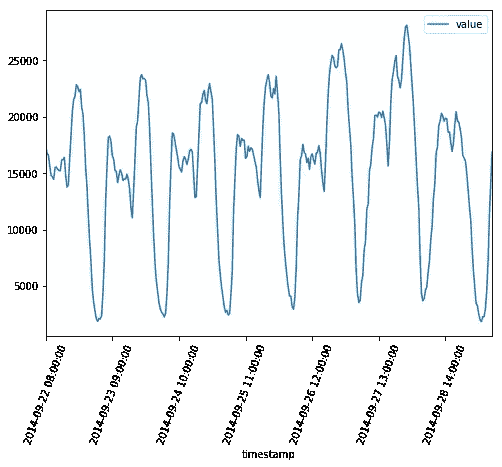
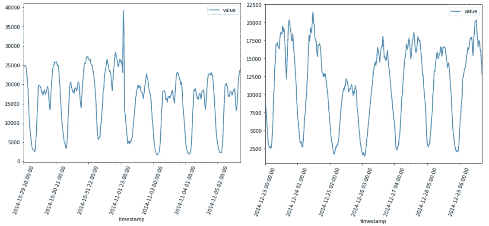
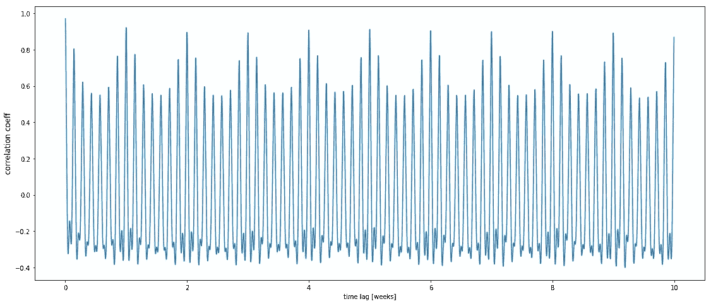
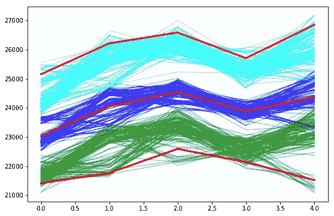
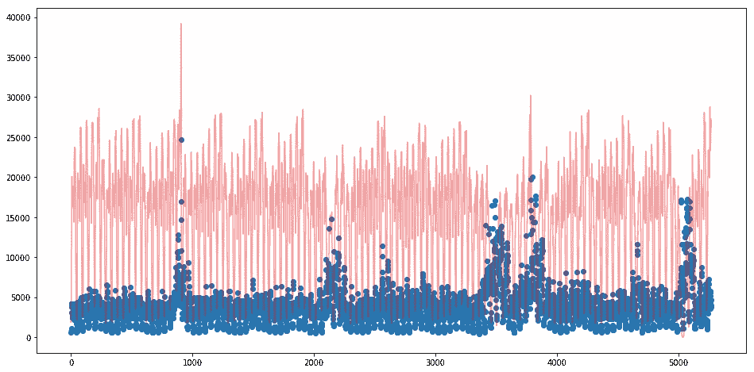
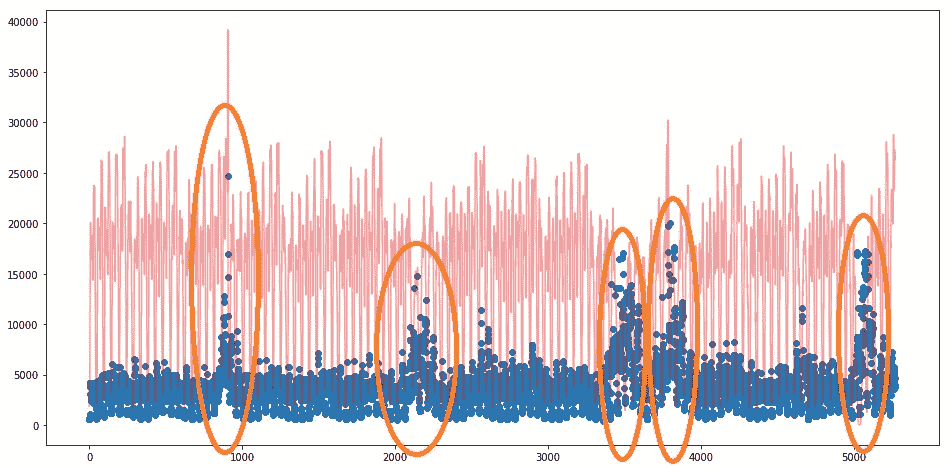

# 喀拉斯 LSTM 异常探测

> 原文：<https://towardsdatascience.com/anomaly-detection-with-lstm-in-keras-8d8d7e50ab1b?source=collection_archive---------2----------------------->

## 使用置信区间预测异常


Photo by [Scott Umstattd](https://unsplash.com/@scott_umstattd?utm_source=medium&utm_medium=referral) on [Unsplash](https://unsplash.com?utm_source=medium&utm_medium=referral)

我在任何地方的各种竞赛中都读到过“异常”的定义。在这个混沌中，唯一的真理就是这个定义的可变性，即**异常解释完全与兴趣域**相关。

对这种行为的检测在每个行业中都是有用的，检测这些观察的难度取决于应用领域。如果您正在处理一个涉及人类活动的异常检测问题(如销售或需求预测)，您可以利用人类行为的基本假设，规划一个更有效的解决方案。

这正是我们在这篇文章中所做的。我们试图预测纽约市在一个关键时期的出租车需求。我们制定了关于人类行为的简单而重要的假设，这将允许我们发现预测异常的简单解决方案。所有的脏活都是由喀拉斯开发的忠诚 LSTM 完成的，它可以同时预测和检测异常情况！

# 数据集

我从 [Numenta](https://numenta.org/) 社区获取了用于我们分析的数据集。特别是，我选择了纽约出租车数据集。该数据集显示了纽约市从 2014 年 7 月 1 日到 2015 年 1 月 31 日的出租车需求，每半小时观察一次。



Example of Weekly NORMAL observations

在此期间，就偏离正常行为而言，存在 5 种异常。它们分别发生在纽约马拉松、感恩节、圣诞节、新年和暴风雪期间。



Example of Weekly ABNORMAL observations: NYC marathon — Christmas

**我们的目的是提前探测到这些异常的观测结果！**

从数据来看，我们注意到的第一个考虑因素是存在一个明显的每日模式(白天的需求高于夜间)。出租车需求似乎也受到每周趋势的驱动:在一周中的某些日子，出租车需求高于其他日子。我们简单地证明这个计算自相关。

```
timeLags = np.arange(1,10*48*7)
autoCorr = [df.value.autocorr(lag=dt) for dt in timeLags]plt.figure(figsize=(19,8))
plt.plot(1.0/(48*7)*timeLags, autoCorr)
plt.xlabel('time lag [weeks]')
plt.ylabel('correlation coeff', fontsize=12)
```



AutoCorrelation 10 weeks depth

我们现在能做的是记下这些重要的行为，以便我们进一步分析。我每小时计算并存储一周中每一天的平均值。当我们将数据标准化以构建我们的模型时，这将是有用的，以便减少各种时间依赖性(*我计算将成为我们未来训练集*的前 5000 个观察值的平均值)。

# 模型

我们需要一种策略来提前检测异常值。为此，我们决定关注出租车需求预测。我们希望开发一种模型，能够在考虑不确定性的情况下预测需求。一种方法是发展分位数回归。我们关注极值的预测:下限(第 10 个分位数)，上限(第 90 个分位数)和经典的第 50 个分位数。计算第 90 个和第 10 个分位数，我们涵盖了现实中最有可能出现的值。这个范围的宽度可以很深；我们知道，当我们的模型对未来有把握时，它是小的，当我们的模型不能看到感兴趣领域的重要变化时，它可能是大的。我们利用了这种行为，并让我们的模型说明了出租车需求预测领域中的异常值检测。当我们的模型对未来有把握时，我们期望得到一个很小的区间(90-10 分位数范围),因为一切都在控制之中；另一方面，当间隔变大时，我们期望得到一个异常。这是可能的，因为我们的模型没有被训练来处理这种可能导致异常的场景。

我们在 Keras 建立了一个简单的 LSTM 神经网络，让这一切成为现实。我们的模型将接收过去的观察结果作为输入。我们用每日窗口大小(48 次观察:每半小时一次观察)来调整数据大小，以便为 LSTM 提供数据。当我们生成数据时，正如我上面提到的，我们操作对数转换和标准化减去平均每日小时值，以便将观察值视为其每日平均小时值的对数变化。我们以同样的方式构建目标变量，每半小时转换一次(我们希望预测接下来三十分钟的需求值)。

```
inputs = Input(shape=(X_train.shape[1], X_train.shape[2]))
lstm = Bidirectional(LSTM(64, return_sequences=True, dropout=0.5))(inputs, training = True)
lstm = Bidirectional(LSTM(16, return_sequences=False, dropout=0.5))(lstm, training = True)
dense = Dense(50)(lstm)
out10 = Dense(1)(dense)
out50 = Dense(1)(dense)
out90 = Dense(1)(dense)model = Model(inputs, [out10,out50,out90])
```

在 Keras 中操作分位数回归非常简单(我从[这篇文章](/deep-quantile-regression-c85481548b5a)中获得了灵感)。我们很容易定义自定义分位数损失函数，该函数基于分位数以及误差是正的(实际>预测的)还是负的(实际<预测的)来惩罚误差。我们的网络有 3 个输出和 3 个损失，分别对应于我们试图预测的每个分位数。

```
def q_loss(q,y,f):
    e = (y-f)
    return K.mean(K.maximum(q*e, (q-1)*e), axis=-1)losses = [lambda y,f: q_loss(0.1,y,f), lambda y,f: q_loss(0.5,y,f), lambda y,f: q_loss(0.9,y,f)]model.compile(loss=losses, optimizer='adam', loss_weights = [0.3,0.3,0.3])
```

# 交叉问题

在处理 Keras 中的神经网络时，一个繁琐的问题是由于内部权值初始化导致的结果的不确定性。用它的提法，我们的问题似乎特别遭受这种问题；即计算分位数预测我们不能允许分位数重叠，这没有意义！为了避免这个陷阱，我在预测阶段使用自举:我重新激活我的网络的丢失(模型中的*trainible:true*)，迭代预测 100 次，存储它们并最终计算期望的分位数(我在[这篇文章](/extreme-event-forecasting-with-lstm-autoencoders-297492485037)中也使用了这个聪明的技术)。

```
pred_10, pred_50, pred_90 = [], [], []
NN = K.function([model.layers[0].input, K.learning_phase()], 
                [model.layers[-3].output,
                 model.layers[-2].output,
                 model.layers[-1].output])for i in tqdm.tqdm(range(0,100)):
    predd = NN([X_test, 0.5])
    pred_10.append(predd[0])
    pred_50.append(predd[1])
    pred_90.append(predd[2])
```

这个过程在下面用图表解释，重点放在预测的子集上。给定分位数引导，我们计算它们的汇总测量(红线)，避免交叉。



q90 prediction bootstraps (cyan); q50 prediction bootstraps (blue); q10 prediction bootstraps (green)

# 结果

正如我前面提到的，我使用前 5000 个观察值进行训练，剩下的(大约 5000 个)用于测试。

我们的模型用第 50 个分位数达到了很好的预测出租车需求的性能。大约 0.055 的均方对数误差是一个辉煌的结果！这意味着 LSTM 网络能够理解驱动出租车需求的潜在规则。因此，我们的异常检测方法听起来很棒…我们计算了第 90 个分位数预测和第 10 个分位数预测之间的差异，看看发生了什么。



Real (red line); Quantile interval length (blue dots)

分位数区间范围(蓝点)在不确定时期较高。在其他情况下，正如我们所预期的那样，该模型往往能够很好地概括。更深入地说，我们开始调查这些高度不确定的时期。我们注意到这些与我们最初的假设相吻合。下面标绘的橙色圆圈分别是:纽约马拉松、感恩节、圣诞节、元旦和暴风雪。



Anomaly Detection

我们可以得出结论，我们达到了我们最初的目标:实现了强大的预测能力，并利用我们的模型的优势来识别不确定性。我们还利用这一点来说一些关于异常检测。

# 摘要

在这篇文章中，我复制了一个异常检测和预测的好方法。我们利用 LSTM 网络来了解纽约市的出租车需求行为。我们利用学到的知识进行预测，同时估计不确定性。我们隐含地将异常定义为不可预测的观察结果——即具有很大的不确定性。这个简单的假设允许我们的 LSTM 为我们做所有的工作。

[**查看我的 GITHUB 回购**](https://github.com/cerlymarco/MEDIUM_NoteBook)

保持联系: [Linkedin](https://www.linkedin.com/in/marco-cerliani-b0bba714b/)