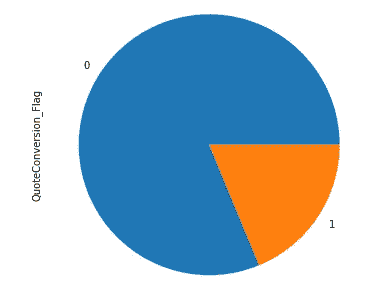
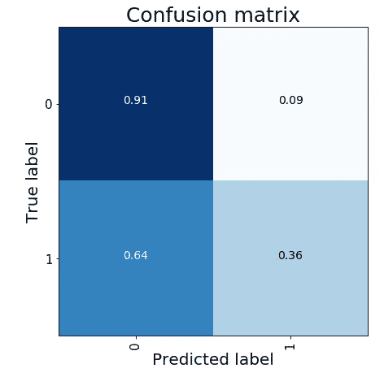
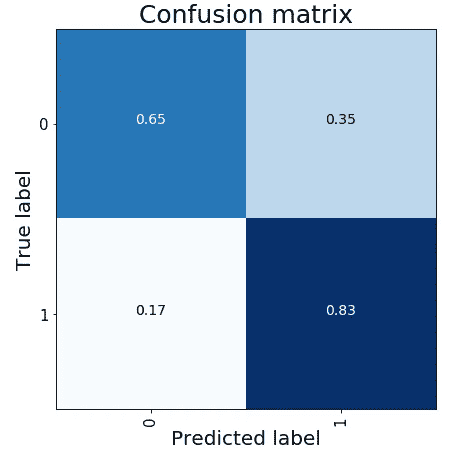

# 置换欠采样和时间相关的异常检测

> 原文：<https://towardsdatascience.com/anomaly-detection-with-permutation-undersampling-and-time-dependency-5919e7c695d0?source=collection_archive---------31----------------------->

## 预测失衡情况下的政策转变


Photo by [Francisco Ghisletti](https://unsplash.com/@tank_ghisletti?utm_source=medium&utm_medium=referral) on [Unsplash](https://unsplash.com?utm_source=medium&utm_medium=referral)

在异常检测中，最乏味的问题之一是处理不平衡。我们作为数据科学家的角色是，在第一阶段，检测导致异常行为的模式。第二，开发特别的 ML 模型，该模型覆盖类不平衡并试图返回最佳结果。

我们在这篇文章中所做的就是利用不平衡。通过构建一个聪明的管道和一些技巧，我们将能够提高我们的 ML 模型的性能。

详细地说，我们分析了一个转换率预测的问题，但我们的方法并不只是专门针对这项任务。不平衡分类的类似问题可以是欺诈检测、流失预测、剩余寿命估计、毒性检测等等。

# 数据集

我为我们对 Kaggle 的分析找到了一个很好的基准，直接来自过去的比赛( [Homesite 报价转换](https://www.kaggle.com/c/homesite-quote-conversion/overview))，目的是让一切变得更加真实和有趣。

> 该数据集代表了对购买保单感兴趣的大量客户的活动。每个条目对应于一个潜在客户，QuoteConversion_Flag 指示该客户是否购买了保单。
> 
> 所提供的特征(总共 296 个)是匿名的，并且提供了潜在客户和保单的丰富表示。它们包括特定的覆盖范围信息、销售信息、个人信息、财产信息和地理信息。我们的任务是预测 QuoteConversion_Flag。

我们必须管理 211，859 次未转化中的 48，894 次成功转化(占总数的 23.07%)。如你所见，这是一个巨大的不平衡问题！



Label distribution on full dataset

# 验证策略

在我看来，当我们面临像这样的分类问题时，我们必须做的第一件事是对时间依赖的存在进行推理。这里，时间模式的存在由“原始报价日期”列给出。记住时间特征是重要的，以便开发一个健壮的验证方案，它以最好的方式反映现实；也就是说，我们希望开发一个能够预测未来可能转换的模型。因此，开发强大而稳定的解决方案的最佳方式是根据“报价日期”在培训/测试中分割我们的数据。鉴于此，我将原始数据按时间排序，并将前 70%(从 2013 年 1 月 1 日到 2014 年 8 月 25 日)作为训练，将后 10%(从 2015 年 3 月 9 日到 2015 年 5 月 18 日)作为测试。我没有故意使用 20%的数据(从 2014 年 8 月 25 日到 2015 年 3 月 9 日),因为我想制造一个漏洞，我很好奇我们的模型对未来的预测有多好。

凭借强大的验证渠道，我们已经处于有利位置。我们现在要做的是比较两种不同的架构。一个是经典的，由一个简单的交叉验证的逻辑回归组成，另一个是更复杂的，由多个交叉验证的逻辑回归组成，其中我们操作负下采样。我们简单地从多数类中随机抽取一部分条目，以使其等于少数类(转换)。

# 模型

现在我们已经介绍了所有我们需要的，让我们使它工作。我不太关注特征工程和模型选择；我更喜欢说明一个在各个方面都可以定制的通用方法。

首先，我实现了基线模型的结构。它由一个交叉验证模式组成，在每一个折叠中，我用主成分分析将原始特征的维度减少到前 50 个组件，并拟合一个逻辑回归。我尝试了 StratifiedCrossValidation 标准，以了解它处理不平衡的能力以及对我们的数据进行良好概括的可能性。使用 5 个折叠进行训练时，我在折叠外拆分中获得了 0.837 的平均 AUC，在测试中获得了 0.773 的最终 AUC，这导致训练数据明显过度拟合！



同样的，少数类的召回值极低，不能令人满意。

我们的第二个架构也是基于交叉验证模式，其中我像降维前一样操作，并拟合逻辑回归。与前一种情况不同，它在以下方面有所不同:

*   我选择一个简单的 Kfold 交叉验证过程，没有洗牌；
*   在交叉验证循环之前，我减少了对少数类采样不足的初始训练数据集(所选条目的选择是随机的)；
*   当整个交叉验证过程结束时，我存储结果并全部重复……我没有发疯，我全部重复(给定次数),改变构成欠采样类样本的条目，即，我改变采样的种子；
*   最后，我平均所有的结果，获得置换种子，并计算性能(也堆叠西装)。

```
for s, seed in enumerate(seeds):

    train_pos = X_train.loc[y_train == 1, features].copy()
    train_pos['QuoteConversion_Flag'] = [1]*neg_istances
    train_pos['Quote_Date'] = Time_train[y_train == 1]
    train_neg = X_train.loc[y_train == 0, features].copy()
    train_neg['QuoteConversion_Flag'] = [0]*pos_istances
    train_neg['Quote_Date'] = Time_train[y_train == 0]
    train_neg = train_neg.sample(neg_istances, random_state=seed)

    train = pd.concat([train_pos, 
                       train_neg]).sort_values('Quote_Date')
    y = train.QuoteConversion_Flag.values
    train = train.drop(['Quote_Date',
                        'QuoteConversion_Flag'], 
                       axis=1).reset_index(drop=True)

    for fold,(in_index,oof_index) in enumerate(skf.split(train, y)):

        print(fold+1, 'FOLD --- SEED', seed)

        scaler = StandardScaler()
        pca = PCA(n_components=50, random_state=seed)

        y_in, y_oof = y[in_index], y[oof_index]
        X_in = train.iloc[in_index, :]
        X_in = scaler.fit_transform(X_in)
        X_in = pca.fit_transform(X_in)
        X_oof = train.iloc[oof_index, :]
        X_oof = scaler.transform(X_oof)
        X_oof = pca.transform(X_oof)

        model = LogisticRegression(C=0.1, solver="lbfgs", 
                                   max_iter=1000)
        model.fit(X_in, y_in)

        yoof[oof_index,s] = model.predict_proba(X_oof)[:,1]
        pred[:,s] += model.predict_proba(
                        pca.transform(
                            scaler.transform(X_test[features])
                        ))[:,1]

        print('AUC', roc_auc_score(y_oof, yoof[oof_index,s]))
        AUC[s] += roc_auc_score(y_oof, yoof[oof_index,s])  

        del model; del pca; del scaler

pred = pred/n_splits
AUC = AUC/n_splits
```

非折叠分割的 AUC 为 0.852(高于之前)，但测试的相对 AUC 为 0.818。此外，混淆矩阵也有所改善。



这意味着我们能够在提高性能的同时减少过度拟合。这些结果之所以可能，有两个主要原因:

*   我们利用了置换缩减采样，因为每次我改变种子时，我们都会在数据中引入一点多样性；
*   **我们选择了更现实的交叉验证模式，因为我们的数据遵循一种时间模式，使得现在(训练)不同于未来(测试)。**没有洗牌的 K-fold 能够在训练中重现这种依赖性，降低过度拟合。

# 摘要

在这篇文章中，我创建了一个有效的管道来处理训练和测试之间的数据不平衡和差异的情况。正如你所看到的，这是现实生活中的一个常见场景，但也经常在许多 Kaggle 比赛中出现。我们可以做的第一件事是定义一个好的验证模式，并尝试从采样技术中提取价值。这将允许我们获得更好的性能并减少计算时间。

[**查看我的 GITHUB 回购**](https://github.com/cerlymarco/MEDIUM_NoteBook)

保持联系: [Linkedin](https://www.linkedin.com/in/marco-cerliani-b0bba714b/)