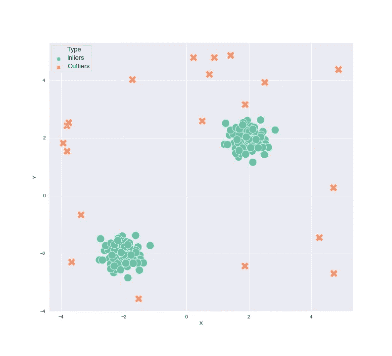
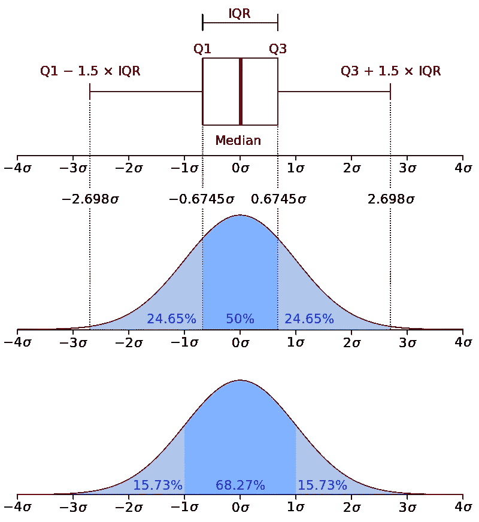
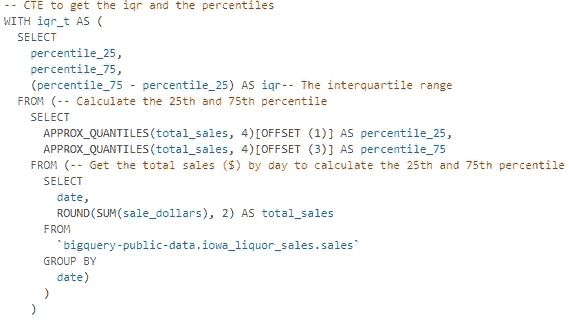
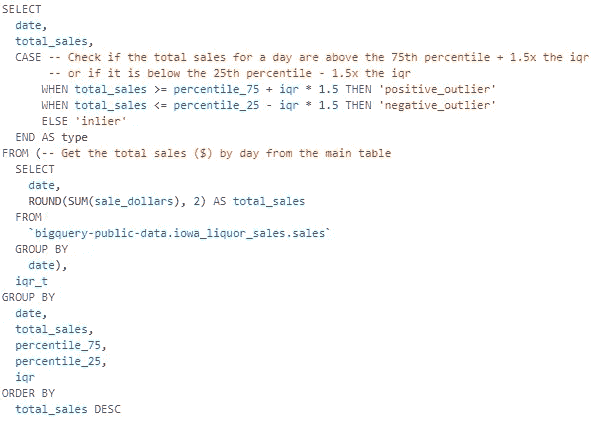
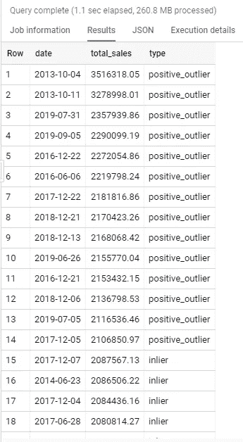
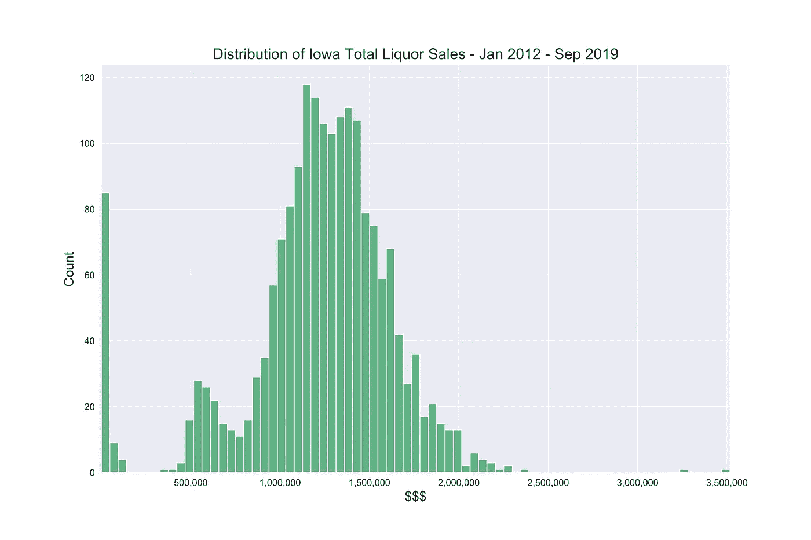
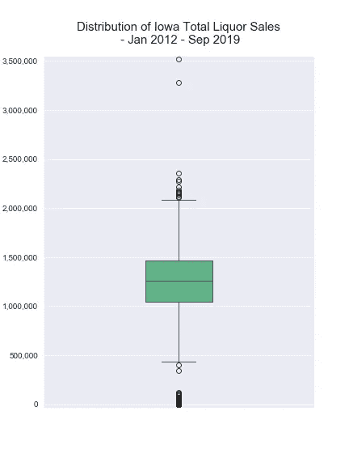

# 使用 SQL 进行异常检测

> 原文：<https://towardsdatascience.com/anomaly-detection-with-sql-7700c7516d1d?source=collection_archive---------6----------------------->

有很多方法可以检测数据中的异常，就像生活中的大多数事情一样，没有一个明确的“正确的方法”来做到这一点。您采用的方法将由您的数据决定，但也取决于项目的要求。

这是否需要像信用欺诈检测一样尽可能准确，您是否只需要监控一些潜在问题的指标，这是否需要快速启动并运行，或者您是否有 6 个月的时间将其投入生产，您有什么样的可用资源等。

Anomalies Detected!!

异常检测有两种基本方法。你可以走基于规则的路线，也可以走机器学习的路线。机器学习模型，如隔离森林、局部离群因子、自动编码器等。都可以用来成功检测异常。如果你走这条路，你应该看看 sklearn 的[包](https://scikit-learn.org/stable/modules/outlier_detection.html)以及《 *手无监督学习* 这本书，它们都是很好的起点。

然而，基于规则的方法工作得很好，更容易实现，更容易投入生产，启动和运行更快。根据您的需求，它们可能是最佳解决方案。

听着我明白了，每个人都想立即去机器/深度学习解决问题，因为让我们面对它，它很有趣，也很有挑战性。然而，走机器学习路线并不总是最好的选择，尤其是在商业环境中。

一种基于规则的方法效果很好并且易于在 SQL 中实现，那就是使用[四分位数范围](https://en.wikipedia.org/wiki/Interquartile_range)。IQR 被定义为数据集的 75%和 25%之间的差值。

如果一个数据点高于第 75 百分位 1.5 倍 IQR 或更多，或者低于第 25 百分位 1.5 倍 IQR 或更少，它们可以被认为是异常值。

*   *正异常值=第 75 百分位+ 1.5 *(第 75 百分位-第 25 百分位)*
*   *负异常值=第 25 百分位- 1.5 *(第 75 百分位-第 25 百分位)*

为什么是 1.5 倍而不是 2 倍或 3 倍？1.5x 相当于平均值以上的 3 个标准差(见下图)。你当然可以*把它改成 1.75 倍或者 2.25 倍等等。这取决于您希望异常值检测有多“敏感”,这是使用 IQR 的另一个优点。*

由于 IQR 使用中值而不是平均值，因此它被视为尺度的[稳健度量，与使用平均值的度量(如标准差)相比，受少数异常值影响的可能性更小。这将更容易识别实际的异常值。](https://en.wikipedia.org/wiki/Robust_measures_of_scale)

如果你曾经看过箱线图，那就是 IQR 离群点检测方法的可视化。“盒子”是 IQR，“胡须”位于第 25 和第 75 百分位，任何高于这些值的数据点(称为“飞行者”)都是异常值，如下图所示:

Source: [Wikipedia](https://en.wikipedia.org/wiki/Interquartile_range)

在我们开始这个例子之前，还有一些关于异常检测的注意事项。异常检测可以是单变量或多变量的。单变量更简单，更容易解释，因为您可以很容易地知道哪个指标触发了异常。如果您有多个指标，那么您可以设置单独的查询来检测每个指标的异常，这使得最终产品更容易理解。如果你走多元路线，机器学习可能更适合。异常检测也可以是有监督的或无监督的，但大多数时候是无监督的，就像我们在这里做的一样。

# 例子

我将使用 BigQuery 中的一个公共数据集，因此您可以自己重新创建它。“爱荷华州酒类销售”数据集(` big query-public-data . Iowa _ liquid _ Sales . Sales `)包含了爱荷华州自 2012 年以来的每日酒类销售情况。

酒类销售有很多不同的方式，包括城市、县、经纬度、类别、售出的瓶数、售出的数量等。在本例中，我将只查看一天的总销售额，但是您可以在表中的任何分项中发现异常。

带评论的完整问题可以在我的 [GitHub 页面](https://github.com/robsalgado/personal_data_science_projects/tree/master/anomaly_detection_sql)上找到，这里是一个[要点](https://gist.github.com/robsalgado/8341dc7c2fe64aef2f882f4646380e59)。让我们来分解一下这个查询是做什么的。

我做的第一件事是创建一个 CTE(通用表表达式),用第 25 个百分位数、第 75 个百分位数和 IQR 制作一个表，用于查询的主要部分。

为了得到四分位数，我使用 BigQuery 的[近似分位数](https://cloud.google.com/bigquery/docs/reference/standard-sql/approximate_aggregate_functions#approx_quantiles)函数。我们说我们需要 4 个分位数来创建一个数组，所以我们只需要用 offset 函数从数组中选择我们想要的分位数。

返回的数组如下所示[最小值，25，50，75，最大值]。如您所见，它还返回最小值和最大值。索引从零开始，所以应该是[0，1，2，3，4]。因此，对于第 25 个百分位数，我们使用偏移函数选择位置 1 的元素，依此类推。

接下来，我们进入查询的主要部分:

从内部查询开始，我们将再次获取每天的总酒类销售额，然后与我们在上面创建的 IQR CTE 进行交叉连接(不过要注意大型数据集上的交叉连接)。然后，我们将创建一个 case 语句，说明当天的酒类销售额是正/负异常值还是非异常值(内标)。为了便于显示，我们还获取了当天的总销售额和日期，并按日总销售额降序排列。这给了我们:

我们现在有一个名为“type”的列，它将告诉我们当天的酒类销售额是内值、正值异常值还是负值异常值。

让我们看看数据的分布情况，以确认查询是否有效。这是一个柱状图，左边显示的是几乎没有销售的日子，右边显示的是销售非常高的日子。这两个问题都应该进一步调查。

这是一个显示异常值的箱线图。您可以看到，箱线图反映了查询，正异常值被确定为大约 2.1MM，就像我们在上面的输出中看到的那样。

现在，您可以安排这个查询每天运行(或者根据需要频繁运行)并输出到一个表中。然后你有一个表，自动更新，识别离群值，你可以连接到你的可视化工具的选择。

您还可以更进一步，在云函数/lambda 中运行它，并在检测到异常时通过 api 自动发送松弛警报/电子邮件，并提供一些关于异常的基本信息。我用这种方法自动对工作中的异常情况发出松弛警报，效果非常好。以后我会写一篇关于这个的帖子。

任何会使用 SQL 的人(分析师、数据科学家、工程师等)都很容易在短时间内建立并运行这样的东西。)而且也很有效。现在你可以回到你的机器/深度学习😃