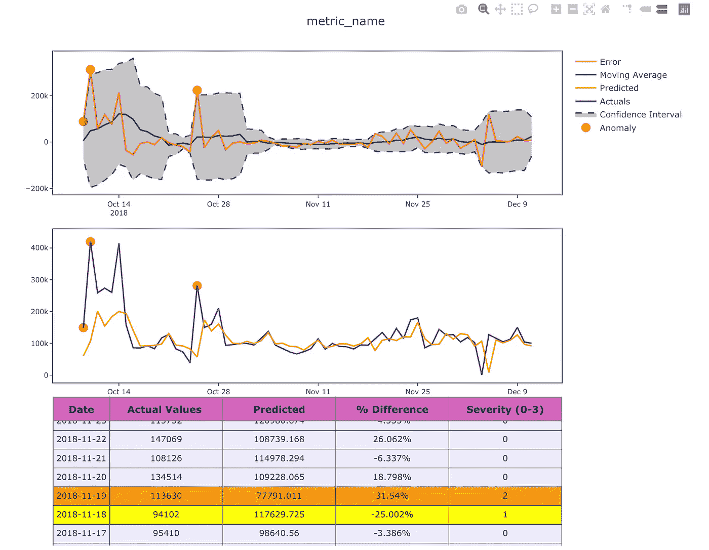
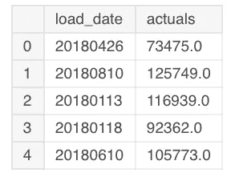
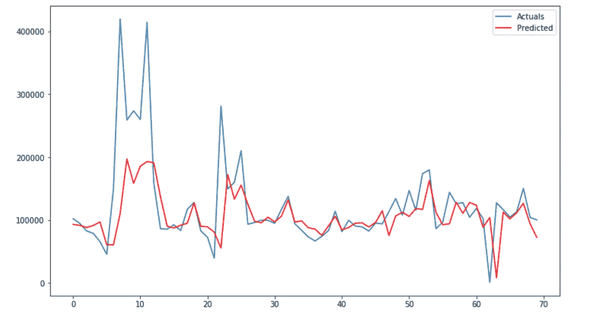
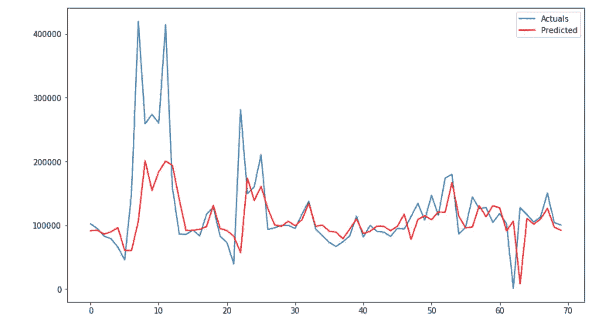
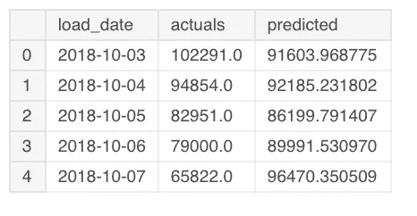
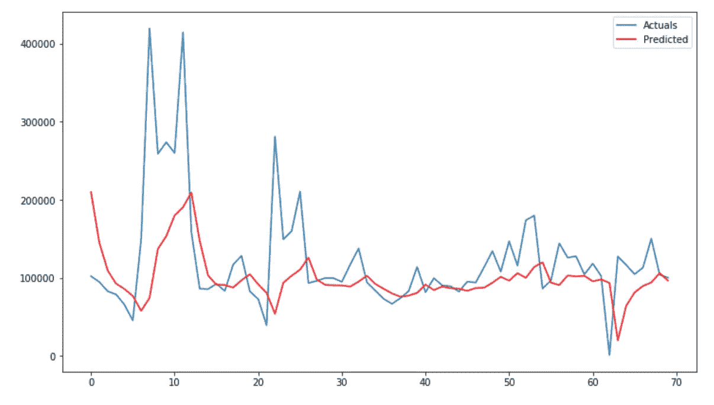
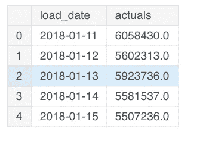
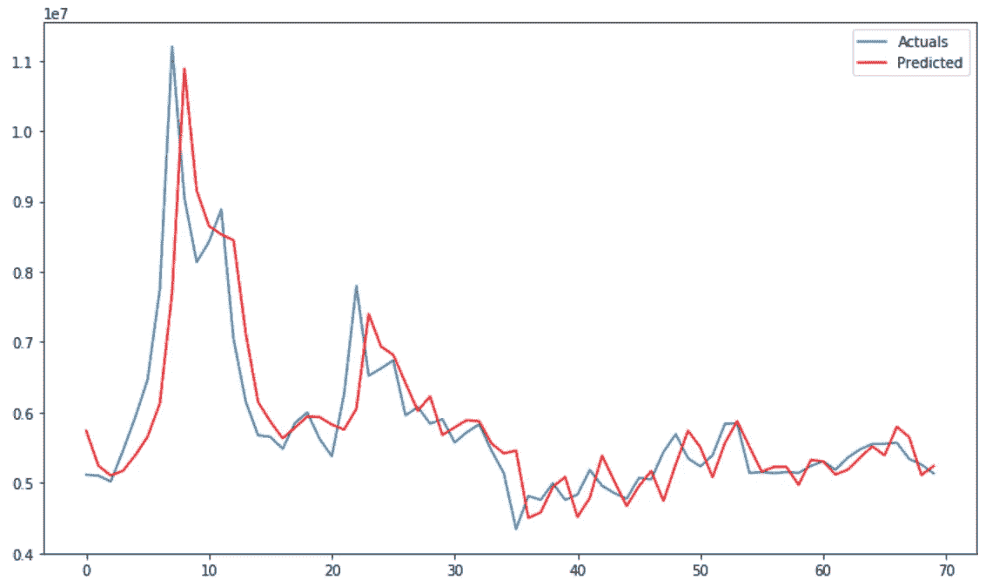

# 基于时间序列预测的异常检测

> 原文：<https://towardsdatascience.com/anomaly-detection-with-time-series-forecasting-c34c6d04b24a?source=collection_archive---------0----------------------->



嗨，这是一篇关于**异常检测**的后续文章(链接到上一篇文章:[https://medium . com/my ntra-engineering/anomaly-detection-with-isolation-forest-visualization-23 CD 75 c 281 e 2](https://medium.com/myntra-engineering/anomaly-detection-with-isolation-forest-visualization-23cd75c281e2)其中我们使用无监督学习进行了异常检测)。

这里我们将看到用**时间序列预测**检测异常。时间序列是与时间相关的任何数据(每天、每小时、每月等)。例如:商店每天的收入是一个**天级别**的时间序列数据。许多用例，如**需求估计、销售预测**是一个典型的时间序列预测问题，可以通过像**萨里玛、LSTM、霍尔特温特斯**等算法来解决。时间序列预测通过用当前数据估计未来需求，帮助我们为未来需求做准备。一旦我们有了预测，我们就可以使用这些数据，通过与实际数据进行比较来发现异常情况。我们来实现一下，看看它的利弊。

安装和导入可视化库

```
#Installing specific version of plotly to avoid Invalid property for color error in recent version which needs change in layout
!pip install plotly==2.7.0
import pandas as pd
import numpy as np
from plotly.offline import download_plotlyjs, init_notebook_mode, plot, iplot
import plotly.plotly as py
import matplotlib.pyplot as plt
from matplotlib import pyplot
import plotly.graph_objs as go
init_notebook_mode(connected=True)
time_series_df=pd.read_csv('../input/time-series-data/time_series_data.csv')
time_series_df.head()
```



这里的数据顺序很重要，应该是**按时间顺序* *因为我们要预测下一个点。

将 load_date 列转换为 datetime 格式，并根据日期对数据进行排序。

```
time_series_df.load_date = pd.to_datetime(time_series_df.load_date, format='%Y%m%d')
time_series_df = time_series_df.sort_values(by="load_date")
time_series_df = time_series_df.reset_index(drop=True)
time_series_df.head()
```


提取数值并应用**对数变换**以稳定数据中的**方差**或在将数据输入模型之前使其**稳定**。

```
actual_vals = time_series_df.actuals.values
actual_log = np.log10(actual_vals)
```

用测试数据中的 70 分来划分数据进行训练和测试。

首先让我们尝试应用 SARIMA 算法进行预测。SARIMA 代表**季节性自回归综合移动平均线**。它有一个季节性参数，由于我们销售数据的每周季节性，我们将其初始化为 7。其他参数是 p、d、q，它们是基于 ACF 和 PACF 图确定的，或者理想情况下，我们应该使用预测误差最小的参数。

更多细节可以在这里找到:[https://people.duke.edu/~rnau/arimrule.htm](https://people.duke.edu/~rnau/arimrule.htm)

我不会在这里讨论获得正确参数集的问题，我们稍后将使用 **Auto Arima** 来解决这个问题，它允许我们在误差最小的范围内获得最佳参数集。

这里我指定差分因子(d)为 1。它帮助我们去除数据中的趋势和周期。

```
import math
import statsmodels.api as sm
import statsmodels.tsa.api as smt
from sklearn.metrics import mean_squared_error
from matplotlib import pyplot
import matplotlib.pyplot as plt
import plotly.plotly as py
import plotly.tools as tlstrain, test = actual_vals[0:-70], actual_vals[-70:]train_log, test_log = np.log10(train), np.log10(test)my_order = (1, 1, 1)
my_seasonal_order = (0, 1, 1, 7)
```

每次我们预测下一个数据点的**，我们循环遍历训练数据以预测下一个数据，并在预测后添加下一个数据点用于进一步预测。**

这就像一个移动窗口日水平数据(例如:前 90 点用于预测任何给定时间的下一点)。

通过**的 10 次方变换**将预测数据转换回比例，并绘制结果。

```
history = [x for x in train_log]
predictions = list()
predict_log=list()
for t in range(len(test_log)):
    model = sm.tsa.SARIMAX(history, order=my_order, seasonal_order=my_seasonal_order,enforce_stationarity=False,enforce_invertibility=False)
    model_fit = model.fit(disp=0)
    output = model_fit.forecast()
    predict_log.append(output[0])
    yhat = 10**output[0]
    predictions.append(yhat)
    obs = test_log[t]
    history.append(obs)
   # print('predicted=%f, expected=%f' % (output[0], obs))
#error = math.sqrt(mean_squared_error(test_log, predict_log))
#print('Test rmse: %.3f' % error)
# plot
figsize=(12, 7)
plt.figure(figsize=figsize)
pyplot.plot(test,label='Actuals')
pyplot.plot(predictions, color='red',label='Predicted')
pyplot.legend(loc='upper right')
pyplot.show()
```



Actuals vs Predict forecast plot

这是一个很好的时间序列预测。**趋势、季节性**是时间序列数据中的两个重要因素，如果您的算法能够捕捉到您数据的趋势(上升/下降)，并且如果您的数据是季节性的(每周、每天、每年的模式)，那么您的算法就适合您的情况。

在这里，我们可以观察到，我们的 SARIMA 算法从峰值中捕捉到了趋势(不是通过复制它，而是通过捕捉峰值)，并在正常情况下很好地预测了实际值。

我们在这里指定的参数似乎很适合这个指标，但是要进行绘图、验证和调整参数将是一项非常艰巨的任务。一个解决方案是 **Auto Arima** ，它在我们指定的范围内返回算法的最佳参数集。

为 auto arima 安装金字塔-arima。

```
!pip install pyramid-arima
from pyramid.arima import auto_arima
stepwise_model = auto_arima(train_log, start_p=1, start_q=1,
                           max_p=3, max_q=3, m=7,
                           start_P=0, seasonal=True,
                           d=1, D=1, trace=True,
                           error_action='ignore',  
                           suppress_warnings=True, 
                           stepwise=True)
```

让我们使用 auto_arima 查找 p 和 q 参数，并将 d 指定为 1 表示一阶差分，将季节性指定为 7 表示每周季节性。

现在，auto arima 模型可以通过我们在上面执行的相同过程用于逐步预测:

```
import math
import statsmodels.api as sm
import statsmodels.tsa.api as smt
from sklearn.metrics import mean_squared_error
train, test = actual_vals[0:-70], actual_vals[-70:]train_log, test_log = np.log10(train), np.log10(test)# split data into train and test-setshistory = [x for x in train_log]
predictions = list()
predict_log=list()
for t in range(len(test_log)):
    #model = sm.tsa.SARIMAX(history, order=my_order, seasonal_order=my_seasonal_order,enforce_stationarity=False,enforce_invertibility=False)
    stepwise_model.fit(history)
    output = stepwise_model.predict(n_periods=1)
    predict_log.append(output[0])
    yhat = 10**output[0]
    predictions.append(yhat)
    obs = test_log[t]
    history.append(obs)
    #print('predicted=%f, expected=%f' % (output[0], obs))
#error = math.sqrt(mean_squared_error(test_log, predict_log))
#print('Test rmse: %.3f' % error)
# plot
figsize=(12, 7)
plt.figure(figsize=figsize)
pyplot.plot(test,label='Actuals')
pyplot.plot(predictions, color='red',label='Predicted')
pyplot.legend(loc='upper right')
pyplot.show()
```



在这种情况下，auto arima 和我们的初始 SARIMA 在预测方面做得很好，也没有过多地追逐实际值。

接下来，让我们用可用的实际数据和预测结果创建一个数据框架

```
predicted_df=pd.DataFrame()
predicted_df['load_date']=time_series_df['load_date'][-70:]
predicted_df['actuals']=test
predicted_df['predicted']=predictions
predicted_df.reset_index(inplace=True)
del predicted_df['index']
predicted_df.head()
```



我们有预测和实际的结果，使用这些信息来检测异常，我使用了数据分布的属性。请注意，这仅在数据分布为**正态/高斯**时才有效。

我检测异常的步骤:
1。计算**误差**项(实际-预测)。
2。计算**滚动平均值和滚动标准差**(窗口为一周)。
3。将误差为 1.5、1.75 和 2 个标准偏差的数据分类为低、中、高**异常**。(基于此属性，5%的数据点将被识别为异常)

我使用 lambda 函数对基于误差和标准偏差的异常进行分类，而不是使用单独的循环和函数。

```
import numpy as np
def detect_classify_anomalies(df,window):
    df.replace([np.inf, -np.inf], np.NaN, inplace=True)
    df.fillna(0,inplace=True)
    df['error']=df['actuals']-df['predicted']
    df['percentage_change'] = ((df['actuals'] - df['predicted']) / df['actuals']) * 100
    df['meanval'] = df['error'].rolling(window=window).mean()
    df['deviation'] = df['error'].rolling(window=window).std()
    df['-3s'] = df['meanval'] - (2 * df['deviation'])
    df['3s'] = df['meanval'] + (2 * df['deviation'])
    df['-2s'] = df['meanval'] - (1.75 * df['deviation'])
    df['2s'] = df['meanval'] + (1.75 * df['deviation'])
    df['-1s'] = df['meanval'] - (1.5 * df['deviation'])
    df['1s'] = df['meanval'] + (1.5 * df['deviation'])
    cut_list = df[['error', '-3s', '-2s', '-1s', 'meanval', '1s', '2s', '3s']]
    cut_values = cut_list.values
    cut_sort = np.sort(cut_values)
    df['impact'] = [(lambda x: np.where(cut_sort == df['error'][x])[1][0])(x) for x in
                               range(len(df['error']))]
    severity = {0: 3, 1: 2, 2: 1, 3: 0, 4: 0, 5: 1, 6: 2, 7: 3}
    region = {0: "NEGATIVE", 1: "NEGATIVE", 2: "NEGATIVE", 3: "NEGATIVE", 4: "POSITIVE", 5: "POSITIVE", 6: "POSITIVE",
              7: "POSITIVE"}
    df['color'] =  df['impact'].map(severity)
    df['region'] = df['impact'].map(region)
    df['anomaly_points'] = np.where(df['color'] == 3, df['error'], np.nan)
    df = df.sort_values(by='load_date', ascending=False)
    df.load_date = pd.to_datetime(df['load_date'].astype(str), format="%Y-%m-%d")return df
```

下面是一个可视化结果的函数。**清晰全面的可视化同样重要，有助于业务用户对异常情况提供反馈，并使结果具有可操作性。**

第一个图中的误差项指定了上限和下限。

突出显示异常的实际值图将易于用户解释/验证。因此，第二个图突出显示了实际值和预测值以及异常情况。

**蓝线-实际值**

**橙色线条-预测的**

**红色-错误**

**绿色——移动平均线**

**虚线——正常行为的上限和下限**

```
def plot_anomaly(df,metric_name):
    #error = pd.DataFrame(Order_results.error.values)
    #df = df.sort_values(by='load_date', ascending=False)
    #df.load_date = pd.to_datetime(df['load_date'].astype(str), format="%Y%m%d")
    dates = df.load_date
    #meanval = error.rolling(window=window).mean()
    #deviation = error.rolling(window=window).std()
    #res = error#upper_bond=meanval + (2 * deviation)
    #lower_bond=meanval - (2 * deviation)#anomalies = pd.DataFrame(index=res.index, columns=res.columns)
    #anomalies[res < lower_bond] = res[res < lower_bond]
    #anomalies[res > upper_bond] = res[res > upper_bond]
    bool_array = (abs(df['anomaly_points']) > 0)#And a subplot of the Actual Values.
    actuals = df["actuals"][-len(bool_array):]
    anomaly_points = bool_array * actuals
    anomaly_points[anomaly_points == 0] = np.nan#Order_results['meanval']=meanval
    #Order_results['deviation']=deviationcolor_map= {0: "'rgba(228, 222, 249, 0.65)'", 1: "yellow", 2: "orange", 3: "red"}
    table = go.Table(
    domain=dict(x=[0, 1],
                y=[0, 0.3]),
    columnwidth=[1, 2 ],
    #columnorder=[0, 1, 2,],
    header = dict(height = 20,
                  values = [['<b>Date</b>'],['<b>Actual Values </b>'],
                            ['<b>Predicted</b>'], ['<b>% Difference</b>'],['<b>Severity (0-3)</b>']],
                 font = dict(color=['rgb(45, 45, 45)'] * 5, size=14),
                  fill = dict(color='#d562be')),
    cells = dict(values = [df.round(3)[k].tolist() for k in ['load_date', 'actuals', 'predicted',
                                                               'percentage_change','color']],
                 line = dict(color='#506784'),
                 align = ['center'] * 5,
                 font = dict(color=['rgb(40, 40, 40)'] * 5, size=12),
                 #format = [None] + [",.4f"] + [',.4f'],#suffix=[None] * 4,
                 suffix=[None] + [''] + [''] + ['%'] + [''],
                 height = 27,
                 #fill = dict(color=['rgb(235, 193, 238)', 'rgba(228, 222, 249, 0.65)']))
                 fill=dict(color=  # ['rgb(245,245,245)',#unique color for the first column
                      [df['color'].map(color_map)],
                      )
    ))#df['ano'] = np.where(df['color']==3, df['error'], np.nan)anomalies = go.Scatter(name="Anomaly",
                       x=dates,
                       xaxis='x1',
                       yaxis='y1',
                       y=df['anomaly_points'],
                       mode='markers',
                       marker = dict(color ='red',
                      size = 11,line = dict(
                                         color = "red",
                                         width = 2)))upper_bound = go.Scatter(hoverinfo="skip",
                         x=dates,
                         showlegend =False,
                         xaxis='x1',
                         yaxis='y1',
                         y=df['3s'],
                         marker=dict(color="#444"),
                         line=dict(
                             color=('rgb(23, 96, 167)'),
                             width=2,
                             dash='dash'),
                         fillcolor='rgba(68, 68, 68, 0.3)',
                         fill='tonexty')lower_bound = go.Scatter(name='Confidence Interval',
                          x=dates,
                         xaxis='x1',
                         yaxis='y1',
                          y=df['-3s'],
                          marker=dict(color="#444"),
                          line=dict(
                              color=('rgb(23, 96, 167)'),
                              width=2,
                              dash='dash'),
                          fillcolor='rgba(68, 68, 68, 0.3)',
                          fill='tonexty')Actuals = go.Scatter(name= 'Actuals',
                     x= dates,
                     y= df['actuals'],
                    xaxis='x2', yaxis='y2',
                     mode='line',
                     marker=dict(size=12,
                                 line=dict(width=1),
                                 color="blue"))Predicted = go.Scatter(name= 'Predicted',
                     x= dates,
                     y= df['predicted'],
                    xaxis='x2', yaxis='y2',
                     mode='line',
                     marker=dict(size=12,
                                 line=dict(width=1),
                                 color="orange"))# create plot for error...
    Error = go.Scatter(name="Error",
                   x=dates, y=df['error'],
                   xaxis='x1',
                   yaxis='y1',
                   mode='line',
                   marker=dict(size=12,
                               line=dict(width=1),
                               color="red"),
                   text="Error")anomalies_map = go.Scatter(name = "anomaly actual",
                                   showlegend=False,
                                   x=dates,
                                   y=anomaly_points,
                                   mode='markers',
                                   xaxis='x2',
                                   yaxis='y2',
                                    marker = dict(color ="red",
                                  size = 11,
                                 line = dict(
                                     color = "red",
                                     width = 2)))Mvingavrg = go.Scatter(name="Moving Average",
                           x=dates,
                           y=df['meanval'],
                           mode='line',
                           xaxis='x1',
                           yaxis='y1',
                           marker=dict(size=12,
                                       line=dict(width=1),
                                       color="green"),
                           text="Moving average")axis=dict(
    showline=True,
    zeroline=False,
    showgrid=True,
    mirror=True,
    ticklen=4,
    gridcolor='#ffffff',
    tickfont=dict(size=10))layout = dict(
    width=1000,
    height=865,
    autosize=False,
    title= metric_name,
    margin = dict(t=75),
    showlegend=True,
    xaxis1=dict(axis, **dict(domain=[0, 1], anchor='y1', showticklabels=True)),
    xaxis2=dict(axis, **dict(domain=[0, 1], anchor='y2', showticklabels=True)),
    yaxis1=dict(axis, **dict(domain=[2 * 0.21 + 0.20 + 0.09, 1], anchor='x1', hoverformat='.2f')),
    yaxis2=dict(axis, **dict(domain=[0.21 + 0.12, 2 * 0.31 + 0.02], anchor='x2', hoverformat='.2f')))fig = go.Figure(data = [table,anomalies,anomalies_map,
                        upper_bound,lower_bound,Actuals,Predicted,
                        Mvingavrg,Error], layout = layout)iplot(fig)
pyplot.show()classify_df=detect_classify_anomalies(predicted_df,7)
classify_df.reset_index(inplace=True)
del classify_df['index']
plot_anomaly(classify_df,"metric_name")
```


通过使用**滚动平均值和标准偏差**，我们能够避免在**大减价日**这样的场景中出现连续的错误异常。

突出显示第一个峰值或谷值，之后调整阈值。

此外，提供实际数据的表格根据异常水平预测了变化和条件格式。

接下来，我们还尝试使用 LSTM 预测，这是一个递归神经网络。

[https://machine learning mastery . com/time-series-prediction-lstm-recurrent-neural-networks-python-keras/](https://machinelearningmastery.com/time-series-prediction-lstm-recurrent-neural-networks-python-keras/)是一个非常好的使用 lstm 进行时间序列预测的教程，我们将在这里使用部分代码作为我们的用例。

以下是用于差分、与它们的倒数一起缩放以及训练和预测**LSTM**的辅助函数。

```
from pandas import DataFrame
from pandas import Series
from pandas import concat
from pandas import read_csv
from pandas import datetime
from sklearn.metrics import mean_squared_error
from sklearn.preprocessing import MinMaxScaler
from keras.models import Sequential
from keras.layers import Dense
from keras.layers import LSTM
from math import sqrt

# frame a sequence as a supervised learning problem
def timeseries_to_supervised(data, lag=1):
    df = DataFrame(data)
    columns = [df.shift(i) for i in range(1, lag+1)]
    columns.append(df)
    df = concat(columns, axis=1)
    df.fillna(0, inplace=True)
    return df# create a differenced series
def difference(dataset, interval=1):
    diff = list()
    for i in range(interval, len(dataset)):
        value = dataset[i] - dataset[i - interval]
        diff.append(value)
    return Series(diff)# invert differenced value
def inverse_difference(history, yhat, interval=1):
    return yhat + history[-interval]# scale train and test data to [-1, 1]
def scale(train, test):
    # fit scaler
    scaler = MinMaxScaler(feature_range=(-1, 1))
    scaler = scaler.fit(train)
    # transform train
    train = train.reshape(train.shape[0], train.shape[1])
    train_scaled = scaler.transform(train)
    # transform test
    test = test.reshape(test.shape[0], test.shape[1])
    test_scaled = scaler.transform(test)
    return scaler, train_scaled, test_scaled# inverse scaling for a forecasted value
def invert_scale(scaler, X, value):
    new_row = [x for x in X] + [value]
    array = np.array(new_row)
    array = array.reshape(1, len(array))
    inverted = scaler.inverse_transform(array)
    return inverted[0, -1]# fit an LSTM network to training data
def fit_lstm(train, batch_size, nb_epoch, neurons):
    X, y = train[:, 0:-1], train[:, -1]
    X = X.reshape(X.shape[0], 1, X.shape[1])
    model = Sequential()
    model.add(LSTM(neurons, batch_input_shape=(batch_size, X.shape[1], X.shape[2]), stateful=True))
    model.add(Dense(1))
    model.compile(loss='mean_squared_error', optimizer='adam')
    for i in range(nb_epoch):
        model.fit(X, y, epochs=1, batch_size=batch_size, verbose=0, shuffle=False)
        model.reset_states()
    return model# make a one-step forecast
def forecast_lstm(model, batch_size, X):
    X = X.reshape(1, 1, len(X))
    yhat = model.predict(X, batch_size=batch_size)
    return yhat[0,0]#### LSTM
supervised = timeseries_to_supervised(actual_log, 1)
supervised_values = supervised.values# split data into train and test-sets
train_lstm, test_lstm = supervised_values[0:-70], supervised_values[-70:]# transform the scale of the data
scaler, train_scaled_lstm, test_scaled_lstm = scale(train_lstm, test_lstm)# fit the model                 batch,Epoch,Neurons
lstm_model = fit_lstm(train_scaled_lstm, 1, 850 , 3)
# forecast the entire training dataset to build up state for forecasting
train_reshaped = train_scaled_lstm[:, 0].reshape(len(train_scaled_lstm), 1, 1)
#lstm_model.predict(train_reshaped, batch_size=1)
```

使用 LSTM 预测数据并绘制结果

```
from matplotlib import pyplot
import matplotlib.pyplot as plt
import plotly.plotly as py
import plotly.tools as tls# walk-forward validation on the test data
predictions = list()
for i in range(len(test_scaled_lstm)):
#make one-step forecast
    X, y = test_scaled_lstm[i, 0:-1], test_scaled_lstm[i, -1]
    yhat = forecast_lstm(lstm_model, 1, X)
    # invert scaling
    yhat = invert_scale(scaler, X, yhat)
    # invert differencing
    #yhat = inverse_difference(raw_values, yhat, len(test_scaled)+1-i)
    # store forecast
    predictions.append(10**yhat)
    expected = actual_log[len(train_lstm) + i ]
# line plot of observed vs predicted
figsize=(12, 7)
plt.figure(figsize=figsize)
pyplot.plot(actual_vals[-70:],label='Actuals')
pyplot.plot(predictions, color = "red",label='Predicted')
pyplot.legend(loc='upper right')
pyplot.show()
```



LSTM 也很适合这个指标。LSTM 神经网络的重要参数是**激活函数、神经元数量、批量大小和时期**，需要对其进行调整以获得更好的结果。

现在，让我们在不同的指标数据中尝试一下。数据是同一时期的。

```
tf_df=pd.read_csv('../input/forecast-metric2/time_series_metric2.csv')
tf_df.head()
```



按照与上述相同的步骤，我们使用 auto arima 获得最佳参数并逐步预测。

绘制实际结果和预测结果。

```
actual_vals = tf_df.actuals.values
train, test = actual_vals[0:-70], actual_vals[-70:]
train_log, test_log = np.log10(train), np.log10(test)
from pyramid.arima import auto_arima
stepwise_model = auto_arima(train_log, start_p=1, start_q=1,
                           max_p=3, max_q=3, m=7,
                           start_P=0, seasonal=True,
                           d=1, D=1, trace=True,
                           error_action='ignore',  
                           suppress_warnings=True, 
                           stepwise=True)
history = [x for x in train_log]
predictions = list()
predict_log=list()
for t in range(len(test_log)):
    #model = sm.tsa.SARIMAX(history, order=my_order, seasonal_order=my_seasonal_order,enforce_stationarity=False,enforce_invertibility=False)
    stepwise_model.fit(history,enforce_stationarity=False,enforce_invertibility=False)
    output = stepwise_model.predict(n_periods=1)
    predict_log.append(output[0])
    yhat = 10**output[0]
    predictions.append(yhat)
    obs = test_log[t]
    history.append(obs)
    #print('predicted=%f, expected=%f' % (output[0], obs))
#error = math.sqrt(mean_squared_error(test_log, predict_log))
#print('Test rmse: %.3f' % error)
# plot
figsize=(12, 7)
plt.figure(figsize=figsize)
pyplot.plot(test,label='Actuals')
pyplot.plot(predictions, color='red',label='Predicted')
pyplot.legend(loc='upper right')
pyplot.show()
```



这里，算法试图**追踪实际值**。虽然这可能是一个误差较低的好预测，但是实际中的**异常行为**不能用这个来识别。

这是一个使用预测技术进行异常检测的问题。**我们试图捕捉数据中的趋势/季节性，同时不对误差进行过多优化，以获得实际值的精确副本(这使得我们难以发现异常)。**

每个指标都需要用微调的参数进行验证，以便在使用预测来检测异常时检测到异常。此外，对于具有不同数据分布的指标，需要遵循不同的方法来识别异常。

另一个缺点是，**隔离林我们检测到一个用例的异常，该用例一次包含多个指标，我们向下钻取其中单个指标的异常。而使用预测机制，我们需要一个单独的关联逻辑，因为预测是针对指标的**。

而像隔离森林这样的算法从数据中分离出异常行为，这些异常行为可用于归纳多个指标。