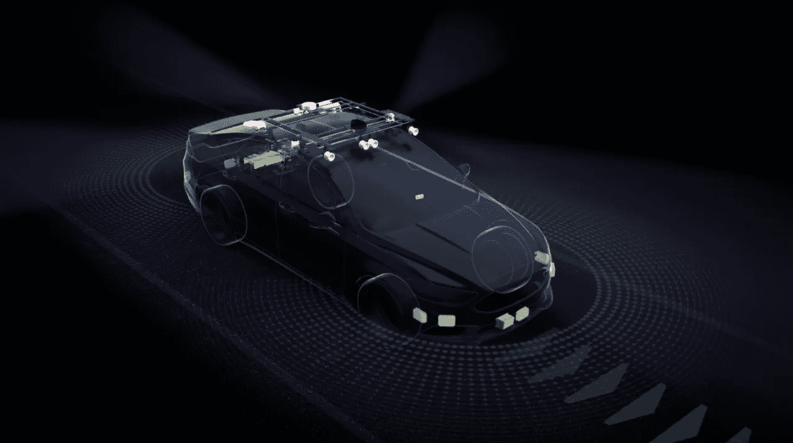
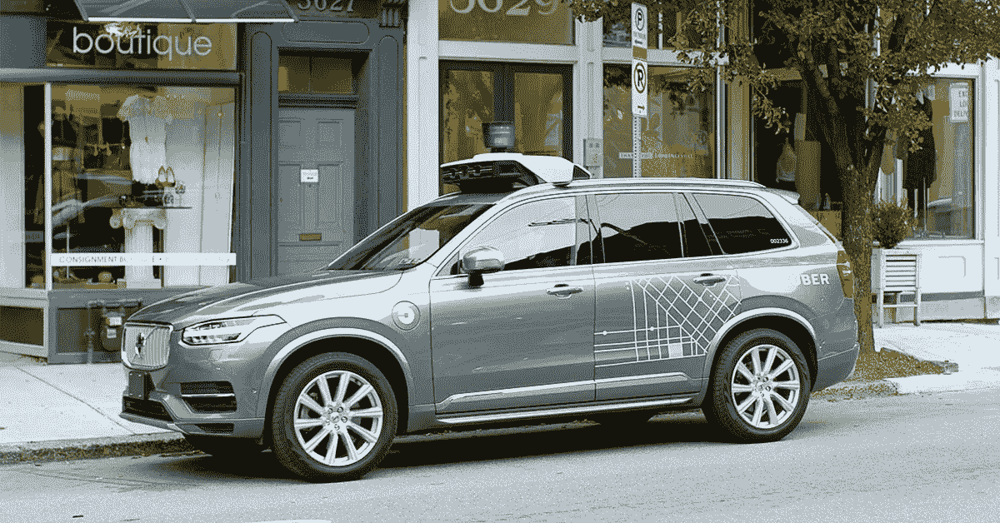
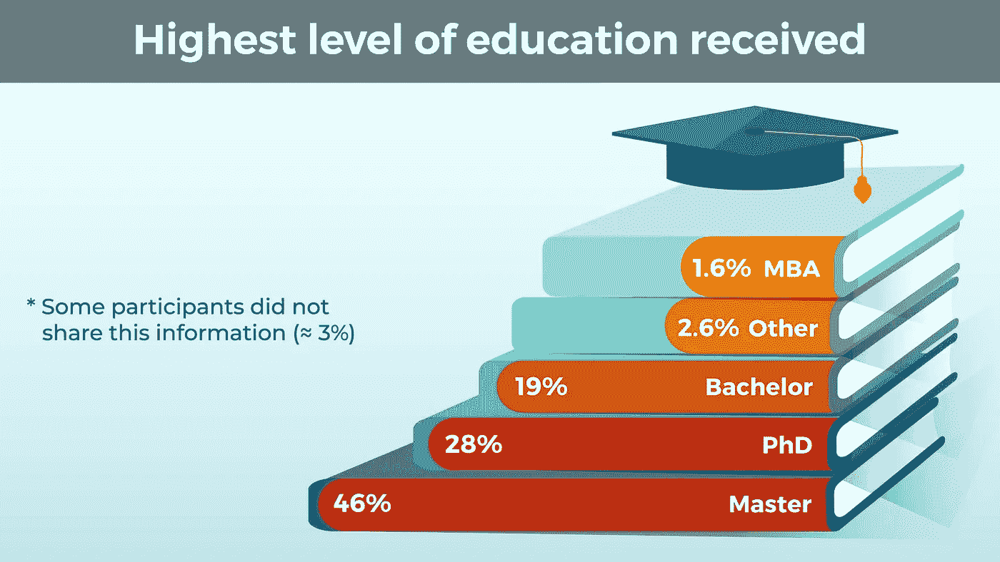
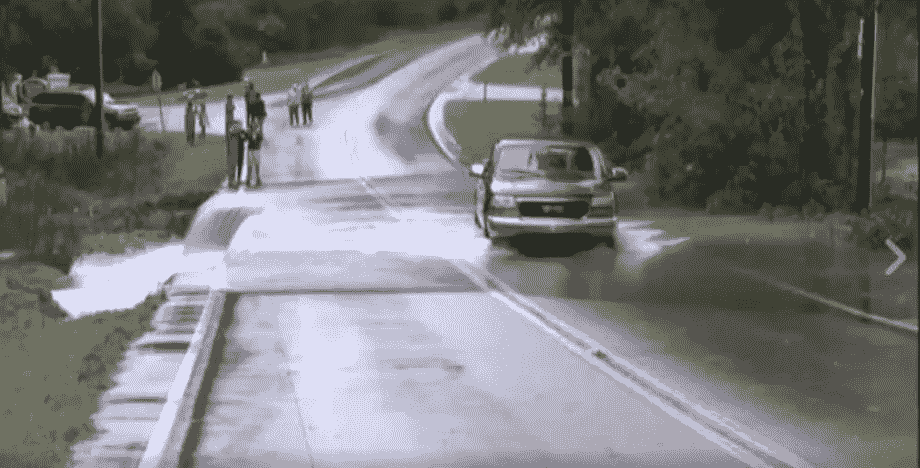
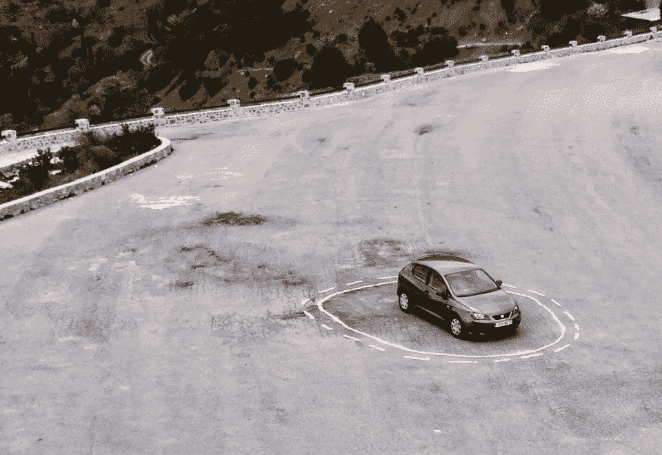
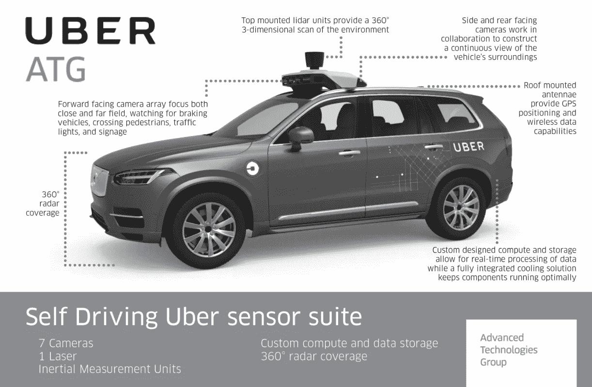

# 又一起自动驾驶车祸，又一堂人工智能开发课

> 原文：<https://towardsdatascience.com/another-self-driving-car-accident-another-ai-development-lesson-b2ce3dbb4444?source=collection_archive---------13----------------------->

## 作为一名数据科学家，优步能从自动驾驶汽车事故中学到什么

Photo from [https://blogs.nvidia.com](https://blogs.nvidia.com/blog/2019/04/15/how-does-a-self-driving-car-see/)

他的事故实际上发生在大约一年半前，发生在一辆优步的自动驾驶汽车上，并夺走了一名女性的生命。这对 AI 社区是一个严重的提醒，正在做的工作承载着很多重量，有时是其他人的生命。

# 对所发生事情的回顾

T 他的可怕事故发生在 2018 年 3 月 19 日深夜。一辆优步自动驾驶汽车在自动模式下行驶，方向盘后面有一名安全驾驶员，在亚利桑那州坦佩撞死了一名女子。详细的调查结果[可以在这里](https://en.wikipedia.org/wiki/Death_of_Elaine_Herzberg)找到。从仪表板摄像头和内部驾驶座摄像头的录像来看，事故发生在一条光线不足的道路上，限速 40 英里/小时。在汽车撞上这名女子之前，这名安全司机正在看她的手机(可能在看 Hulu)。根据优步在撞车后获得的遥测数据，算法将这些女性分类为'*未知物体*，然后是'*车辆*，然后是'*自行车*'，在此过程中，优柔寡断导致了非常晚的行动(在撞车前 1.3 秒命令汽车停下)，最终导致了悲剧的发生。激光雷达或雷达传感器都没有触发，也没有付费的安全司机看到行人。以上任何一种方法，如果有效，都有可能挽救这位妇女的生命。这起事故已经过去了一段时间，优步已经恢复在道路上测试他们的自动驾驶汽车。然而，从数据科学的角度多思考一些问题可能是有价值的，这些问题是什么，优步的自动驾驶系统中有哪些缺陷导致了这场悲剧。

# 自动驾驶系统可能存在的缺陷

在深入探讨自动驾驶系统的潜在缺陷之前，值得注意的是，自动驾驶汽车实际上是人工智能的最先进应用，最接近于 [AGI(人工智能)](https://en.wikipedia.org/wiki/Artificial_general_intelligence)。首先，驾驶是一项非常复杂且潜在相当危险的行为。自动驾驶汽车必须应对的环境可能非常复杂，需要各种情况意识:其他汽车、行人、自行车、交通信号、标志、天气、路况等。诚然，这些年人工智能已经取得了很大的进步，但对于这项任务来说，它足够好吗？不管答案是什么，所有可能的问题都应该彻底解决和测试，不遗余力。这导致了该系统的第一个也是最重要的方面，即开发自动驾驶汽车的团队。

## 应用人工智能开发团队有时工程师人手不足

Photo from [https://365datascience.com](https://365datascience.com/data-scientist-profile-2019/)

做数据科学工作不一定需要硕士或者博士，但是[统计数据显示](https://365datascience.com/data-scientist-profile-2019/)行业内的数据科学家绝大多数至少有硕士学历。他们中的很大一部分人甚至拥有博士学位。这是非常合理的，因为人工智能和数据科学不是微不足道的领域。它需要多年的数学、计算机科学和各种技术的训练。这已经是业界的共识。这种共识如此强烈，有时人们会忘记其他同样重要的角色，以使自动驾驶汽车等现实生活中的人工智能项目取得成功。最重要的是，**工程**。如果需要证明某个算法对于某个单一目的任务的性能(比如放射学图像识别)，你不需要太多的工程能力。一个可靠的数据科学家可能会做得足够好。如果在 web 上开发和部署一个机器学习应用程序来分析评论情绪是一项任务，那么你可能需要雇用更多可靠的开发人员和 DevOps 工程师来确保该应用程序结构良好、精心编码并且易于维护。那么，如果你想建立一个自动驾驶汽车系统，需要在现实世界中维持许多小时而不发生任何事故，那该怎么办呢？你可能想雇佣汽车设计师、监管专家、汽车安全专家、物理学家和一些顶尖的数据科学家来创建一个多元化的团队，以便正确处理这项任务。对于这起优步自动驾驶汽车事件，自动驾驶汽车未能迅速做出反应的一个原因是，激光雷达和雷达系统都没有捕捉到过马路的女子。优步从使用 7 个激光雷达传感器改为只在汽车顶部使用一个，这在汽车周围产生了一些“盲点”。这是什么原因呢？出于安全原因，是否有其他工程债务需要承保？传感器的放置是否存在任何设计缺陷？环境中是否存在任何干扰问题？传感器和中央计算机之间的通信通道是否顺畅？这并不是说这些是确切的情况，只是这些是需要被询问和解决的问题，解决这些问题的最佳人才类型是**工程师**，而不是数据科学家。

## 小数据

现在，小数据是一个需要解决的数据科学问题。这意味着要建立一个有效的模型，每种情况下都需要大量的数据来训练模型。但有时不平衡数据问题很难解决，而且成本很高。以自动驾驶汽车为例。说到安全，最重要的是什么时候出了问题。收集的不同事故类型的数据越多，就越有利于训练一个足够稳健的模型，使其能够在所有条件下自行处理。但与装有黑匣子的飞机不同，车祸数据更难收集。首先，很难“产生”或“制造”事故。其次，并不是所有的汽车都配备了传感器来收集事故发生时的数据(一些更“智能”的汽车，如特斯拉，可能可以，但大多数汽车还没有)。作为数据科学家，一个共识是高性能模型的瓶颈通常不是算法，而是数据。如果没有足够的车祸相关数据，数据科学家将很难开发出一个能够很好地处理这些事故类型的模型。要做出一个能在街上驾驶汽车，转弯，适当加速/减速的自动驾驶汽车系统，并不是最难的任务。最困难的任务是在没有足够数据的情况下，创建一个能很好地处理所有事故的模型。

## 处理边缘情况

这实际上是小数据问题的一个更极端的例子，但值得一提。安全的一个经验法则是考虑所有可能出错的边缘情况，并做好准备。这对人类来说不是问题，因为人类比任何算法都具有常识和更广泛的情境意识，所以人类更有准备来处理边缘情况，但算法通常不够复杂，因此需要更多的工作。

Photo from [https://www.chron.com](https://www.chron.com/news/houston-texas/article/Impressive-video-show-why-people-should-drive-on-7963621.php)

让我们想象一些边缘情况。

**道路上的洪水:**人类会后退，或者选择一些更平坦的草地来穿越洪水，但如果汽车只接受在道路上驾驶的训练，它无法正确处理这一点。

**非常滑的路:**人类会改变他们的驾驶模式，非常轻柔地转弯以避免打滑。或者停下来放防雪链，AI 就很难达到同等水平的灵活度。

**涂鸦之路:**人类很容易知道发生了什么，不会出错，但 AI 如果没有受过涂鸦之路的训练，可能会把涂鸦误认为是真实的道路指引。

这个清单还在继续。如果你能从过去的驾驶经历中想到你遇到的其他边缘案例，请在下面留下回应。底线是，在现实世界中驾驶需要更复杂的系统来处理所有奇怪的情况，人类非常擅长这一点(因此这是有保证的)。而人工智能需要在每种情况下进行训练。没有捷径。提出这些边缘案例并围绕其设计自动驾驶系统的能力将获得鲁棒性和安全性分数，并可能在竞争中获得优势。

# 哪里需要改进

那么自动驾驶车祸应该阻止技术的发展吗？当然不是！这项技术在拯救许多生命方面有巨大的潜力。人工智能可能有偏见或不够复杂，但它有一个人类没有的优点。他们永远不会变得情绪化、鲁莽或困倦。如果做得好，在大多数情况下，它应该在安全性方面优于人类，但显然它还没有做到这一点。那么流程的哪些部分可以改进呢？(*我本人并不是自动驾驶汽车专家，只是想在本文中探索各种可能性，所以对以下内容持保留态度。如果你有更好的想法，欢迎在下面留下回应！*)

## 测试过程

同样，在深入研究技术之前，需要首先解决与人相关的问题。这起事故中特别令人惊讶的一点是，这辆车竟然有一名安全驾驶员。如果安全司机尽职尽责，不看手机，眼睛盯着路面，整件事本来是可以避免的。这并不难做到，但她未能做到这一点间接代价是一条生命。这与技术无关，但与如何改善自驾测试过程有关。让一名付费的安全司机开车，为测试增加一层安全，这是一个好的开始，但人类会犯错误。既然汽车已经有一个内部摄像头监控司机，为什么不开发一种算法来监控她/他的行为，并在她/他的眼睛离开道路时给出警告/分数？

## 五金器具

Photo from [https://labs.sogeti.com](https://labs.sogeti.com/driverless-cars-ultimate-use-case-telecom-industry/)

激光雷达/雷达在这起事故中未能触发。原因是什么？多加一个传感器会不会效果更好？添加更多类型的传感器？优化传感器的位置？传感器需要在任何天气条件下都能工作。炎热、高温、下雪、极度晒伤、刮风等。如果没有，要有后备计划。做好极端的准备。

## 软件

中央驾驶系统有一个优先控制系统，意味着传感器或图像识别系统上触发的一些特殊事件将导致汽车立即停止以避免严重事故，超越所有其他驾驶控制系统。(例如，硬代码[确保前方净距离](https://en.wikipedia.org/wiki/Assured_clear_distance_ahead))优先系统需要仔细设计和调整，以实现最大的安全性。

## 算法

对于所有机器学习模型来说非常重要的一点是*验证集*。一个好的验证集定义了模型的泛化能力，从而在很大程度上决定了项目在现实生活中的成败。这也适用于自动驾驶汽车。这里什么是好的验证集？嗯，驾驶汽车不像我们的分类器问题那么简单，因此没有非常明确的定义。这正是问题所在。所有自动驾驶汽车公司和监管机构是否应该合作，开发一个良好的“测试例程”，捕捉所有极端情况、边缘情况、测试场景、自动测试软件等。，以有效地充当自动驾驶汽车的“验证集”？我认为，所有参与者在这方面达成一致并做出努力是至关重要的，但这一点还没有得到充分探讨。

# 最后的想法

Photo by [Ciprian Morar](https://unsplash.com/@ciprianmorar?utm_source=medium&utm_medium=referral) on [Unsplash](https://unsplash.com?utm_source=medium&utm_medium=referral)

无论自动驾驶汽车取得了多大的进展，有时感觉就像只是触及表面，水下潜伏的冰山的大小仍然未知。此外，自动驾驶汽车事故通常会受到媒体的高度关注。据《连线》报道，去年仅在美国就有近 4 万人死于交通事故，但很少有人(如果有的话)像优步事件那样成为头条新闻。不公平？不真的。这其实是一件好事。严格和密切的审查是一件好事，可以推动自动驾驶汽车的安全极限。因为人命关天。

更新:调查的最终结果将于 2019 年 11 月 20 日公布。你可以参考[这篇由 The Verge](https://www.theverge.com/2019/11/20/20973971/uber-self-driving-car-crash-investigation-human-error-results) 撰写的文章。

觉得这篇文章有用？在 Medium 上关注我([李立伟](https://medium.com/u/72c98619a048?source=post_page-----dbe7106145f5----------------------))或者你可以在 Twitter [@lymenlee](https://twitter.com/lymenlee) 或者我的博客网站[wayofnumbers.com](https://wayofnumbers.com/)上找到我。你也可以看看我下面最受欢迎的文章！

 [## “这是 CS50”:开始数据科学教育的愉快方式

### 为什么 CS50 特别适合巩固你的软件工程基础

towardsdatascience.com](/this-is-cs50-a-pleasant-way-to-kick-off-your-data-science-education-d6075a6e761a)  [## 一枚硬币的两面:杰瑞米·霍华德的 fast.ai vs 吴恩达的 deeplearning.ai

### 如何不通过同时参加 fast.ai 和 deeplearning.ai 课程来“过度适应”你的人工智能学习

towardsdatascience.com](/two-sides-of-the-same-coin-fast-ai-vs-deeplearning-ai-b67e9ec32133)  [## 你需要了解网飞的“朱庇特黑仔”:冰穴📖

### 是时候让 Jupyter 笔记本有个有价值的竞争对手了

towardsdatascience.com](/what-you-need-to-know-about-netflixs-jupyter-killer-polynote-dbe7106145f5)