# 机器学习中特征选择的方差分析

> 原文：<https://towardsdatascience.com/anova-for-feature-selection-in-machine-learning-d9305e228476?source=collection_archive---------2----------------------->

## 方差分析在特征选择中的应用

Photo by [Fahrul Azmi](https://unsplash.com/@fahrulazmi)

机器学习中最大的挑战是选择最佳特征来训练模型。我们只需要高度依赖于响应变量的特征。但是如果响应变量是连续的，而预测变量是分类的呢？？？

*ANOVA(****An****analysis****o****f****Va****riance)帮助我们完成选择最佳特征的工作*。

在这篇文章中，我将带您了解

a.差异的影响

b.f 分布

c.方差分析

c.举例说明单因素方差分析

# 差异的影响

方差是一个变量中数字之间分布的度量。它衡量一个数字与平均值和变量中每个数字的距离。

特征的方差决定了它对响应变量的影响程度。如果方差较低，则意味着该特性对响应没有影响，反之亦然。

# f 分布

通常用于方差分析的概率分布。它假设假设为

> H0:两个方差相等
> 
> H1:两个方差不相等

## 自由度

自由度是指逻辑上独立的值的最大数量，这些值可以自由变化。简而言之，它可以定义为观测值的总数减去施加在观测值上的独立约束的数量。

> Df = N -1 其中 N 是样本大小

## f 值

它是两个卡方分布的比率*除以它的自由度。*

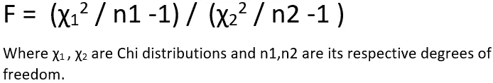

F value

让我们求解上面的方程，看看它对分析方差有什么用处。

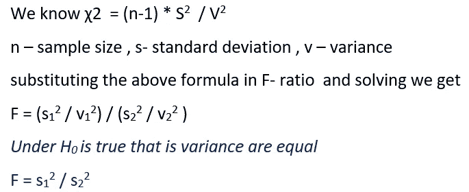

F ratio

在现实世界中，我们总是处理样本，因此比较标准差几乎等于比较方差。

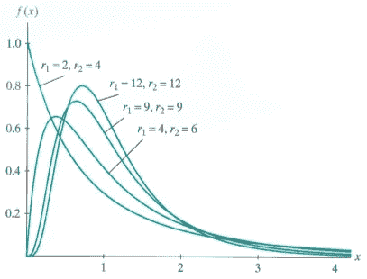

image from [https://newonlinecourses.science.psu.e](https://newonlinecourses.science.psu.edu/stat414/node/294/)du

在上图中，我们可以观察到 F 分布的形状总是依赖于自由度。

# 方差分析

**方差分析**方差分析**是一种统计方法，用于检验两个或两个以上显著不同的组的均值。它假设假设为**

> H0:所有群体的手段都是平等的。
> 
> H1:至少有一组是不同的。

## 均值比较如何转化为方差比较？

考虑下图中的两种分布及其行为。

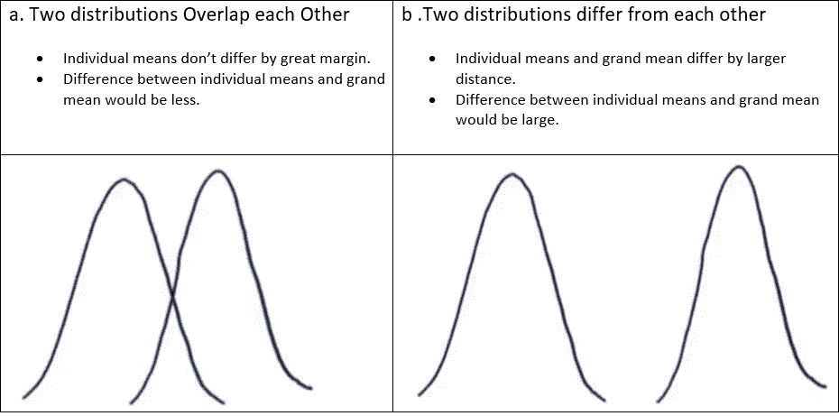

Behavior of distributions

从上图中，我们可以说，如果分布重叠或接近，大平均值将类似于个体平均值，而如果分布较远，大平均值和个体平均值相差较大。

*指各组之间的差异，因为各组中的值不同。所以在方差分析中，我们将比较组间差异和组内差异。*

ANOVA 使用 F-tet 检查各组之间是否有任何显著差异。如果所有方差相等的组之间没有显著差异，ANOVA 的 F 比率结果将接近 1。

# 举例说明单因素方差分析

1.  单向 ANOVA 检验分类预测值与连续反应之间的关系。
2.  在这里，我们将检查连续反应的分类特征组之间是否有相等的方差。
3.  如果组之间的方差相等，则意味着该特征对响应没有影响，并且可以不考虑用于模型训练。

让我们考虑一个包含学生表现数据的学校数据集。我们必须根据年龄、监护人、学习时间、失败、活动等特征来预测学生的最终成绩。

通过使用单因素方差分析，我们可以确定监护人对最终成绩是否有任何影响。下面是数据

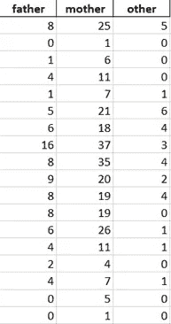

Student final grades by the guardian

我们可以看到监护人(母亲、父亲、其他)为列，学生最终成绩为行。

## 执行单向方差分析的步骤

1.  定义假设
2.  计算平方和
3.  确定自由度
4.  f 值
5.  接受或拒绝零假设

## 定义假设

> H0:“守护者”中的所有等级或团体都有相同的方差
> 
> H1:至少有一个群体是不同的。

## 计算平方和

平方和是用于确定数据点离差的统计技术。它是偏差的度量，可以写成

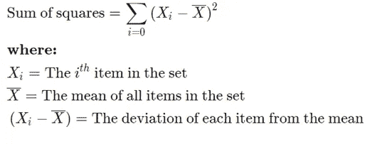

Sum of Squares

如 ANOVA 中所述，我们必须进行 f 检验，通过比较组间方差和组内方差来检查组间是否存在任何方差。这可以通过使用平方和来完成，定义如下。

**总平方和**

每个观察点 x 与大平均值 xbar 之间的距离是 x-xbar。如果您计算每个数据点之间的距离，请计算每个距离的平方，并将您得到的所有平方距离相加

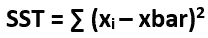

Total Sum of Squares

**之间的平方和**

各组平均值 g 与 grand means xbar 之间的距离为 g-xbar。类似于我们得到的平方和

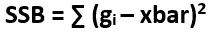

Between the Sum of Squares

**平方和内**

组 x 内的每个观察值与组均值 g 之间的距离为 x-g。类似于我们得到的平方和

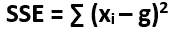

Within the Sum of Squares

> 总平方和=间平方和+内平方和

**确定自由度**

我们已经讨论了自由度的定义，现在我们将计算组间和组内的自由度。

1.  因为我们有 3 个组(母亲、父亲、其他)，所以组之间的自由度可以给定为(3–1)= 2。
2.  每组有 18 个样本，组内的自由度将是所有组的自由度之和，即(18–1)+(18–1)+(18–1)= 51。

## f 值

因为我们比较的是组间方差和组内方差。F 值由下式给出

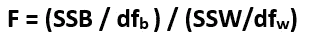

F value

计算平方和和 F 值这里是总结。

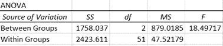

ANOVA table

## 接受或拒绝零假设

在 95%的置信度下，alpha = 0.05，df1 =2，df2 =51 从 [F 表](https://www.socscistatistics.com/tests/criticalvalues/default.aspx)给定 F 值为 3.179，计算出的 F 值为 18.49。

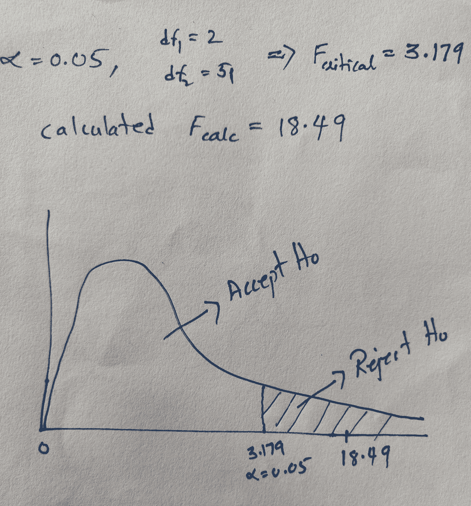

F test

在上图中，我们看到计算出的 F 值落在超出我们置信水平的剔除区域内。所以我们拒绝零假设。

> 总之，由于零假设被拒绝，这意味着组之间存在差异，这表明监护人对学生的最终分数有影响。因此，我们将在模型训练中包含此功能。

使用单因素方差分析，我们可以只检查单个预测因子与反应，并确定关系，但如果你有两个预测因子呢？我们将使用双向方差分析，如果有两个以上的特征，我们将进行多因素方差分析。

使用双向或多因素方差分析，我们可以检查以下响应的关系

1.  《卫报》会影响学生的最终成绩吗？
2.  学生活动会影响学生的最终成绩吗？
3.  《卫报》和学生活动一起会影响期末成绩吗？

得出以上结论做一个测试总是有趣的，对吗？？我正在写一篇关于双向多因素方差分析的文章，会写得更有趣。

*在这里，我们处理了连续响应和分类预测*。*如果回答是分类的，预测器也是分类的，请查看我的文章* [*卡方检验机器学习中的特征选择*](/chi-square-test-for-feature-selection-in-machine-learning-206b1f0b8223) *。*

 [## 机器学习中特征选择的卡方检验

### 我们总是想知道卡方检验在机器学习中的什么地方有用，以及这个检验有什么不同。功能…

towardsdatascience.com](/chi-square-test-for-feature-selection-in-machine-learning-206b1f0b8223) 

希望你喜欢！！敬请期待！！！请对任何疑问或建议发表评论！！！！