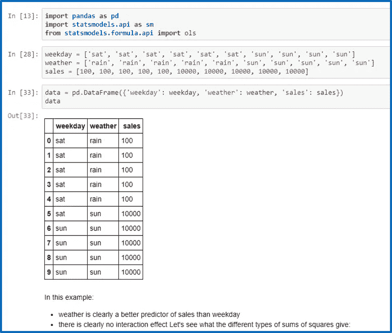
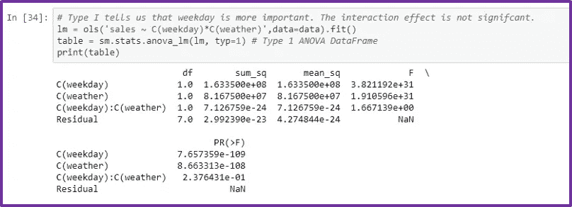
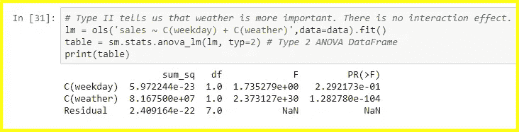
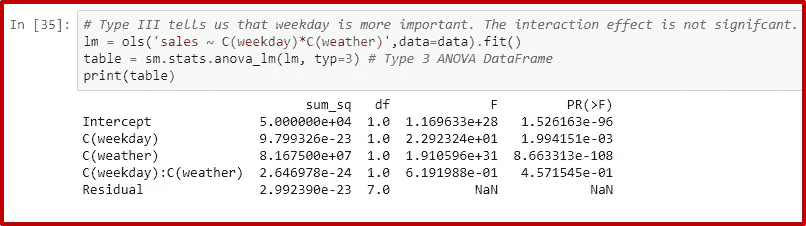
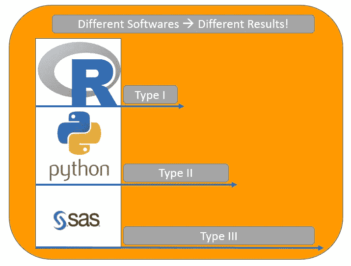
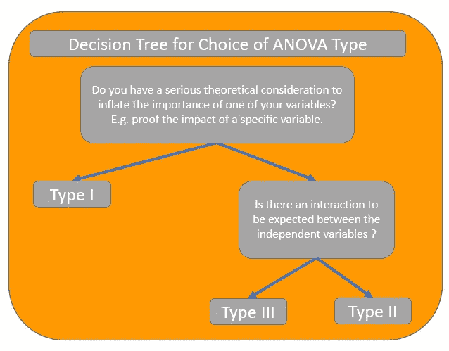

# ANOVA 估计平方和的三种类型:不要选错！

> 原文：<https://towardsdatascience.com/anovas-three-types-of-estimating-sums-of-squares-don-t-make-the-wrong-choice-91107c77a27a?source=collection_archive---------0----------------------->

在本文中，我将解释计算方差分析平方和的三种不同方法，方差分析是一种使用统计显著性比较不同组平均值的常用统计方法。

这篇文章直接进入双向方差分析。如果你需要回到更基本的单因素方差分析，请查阅我以前的文章。

Ronald Fisher, the guy who invented ANOVA.

# 1.双向方差分析基础概述

双向方差分析的目的是将因变量的总变异(以平方和衡量)分成不同的变异源。这使我们能够发现我们的自变量是否对因变量有显著影响。

> 双向方差分析是有 2 个独立变量的方差分析。

存在三种不同的分裂变异方法:第一类、第二类和第三类平方和。在不平衡数据的情况下，它们不会给出相同的结果。

> I 型、II 型和 III 型方差分析结果不同！

## 根据工作日和天气解释销售[(笔记本在这里)](http://bit.ly/anova-types)

我将在一个实际的例子中应用这三种平方和来看它们的区别:

An example with data for two way ANOVA

# 2.第一类平方和

第一类平方和，也称为序列平方和，以序列顺序分配变量。

如果模型有两个自变量 A 和 B 以及交互作用效应，按顺序指定，I 类平方和将:

*   首先给变量 A 分配一个最大变化量
*   在剩余的变化中，将最大变化分配给变量 B
*   在剩余的变化中，将最大变化分配给交互效果
*   把剩下的分配给剩余平方和。

> 第一类平方和是连续的，因此模型中变量的顺序有所不同。这在实践中很少是我们想要的！

**平方和在数学上定义为:**

*   自变量 A 的 SS(A)
*   自变量 B 的 SS(B | A)
*   相互作用效应的 SS(AB | B，A)

**I 型方差分析结论为:**

ANOVA table for the Type I Sums of Squares

> 在 I 型平方和中，weekday 被错误地选为最重要的变量，只是因为它在模型中首先被指定。

# 3.第二类平方和

第二类平方和在两个方面采取了不同的方法。

*   首先，分配给自变量 A 的变化是对 B 的解释，而分配给 B 的变化是对 A 的解释。
*   第二，第二类平方和没有交互作用的影响。

> 如果自变量之间没有交互作用，则应使用第二类平方和。

**平方和在数学上定义为:**

*   自变量 A 的 SS(A | B)
*   自变量 B 的 SS(B | A)
*   无交互效应

**第二类方差分析结果为:**

ANOVA table for the Type II Sums of Squares

> 在第二类平方和中，天气是唯一重要的变量。这比 I 型平方和好得多。

# 4.第三类平方和

第三类平方和也称为部分平方和，这是计算平方和的另一种方法:

*   与类型 II 一样，类型 III 的平方和不是连续的，因此说明的顺序并不重要。
*   与第二类不同，第三类平方和确实规定了一种相互作用效应。

**平方和在数学上定义为:**

*   独立变量 A 的 SS(A | B，AB)
*   独立变量 B 的 SS(B | A，AB)

**III 型方差分析结果为:**

ANOVA table for Type III Sums of Squares

> 在第三类平方和中，天气和工作日都很重要。给定我们的示例数据，这似乎是一个可以接受的结果。

# 5.不同的软件—不同的结果

关于使用哪种平方和存在激烈的争论。

> r 给出 I 型，Python 给出 II 型，SAS 给出 III 型。

I 型和 II 型在 **R 软件**社区更受欢迎。在 R 的 *anova()* 和 *aov()* 函数中，平方和的实现类型是类型 I，即顺序计算。对于其他类型的平方和，使用 *car* 包中的 *Anova()* 函数，该函数带有一个*类型*参数。

在 **SAS 软件社区中，**类型 III 平方和被更多地使用，因为这通常是 SAS 的默认实现。

在 **Python** statsmodels 库中，默认实现是 Type II，但是 *type* 参数使得使用 Type I 或 Type II 变得非常容易。

Default Types of Sums of Squares for different programming languages

# 6.结论:不同的平方和——不同的问题

仔细观察，每种平方和都给出了划分共享变量的不同方法。在我们的例子中，我们根本不知道哪个答案是正确的，所以我们可以采取多种策略:

> 只有在理论上有充分理由时才使用 I 型，没有相互作用时使用 II 型，有相互作用时使用 III 型。

在类型 I 中，我们选择最“重要”的自变量，它将得到最大可能的变化量。

在类型 II 中，我们忽略了共享变量:没有假设交互作用。如果这是真的，第二类平方和在统计上更有力量。然而，如果在现实中有一个相互作用的影响，该模型将是错误的，将有一个问题的分析结论。

如果存在交互作用效应，并且我们正在寻找自变量之间的“相等”分割，则应使用类型 III。

Decision Tree for Different Types of Sums of Squares in ANOVA

所以这个综述的结论是:只有在有严肃的理论理由时才使用 I 型，没有相互作用时使用 II 型，有相互作用时使用 III 型。

*回顾 ANOVA 理论真的很有趣，我希望这些内容能帮助你踏上数据科学之旅。* ***感谢阅读！***