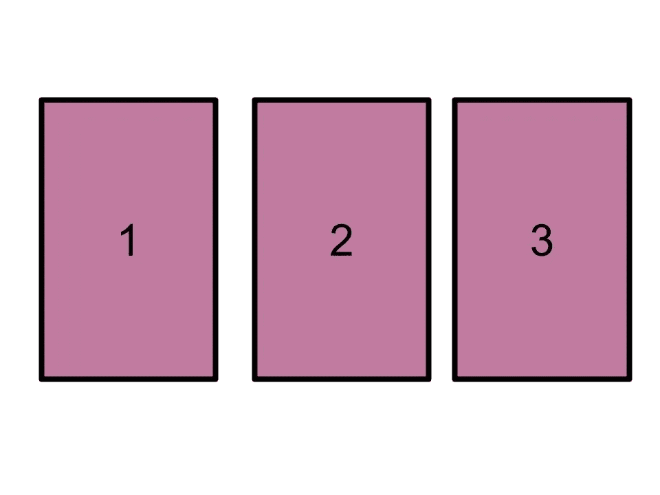
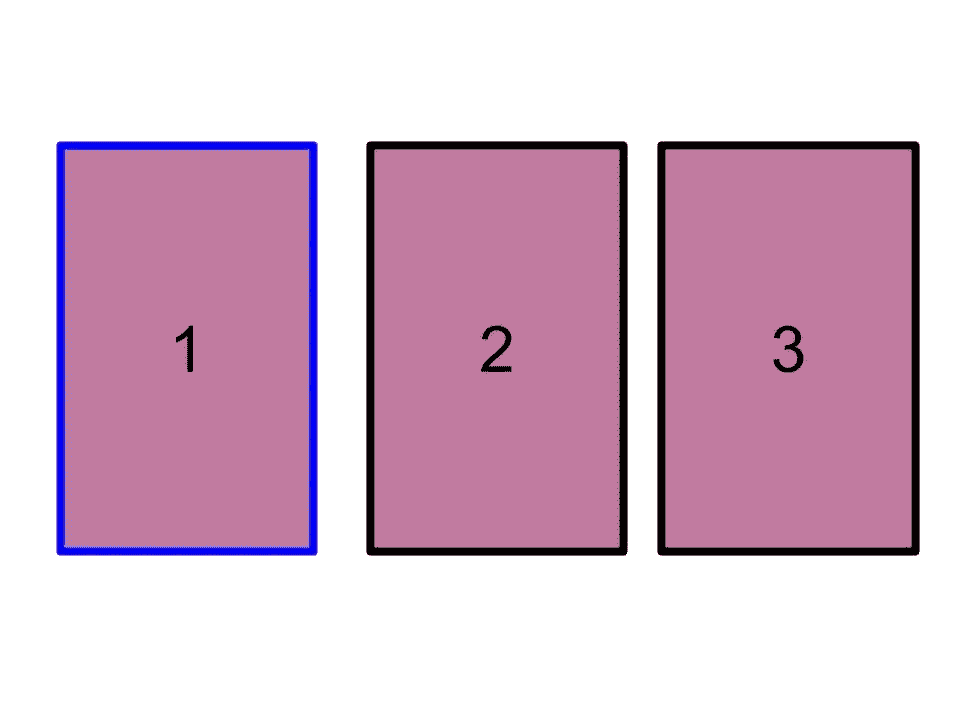
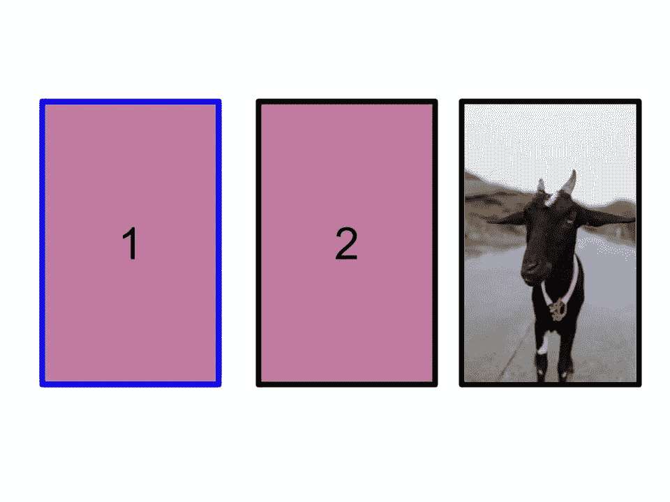
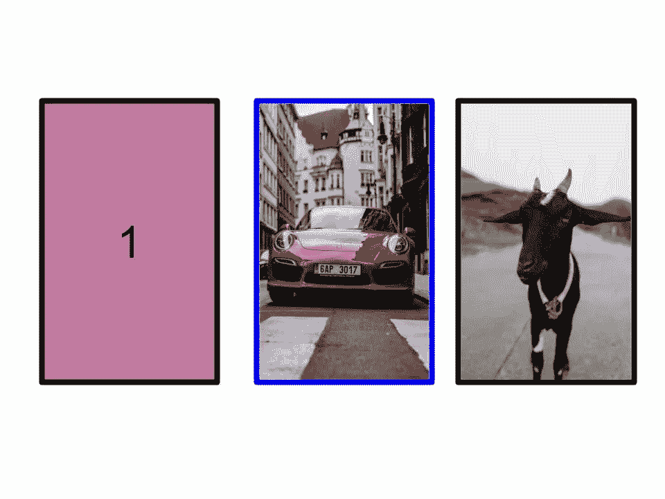

# 用蒙特卡洛回答蒙蒂·霍尔难题

> 原文：<https://towardsdatascience.com/answering-monty-hall-problem-with-monte-carlo-6c6069e39bfe?source=collection_archive---------17----------------------->


Photo by [Adam Rhodes](https://unsplash.com/@adamrhodes?utm_source=medium&utm_medium=referral) on [Unsplash](https://unsplash.com?utm_source=medium&utm_medium=referral). [Adams’s Website](https://adamrhodesphotography.co.uk/)

## 蒙特卡洛是一种概念简单但功能强大的技术，被广泛使用。它利用随机性来回答问题。

在这篇文章中，我将解释如何使用[蒙特卡罗方法](https://en.wikipedia.org/wiki/Monte_Carlo_method)解决[蒙蒂霍尔问题](https://en.wikipedia.org/wiki/Monty_Hall_problem)。这是用 python 实现的，Python 是一种编程语言，它的名字本身就是向英国喜剧团体——[蒙蒂 Python 致敬。](https://en.wikipedia.org/wiki/Monty_Python)

# 蒙蒂·霍尔问题

我第一次接触到蒙蒂霍尔问题是在电影《21 世纪》。这个片段展示了这个问题。

Vsauce 的迈克尔大卫·史蒂文斯[和 Vox](https://www.youtube.com/watch?v=TVq2ivVpZgQ) 对此也有解释。

让我们跳入问题— *想象一下，你面前有三扇门。*



*游戏节目主持人让你选择其中一扇门。如果你选择了正确的门，你会赢得一辆车，否则你会得到一只山羊。*

*假设您选择了门№1*



知道每扇门后是什么的游戏节目主持人打开 3 号门，露出一只山羊。



*游戏节目主持人给你两个选择*

1.  *贴着 1 号门*
2.  *切换到 2 号门*

你会选择哪一个？

# 蒙特卡罗实验

蒙特卡洛实验的定义根据[维基百科](https://en.wikipedia.org/wiki/Monte_Carlo_method) ***蒙特卡洛方法*** *，或* ***蒙特卡洛实验*** *，是一大类* [*计算*](https://en.wikipedia.org/wiki/Computation) [*算法*](https://en.wikipedia.org/wiki/Algorithm) *即依靠重复* [*随机抽样*](https://en.wikipedia.org/wiki/Random_sampling) *底层概念是用* [*随机性*](https://en.wikipedia.org/wiki/Randomness) *来解决原则上可能是* [*确定性*](https://en.wikipedia.org/wiki/Deterministic_system) *的问题。*

这意味着你可以模拟一个实验，基于某个或某些条件模拟任意次，然后分析模拟的结果以得出一个解决方案。

在电影《复仇者联盟 3：无限战争》中，奇异博士对未来进行了近 1400 万次模拟，以确定未来有多少结局，复仇者联盟会赢吗？本质上，他是在应用蒙特卡罗实验的原理。

# 用蒙特卡洛模拟蒙提霍尔

想象一下前面描述的游戏陷入了一个循环，就像电影[土拨鼠日](https://en.wikipedia.org/wiki/Groundhog_Day_(film))中的比利·穆雷一样。

每次游戏开始时，我们记录坚持第一个选择的门和切换到新的门的成功和失败。

假设这个游戏已经进行了 100 次。我们会检查在这 100 场比赛中，有多少场比赛的车是通过不开关车门和开关车门赢得的。

通过查看这些比率，我们将知道哪个选项增加了成功的机会。

# 编纂蒙蒂霍尔和蒙特卡洛

让我们定义一个模拟蒙蒂霍尔问题的函数

```
def monty_hall():
    ...
```

在该函数中，创建三个车门，并将汽车随机分配给其中一个车门。列表中的值“1”代表汽车

```
doors = [0, 1, 0]
shuffle(doors)
```

玩家选择打开一扇门。值 0、1 和 2 代表列表变量“门”的索引

```
door_selected = choice([0, 1, 2])
```

游戏节目主持人现在打开后面没有汽车的门

```
non_car_doors = list()
for i,d in enumerate(doors):
 if d == 0 and i != door_selected: non_car_doors.append(i)door_opened = choice(non_car_doors)
```

现在，评估以下两个选择

1.  坚持最初的选择赢得一辆车

```
non_switch_success =  True if doors[door_selected] == 1 else False
```

2.通过切换到剩下的门赢得一辆车

```
remaining_door = set([0,1,2]).difference([door_selected, door_opened])
remaining_door = remaining_door.pop()
switch_success =  True if doors[remaining_door] == 1 else False
```

最后，返回每个选项的成功结果

```
return non_switch_success, switch_success
```

定义蒙特卡洛函数，该函数采用单个参数“n”来表示要运行的模拟数量。运行 Monte Hall 模拟“n”次，并返回每个选项的成功分布。

```
def monte_carlo(n):
    non_switch_success_count = 0
    switch_success_count = 0for i in range(n):
        ns, ss = monty_hall()
        non_switch_success_count += ns
        switch_success_count += ssprint(f"Number of plays: {n}")
    print(f"Number of success on switch: {switch_success_count}     
     {(switch_success_count/n)*100}%")
    print(f"Number of success on non-switch:                       {non_switch_success_count}  
     {(non_switch_success_count/n)*100}%")
```

完整的代码可以在下面找到，如何运行它在标题评论。

# 运行模拟

让我们模拟 100 个游戏

```
╰─$ ./main.py 100
Number of plays: 100
Number of success on switch: 71  71.0%
Number of success on non-switch: 29  28.999999999999996%
```

我们可以看到切换的成功率更高。

让我们再运行一次

```
╰─$ ./main.py 100
Number of plays: 100
Number of success on switch: 62  62.0%
Number of success on non-switch: 38  38.0%
```

我们仍然可以看到切换的成功率更高，但是成功率差别很大。

让我们对 100 万个游戏进行同样的模拟，然后做 3 次，看看成功率是否有很大的不同。

```
╰─$ ./main.py 1000000
Number of plays: 1000000
Number of success on switch: 666566  66.6566%
Number of success on non-switch: 333434  33.3434%╰─$ ./main.py 1000000
Number of plays: 1000000
Number of success on switch: 666588  66.6588%
Number of success on non-switch: 333412  33.3412%╰─$ ./main.py 1000000
Number of plays: 1000000
Number of success on switch: 666628  66.6628%
Number of success on non-switch: 333372  33.3372%
```

我们可以看到，成功的百分比变化不大，它告诉我们，如果我们进行转换，那么获胜的机会是三分之二。

进行切换！



# 结论

这篇文章的动机是介绍蒙特卡罗方法，并将其应用于一个对新手来说容易理解和有趣的问题。蒙特卡罗方法可能在概念上看起来很简单，但它是一种强大的方法，广泛用于金融行业、强化学习、物理科学、计算生物学等领域。