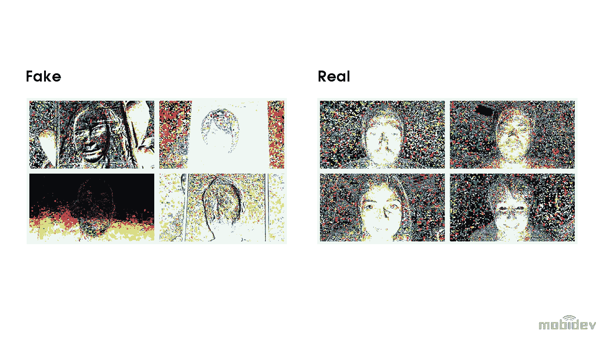
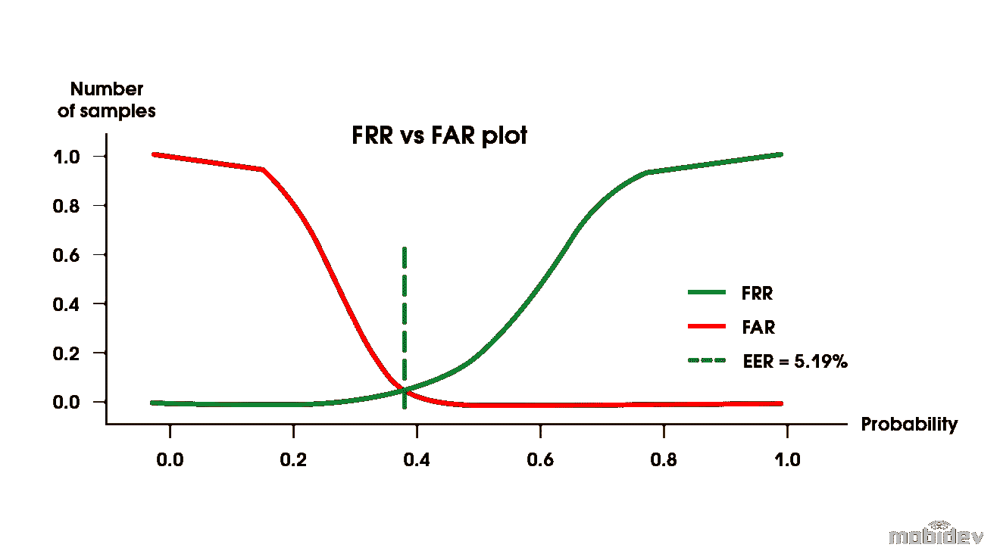

# 人脸识别解决方案的反欺骗技术

> 原文：<https://towardsdatascience.com/anti-spoofing-techniques-for-face-recognition-solutions-4257c5b1dfc9?source=collection_archive---------7----------------------->

## 防止演示攻击的机器学习

[Source](https://mobidev.biz/blog/face-anti-spoofing-prevent-fake-biometric-detection?utm_source=towardsds&utm_medium=antispoofing&utm_campaign=image)

在我们日益数字化的世界中，网络犯罪呈上升趋势，这并不奇怪。许多公司现在正在探索由[机器学习](https://mobidev.biz/services/machine-learning-consulting?utm_source=towardsds&utm_medium=antispoofing&utm_campaign=mlservice)工程师提供的[生物面部识别](/how-to-build-a-face-detection-and-recognition-system-f5c2cdfbeb8c)作为可行的安全解决方案。这项创新技术展现了巨大的前景，可能会彻底改变我们获取敏感信息的方式。

人脸识别技术将是决定人工智能未来[前景的因素之一。](https://hackernoon.com/the-future-of-artificial-intelligence-to-kill-or-to-heal-t6fl24sq)

尽管面部识别很有前途，但它也有缺陷。用户照片可以很容易地通过社交网络找到，并用于欺骗面部识别软件。让我们说使用纸质照片，截图，或三维面部重建。

这就是为什么对公司来说，部署 face 反电子欺骗系统以保护敏感数据、减少盗窃和欺诈非常重要。这些系统通过提高检测欺诈的能力来增强现有的面部识别解决方案。

虽然这在理论上看起来很棒，但很明显弱点确实存在。是什么阻止了一个人用假脸获取敏感数据？

这就是反电子欺骗解决方案发挥作用的地方。我们依靠活体检测来验证个体的身份。这些检查可以验证个人是否实际存在或使用照片来欺骗系统。

# 最流行的人脸反欺骗技术

大多数面部欺骗攻击被称为表示攻击。这些攻击使用 2D 和 3D(静态或动态)来欺骗面部识别软件。

**静态 2D 演示攻击**依赖于照片、平面纸或面具，而动态版本使用屏幕视频回放或一系列照片。

**静态 3D 呈现攻击**可能使用 3D 打印、雕塑或面具，而动态版本使用复杂的机器人来再现表情，并完成化妆。

当然，这些例子并不是最终的真相。随着技术的发展，表示攻击也在发展。

如今，由于技术限制，2D 比 3D 更受欢迎。

在开发该问题的解决方案时，我们认为重点关注以下技术非常重要:

*   防止静态和动态 2D 欺骗
*   使用图像，而不是视频
*   不需要用户的交互

一个可靠的解决方案需要达到最大的准确性，需要很少的时间，并优先考虑用户体验。

最重要的是，它需要与现有的面部识别软件集成。

# 眨眼检测

眨眼检测是一种非常准确的活体检测测试。自然眨眼是判断一张脸是否真实的简单方法。人类平均每分钟眨眼 15-30 次。在一次眨眼过程中，眼睛会保持大约 250 毫秒的闭着状态。现代相机记录视频的帧间隔要小得多(每秒 30 帧，50 毫秒)。

我们可以使用视频找到闭着眼睛的帧，并对它们进行计数，以获得预期的数量。眨眼检测的实现可以使用面部标志分析并计算眼睛的表面积。我们也可以将深度学习应用于这项任务。

# 深度学习特征:卷积神经网络

深度学习和卷积神经网络(CNN)是可以帮助反电子欺骗的附加解决方案。

在探索技术时，我们开始将反电子欺骗视为一个二元分类问题。我们可以训练 CNN 识别哪些是真实的照片，哪些是伪造的。会成功的。

但是有一个问题。

卷积网络没有“看到”和“理解”的一致(稳定)的功能集这整个模型依赖于希望系统能探测到我们肉眼看不到的东西。

**这里有一个例子。**

A trained CNN identifies both photos as spoofing

以上两张图都是恶搞。是的——我们训练有素的 CNN 能够识别出这两个都是欺骗。甚至在左边也有许多肉眼看不到的失真。但它只能在特定条件下处理特定数据集，包括相机质量、环境、光线等。

如果其中任何一个发生了变化，神经网络都不会提供准确的结果。因此，这种方法只在有限的用例中可行。

# 挑战-回应技术

挑战和响应是另一种可行的反欺骗技术。这种技术使用一种称为挑战的特殊动作。

该系统工作以验证挑战发生在视频序列期间。挑战应答系统依靠一系列挑战来验证个人的身份。

这些挑战可能包括:

*   笑容
*   悲伤或快乐的面部表情
*   头部运动

然而，虽然有效，但这种方法需要额外的输入，并且会显著影响用户体验。

# 3D 相机

3D 摄像头是最可靠的反欺骗手段。精确的像素深度信息可以提供抵抗呈现攻击的高准确度，因为我们可以区分人脸和平面形状。

3D 攻击可能会造成困难，但摄像头仍然是可用的最可靠的人脸反欺骗技术之一。尽管有相机，但并不是所有用户的电脑上都有。

这就是为什么我们觉得处理常规 RGB 图像很重要。

# 活动闪光灯

主动闪存是一项有趣的技术，我们认为它很有前途。我们决定为我们的特定项目测试它。与其他一些解决方案不同，它没有“黑盒问题”

这种解决方案使我们能够利用人脸上的反光来检测电子欺骗。这个想法涉及到使用一个不断变化的光环境，这种光环境是由来自设备屏幕的额外光线提供的。白光在脸上产生适当的反射。

Active Flash anti-spoofing technique

我们可以用这种技术让真脸和假脸不同。

但是它是如何工作的呢？

我们在闪光发生前后取帧，并用这些数据训练我们的网络。主动闪光帮助我们分离面部特征并进行分类。

有可能建立一个独立于面角的模型(具有合理的限制)。但是，如果我们计算像素差异，人脸对齐就变得必要了。但是很明显这个方法是有效的。基于需要解决的特定用例，该技术可以变得更加复杂。

# 定义成功的衡量标准

我们提到的每一种反欺骗方法都有各自的可行性。但是像任何事情一样，它们有优点也有缺点。其中一些可以通过增加额外的复杂性来改进，另一些则适合单独使用，而某些解决方案在组合使用时会表现得更好。

但是你如何定义成功呢？我们认为度量标准对于衡量人脸反欺骗系统的准确性是必要的。

False Acceptance Rate (FAR) and False Rejection Rate (FRR) are common metrics

**错误接受率(FAR)** 和**错误拒绝率(FRR)** 是在生物特征验证中使用的常见度量，也适用于反电子欺骗。特定的任务定义了我们在解释错误时需要考虑的指标。

有几件事需要考虑。

如果最少遗漏的冒名顶替者是成功的衡量标准，我们应该消除 FAR。但是如果我们优先考虑用户体验，那么更重要的是关注 FRR。根据我们的经验，流畅的用户体验至关重要。

# 人脸反欺骗的下一步是什么？

依靠深度学习的反欺骗技术不仅仅是炒作。面部识别软件的成功将依赖于这些技术。但是，这种成功也需要反欺骗方法的组合和合理的成功度量标准。

无论如何，人工智能的未来令人兴奋，很明显，这项技术将改变我们进行身份验证的方式。

有兴趣知道如何运行具有 DS/ML 特性的软件开发项目吗？阅读我最近的文章[数据科学咨询:从想法到部署](/data-science-consulting-from-idea-to-deployment-ea8efed8c388)。