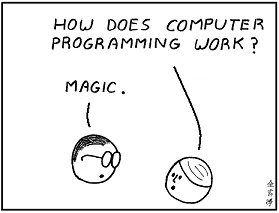
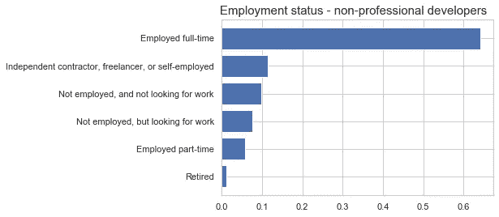
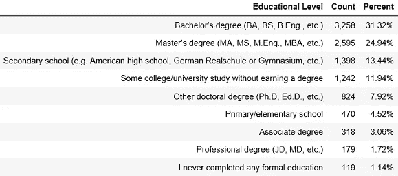
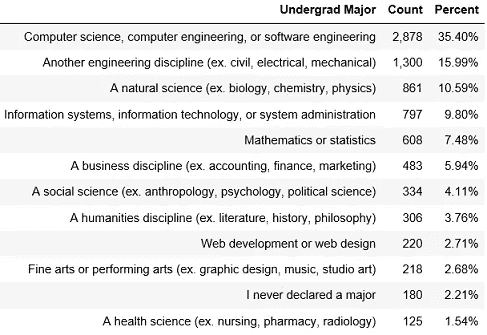
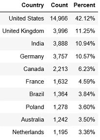
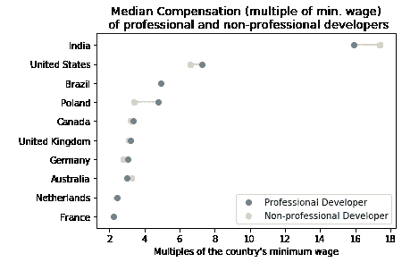

# 还有其他人力资源专业人士吗？这就是非专业开发者社区的样子。

> 原文：<https://towardsdatascience.com/any-other-hr-out-there-this-is-how-the-non-professional-developer-community-looks-like-4c7101bd8dcf?source=collection_archive---------37----------------------->

## 一种基于数据的方法，使用 2019 Stack Overflow 的开发者调查数据。

## 介绍

我刚刚开始我的数据科学之旅，我可以告诉你:我不是天生的，作为一个成年人更难学习。

我的动机是相信通过“做”,我将能够理解这个新的数字企业世界，并有望与我的同行们——主要是人力资源专业人士——一起帮助翻译这个世界。

最近，我听到了很多关于未来最有价值的能力将是最基本的人类能力的说法。人工智能和自动化将出现在我们的工作场所，完成我们认为只有人类智能才能完成的任务。

这听起来像是一个为未来工作优先考虑人文科学和情商的论点。然而，我认为在我们到达那里之前，我们仍然有许多其他的积木要塑造。如果我们不认为功能知识和技术技能会被简单地推进机器，让机器神奇地自动运转，那将是明智的。

> 我的观点是:所有职业(办公室职员、工厂经营者、销售人员、教师、首席执行官……)都需要某种程度的数字素养，以了解我们如何才能以一种我们作为一个社会不会经历我们所担心的令人生畏的破坏性变化的方式来构建这个新的现实。

当我们用数据来检验想法和讲述故事时，我们的能力会更有效。对于一些专业人士来说，未来的数字素养可能会以学习一些编程技能的形式出现，以处理和理解复杂而混乱的数据集。

在这篇文章中，我想利用 2019 年 Stack Overflow 年度开发者调查来探索这一人群的一个片段。对于不熟悉的人来说， [Stack Overflow](https://stackoverflow.com/) 是开发者学习和分享编程知识的最大在线社区。

非专业开发人员的**简介**、**工作满意度**、**薪酬**是什么？让我们来看看…

## 第一部分:今天，非专业开发人员的开发人员是什么样的？

我用的是最近一次调查(2019 年)，有 88，883 名受访者。只有 12.32%的人口:

*   不是专业开发人员，但有时会将编写代码作为工作的一部分(8.53%)或
*   编码主要作为爱好(3.78%)。

我将把选择这些答案中任何一个的所有回答者称为“非专业开发人员”。

Table 1: Type of respondent (excluding null answers) from 2019 survey.

与 2017 年的调查数据(11.78%)相比，我们可以观察到这一人口参与率略有增加。

*这些回答者都不是专业开发人员，但是他们有多少编码经验呢？*

Figure 1: Age of first code and current age (left) and years the respondents have been coding (right) of non-professional developers population (2019 survey results).

30 岁是受访者的年龄中位数。第一次编码经历的平均年龄是 15 岁。但回答者编码 8 年(中位数)，所以有差距。

*他们的就业状况如何？*

Figure 2: Employment status of non-professional developers (2019 survey results).

大部分受访者(64.22%)是全职就业，其次是“独立承包人、自由职业者或个体户”，占 11.45%。

*他们的最高学历和研究领域是什么？*

Table 2: Educational level of non-professional developers, excluding null responses (2019 survey results).

64.18%的人口至少拥有学士学位。

最常见的学习领域是计算机科学/工程(35.40%)，其次是另一个工程学科(15.99%)。

Table 3: Field of study of non-professional developers, excluding null responses (2019 survey results).

这部分人口主要是男性(86%)。妇女占总人口的 8%,其他类别占 6%。

## 第二部分:该人群和所有受访者的工作满意度相比如何？

以下是我们将要研究的问题:

*   总的来说，到目前为止，你对自己的职业有多满意？
*   你对目前的工作有多满意？
*   你对你的经理知道他们在做什么有多少信心？
*   以下哪一项最能描述您目前的求职状态？

为了给这些定性的答案打分，我对“工作满意度”做了如下分类，并添加了结果:

Table 4: Job satisfaction score based on answers available at the 2019 survey.

总体人口和非专业开发人员的平均得分相同(3.00)，但是非专业开发人员的平均得分较低(2.50 比 2.85)。

Figure 3: Job satisfaction, all respondents (left) and non-professional developers (right).

## 第三部分:这个群体的薪酬与专业开发商相比如何？

为了进行薪酬分析，我选择了薪酬信息回复频率最高的前十个国家:

Table 5: Countries with the highest frequency of compensation information at the 2019 survey.

在准备可视化的工资信息时，我们需要考虑一些细节，更多细节请查看我的代码[这里](https://github.com/ericau87/stackoverflow_non-prof-developer)。

让我们比较一下专业开发人员和非专业开发人员的报酬。为了更好的可视化，补偿被标准化为国家最低工资的倍数，并进行对数转换。

Figure 4: Compensation distribution comparing professional developers and non-professional developers.

该数据库包含大量异常值，由最大值上方和最小值下方的点表示(可能是虚拟条目)。对比各国，我们可以发现薪资分配存在一些差异:

*   在印度和巴西等国家，分布(由彩色方框表示)更大，表明受访者之间的工资差异更大；
*   另一方面，我们有法国、德国、荷兰、加拿大和澳大利亚，分布较窄——这表明总体上工资差距较小；
*   与其他国家相比，印度的最低工资高出许多倍。

看起来比较两组(专业开发人员和非专业开发人员)的分布是相似的。我们来看看中位数的绝对信息。

Figure 5: Median compensation (multiple of minimum wage), professional developer and non-professional developer.

*   巴西、荷兰和法国的非专业开发人员和专业开发人员人口的中位数相似；
*   与专业开发人员相比，印度和澳大利亚的非专业开发人员受访者的中位数更高。

## 总结和结论

这个小型的非专业开发人员社区似乎是由大多数在正规教育中接触过编码的人组成的。此外，他们将编码作为工作的一部分。

至于工作和职业满意度，将这一人群与所有受访者相比，我们没有发现任何明显的差异。

非专业开发者和专业开发者的薪酬分配也是如此。我们可以观察到国家之间的一些不同的行为，但是，总的来说，专业和非专业开发人员之间没有明显的差异。

这些只是观察发现。我很想知道这些年来这个种群会如何演变。

> 你会加入数字化转型吗？

要了解更多关于这个分析的信息，请查看[链接](https://github.com/ericau87/stackoverflow_non-prof-developer)到我的 Github。