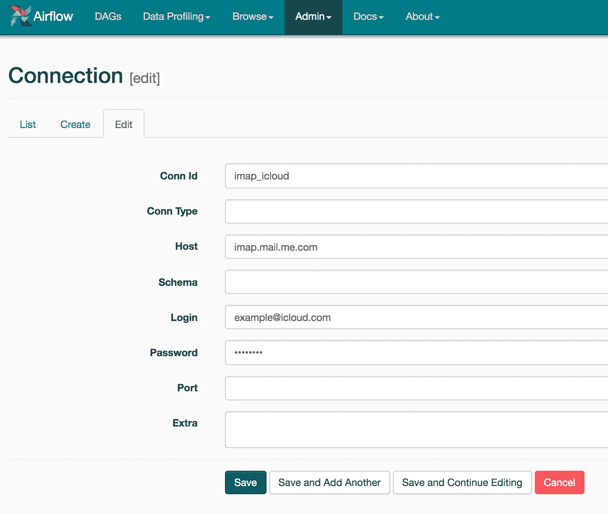
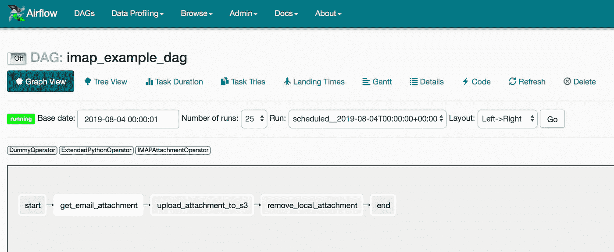

# Apache Airflow:自动收集日常电子邮件附件

> 原文：<https://towardsdatascience.com/apache-airflow-automating-the-collection-of-daily-email-attachments-213bc7128d3a?source=collection_archive---------14----------------------->

Photo by [Mathyas Kurmann](https://unsplash.com/@mathyaskurmann?utm_source=unsplash&utm_medium=referral&utm_content=creditCopyText) on [Unsplash](https://unsplash.com/search/photos/mail?utm_source=unsplash&utm_medium=referral&utm_content=creditCopyText)

这篇文章演示了如何使用 Apache airflow 和 IMAP 邮件协议从任何通用电子邮件服务器自动收集日常电子邮件附件。

俗话说，数据科学家 80%的时间都花在收集、清理和组织数据上。在很大程度上，这是真的，特别是在一次性洞察生成项目的情况下，然而一旦我们将模型投入生产，我认为表盘会移动得更远。我们不仅需要确保数据的完整性，还需要确保数据是最新的，并与内部系统无缝集成。

当集成一个新的数据源时，有许多方法可以探索，仅举几个例子:

*   有报告 API 吗？
*   有数据库吗？
*   客户端或平台能支持 SFTP、S3、谷歌驱动等吗？

当所有希望都破灭时，我们可以求助于自动电子邮件报告。计划的电子邮件报告是一种在报告平台和最终用户之间共享数据的广泛支持的方法，并且在设置成本方面也相对便宜。因此，与其每天登录我们的电子邮件，下载报告并将文件复制到更永久的存储解决方案，我们可以使用 Airflow 插件和 DAG 来为我们完成这些工作。

*这篇文章假设你有一个现有的气流环境和气流概念的基本知识。*

# IMAP 插件

Airflow 的一个很大的特性是插件，插件是扩展 Airflow 现有特性集的一个简单方法。要将新插件与现有气流环境集成，只需将插件文件移动到`$AIRFLOW_HOME/plugins`文件夹中。

IMAP 插件将包含一个钩子和操作符，钩子处理外部连接并构成操作符的构件。操作员将执行我们的任务。插件文件夹结构如下:

。
├── README.md
├── __init__。py
├──钩子
│ ├── __init__。py
│ └── imap_hook.py
└──运算符
├── __init__。py
└──IMAP _ attachment _ operator . py

要创建一个插件，你需要派生 AirflowPlugin 类并引用你想插入到 Airflow 中的对象，我们在 __init__ 中做了这些。py 文件:

注意钩子和操作符是如何相对于文件夹结构导入的。

## IMAP 挂钩

在创建一个钩子之前，气流连接需要到位，或者至少经过深思熟虑。这告诉气流如何连接到外部环境。IMAP 挂钩需要 IMAP 服务器 url、电子邮件地址和密码。可以在 Airflow UI 的管理选项卡中创建连接。以下是 iCloud 的 IMAP 连接示例。

IMAP 挂钩继承自 BaseHook 模块，它是所有挂钩的基类，并使用 get_connection 方法来访问连接模型。

请注意 init 方法中的“get_connection”是如何使用连接 id 来返回一个气流连接对象的，根据 UI 中创建的 IMAP 连接，它的属性是 host、login 和 password。

imaplib 库用于处理 Authenticate 方法中的邮件连接。IMAP4_SSL 类实现 is IMAP 协议，并通过 SSL 连接到服务器。login(user，password)方法授予 IMAP 对象对指定电子邮件帐户的访问权限。

既然钩子已经连接上了，它需要能够搜索特定的电子邮件。find_mail 方法就是这样做的:

mailbox 参数指示要搜索的邮箱，search_criteria 是一个搜索术语的字典，它定义了我们要查找的电子邮件。所有可接受的搜索词都可以在[这里](https://gist.github.com/martinrusev/6121028)找到。

该方法返回相对于所搜索邮箱的电子邮件 id。如果没有找到电子邮件，则返回的 mail_id 为 None，如果找到了多个电子邮件，则只返回最新的 mail_id。

最后，get_mail_attachment 方法将电子邮件附件保存到本地目录。

mail_id 参数应该是 find_mail 方法的输出，邮箱已经设置好了。附加参数是可选的，local_path 指示保存附件的位置，file_name 允许您选择是否重命名附件。

fetch 方法使用 mail_id 返回电子邮件部分，这些部分被解码并使用 message_from_string 命令转换为消息对象。遍历用于“遍历”消息树并产生每个部分；最后一部分总是包含使用 get payload 函数检索的附件。

## IMAP 附件操作员

如前所述，气流挂钩是操作员的构建模块。下面的操作员使用 IMAP hook 命令和 Airflow 的执行上下文来下载任务执行日期前一天(总是昨天)收到的电子邮件的附件，并将其保存到本地目录。

所有气流操作符必须继承 BaseOperator 类，该类创建成为 DAG 中节点的对象。下面所有的参数都已经在 IMAP 钩子中提到了。唯一的新参数是 execute 方法中的上下文变量；这是一个描述任务执行环境的字典，即 execution_date & run_id。气流执行上下文的全部内容可以在[这里](https://bcb.github.io/airflow/execute-context)找到。

Airflow 操作符的一个重要特性是能够定义模板字段；这些是 Jinjaified 字段，在执行时可以接受 Airflow 宏。文件名是一个 template_field，这意味着它可以在运行时使用宏动态设置。在 8 月 1 日运行 DAG 将产生以下结果:`file_name = {{ ds }}_attachment = 2019-08-01_attachment`。

execute 命令使用上下文变量将搜索标准的 date received 元素预设为执行日期的前一天。这是通过使用“yesterday_ds”宏设置或更新“ON”值来实现的。这背后的想法是，如果每天都有电子邮件报告发送，我们只需要最新的附件。

*我使用“yesterday_ds”宏，因为有时报告和数据会在一天的不同时间合并，所以我们只是给它额外的交付时间。我不要求我的数据比几天前更新，但如果速度是最重要的，气流传感器会更合适。*

get_attachment 方法验证 IMAP 挂钩，并调用每个方法将附件下载到 disc。

# **S3 达格**的电子邮件附件

既然插件现在已经完成了，下一步就是在气流 DAG 中将它投入使用。下面是一个简单的 DAG，每天运行，下载电子邮件附件并保存到 S3。

已经定义了 IMAP 附件操作符，下面的代码描述了将附件上传到 S3 和删除本地存储的附件所需的两个函数。

这些将使用 Python 操作符的扩展版本在 DAG 中执行。扩展的 Python 运算符继承了 Python 运算符，并将 op_kwargs 字段定义为模板字段，这意味着 upload_file_to_s3 和 remove_file 函数中的关键字参数现在都可以被 Jinjaified(接受 airflow 宏)。

下一步是定义 DAG。下面的 DAG 在八月份每天运行，在出现故障时重试 3 次，每次尝试之间有 5 分钟的延迟。

最后一步是将所有任务放在一起并定义依赖关系。file_name 变量是使用 yesterday_ds_macro 定义的(我们正在提取昨天的电子邮件附件)。由于 file_name 在所有操作符中都是一个模板化的字段，因此它将用于跨任务跟踪附件。

描述这个 DAG 的最佳方式是想象一下 8 月 1 日的一场挤兑。动态变量定义如下:

*   DAG 以一个伪操作符开始；虚拟操作符不做任何事情，但是对于分组任务非常有用。
*   DAG 启动后，下一步是下载电子邮件附件。这是使用 IMAP 附件操作符来完成的，该操作符使用新的文件名保存附件:email _ Attachment _ received _ on _ 2018 07 31。
*   将附件上传至 s3 任务将文件 staging _ folder/email _ attachment _ received _ on _ 2018 07 31 上传至 S3 存储桶:email_attachment_bucket。
*   “删除本地附件”任务从暂存文件夹中删除文件:email _ attachment _ received _ on _ 2018 07 31。
*   最后，DAG 以另一个伪操作符结束。

我希望你喜欢这篇文章；如果你有任何问题或建议，甚至是对未来帖子的想法，请在评论区告诉我，我会尽最大努力回复你。