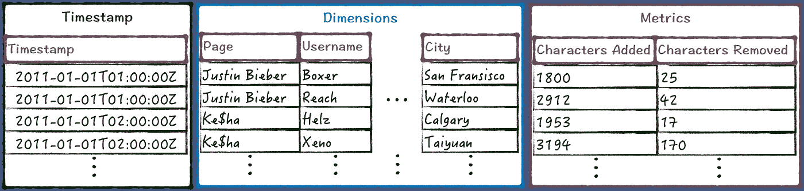
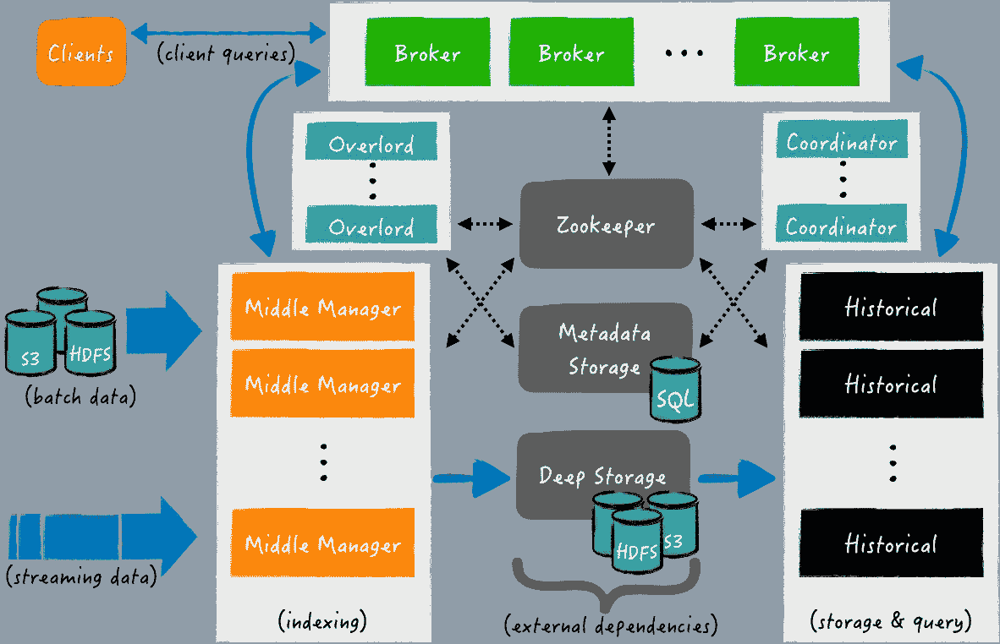
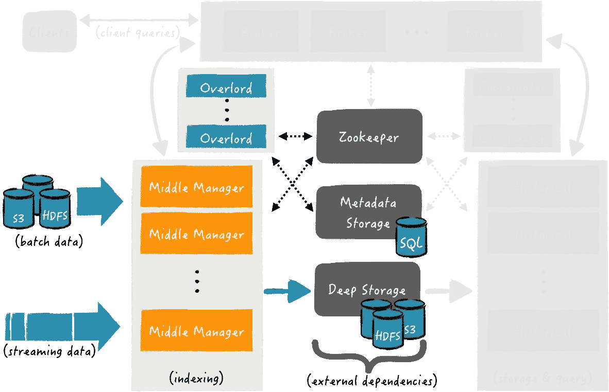
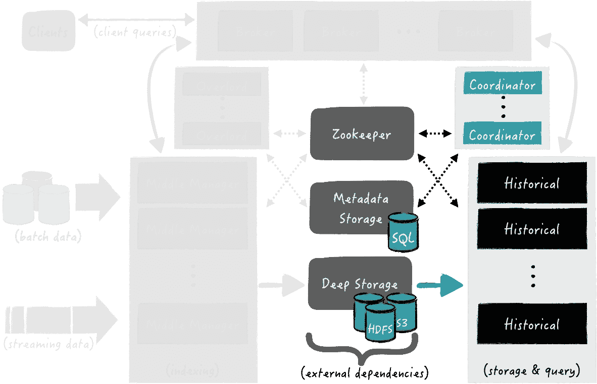
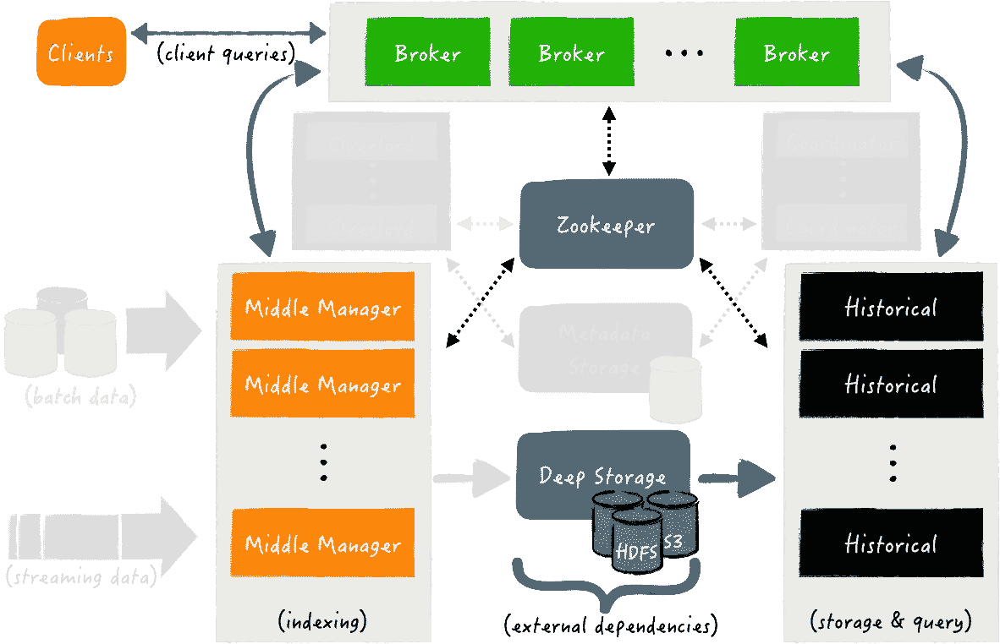

# Apache Druid(第 1 部分):可伸缩的 Timeseries OLAP 数据库系统

> 原文：<https://towardsdatascience.com/apache-druid-part-1-a-scalable-timeseries-olap-database-system-af8c18fc766d?source=collection_archive---------7----------------------->

在线分析处理(OLAP)系统通常用于许多商业智能、分析和数据科学应用中。根据[维基百科](https://en.wikipedia.org/wiki/Online_analytical_processing)，“OLAP 是一种在计算中快速回答多维分析查询的方法”。

与传统的关系数据库系统相比，主要区别在于 OLAP 系统中的数据是以预聚集和多维形式存储的。以这种形式存储数据的主要好处是，它针对特定的复杂聚合进行了优化。例如，通过使用不同的粒度级别(每小时、每天、每周等)存储预聚合。)，我们可以高效地回答类似“两年前的月销售额是多少？”，或者“在过去的 90 天里，用户每天使用我们服务的特定功能的平均时间是多少？”。此外，我们可能需要随时深入到更详细的视图，并在数据的任何其他维度上重新计算聚合。例如，现在我们想重新计算上述问题，并对世界上每个国家的结果进行分组，以便生成更详细的可视化/报告/仪表板，并帮助制定决策。

从关系数据库中收集这样的答案并非不可能，但是模式设计和维护的复杂性，以及能够“有效地”回答这种复杂的特别聚合的需求，可能会导致数据工程的噩梦(多个表、索引、可能的多个数据库和定制 ETL 任务)。

简而言之，OLAP 系统的主要特征概述如下:

*   保留数据的时间序列—例如，能够了解指标值的演变。
*   分析师通常执行的查询是特定的，因此系统应该能够回答任何业务问题，而不需要模式工程。应该快速收集和查询任何维度的数据。
*   与关系数据库相比，数据可能以大量冗余存储。这是期望的，或者是为了提高收集结果的速度(例如，避免连接)，或者是因为需要具有时间序列中的数据演变。
*   为了回答业务问题，可能需要扫描大量数据。

OLAP 系统背后的主要概念如下:

1.  [OLAP 立方体](https://en.wikipedia.org/wiki/OLAP_cube):你可以把立方体看作是电子表格的多维概括。例如，考虑我们想要按国家、按某些时间段(例如，每周、每月、每季度和每年)以及按任何其他可能的维度(例如，按地区、城市、服务特征等)进行销售。).
2.  对于任何查询来说，预先计算一个多维数据集中所有可能的聚合将是最快的答案响应时间的理想情况，但是这需要大量的处理时间和存储。根据业务需求、系统配置和聚合类型，我们通常设置哪些聚合将在数据接收期间完全预先计算，因此，任何其他聚合都是在查询计算期间按需计算的。

有许多商业和开源的 OLAP 系统，一个简单的比较可以在[维基百科](https://en.wikipedia.org/wiki/Comparison_of_OLAP_servers)中找到。正如本文标题所揭示的，我们将重点关注 [Apache Druid](http://druid.io/) ，这是一个分布式数据存储，旨在对大型数据集进行高性能切片分析(OLAP 式)。

# 阿帕奇德鲁伊

[Apache Druid](http://druid.io/) 由广告分析公司 [Metamarkets](https://metamarkets.com/) 创建，目前已经被许多公司[使用](http://druid.io/druid-powered)，包括 Airbnb、网飞、尼尔森、易贝、Paypal 和雅虎。它结合了来自 [OLAP 数据库](https://en.wikipedia.org/wiki/Online_analytical_processing)、[时间序列数据库](https://en.wikipedia.org/wiki/Time_series_database)和[搜索系统](https://en.wikipedia.org/wiki/Full-text_search)的想法，为广泛的用例创建了一个统一的系统。最初，Apache Druid 在 2012 年成为 GPL 许可下的开源软件，此后在 2015 年改为 Apache 2 许可，并在 2018 年加入 Apache 软件基金会作为孵化项目。

Druid 提供了什么来处理类似 OLAP 的查询:

*   为了存储效率和对数据维度的快速过滤，Druid 以面向列的压缩格式存储数据(参见[面向列的系统](https://en.wikipedia.org/wiki/Column-oriented_DBMS#Column-oriented_systems)和[面向列的数据库系统](http://nms.csail.mit.edu/~stavros/pubs/tutorial2009-column_stores.pdf))。因此，它可以处理数据冗余，同时使用有效的格式对多维聚合和分组执行查询。
*   为了回答查询，它只加载所需的精确列。
*   每一列都针对其特定的数据类型进行了优化存储。
*   为了提供跨多列的快速过滤和搜索，Druid 使用了最先进的压缩位图索引(详情见[简明](https://arxiv.org/pdf/1004.0403)和[咆哮](https://roaringbitmap.org/))。
*   任何数据源的模式(例如，Druid 中的一个表)都非常灵活，可以很容易地发展。
*   数据基于时间进行分区，因此时间序列查询比传统数据库快得多。
*   Druid 提供了开箱即用的算法，用于近似计数区分、近似排序以及近似直方图和分位数的计算。
*   它具有高度的可伸缩性，已经在生产环境中使用，每秒钟处理数百万个事件，存储数年的数据。
*   查询的亚秒级平均响应时间。
*   容错架构。
*   集成最先进的大数据技术，包括 [Apache Kafka](http://druid.io/docs/latest/development/extensions-core/kafka-ingestion.html) 、 [Apache Flink](https://github.com/druid-io/tranquility/blob/master/docs/flink.md) 、 [Apache Spark](https://github.com/druid-io/tranquility/blob/master/docs/spark.md) 和 [Apache Hive](https://cwiki.apache.org/confluence/display/Hive/Druid+Integration) 。
*   提供了一种基于本地 JSON 的语言，以及基于 HTTP 或 JDBC 的 SQL(实验性的)。
*   由高级商业智能和分析数据探索和可视化工具支持，如[元数据库](https://github.com/metabase/metabase)和 [Apache 超集](https://github.com/apache/incubator-superset)。

# 数据是如何存储的

Druid 中的表被命名为*数据源*，它们按照时间间隔进行划分。每个时间间隔被命名为*组块*，由*片段*组成。段是一种不可变的数据结构，它被周期性地持久化。例如，您可以设置每天或每小时创建一次分段，等等。如图 1 所示，一个段由以下三种列类型组成:

*   **时间戳**:数据的时间戳(是否汇总)。
*   **维度**:输入数据的字段，可用于过滤和分组。
*   **指标**:预聚合(例如，第一、最后、总和、最大值等。).



图 1 ~分段核心数据结构

每个*块*可以由一个或多个段文件组成。根据数据摄取的配置，当其记录的数量达到某个最大阈值(例如，五百万个记录)时，或者当存在多个并发摄取任务并且因此每个任务创建单独的段文件时，或者当任务中的段文件的文件大小超过某个阈值(例如，超过 512MB)时，可以创建段。有关细分市场的更多详细信息，您可以阅读官方文档。

此外，您可以指定段内数据的粒度。例如，假设您在用例中需要一个小时级别的粒度。您可以设置 druid 按小时自动聚合您的实时数据。为了说明 rollup 在 Druid 中是如何工作的，例如，考虑以下 JSON 中的输入数据片段:

```
{"timestamp":"2018-01-01T01:01:31Z","user_name":"Boxer","city":"San Fransisco","characters_added":1000} {"timestamp":"2018-01-01T01:02:16Z","user_name":"Boxer","city":"San Fransisco","characters_added":400} {"timestamp":"2018-01-01T01:03:21Z","user_name":"Boxer","city":"San Fransisco","characters_removed":25} {"timestamp":"2018-01-01T01:03:46Z","user_name":"Boxer","city":"San Fransisco","characters_added":400} {"timestamp":"2018-01-01T02:05:41Z","user_name":"Helz","city":"Calgary","characters_added":1800} {"timestamp":"2018-01-01T02:07:36Z","user_name":"Helz","city":"Calgary","characters_removed":17} {"timestamp":"2018-01-01T02:10:06Z","user_name":"Helz","city":"Calgary","characters_added":153}
```

每一行都是一个 json，代表一个输入事件。字段*时间戳*是使用 [ISO-8601](https://en.wikipedia.org/wiki/ISO_8601) 标准表示的事件的时间戳，而 *characters_added* 和 *characters_removed* 是度量。为了简化起见，给定的数据片段在示例 JSON 中只包括两个维度，即*用户名*和*城市*。通过将 rollup 设置为小时级别的粒度，上面的示例将被聚合到每小时的记录中，如图 1 所示。例如，在对应于区间*2018–01–01t 01:00:00Z*到*2018–01–01t 02:00:00Z*的段中添加的 _characters_ *的值就是其在该区间内的所有值的总和(即 *1000 + 400 + 400 = 1800* )。有关汇总的更多细节，请参见官方教程。*

# 架构的简要概述

Druid 有一个分布式和可伸缩的架构。Druid 的设计是由具有高可用性系统的需求驱动的，具有灵活的配置，同时是云友好的和易于操作的。下面的图 2 显示了该架构的示意图。



图 2 ~德鲁伊教建筑

首先，Druid 平台依赖于以下三个外部依赖:

1.  **深度存储**:它可以是任何分布式文件系统或对象存储，如亚马逊 S3、Azure Blob 存储、阿帕奇 HDFS(或任何 HDFS 兼容系统)，或网络挂载文件系统。深度存储的目的是持久存储 Druid 获取的所有数据，作为备份解决方案，同时在需要时可供所有 Druid 组件和集群使用。
2.  **元数据存储**:由传统的关系数据库系统支持，如 PostgreSQL 或 MySQL。所有元数据对任何 Druid 组件都可用。Druid 中有各种类型的元数据，有些与深层存储中的持久段有关，例如段文件的路径、它们的时间戳、它们的版本等等。其他可能与外部系统相关，如来自 Apache Kafka 主题的摄取的分区偏移，其余与各种内部进程的元数据相关(例如，其中现在正在创建片段)。
3.  **动物园管理员**:用于内部服务发现，协调，领袖选举。

Druid 的架构由以下处理类型的组件组成:

*   **中间管理器**进程处理集群的数据接收。例如，他们负责从 Apache Kafka 接收实时流数据，或者从其他来源加载批量数据(例如，来自 HDFS 的文件)。
*   **历史**进程处理“历史”数据的存储和查询。运行历史进程的节点从深层存储中提取数据段到本地磁盘，并响应关于这些数据段的查询。
*   **代理**进程接收来自外部客户端的查询。它们识别哪些*历史*和*中间管理器*节点正在服务这些段，并向这些进程中的每一个发送重写的子查询。此后，他们收集和合并结果，并回复呼叫者。在内部，*历史*进程响应对应于已经保存到深度存储的数据段的子查询，而*中间管理器*响应对应于最近摄取的数据(即，还没有发布到深度存储的内存中的数据)的子查询。
*   为了平衡*历史*和*中层管理者*流程上的数据，德鲁伊分别拥有**协调者**流程和**霸主**流程。*协调器*进程，具体来说，负责将段分配给运行*历史*进程的特定节点。类似地，*霸王*流程负责向*中层经理*分配摄取任务，并负责协调部门发布。
*   最后**路由器**处理，在*经纪人*、*领主*和*协调人*面前提供统一的 API 网关。它们的使用是可选的，因为你也可以直接联系*经纪人*、*上司*和*协调员*。

如前所述，Druid 由用于摄取、查询和协调的独立组件组成。每个 Druid 流程组件都可以独立地配置和伸缩，为您提供了最大的灵活性，以及对容错的健壮性(因为一个组件的中断不会立即影响其他组件)。此外，将深度存储和元数据存储与 Druid 系统的其余部分分离开来，可以从深度存储和元数据存储中保存的数据重新启动组件或整个集群。

# 数据摄取流程

数据接收流程分为两个部分。在第一部分中，*中层管理人员*正在运行索引任务，这些任务创建段并将其发布到*深层存储*。第二部分，通过*历史*进程从*深层存储*中获取发布的片段，以便在查询回答中使用。

## 索引:线段创建和发布

*中层管理人员*负责外部数据源的接收，例如在 HDFS 批量接收文件或从 Kafka 流式接收。图 3 中的图表突出显示了在数据摄取过程中参与的组件，而其余的组件是灰色的。在摄取期间，数据被索引、预聚合、分割成段(记录数量以及汇总间隔)，然后发布到*深层存储*。



图 3~索引:段创建和发布

来自数据源的数据摄取可对应于一个或多个摄取任务。对于日志和资源隔离，*中间管理器*进程创建摄取任务并将其转发给**Peons**——也就是每次处理单个摄取任务的独立 JVM 实例。

在索引任务开始时，会创建一个新的段。片段的输入数据可以来源于实时流(例如，卡夫卡主题)或一批文件(例如，HDFS 的 CSV 文件)。有两种摄入模式:

*   **附加模式**:当输入数据源是一个流(例如，Kafka 主题)或者批量索引任务被设置为附加模式(即，读取文件并附加一个现有的 Druid 数据源)时，任务将新的段添加到相同时间间隔的现有段集合中。
*   **覆盖模式**:旧段被停用，并被具有相同时间间隔的新版本号的新段替换。

Druid 的一个重要特性是，当前从实时任务中创建的片段是可立即查询的——例如，从 Kafka 消费的记录是可立即查询的，尽管它们尚未发布到*深层存储*。

当任务已经索引了每个段的最大数量的记录(例如，五百万条记录)或者达到了期望的汇总时间间隔(例如，每小时聚集)时，任务完成。此时，通过将其数据保存到*深层存储*并将元数据保存到*元数据存储*来发布该段。

## 移交:为查询应答提取已发布的段

图 4 中的图表突出显示了在切换期间参与的组件，其余的组件是灰色的。



图 4 ~移交:为查询应答提取已发布的片段

*协调器*进程定期轮询*元数据存储*，以便从数据摄取任务中找到任何新发布的片段。一旦一个新创建的段被一个*协调器*进程发现，它选择哪个*历史进程*应该从*深层存储器*中获取该段。当该段成功加载后，*历史流程*准备好为其提供查询服务。

# 查询回答

客户端直接向*代理*发送查询(或者通过*路由器*间接发送)。可以使用基于本地 JSON 的语言或实验性 SQL 语言来表达查询。查询的类型可以是[时间序列](http://druid.io/docs/latest/querying/timeseriesquery.html)、 [TopN](http://druid.io/docs/latest/querying/topnquery.html) 或 [GroupBy](http://druid.io/docs/latest/querying/groupbyquery.html) 中的任何一种。所有类型的前述查询至少包含目标间隔时间，以及感兴趣的维度和/或度量。目标时间间隔是 Druid 用来决定需要处理哪些片段来回答查询的信息。图 5 中的图表突出显示了在查询应答期间参与的组件，其余的组件是灰色的。



图 5 ~查询回答

一旦客户请求查询，*代理*的初始任务之一就是识别哪些流程服务于所需的细分市场。例如，假设 a 我们有兴趣找到“*从现在开始*过去 48 小时内每小时平均时间最高的前 10 名用户”。该查询既需要已经被索引并发布到*深层存储*的数据，也需要当前从*中层管理器*进程获取数据的片段。此时，*代理*将相应的子查询发送到*历史*和*中间管理器*节点，每个节点将计算请求的聚合和过滤，然后发回结果。最后，*代理*收集并合并所需的数据，然后将最终结果返回给客户机。

# 结论

[OLAP 系统](https://en.wikipedia.org/wiki/Online_analytical_processing)是非常强大的数据库，用于处理商业智能、分析和数据科学应用程序常用的复杂聚合的即席查询。其设计背后的特征和概念将它们与传统的关系数据库区分开来，并使它们成为这类应用程序的理想选择。本文简要介绍了类似 OLAP 的 timeseries 数据库 [Apache Druid](http://druid.io/) ，概述了它的架构以及它的组件为数据接收、索引和查询应答而交互的方式。正如已经说明的，该架构是云友好的、易于操作的、高度可扩展的和灵活配置的。已经了解了数据是如何组织的，查询是如何计算的，在下一篇文章中，我们将通过使用开源库 [Scruid](https://github.com/ing-bank/scruid) 的示例查询来关注 Druid 的实际使用。

*原载于 2019 年 3 月 29 日*[*anskarl . github . io*](https://anskarl.github.io/post/2019/druid-part-1/)*。*