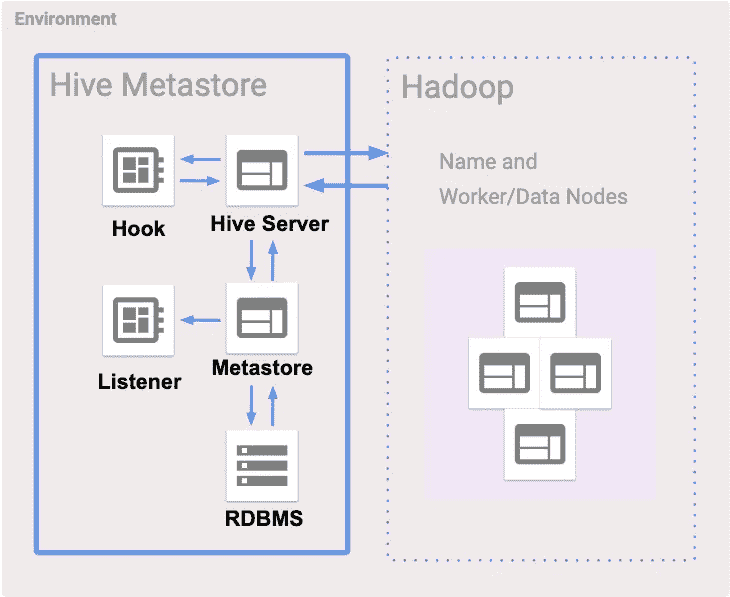
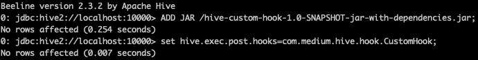
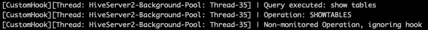
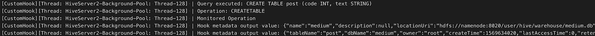
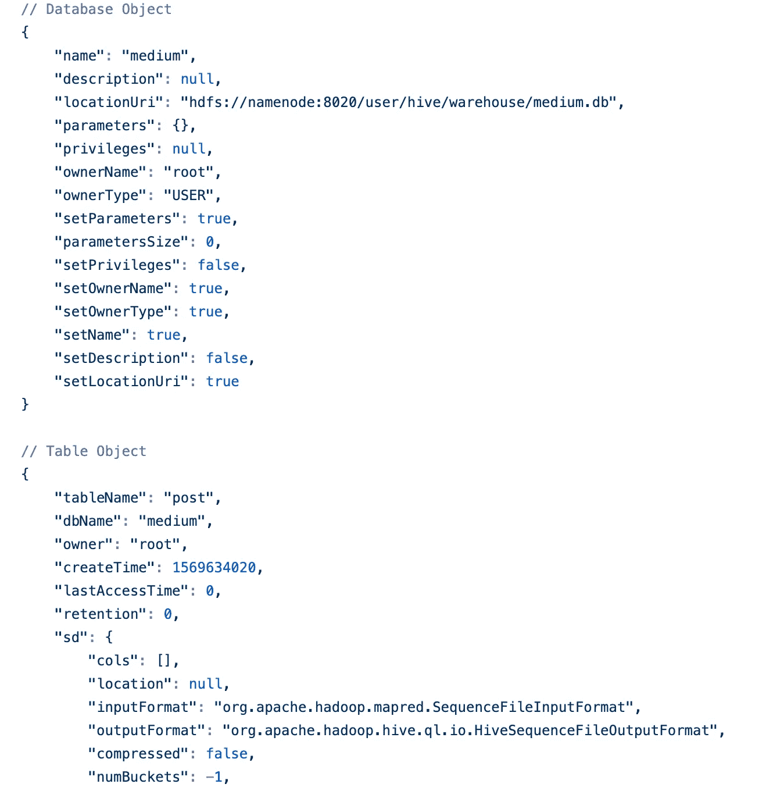
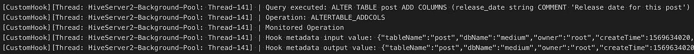
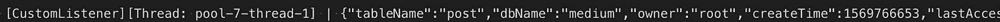
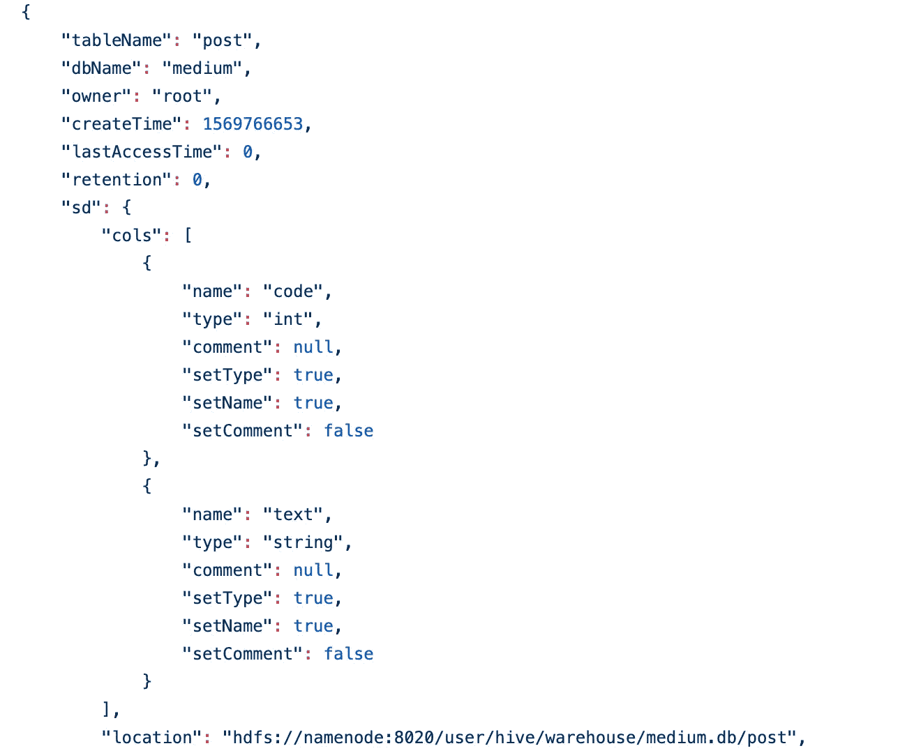
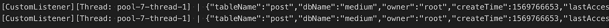

# Apache Hive 挂钩和 Metastore 监听器:元数据的故事

> 原文：<https://towardsdatascience.com/apache-hive-hooks-and-metastore-listeners-a-tale-of-your-metadata-903b751ee99f?source=collection_archive---------7----------------------->

## 元数据介绍，什么是 hive 挂钩和 metastore 侦听器，何时使用它们，以及使用它们的一些探索

Photo by [Dennis Kummer](https://unsplash.com/@dekubaum) on [Unsplash](https://unsplash.com/photos/52gEprMkp7M)

# 开始前的假设

本文的目标读者应该对 Hive 和 Hadoop 生态系统特性有基本的了解。本文着重于比较和展示编写一个 Hive 钩子和一个 Metastore 侦听器需要什么，使您能够自动化元数据管理。

本帖涵盖的主题将是:

*   **元数据管理的需求**
*   **元数据**
*   **元数据管理**
*   **为什么是阿帕奇蜂房？**
*   **配置单元挂钩和 Metastore 监听器**
*   **蜂巢挂钩概要**
*   **Metastore 侦听器摘要**
*   **开始使用 Hive 环境**
*   **探索钩子**
*   **探索听者**

# 元数据管理的需求

据 Gartner " *称，到 2020 年，大多数数据和分析用例* ***将需要连接到分布式数据源*** *，这将导致企业在元数据管理方面的投资翻倍。*”

读完这句话后，您可能想知道:元数据到底代表什么？为什么它需要管理？

我可以告诉你，这是几个月前我想到的第一个问题…

# [计]元数据

我们可以将元数据分类为:

*   **技术元数据**:关于资产的详细信息，比如它的名称、类型、创建者的名字、对象的大小，或者最后一次更新的时间。
*   **业务元数据**:提供关于资产的附加业务上下文，例如，它是否包含 PII(个人身份信息)、它应该被删除的日期以及许多其他信息。
*   **运营元数据** : 通常是关于资产使用情况的信息，如查询日志、数据采样和数据分析。

您还可以考虑关于资产的物理和逻辑信息，让我通过查看 Hive 和 Hadoop 生态系统来澄清这一点…

您的数据可以物理地存储在 hdfs 位置，并且在 Hive 上有许多不同的逻辑表指向它。

Photo by [Amy Chen](https://unsplash.com/@spdumb2025) on [Unsplash](https://unsplash.com/photos/xIzBdHcFodE)

这是一个很大的过程，但它会变得更加清晰…

# 元数据管理

元数据管理解决方案有助于回答与您的数据资产相关的问题，例如:

*   我的数据资产安全吗？
*   我是否符合所有这些新的数据保护法规？如 [CCPA](https://www.caprivacy.org) 、 [GDPR](https://gdpr-info.eu/) 、 [HIPAA](https://www.hhs.gov/hipaa/index.html)
*   谁具有可见性，谁可以对这些资产进行更改？

管理的本质通常始于维基、电子表格和各种文档，但当我们开始进入大数据世界时，它们很容易失去同步，我们变得无法回答这些问题。

你还记得关于脸书用户数据隐私的 50 亿美元罚款吗？你不想被放在一个无法回答这些问题的地方。

我们需要开始自动化我们的元数据管理！

A Data Dashboard. Photo by [Carlos Muza](https://unsplash.com/@kmuza) on [Unsplash](https://unsplash.com/photos/hpjSkU2UYSU)

# 为什么是阿帕奇蜂房？

正如 Gartner 所言:“*大多数数据和分析用例都需要连接到分布式数据源”。*虽然Hive 只是其中之一，但它是一个开源项目，仍然被许多组织使用。

通过深入研究配置单元挂钩和 Metastore 侦听器，我们将了解如何在这种环境中连接到数据源，并收集有关其元数据更改的信息。值得一提的是，对于更复杂的元数据场景，像 [Apache Atlas](https://atlas.apache.org/) 这样的健壮数据治理和元数据框架可以在这个过程中为您提供帮助。

因此，我们将在本文中展示的是非常简单的实现，可以帮助您入门。

# 配置单元挂钩和 Metastore 侦听器

为了节省您的时间，让我简单地说一下，从概念上讲，它们基本上是相同的。重点是如何将每一个注册到 Hive 中，以及为他们提供什么信息。

本质上，我们创建了一个扩展接口或抽象类的类，带有我们的自定义逻辑，它将被钩子或监听器事件调用。

根据事件的不同，我们将获得不同的工作对象，让我们看一些例子:

*   蜂巢挂钩:

Hive Hooks: Properties and Classes

*   Metastore 侦听器:

Metastore Listeners: Properties and Classes

对于它们中的每一个，你都有一对**属性**和**类**。

属性是触发事件的地方，而类是您必须扩展的，所以配置单元运行器知道如何调用它。

为了演示如何以及何时使用它们，我们将探索`**hive.exec.post.hook**`和`**hive.metastore.event.listener**`属性。

# 蜂巢挂钩概述

让我们来看看使用 Hive 钩子的优缺点:

**优点**

*   在查询处理的各个步骤中，可以更加灵活地运行/注入一些代码。
*   可用于更新您的资产元数据，如表的访问时间，例如[UpdateInputAccessTimeHook](https://github.com/apache/hive/blob/master/ql/src/java/org/apache/hadoop/hive/ql/hooks/UpdateInputAccessTimeHook.java)

**缺点**

*   关于您的资产的元数据可能很难理解，您可能必须解析它，因为您正在处理钩子对象。
*   您可以更改挂钩对象并影响配置单元查询处理。

对于 hive hook 方法，我们将使用`**hive.exec.post.hook**` 属性，这个属性在查询执行之后和结果返回给用户之前运行，一旦我们看到它运行，它将变得更加清晰。

# Metastore 侦听器摘要

让我们来看看使用 Metastore 侦听器的一些优点和缺点:

**优点**

*   关于您的资产的元数据已经被解析，更容易处理。
*   不能影响查询处理，它是只读的。

**缺点**

*   灵活性较差，您只能访问属于您的事件的对象。

对于 metastore 监听器方法，我们将使用`**hive.metastore.event.listener**`属性**。**

在该属性中，我们能够从`**MetaStoreEventListener**`抽象类的事件列表中进行选择。

Methods from the MetaStoreEventListener with their Parameters

为了使用它，我们覆盖我们想要的方法，当事件发生时，我们将接收参数对。为了展示这一点，我们将覆盖两个方法:`**onCreateTable**`和`**onAlterTable**`。

> 是时候动手了，让我们探索这两种策略。

# 开始使用 Hive 环境

我们将使用通常推荐的生产配置单元环境，在该环境中，我们为配置单元服务器、metastore 和底层 RDBMS(代表配置单元存储元数据)提供了单独的进程。

Hive Environment showcasing Hook and Listener usage

需要指出的是，钩子和监听器连接到不同的进程，正如你在上面的图片中看到的。

如果你想建立一个如图所示的环境，有一个很好的 repo: [docker-hive](https://github.com/big-data-europe/docker-hive) ，可以帮助你开始。

# 探索钩子

让我们来看看我们的定制钩子代码:

在 hook 上下文中，我们可以访问执行的查询、执行的操作以及查询执行的输入和输出。在这种情况下，我们只是过滤资产中的修改操作，并记录输入和输出值，这样我们就可以看到它们的结果。

出于测试目的，让我们在一个连接到我们的 Hive 服务器的直线终端中注册这个钩子。

现在让我们运行一些命令来查看它们的结果:

*   `show tables`

在我们的钩子中这是一个不受监控的操作，所以在这种情况下没有关于对象的日志，但是您能发现**操作元数据**吗？

> 我们正在记录执行的查询:)

*   `CREATE TABLE post (code INT, text STRING);`

让我们看看 JSON 日志对象:

Full JSON file [here](https://gist.github.com/mesmacosta/16d34ba5460122c86be06882f7c0b58e)

你能在这个 JSON 对象中找到所有的技术元数据吗？！看看所有这些字段和布尔标志，并开始思考我们可以监控的一切！

如果您注意到 JSON 中没有关于列名(`code`和`text`)的信息，那么在`CREATETABLE`事件中，如果我们需要这些信息，我们将需要额外的工作。

*   `ALTER TABLE post ADD COLUMNS (release_date string COMMENT ‘Release date for this post’);`

让我们看看 JSON 日志对象:

Some fields were suppressed to keep it short

与 Create Table 语句相比，我们有两个`output`对象，一个代表数据库，另一个代表表。
现在，对于 Alter Table 语句，我们有一个`input`对象和一个`output`对象，两者都表示表。

这里有一个问题，`output`对象不包含新列`release_date`，它表示应用更改之前的目标对象。

让我们使用侦听器运行相同的操作进行比较。

> 你可以在这个 git [repo](https://github.com/mesmacosta/hive-custom-hook) 上找到完整的实现。关于注册钩子需要改变什么文件的更多细节，请查看`README.md`文件。

# 探索听者

让我们看一下我们的定制监听器代码:

这里我们订阅了两个事件:`**onCreateTable**`和`**onAlterTable**`。如您所见，我们访问的对象与它们的事件相关联，对于`**onCreateTable**` 我们获得事件表元数据，对于`**onAlterTable**` 我们获得新旧表元数据。

当使用监听器时，我们不能像使用自定义钩子那样注册它，因为它运行在 Metastore 进程上。如果你想看到你需要修改的配置文件，请查看本主题底部的`README.md`。

现在让我们运行一些命令来查看它们的结果:

> 在运行命令之前，我清除了配置单元环境，以便我们能够使用相同的表名。

*   `CREATE TABLE post (code INT, text STRING);`

让我们看看 JSON 日志对象:

Full JSON file [here](https://gist.github.com/mesmacosta/58a51499cfd348802de4bf6018eec968)

*   `ALTER TABLE post ADD COLUMNS (release_date string COMMENT ‘Release date for this post’);`

Some fields were suppressed to keep it short

这里我们可以看到新的表元数据包含了添加的列`release_date`，因此使用已经解析的对象有其优势。

> 你可以在这个 git [repo](https://github.com/mesmacosta/hive-custom-metastore-listener) 上找到完整的实现。有关注册监听器需要更改哪些文件的更多详细信息，请查看`README.md` 文件。

# 结束语

在本文中，我们介绍了如何在 Hive 环境中连接来自资产的元数据，使您能够自动化元数据管理。我们演示了一个简单的实现，只是记录了操作性的元数据，但是正如我们在本文开头看到的，我们可能会处理许多分布式数据源。下一步是扩展代码，将元数据事件发布到消息系统，如 Kafka、Pub/Sub 或 SQS，并更新您的元数据管理工具。这样做将使我们能够将**业务**元数据添加到我们的资产中，所以敬请关注！

希望你觉得有用！如果你喜欢这篇文章并想看更多，一定要关注我的简介。

# 参考

*   **蜂巢钩**:【http://dharmeshkakadia.github.io/hive-hook/ 
*   **码头工人蜂巢环境**:[https://github.com/big-data-europe/docker-hive](https://github.com/big-data-europe/docker-hive)
*   **蜂巢挂钩的 Git repo**:[https://github.com/mesmacosta/hive-custom-hook](https://github.com/mesmacosta/hive-custom-hook)
*   **metastore 侦听器的 Git repo:**[https://github . com/mes macosta/hive-custom-metastore-listener](https://github.com/mesmacosta/hive-custom-metastore-listener)