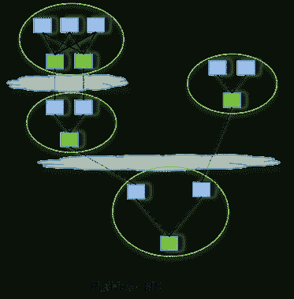
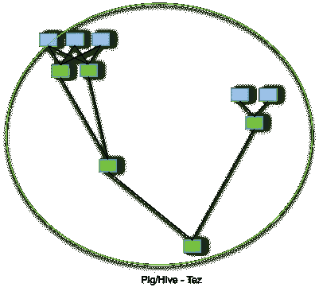

# Apache Hive 优化技术— 1

> 原文：<https://towardsdatascience.com/apache-hive-optimization-techniques-1-ce55331dbf5e?source=collection_archive---------5----------------------->

Apache Hive 是一个查询和分析引擎，构建在 Apache Hadoop 之上，使用 MapReduce 编程模型。它提供了一个抽象层，通过使用 Java API 实现传统的 SQL 查询，使用 SQL 语法查询大数据。蜂巢的主要组件如下:

*   Metastore
*   驾驶员
*   编译程序
*   【计算机】优化程序
*   执行者
*   客户

虽然 Hadoop/hive 可以处理几乎任何数量的数据，但优化可以在处理时间和成本方面带来与数据量成比例的巨大节省。在 hive 中可以应用大量的优化。让我们来看看我们将要涉及的优化技术:

1.  分割
2.  桶装
3.  使用 Tez 作为执行引擎
4.  使用压缩
5.  使用 ORC 格式
6.  连接优化
7.  基于成本的优化器

# **分区**

分区根据特定列的值将表分成几个部分。一个表可以有多个分区列来标识一个特定的分区。使用分区很容易对数据切片进行查询。分区列的数据不保存在文件中。在检查文件结构时，您会注意到它根据分区列值创建文件夹。这确保了在执行特定作业时只读取相关数据，减少了查询所需的 I/O 时间。因此，提高了查询性能。

当我们在分区表上查询数据时，它只会扫描要查询的相关分区，跳过不相关的分区。现在，假设即使进行分区，分区中的数据也相当大，为了进一步将它分成更易于管理的块，我们可以使用分块。

> *创建由(partition1 data_type，partition2 data_type，…)分区的表 table_name (column1 data_type，column2 data_type，…)。);*

*   表的列列表中未定义分区列。
*   在插入查询中，分区在开头被提及，并且它们的列值也与其他列的值一起被给出，但是在结尾。

> ***向表中插入 table_name 分区(partition1 = 'partition1_val '，partition2 = 'partition2_val '，…)值(col1_val，col2_val，…，partition1_val，partition2_val，…)；***

*   分区基本上有两种类型:**静态**和**动态**。名字是不言自明的。
*   **静态分区** 当我们知道将要加载的数据的分区时，就可以进行静态分区。当从大文件中加载表中的数据时，这应该是首选方法。它在严格模式下执行:

> ***设置 hive . mapred . mode = strict；***

*   **动态分区** 当我们不知道数据的分区时，就使用它。在表中加载数据需要更多时间。通常，我们使用另一个包含未分区数据的表来装载表中的数据。
    在配置单元中启用动态分区:

> **设置 hive . exec . dynamic . partition = true；**

**动态分区有两种模式:**
**严格:**这需要在加载数据时至少有一列是静态的。
**非严格:**这允许我们拥有所有分区列的动态值。

> **SET hive . exec . dynamic . partition . mode = non strict；**

使用动态分区时，还需要配置其他一些东西，比如

> **hive . exec . max . dynamic . partitions . pernode:**每个映射器/缩减器节点中要创建的最大分区数
> 
> **hive . exec . max . dynamic . partitions:**总共允许创建的最大动态分区数
> 
> **hive . exec . max . created . files:**MapReduce 作业中所有 mapper/reducer 创建的最大 HDFS 文件数
> 
> **hive . error . on . empty . partition:**如果动态分区插入生成空结果，是否抛出异常

# 桶装

存储桶提供了灵活性，可以进一步将数据分成更易于管理的部分，称为存储桶或集群。存储基于哈希函数，哈希函数取决于存储列的类型。由相同列值存储的记录将始终保存在相同的存储桶中。 **CLUSTERED BY** 子句用于将表分成桶。对于具有高基数的列，它工作得很好。

> 创建由(partition1 data_type，partition2 data_type，…)分区的表 table_name (column1 data_type，column2 data_type，…)。)按(clus_col1)聚类按(sort_col2)排序到 n 个桶中；

在 Hive 分区中，每个**分区**将被创建为一个**目录**。但是在 Hive 桶中，每个**桶**将被创建为一个**文件**。

> **设置 hive . enforce . bucket ing = true；**

使用分桶，我们还可以使用一个或多个列对数据进行排序。因为数据文件是大小相等的部分，所以分桶表上的映射端连接会更快。

当与 ORC 文件一起使用并用作连接列时，分段也有它自己的好处。我们将进一步讨论这些好处。

# 使用 Tez 作为执行引擎

Apache Tez 是一个客户端库，它像一个执行引擎一样运行，是传统 MapReduce 引擎的替代引擎，在 Hive 和 Pig 下，它允许使用 DAG 格式更快地处理作业。

为了研究 Tez 如何帮助优化作业，我们将首先研究 MapReduce 作业的定型处理序列:

*   Mapper 函数从文件系统中读取数据，将其处理成键值对，然后临时存储在本地磁盘上。这些按键值分组的键值对通过网络发送给 reducers。
*   在要运行 Reducers 的节点上，数据被接收并保存在本地磁盘上，等待来自所有映射器的数据到达。然后，将一个键的整组值读入一个 reducer，进行处理，并进一步写入输出，然后根据配置进一步复制输出。
*   正如您所注意到的，单个 MapReduce 作业中包含了大量不必要的读/写开销。运行多个 MapReduce 作业来完成单个配置单元查询，并且 MapReduce 作业的所有输出首先被写入 DFS，然后被传输到节点，并且由于两个 MapReduce 作业之间没有协调，所以循环被重复。

Apache Tez 通过不中断多个 MapReduce 作业中的 Hive-query 来优化它。因为，Tez 是一个客户端库，用于编排 MapReduce 作业的处理。Tez 使用如下步骤优化作业:

*   跳过缩减器的 DFS 写入，并将缩减器的输出直接作为输入管道传输到后续映射器中。
*   级联一系列减速器，而不插入映射器步骤。
*   连续加工阶段容器的重复使用。
*   使用预热容器实现最佳资源利用。
*   基于成本的优化。
*   矢量化查询处理。

我们可以使用下面的查询来设置执行引擎，或者在 hive-site.xml 中设置它。

> **设置 hive . execution . engine = tez/Mr**

# 使用压缩

正如您可能已经注意到的，hive 查询涉及大量的磁盘 I/O 或网络 I/O 操作，通过压缩减少数据的大小可以很容易地减少这些操作。Hive 中的大多数数据格式都是基于文本的格式，可压缩性很强，可以节省大量成本。但是，当我们考虑压缩时，有一个权衡，压缩和解压缩的 CPU 成本。

以下是执行 I/O 操作和压缩可以节省成本的主要情况:

*   从本地 DFS 目录中读取数据
*   从非本地 DFS 目录读取数据
*   将数据从缩减器移动到下一级映射器/缩减器
*   将最终输出移回 DFS。

此外，DFS 复制数据也是为了容错，当我们复制数据时，会涉及更多的 I/O 操作。

您可以将使用 Gzip 或 Bzip2 压缩的文本文件直接导入存储为 TextFile 的表格中。使用 LOAD 语句或通过在压缩数据位置上创建表，可以将压缩数据直接加载到 Hive 中。将自动检测压缩，并在查询执行期间动态解压缩文件。然而，在这种情况下，Hadoop 将无法将您的文件分割成块/块，并并行运行多个映射。但是，压缩的序列文件可以分割成多个。

上面的优化将会节省大量的执行成本，并且会使作业执行得更快。在下一篇文章的[中，我们将讨论剩下的技术:使用 ORC 文件的优化、连接查询的优化以及基于成本的优化。](https://medium.com/@info.ankitp/apache-hive-optimization-techniques-2-e60b6200eeca)

我希望你会发现这篇文章内容丰富且简单易学。如果你有任何疑问，请随时拨打 info.ankitp@gmail.com[的电话联系我](mailto:info.ankitp@gmail.com)