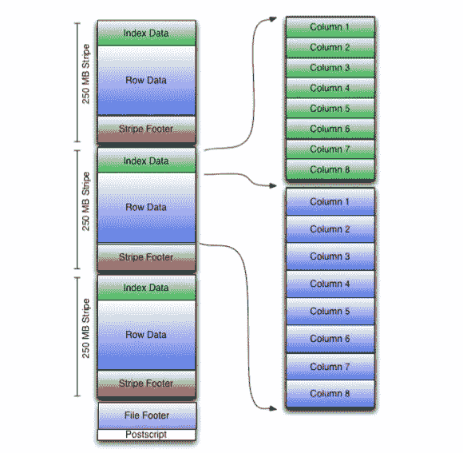

# Apache Hive 优化技术— 2

> 原文：<https://towardsdatascience.com/apache-hive-optimization-techniques-2-e60b6200eeca?source=collection_archive---------2----------------------->

在[早期文章](/apache-hive-optimization-techniques-1-ce55331dbf5e)中，我们介绍了如何使用分区和分桶进行适当的数据建模，选择 Tez 作为执行引擎以及压缩可以证明是非常大的成本节约因素。现在，让我们深入研究其他可以带来丰硕成果的优化因素。

# 使用 ORC 格式

选择正确的文件格式可以在很大程度上优化处理工作。Hive 支持一大系列文件格式:

*   文本文件
*   序列文件
*   RC 文件
*   Avro 文件
*   ORC 文件
*   镶木地板
*   自定义输入格式和输出格式

以前，这些列格式的大多数数据都是以分隔文本文件的形式存储的。在这些文件中，即使我们必须只读取一列，我们也必须读取和解析每行的整个记录。ORC 文件在 Hive 中支持多种优化，如下所示:

*   实现更高级别的压缩，可以使用配置单元中的 **orc.compress** 设置来更改压缩算法。默认情况下，它使用 Zlib 压缩。
*   如果与查询无关，它能够使用存储在文件中的轻量级索引跳过扫描块中的整个范围的行。
*   如果与查询无关，它能够跳过块内行的解压缩。
*   单个文件作为每个任务的输出，减少了名称节点上的负载。
*   它支持多个流同时读取文件。
*   它使用协议缓冲区将元数据保存在文件中，用于序列化结构化数据。

ORC 存储策略是面向列和面向行的。ORC 格式文件包含以适当大小的“条带”形式写入的表格数据，以便在单个映射器中进行处理(常见大小为 256 MB 和 512 MB。)条带可以由单独的任务处理，也可以不由单独的任务处理，一个 ORC 文件可以包含许多条带，每个条带都是独立的。在条带中，列是单独压缩的，只有查询投影中的列需要解压缩。

在一个条带中，数据分为 3 组:

1.  **条带页脚**包含流位置的目录。
2.  **行数据**用于表格扫描，默认包含 10，000 行。
3.  **索引数据**包括每列的最小值和最大值以及每列中的行位置。**行索引**条目提供偏移量，使得能够在解压缩的块中寻找到正确的压缩块和字节。请注意，ORC 索引仅用于选择条带和行组，而不用于回答查询。

仅使用 ORC 格式，就会产生以下优化:

*   下推谓词
*   布隆过滤器
*   ORC 压缩
*   …向量化…

## 下推谓词

ORC 读取器使用条带的索引数据中存在的信息来确定条带中的数据是否与查询相关。因此，在从行数据块中解包相关列之前，查询的 where 条件被传递给 ORC 阅读器。例如，如果 where 条件中的值不在块的最小/最大范围内，则可以跳过整个块。

## 布隆过滤器

Bloom Filters 是一种概率数据结构，它通过使用最少量的内存来告诉我们一个元素是否存在于一个集合中。布鲁姆过滤器的一个引人注意的地方是，它们偶尔会错误地回答某个元素存在，而实际上它并不存在。然而，他们的可取之处在于，如果某个元素存在，他们永远不会告诉你它不存在。

Bloom Filters 同样有助于 ORC 文件格式的下推谓词。如果为列指定了 Bloom filter，即使行组索引中的 min/max 值表明给定的列值在该行组的范围内，Bloom filter 也可以明确回答该值是否实际存在。如果 where 子句中的值很有可能不存在，这可以节省大量无意义的数据操作。

我们可以使用以下表属性设置布隆过滤器列和布隆过滤器的误报概率:

*   **orc . bloom . filter . columns:**应该为其创建 bloom filter 的列名的逗号分隔列表
*   **orc.bloom.filter.fpp:** 布隆过滤器的误报概率。

## ORC 压缩

ORC 格式不仅压缩列的值，还压缩整个条带。它还提供了对整体压缩算法的选择。它允许使用以下压缩算法:

*   **Zlib:** 更高的压缩率。使用更多 CPU 并节省空间。
*   **爽快:**压缩量少。使用更少的 CPU 和更多的空间。
*   **无:**完全没有压缩。

如果 CPU 很紧张，你可能想用 Snappy。您很少希望使用 none，它主要用于诊断目的。此外，蜂巢的作者是聪明的，如果它没有预见到任何边际收益，它不会压缩数据。

## …向量化…

使用矢量化查询执行，可以在很大程度上优化扫描、过滤、聚合和连接等查询操作。标准的查询执行一次处理一行，经历一个很长的代码路径以及大量的元数据解释。

矢量化通过一次处理一个包含 1024 行的块来优化查询执行，其中每一行都保存为一个矢量。在向量上，简单的算术和比较运算可以很快完成。执行速度加快是因为在同一类型的大数据块中，编译器可以生成代码以在一个紧循环中执行相同的函数，而无需经过独立函数调用所需的长代码路径。这种类似 SIMD 的行为导致了许多低层次的效率:更少的执行指令，更好的缓存行为，改进的流水线操作，更好的 TLB 行为，等等。

不是每种数据类型和操作都可以从矢量化中受益，但是大多数简单的操作可以，而且网络通常是一个显著的加速。

要使用矢量化查询执行，必须以 ORC 格式存储数据，并设置以下变量，如 Hive SQL 所示:

> **设置 hive . vectorized . execution . enabled = true；**
> 
> **设置 hive . vectorized . execution . reduce . enabled = true**
> 
> **设置 hive . vectorized . execution . reduce . group by . enabled = true**

我们可以使用 Explain 命令检查查询是否以矢量化的方式执行。在 Explain 命令的输出中，您可能会在不同阶段看到以下内容:

**执行方式:**矢量化

# 连接优化

因此，在深入研究连接优化之前，让我们了解一个普通的连接查询实际上是如何使用 MapReduce 执行的。

*   映射器对连接键上的表进行并行排序，然后传递给 reducers。
*   具有相同关键字的所有元组被给予相同的缩减器。一个缩减器可以为多个键获取元组。元组的键还将包括表 id，因此可以识别具有相同键的两个不同表的排序输出。Reducers 将合并排序后的流以获得连接输出。

在编写连接查询时要记住的一点是，最后提到的表是通过 reducer 传输的，其余的都缓存在 reducer 的内存中。因此，我们应该始终记住，大表是在最后提到的，这将减少 reducer 所需的内存，或者我们可以使用 STREAMTABLE 提示。

> *SELECT/*+stream table(a)*/a . val，b.val，c . val FROM a JOIN b ON(a . key = b . key 1)JOIN c ON(c . key = b . key 1)*

另一件需要注意的事情是，当 where 子句用于连接时，首先执行连接部分，然后使用 where 子句过滤结果。比如，在下面的查询中:

> SELECT a.val，b . val FROM a LEFT OUTER JOIN b ON(a . key = b . key)其中 a . ds = ' 2009–07–07 '和 b . ds = ' 2009–07–07 '

而在连接表时也可以执行相同的记录过滤。这可以通过包含过滤条件和连接条件来实现。

> SELECT a.val，b . val FROM a LEFT OUTER JOIN b
> ON(a . key = b . key AND b . ds = ' 2009–07–07 ' AND a . ds = ' 2009–07–07 ')

该连接包括混洗阶段，在该阶段中，映射器的输出被排序并用连接键混洗，这在处理、I/O 和数据传输成本方面需要很大的执行成本。因此，为了降低上述成本，已经开发了许多连接算法，例如:

*   多路连接
*   地图连接
*   桶图连接
*   中小企业加入
*   倾斜连接

## 多路连接

如果多个连接共享同一个驱动端连接键，那么所有这些连接都可以在一个任务中完成。
示例:(R1 pr1 . x = R2 . a—R2)pr1 . x = R3 . b—R3)pr1 . x = R4 . c—R4
所有连接都可以在同一个归约器中完成，因为 R1 已经根据连接键 x 进行了排序。
因此，通过在一个归约器中完成所有归约任务，减少了归约器的数量。Hive 自己做这个优化，内部管理。如下面的查询所示:

> 从 JOIN b ON(a . key = b . key 1)JOIN c ON(c . key = b . key 1)中选择 a.val，b.val，c.val

## 映射连接(广播连接或广播哈希连接)

对于星型模式连接非常有用，这种连接算法将所有小表(维度表)保存在所有映射器的内存中，而大表(事实表)在映射器中通过它进行流式传输。这避免了普通连接中固有的洗牌成本。对于每个小表(维度表)，将使用连接键作为哈希表键来创建哈希表，并且当在映射器函数中合并数据时，数据将与映射哈希值相匹配。

但是约束条件是，除了一个表之外，所有被连接的表都很小，所以连接可以作为仅映射作业来执行。

如果我们允许 Hive 通过执行以下设置来优化连接，则 hive 可以将连接优化到映射端连接中:

> **设置 hive . auto . convert . join = true；**
> 
> **设置 hive . auto . convert . join . noconditionaltask = true；**
> 
> **设置 hive . auto . convert . join . noconditionaltask . size = 10000000；**

前两个设置将允许 hive 优化连接，第三个设置将让 hive 了解 mapper 函数中的可用内存，以保存小表的哈希表。

或者，我们也可以在查询中使用 MAPJOIN 提示，例如:

> **SELECT /*+ MAPJOIN(b) */ a.key，a.value**
> 
> **从 a.key = b.key 上的 a JOIN b**

但是限制是，不能对表 b 执行全外连接和右外连接。

## 桶图连接

让我们假设表的大小更大，以适合映射器的内存。但是，当分块到存储桶中可以放入内存时，被连接的表在连接列上分桶，并且一个表中的存储桶数量是另一个表中存储桶数量的倍数，可以通过在内存中创建较小表的存储桶的哈希表并在映射器中流式传输另一个表的内容来将存储桶相互连接。假设，如果表 A 和 B 各有 4 个桶，那么下面的连接只能在映射器上完成。

> S ELECT /*+ MAPJOIN(b) */ a.key，a.value
> 从 a.key = b.key 上的 JOIN b

不是为 A 的每个映射器完全提取 B，而是只提取所需的桶。对于上面的查询，A 的映射器处理桶 1 将只提取 b 的桶 1。这不是默认行为，由以下参数控制。

> **设置 hive . optimize . bucketmapjoin = true**

## 排序-合并-桶联接

这是对存储桶映射连接的优化；如果要连接的数据已经按照连接键进行了排序，则避免创建哈希表，而是使用排序-合并连接算法。可以使用以下设置来使用此连接:

> **set hive . input . format = org . Apache . Hadoop . hive . QL . io . bucketizedhiveinputformat；
> 设置 hive . optimize . bucketmapjoin = true；
> 设置 hive . optimize . bucketmapjoin . sorted merge = true；**

该查询将与上面的查询相同，并且 hive 将形成它的执行策略。

> SELECT /*+ MAPJOIN(b) */ a.key，a.value
> 来自 a.key = b.key 上的一个 JOIN b

## 倾斜连接

如果数据的分布对于某些特定值是倾斜的，那么连接性能可能会受到影响，因为连接操作符的一些实例(map-reduce 世界中的 reducers)可能会过载，而其他实例可能会利用不足。在用户提示下，hive 会将 skew 值周围的连接查询重写为连接的联合。因此，它将执行一个查询来实现偏斜键的连接，另一个查询用于其余的连接键，并进一步合并两个查询的输出。

示例 R1 PR1.x=R2.a — R2，其中大部分数据分布在 x=1 附近，则此连接可以重写为(R1 PR1.x=R2.a 和 pr1 . x = 1—R2)union all(R1 pr1 . x = R2 . a 和 PR1.x <> 1 — R2)

> **设置 hive . optimize . skew join = true；
> 设置 hive . skew join . key = 500000；**

# 基于成本的优化

因此，我们都同意一个问题可能有多个解决方案的说法，直到基于成本的优化器出现，hive 才使用硬编码的查询计划来执行单个查询。CBO 让 hive 根据收集的元数据优化查询计划。CBO 提供了两种类型的优化:逻辑优化和物理优化。

**逻辑优化:**

*   投影剪枝
*   推导及物谓词
*   谓词下推
*   将选择-选择、过滤-过滤合并到一个运算符中
*   多路连接
*   重写查询以适应某些列值的连接偏差

**物理优化:**

*   分区修剪
*   基于分区和存储桶的扫描修剪
*   如果查询基于采样，则进行扫描修剪
*   在某些情况下，在地图端应用分组依据
*   优化联合，以便只能在地图端执行联合
*   在多路连接中，根据用户提示决定最后传输哪个表
*   删除不必要的 reduce sink 运算符
*   对于带有 limit 子句的查询，减少需要为表扫描的文件数量。

打开 CBO 通常会将查询的执行时间减半，而且效果可能会更好。除了这些优化，CBO 还将使用保存在 metastore 中的表的统计信息，将连接查询转换为可能的最佳连接。

可以使用 hive-site.xml 文件中的以下设置打开 CBO:

> **hive.cbo.enable=true**

如果 *hive.stats.autogather* 设置为 True，则表的统计信息由 hive 自动收集，否则可以使用 ANALYZE 命令进行计算。

我希望这篇文章和[之前的文章](/apache-hive-optimization-techniques-1-ce55331dbf5e)能够给你一个关于如何优化 hive 查询以及 Hive 的关键特性如何在后台使用 MapReduce 的完整概述。

我希望你会发现这篇文章内容丰富且易于学习。如果你有任何疑问，请随时拨打 info.ankitp@gmail.com[的电话联系我，并通过 LinkedIn](mailto:info.ankitp@gmail.com) 与我联系。