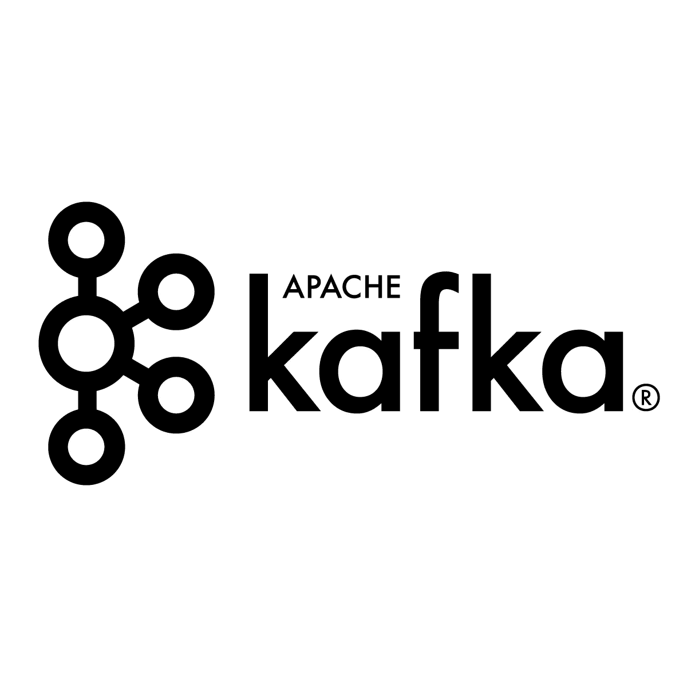
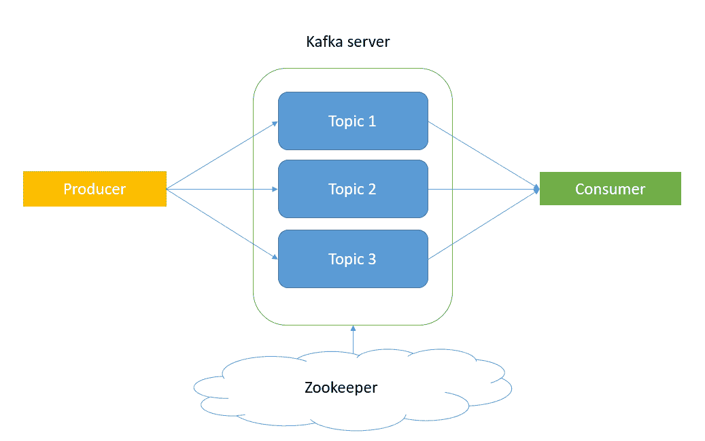
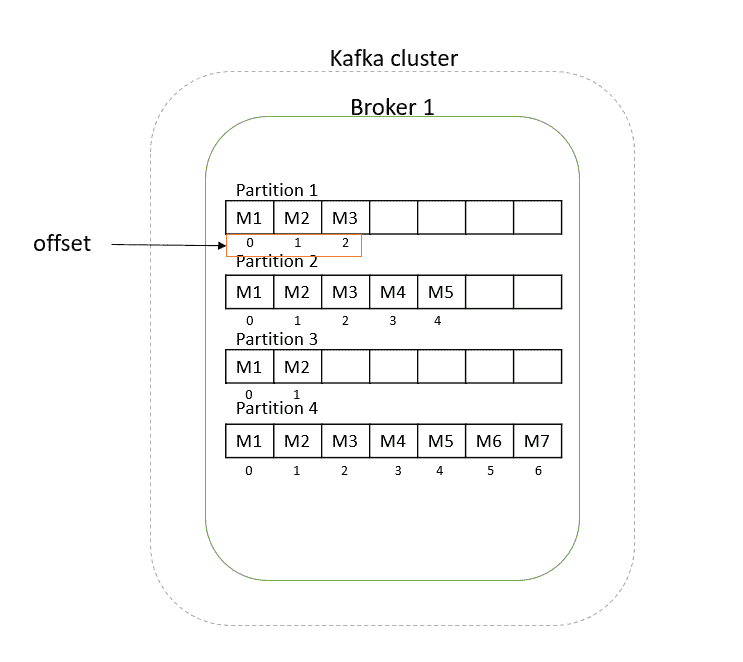
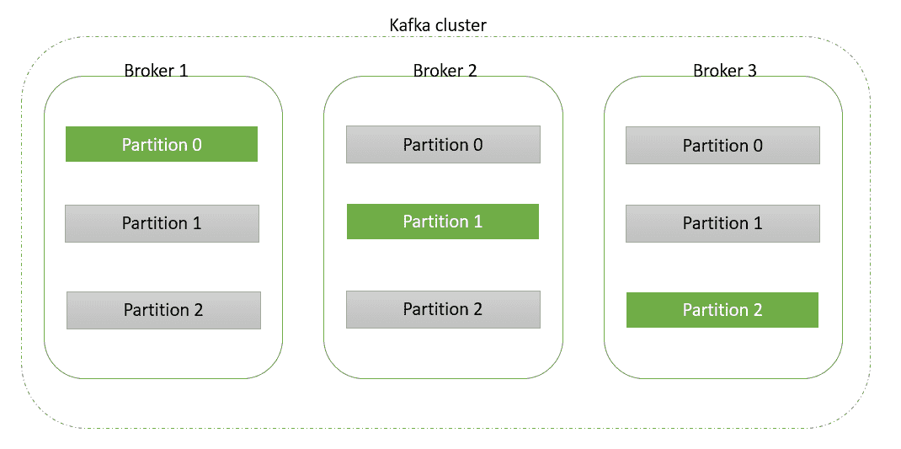
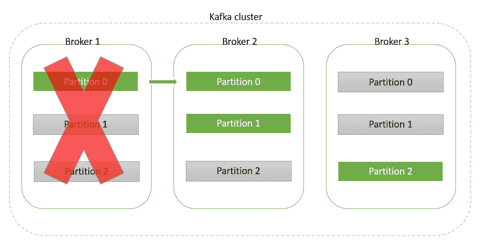
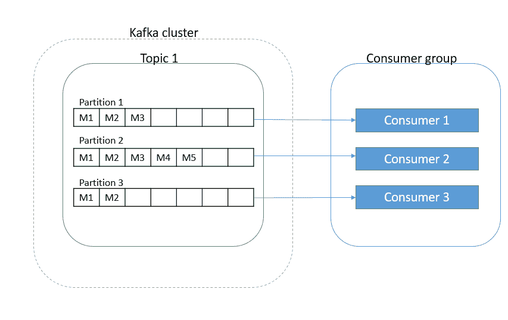

# 阿帕奇卡夫卡:平台架构和流分析

> 原文：<https://towardsdatascience.com/apache-kafka-platform-architecture-and-streaming-analysis-68ee8488561d?source=collection_archive---------20----------------------->



Kafka 是一个分布式流媒体平台，允许用户发送和接收包含大量数据的实时消息。

本文将详细讨论 Kafka 的体系结构，这对于理解如何正确设置您的流分析环境至关重要。稍后，我将通过用 Kafka 创建一个即时消息环境来提供一个实时数据分析的例子。到本文结束时，你将能够理解使卡夫卡如此有用的主要特征，它们是:

*   分布
*   提交日志
*   水平可扩展性
*   容错

现在，让我们记住它们，而不解释它们的含义，在介绍一些进一步的概念后，它们的含义会清楚得多。

让我们从卡夫卡建筑开始。主要思想是，发送者将把它的消息发送到 Kafka 服务器，接收者将要求 Kafka 服务器向他显示他感兴趣的消息。然后由 Apache 发布的软件 Zookeeper 跟踪 Kafka 服务器的状态，并管理消息的所有信息和配置。当然，架构要复杂得多，但底层框架就是这样。

现在，让我们通过初始化一些术语和“角色”，开始深入卡夫卡的结构:

*   生产者:是应用程序发送消息
*   消息:它被 Kafka 作为一个字节数组读取
*   消费者:接收消息的是应用程序
*   主题:卡夫卡流的独特名称

到目前为止，我们已经对它是如何工作的有了一个更具体的想法:



如前所述，卡夫卡不断收到收发信息的请求。这些订单处理和这些数据传输的方式是通过所谓的 Kafka broker，由 Zookeeper 进行协调和管理。代理只不过是一个 Kafka 服务器，这是一个有意义的名称。代理的概念直接导致了集群的概念。事实上，代理运行在 Kafka 集群上，Kafka 集群是一组机器，每个机器执行 Kafka 代理的一个实例。让我们将这两个进一步的概念添加到我们的列表中:

*   Broker:在集群上运行的 Kafka 服务器。它管理收到的消息并将它们发送给消费者
*   集群:一组机器，每个机器执行 Kafka broker 的一个实例

注意，机器集群的概念解释了**分布**的含义。事实上，分布式系统是一个分成多个运行机器(每个机器执行一个代理)在一个集群上一起工作的系统。

有时，生产者发送的数据量巨大而沉重，集群中的一台计算机可能无法存储和处理这些数据。这就是为什么 Kafka 提供了将我们的数据分割成更小部分的可能性，称为分区。每个分区都有一个唯一的 ID。分区的数量和大小由用户在创建主题时设置，然后 Kafka 将按照这些指示相应地拆分您的数据。

请注意，分区是基于只支持追加的持久有序数据结构的:您不能删除也不能修改已经发送到代理的消息，您只能向它们添加更多的消息。这个数据结构被称为**提交日志**。

因此，每个分区将包含一系列需要识别的消息，这就是偏移量应该做的事情。它是一个数字数组，按照消息发送的顺序标识一个分区的每条消息(因此第一条消息的 offset=0)。注意偏移是局部的，而不是全局的，这一点很重要:每个分区都有一个用等于 0 的偏移标识的消息，但是当然这些不是相同的数据！这就是为什么每条消息都有特定的标识路径:主题名、分区号(ID)、偏移量。总而言之:

*   分区:Kafka brokers 可以在其中拆分数据的“片段”之一
*   偏移量:一个 ID 号序列，在本地标识每个分区中消息的顺序



在上一张图中，我假设一个集群只有一台机器，因此只有一个代理。但是，当经纪人很多的时候，就需要引入 Kafka 生态系统的另一个特征。我说的是复制的概念:事实上，Kafka 能够在可配置数量的服务器(或代理)上存储 topic 的分区，这样每个分区都可以在其他代理上复制。因此，每个代理拥有几个分区，每个分区可以是一个主题的领导者或复制品。对于每个分区，有权管理它的代理是存储其“leader”版本的代理。但是，如果这个代理的机器出现故障，这个分区的处理将在它的一个副本上继续，该副本将成为新的领导者。

让我们把它形象化，让它更清楚:



这里我们有三个代理和三个复制因子为 3 的分区(每个分区有三个副本)。如果三个代理都没有崩溃，代理 1 将只处理存储在分区 0 中的数据，因为它是“主要”版本，而它的副本将与它同步。类似地，代理 2 和 3 将分别处理分区 1 和 2。这种处理数据的方式基于**水平可伸缩性**的概念，也就是说，通过投入更多的机器来解决同样的问题。

现在想象一下正在执行代理 1 崩溃的机器。发生的情况如下:



现在代理 2 的分区 0 是新的领导者，所以代理 2 将处理分区 0 和 1。这个概念有助于我们解释**容错**:如果一个分区有 *n 个*副本，那么即使发生 *n-1 个*故障也可以处理。

我想介绍的最后一个概念与消费者有关。假设我们只有一个消费者，但有大量的数据要发送给他:他可能无法处理所有这些数据。我们希望我们的数据被并行处理，但是我们如何实现呢？答案是通过创造一个消费群体。它是由几个消费者组成的单个接收应用程序，每个消费者从一个或多个分区中读取数据(但是同一个分区不能从两个不同的消费者中读取:没有重复)。因此，消费者的最大数量是分区的数量，否则一些消费者将什么也不做。请注意，当一个组中有多个用户时，消息在一个分区内按顺序读取，但是跨分区并行读取。

因此，一个示例情况可能如下:



我们将一个主题分成三个分区，并且我们有一个由三个成员组成的消费者组，每个成员阅读一个分区。

但是，如果有新的消费者喜欢这个群体，或者实际消费者离开，会发生什么呢？Kafka 如何决定重新分配分区并在新消费者的配置中重新平衡工作？

卡夫卡需要的是一个团体协调员，因此其中一个经纪人被选为团体协调员。当消费者想要享受或离开团体时，他必须将请求发送给团体协调员。第一个享受群体的消费者成为群体的领导者。因此，当需要某种重新平衡时，组协调者决定如何重新分配分区(记住消费者数量的上限)，而组长负责执行这个操作。

好了，现在你对卡夫卡的架构有了一个概念，让我们来运行一个非常基本的例子。

在为 Kafka 创建了我的虚拟环境之后，我创建了一个新的主题，叫做“test”，它不会被划分分区(的确，它只会有一个分区)，也不会被复制很多次(它的复制因子等于 1)；

现在，我正在创建我的生产者，编写他将发送给消费者的三条消息:

```
(kafka) [root@quickstart kafka] kafka-console-producer --broker-list localhost:9092 --topic test 
>hello 
>this is my first message 
>this is my second message
```

最后，让我们设置我们的消费者，它将能够接收生产者在上面写的消息:

```
(kafka) [root@quickstart kafka] kafka-console-consumer --bootstrap-server localhost:9092 --topic test --from-beginning hello 
this is mt first message 
this is my second message
```

如果使用 Spark Streaming 实现 Apache Kafka，您不仅可以跟踪流数据，还可以在其上构建相关分析。如果您需要跟踪工作的引擎并关注延迟或次优执行，或者如果您需要了解市场对您的新业务战略的反应，该工具尤其强大。

无论涉及哪个业务部门，实时数据分析都可以为其增加相关价值。

*原载于 2019 年 7 月 9 日*[*http://datasciencechalktalk.com*](https://datasciencechalktalk.com/2019/07/09/apache-kafka-platform-architecture-and-streaming-analysis/)*。*