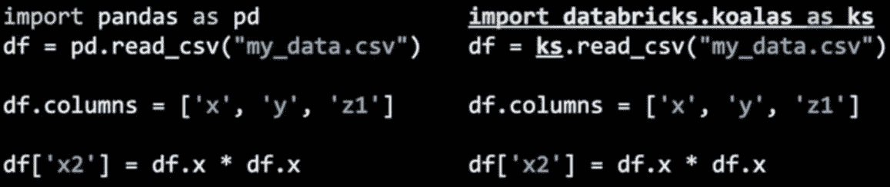

# 阿帕奇火花-3.0 斯内克峰

> 原文：<https://towardsdatascience.com/apache-spark-3-0-sneek-peak-284da5ad4166?source=collection_archive---------18----------------------->

Apache Spark 多年来一直保持强劲，现在带着其主要版本之一回归，其持续的目标是统一分析，将批处理和流世界融合为一。让我们来看看它的一些特点。

1.  改进的优化器和目录
2.  三角洲湖(酸性交易)+ Linux 基金会
3.  考拉:给熊猫带来火花尺度
4.  Python 升级
5.  深度学习
6.  库伯内特斯
7.  Scala 版本升级
8.  图形 API —图形和密码脚本。
9.  GPU 支持以及氢项目
10.  Java 升级
11.  纱线升级
12.  二进制文件

## **改进的优化器和目录:**

i) **可插拔数据目录:(DataSourceV2)**

*   可插拔目录集成
*   改进的下推
*   面向流和批处理的统一 API

```
eg: df.writeTo(“catalog.db.table”).overwrite($”year” === “2019”)
```

ii) **自适应查询执行**

*   在查询执行期间做出更好的优化决策

例如:它解释表的大小，并自动从排序合并连接变为广播连接等等..如果其中一张桌子很小

*   **动态分区修剪**加速昂贵的连接

基于维度表(小表)过滤器查询事实表(大表)也将被过滤，使连接更容易和最佳

## 三角洲湖:

Delta Lake 已经开源了很长一段时间，并且由于其易于实现和升级到任何现有的 Spark 应用程序而广受欢迎。我相信，这是下一代的数据湖，有助于克服数据沼泽以及 Lambda 和 Kappa 架构的局限性。现在有了 Linux 基金会的支持，这个程序将会更上一层楼。

以下是一些有助于我们向统一分析迈进一步的功能。

*   酸性交易
*   架构实施
*   可扩展元数据处理
*   时间旅行

**注:**关于 DeltaLake 的更多细节将会在我不久后的每日帖子中更新——(同时 [**关注我**](https://www.linkedin.com/in/jayvardhan-reddy-vanchireddy/) 或标签 [**#jayReddy**](https://www.linkedin.com/feed/hashtag/jayreddy/) )

## 考拉:给熊猫带来火花尺度:

考拉最近已经发布，它是 Python 开发人员的一个很大的附加产品，对于数据工程师和数据科学家来说都是如此，因为它在数据帧和熊猫之间有相似之处。现在，他们可以从单节点环境扩展到分布式环境，而不必单独学习 Spark 数据帧。

*   集成到 Python 数据科学生态系统中。例如:numpy，matpotlib
*   数据框架/系列 API 的 60%
*   60%的数据帧分组依据
*   指数/多指数 API 的 15%
*   如果图起作用，80%
*   90%的多索引列



## Python 升级:

Python 有望完全从版本 2 迁移到版本 3。

## 深度学习:

*   请求 RDD 操作中的 GPU。也就是说，您可以指定在 RDD 操作中每个任务使用多少个 GPU，例如用于 DL 训练和推理。
*   YARN+Docker 支持用 GPU 资源推出我的 Spark 应用。所以您可以很容易地在 docker 文件中定义 DL 环境。

## Kubernetes:

通过 Kubernetes 的主机集群是下一件大事，它可能是内部部署或云。与其他编排容器(如 Mesos 和 Docker Swarm)所用的时间相比，部署、管理和启动时间的简易性将会大大提高。

*   Spark-submit 使用变异的 webhook confs 在运行时修改 pods
*   GPU 资源的自动发现
*   执行程序 pod 级别的 GPU 隔离
*   spark-使用 pod 模板提交
*   指定用于任务的 GPU 数量(RDD 舞台，熊猫 UDF)

Kubernetes 编排容器并支持一些容器运行时，包括 Docker。Spark(版本 2.3 以上)附带了一个 docker 文件，可以用于此目的，并根据特定的应用程序需求进行定制。

## Scala 版本升级:

*   Scala 2.12

## 图形 API —图形和密码脚本:

火花图形 Api 有一个新的附加组件。

*   一个图形以及属性图和密码脚本。

密码查询执行、查询结果处理和属性图存储/加载。为 API 提供一个独立模块的想法是允许一个 Cypher 查询引擎的多种实现。

*   Graph query 将有自己的催化剂&它将遵循与 SparkSQL 相似的原则。

## GPU 支持以及氢项目:

NVIDIA 拥有最好的 GPU，它已经远远超过了任何其他供应商。Spark 3.0 最适合这种情况。(英伟达 RTX——2080)是值得警惕的。

*   列出 GPU 资源
*   自动发现 GPU
*   GPU 分配给作业和回退
*   熊猫 UDF 的 GPU
*   GPU 利用和监控
*   支持异构 GPU (AMD、Intel、Nvidia)

## Java 升级:

随着 Java 社区每一个新的 JDK 版本的发布，我们都可以看到它向函数式编程迈近了一步。

Java-8 版本的发布是它的开始，从 Lambda 表达式开始。

下面是一个变量声明的例子:

**Java 10 版本之前:**

```
String text = "HelloO Java 9";
```

**来自 Java 10 及更高版本:**

```
var text = "HelloO Java 10 or Java 11";
```

## 纱线升级:

*   GPU 调度支持
*   GPU 的自动发现
*   进程级的 GPU 隔离

下面是支持从 Spark 或 Yarn 3 版本开始的 GPU 的配置设置

## GPU 调度

**在 resource-types.xml 中**

```
configuration>
  <property>
     <name>yarn.resource-types</name>
     <value>yarn.io/gpu</value>
  </property>
</configuration>
```

**在 yarn-site.xml 中**

```
<property>
    <name>yarn.nodemanager.resource-plugins</name>
    <value>yarn.io/gpu</value>
  </property>
```

## 二进制文件:

为支持非结构化数据而添加的另一种文件格式。你可以用它来加载图像、视频等等。限制是它不能执行写操作。

```
val df = spark.read.format(BINARY_FILE).load("Path")
```

现在你已经知道了 Spark 下一个主要版本，你可以看看 Spark 3.0 预览版。

如果你喜欢这篇文章，那么你可以看看我的文章

*   [**深入火花内部架构**](https://medium.com/free-code-camp/deep-dive-into-spark-internals-and-architecture-f6e32045393b) 。
*   [**大数据生态系统架构**](https://github.com/Jayvardhan-Reddy/BigData-Ecosystem-Architecture)

**注:** Delta-Lake 和考拉既可以是 Spark-3.0 的一部分，也可以作为单独的实体作为 Databricks 的一部分。

如果你也愿意，可以在 LinkedIn 上与我联系— [Jayvardhan Reddy](https://www.linkedin.com/in/jayvardhan-reddy-vanchireddy) 。

# Apachespark # bigdata #数据工程师#数据科学#深度学习# ai # jayReddy # python # Scala # spark