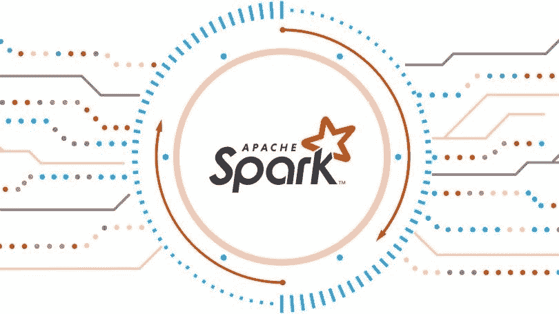
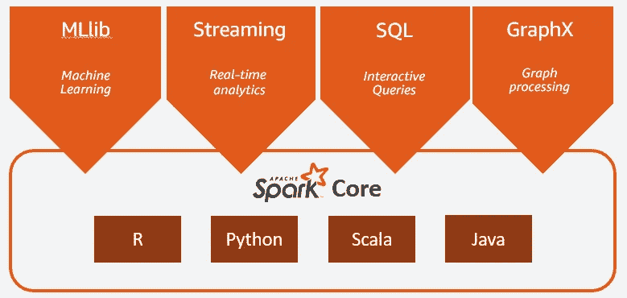
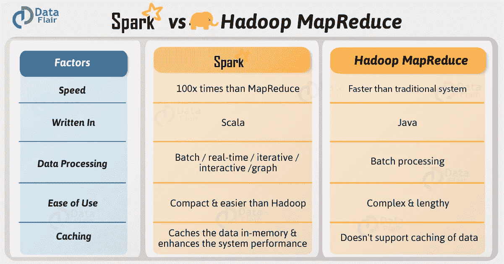

# Apache Spark:概念导向

> 原文：<https://towardsdatascience.com/apache-spark-a-conceptual-orientation-e326f8c57a64?source=collection_archive---------10----------------------->

## 这是什么？为什么重要？

# 什么是阿帕奇火花？

[Apache Spark](https://spark.apache.org/) ，曾经是 [Hadoop](http://hadoop.apache.org/) 生态系统的一部分，是一个强大的开源、通用分布式数据处理引擎，提供实时流处理、交互式处理、图形处理、内存处理、非常快速的批处理和易用性。应用程序开发人员和数据科学家将 Spark 集成到他们的应用程序中，以快速查询、分析和转换大规模数据。Spark 最常见的任务包括跨大型数据集的 ETL 和 SQL 批处理作业，处理来自传感器、物联网或金融系统的流数据，以及机器学习任务。领先的科技公司现在希望有一个强大的引擎可以做所有这些事情，幸运的是，如果你已经知道 Python 和 SQL，Spark 并不太难学。

Spark 最初于 2009 年在加州大学伯克利分校开发，此后许多互联网巨头都采用了 Spark，在 8K+节点的集群上集体处理数 Pb 的数据。它已经成为大数据领域最大的开源社区，拥有超过 1K+代码贡献者、180，000+成员和 400+会议。

# 重要术语

*   **Apache Spark**:“Apache Spark 是一个开源的分布式通用集群计算框架。”抱歉，你说什么？
*   **分布式计算** —简而言之，Apache Spark 解决了数据集太大，或者新数据太快，单台计算机无法处理的问题。进入分布式计算。这些任务可以在相互通信的多台计算机之间分配，而不是试图在单台计算机上处理计算量大的程序。当 Spark 说它与分布式数据有关时，这意味着它被设计来处理非常大的数据集，并在分布式计算系统上处理它们。
*   **通用** — Spark 非常灵活，有许多应用领域。它支持 Scala、Python、Java、R 和 SQL。它有一个专用的 SQL 模块，能够实时处理流数据，并有一个机器学习库和现成的图形计算引擎。
*   **集群计算—** 计算机集群是一组松散或紧密连接的计算机，它们协同工作，因此可以被视为一个单一系统。他们将每个节点设置为执行相同的任务，由软件控制和调度。
*   **分区数据**是指经过优化，能够在多个节点上处理的数据。
*   **RDDs**—Spark 的核心组件，弹性分布式数据集是数据元素的不可变分布式集合，可以存储在机器集群的内存中。它们可以与提供转换和动作的低级 API 并行操作。rdd 是容错的，因为它们跟踪数据沿袭信息，以便在出现故障时自动重建丢失的数据。
*   **容错** — Spark 是容错的。简而言之，容错指的是分布式系统即使发生故障也能继续正常工作的能力。如果一个节点发生故障，流程仍然可以运行。
*   **懒评价** — Spark 是“懒”，好的方面。当一个不“懒惰”的编译器编译代码时，它会依次计算每个表达式。一个懒惰的编译器不会不断地计算表达式，而是等待，直到它被真正告知输出一个结果，一次执行所有的计算。
*   **PySpark**——又名“Spark Python API”，py Spark 是与 Python 编程语言一起使用的 Spark，使数据科学专业人员更容易使用 Spark 的实用程序，他们对 Python 比对 Scala 更熟悉。
*   **Spark DataFrames** —组织成命名列的不可变分布式数据集合，就像关系数据库中的表一样，这允许开发人员将结构强加到分布式数据集合上。对于那些熟悉 Pandas 数据框架的人来说，这是相似的，只需要稍微长一点的时间来适应，并且对于较大的数据集更好。
*   **MLlib** —一个通用的机器学习库，旨在实现简单性、可扩展性和与其他工具的轻松集成。借助 Spark 的可伸缩性、语言兼容性和速度，数据科学家可以更快地解决和迭代他们的数据问题。
*   **GraphX** —一个用于图形和图形并行计算的 Spark 组件/库，它包括一个不断增长的图形算法和构建器集合，以简化图形分析。
*   **Spark Streaming**—Spark API 的扩展，允许数据工程师/科学家处理来自 Kafka、Flume 和 Amazon Kinesis 等来源的实时数据，并将其推送到数据库和实时仪表盘。它的关键抽象是一个离散化流(d Stream)，因为它是建立在 Spark RDDs 上的，所以允许与 MLlib 和 Spark SQL 无缝集成。

# 从 MapReduce 到 Spark:简史

在 Spark 之前，Google 使用 MapReduce(2004 年发布的框架白皮书)，这是一个弹性分布式处理框架，用于索引大型商用服务器集群中的大量 web 内容。他们想要分布数据:将数据文件分割成称为数据块的块，这些块可以分布在许多节点上，并在集群中复制。他们希望分配计算能力，在大型商用机器集群上自动并行化和执行任务，每个机器处理一个数据子集。他们希望通过将故障推迟到另一个节点来处理数据和计算，从而很好地处理故障。

一年后(2005 年)，Apache Hadoop 诞生了——这是一个开源框架，旨在跨计算机集群分布式存储和处理超大型数据集。该框架支持 Hadoop 分布式文件系统(HDFS ),这是存储的底层组件，它将文件分解成块，并将它们分布在集群节点上。它支持 Yarn 进行作业调度和集群资源管理，支持 MapReduce 进行并行处理，等等。

2009 年，加州大学伯克利分校的 AMP 实验室开始了 Apache Spark 的初步工作。2013-2014 年，Apache Software Foundation 决定将 Spark 作为重中之重，与 Databricks、IBM 和华为等富裕的支持者并列。目标是做一个更好的 MapReduce 版本。Spark 通过跨多个并行操作在内存中缓存数据来执行速度更快，而 MapReduce 涉及更多的磁盘读写。Spark 的启动速度更快，并行性更好，CPU 利用率更高。它提供了比 MapReduce 更丰富的函数式编程模型，并支持迭代算法。

# Spark 真正为科技行业带来了什么？

Spark 能够一次处理数 Pb 的数据。它很灵活，拥有一套跨 Java、Python、R 和 Scala 的丰富的开发人员库和 API。Spark 经常与 MapR XD、Hadoop 的 HDFS 和 Amazon 的 S3 等分布式数据存储、MapR Database、Apache HBase、Apache Cassandra 和 MongoDB 等流行的 NoSQL 数据库以及 MapR Event Store 和 Apache Kafka 等分布式消息存储一起使用。

## 具体优势:

1.  **简单:** Spark 的功能可以通过丰富的 API 来访问，这些 API 都有良好的文档记录和结构，使数据科学家和开发人员能够轻松快速地开始工作。
2.  **速度:** Spark 是为速度而设计的，在内存和磁盘上都可以运行。当支持存储在内存中的数据的交互式查询时，Spark 可以表现得很好。在这些情况下，有人声称 Spark 可以比 MapReduce 快 100 倍。
3.  **支持:** Spark 支持多种编程语言，包括 Java、Python、R、Scala，以及众多前沿存储解决方案。开发人员社区规模庞大、活跃且遍布全球。更多的商业提供商，包括 Databricks、IBM 和主要的 Hadoop 供应商，为基于 Spark 的解决方案提供技术支持。

## 特定功能:

1.  **流数据:**从活动日志到传感器数据，开发人员越来越多地被源源不断的新数据淹没，这些新数据往往同时来自多个来源。在数据到来时对其进行处理和操作通常是有意义的(例如识别欺诈性金融交易)。
2.  **机器学习:**随着数据量的增加，机器学习模型往往会变得更加有用和准确。Spark 将数据存储在内存中并快速运行重复查询的能力使其成为训练 ML 算法的良好选择。大规模地重复类似的查询减少了为了找到最有效的算法而评估可能的解决方案所需的时间。
3.  **交互式/自定义分析:**预定义的查询和静态仪表板效率较低，可扩展性较差，因为业务分析师和数据科学家希望通过提问、查看结果和实时深入研究来探索他们的数据。Spark 能够快速响应和适应，支持实时定制分析部署。
4.  **数据集成& ETL:** 来自不同业务系统的数据很少干净到足以方便地为报告/分析做准备。提取、转换和加载(ETL)过程通常用于将数据提取、清理、标准化和加载到新系统中进行分析。Spark 可以减少这个 ETL 过程所需的成本和时间。

An Example of Possible Data Ecosystems Built Around Spark

感谢您的阅读，

亚历克斯

***我们来连线！我鼓励你评论、分享或直接给我发消息，告诉我你对这里提出的想法的想法，或者对我今后应该关注的有趣话题的建议。***

[www.linkedin.com/in/alexandershropshire](https://towardsdatascience.com/www.linkedin.com/in/alexandershropshire)

[medium.com/@as6140](http://medium.com/@as6140)

[github.com/as6140](http://github.com/as6140)