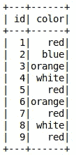
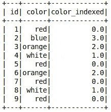
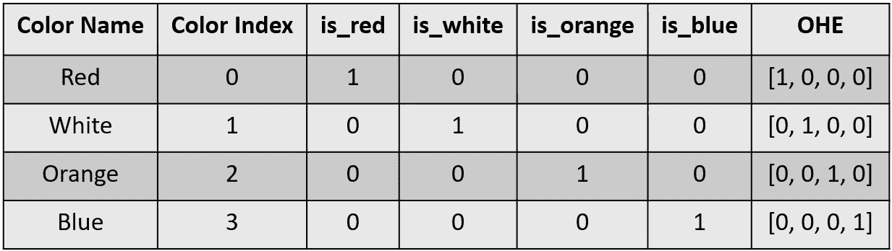
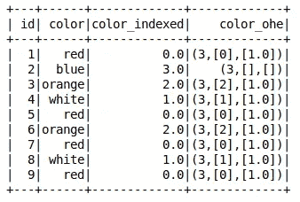
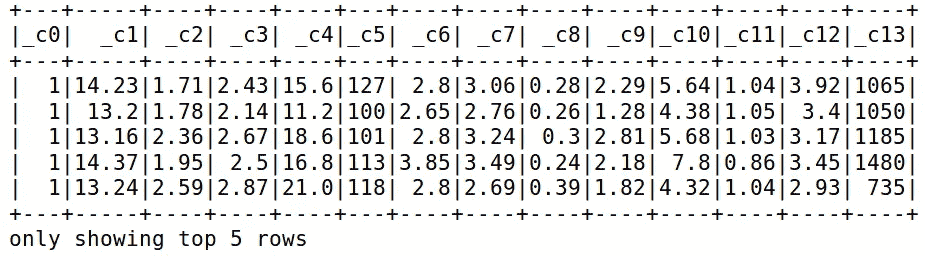
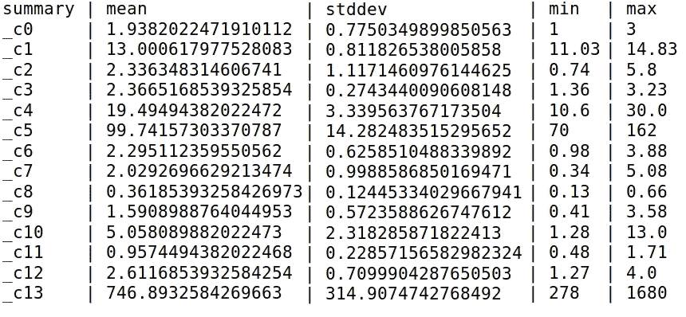
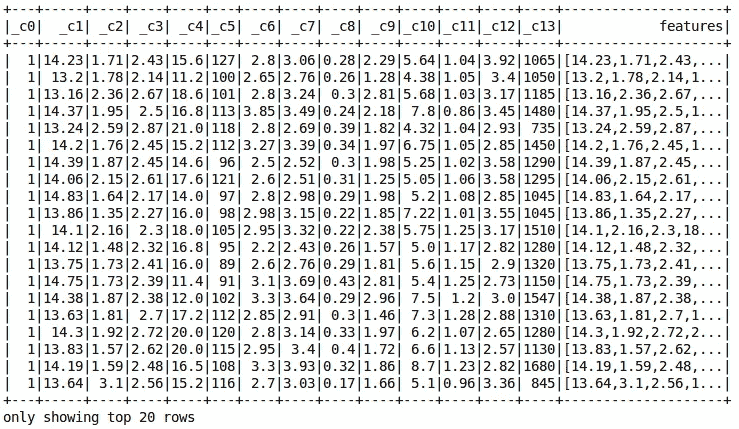
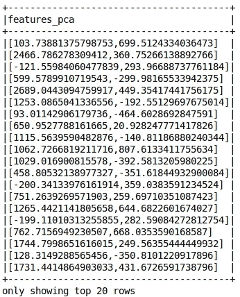
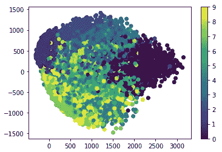

# 特征转换

> 原文：<https://towardsdatascience.com/apache-spark-mllib-tutorial-7aba8a1dce6e?source=collection_archive---------2----------------------->

## Apache Spark ML 教程

## 如何处理数据集中的不同要素类型

注意:本文是系列文章的一部分。查看完整系列: [*第 1 部分:回归*](/apache-spark-mllib-tutorial-ec6f1cb336a9) *，* ***第 2 部分:特征转化*** *，* [*第 3 部分:分类*](/apache-spark-mllib-tutorial-part-3-complete-classification-workflow-a1eb430ad069) *，第 4 部分及以上即将推出。*

在之前的文章中，我们谈到了 Spark ML 以及如何用它来训练回归模型。本文关注**特性转换。**我们会了解概念，以及如何在 Spark ML 中直接实现。


[Photo by Suzanne D. Williams](https://unsplash.com/photos/VMKBFR6r_jg)

# 特征转换

特征变换只是将特征从一种表示形式变换到另一种表示形式的函数。但是我们为什么要改变我们的特征呢？原因有很多，比如:

1.  数据类型不适合输入到机器学习算法中，例如文本、类别
2.  特征值可能会在学习过程中造成问题，例如，数据以不同的尺度表示
3.  我们希望减少用于绘制和可视化数据的要素数量，加快训练速度或提高特定模型的准确性

在本文中，我们将关注三种主要的转换技术:

*   处理分类变量
*   特征缩放
*   主成分分析

# 处理分类变量

## 分类数据

分类值是可以表示为类别或组的值。它们可以分为两种主要类型:*标称*和*序数*。

*   标称值只是没有定义顺序的名称或标签。例子:性别，颜色。
*   序数值是顺序很重要的类别。例如:t 恤尺寸、等级、级别。

机器学习算法无法处理以类别或标签表示的数据。因此，我们需要将这些值转换成更相关的格式。

## 资料组

我们将使用一个非常简单的数据集，这样我们就可以将全部注意力放在我们将要学习的技术上。数据集只是一个 CSV 文件，包含两个字段: *ID* 和 *Color* 。[从[这里](https://drive.google.com/open?id=1cgZG_6HdI92ThuFxt7V14qUN7n5b5ZoB)下载]

## 设置环境

对于本文的其余部分，以下是设置开发环境的常见步骤:

1.  打开一本 *Jupyter* 笔记本
2.  导入 *findspark* 并初始化它
3.  创建一个 *spark 会话*
4.  加载并显示数据

```
import findspark
findspark.init('/opt/spark')
from pyspark.sql import SparkSession
spark = SparkSession.builder.getOrCreate()
data = spark.read.csv('./datasets/colors.csv', header=True, inferSchema=True)
data.show()
```



Data

即使数据非常简单，我们也不能处理颜色列，因为它包含分类数据。

为了解决这个问题，我们将介绍两种主要的方法以及如何在 Spark ML 中实现:*字符串索引*和*一热编码*。

## 字符串索引

*字符串索引*背后的概念非常直观。我们只是用一个数字来代替每个类别。然后我们在模型中使用这个数字来代替标签。

我们是这样做的。首先，我们需要定义一个 **StringIndexer** 。

```
from pyspark.ml.feature import StringIndexer
indexer = StringIndexer(inputCol="color", outputCol="color_indexed")
```

注意这里的*索引器*是一个类型为**估算器**的对象。

> **估算器**抽象了学习算法或任何适合或训练数据的算法的概念。从技术上来说，**估算器**实现了一个方法 **fit()** ，它接受一个数据帧并产生一个**模型**，这是一个**转换器**。
> 来源:[https://spark . Apache . org/docs/1 . 6 . 1/ml-guide . html # estimators](https://spark.apache.org/docs/1.6.1/ml-guide.html#estimators)

这里估计器的目标是学习从颜色标签到颜色索引的映射。

接下来我们调用***fit()****方法来启动学习过程。*

```
*indexer_model = indexer.fit(data)*
```

*返回的 *indexer_model* 是类型 **Transformer** 的对象。*

> ***转换器**是一个抽象，包括特性转换器和学习模型。它实现了一个方法 **transform()** ，该方法将一个数据帧转换成另一个数据帧，通常通过追加一个或多个列来实现。
> 来源:[https://spark . Apache . org/docs/1 . 6 . 1/ml-guide . html # transformers](https://spark.apache.org/docs/1.6.1/ml-guide.html#transformers)*

*在拟合估计器并得到我们的转换器之后，是时候通过调用 ***transform()*** 对我们的数据使用它了。*

```
*indexed_data= indexer_model.transform(data)
# to view the data
indexed_data.show()*
```

*请注意如何在我们的 *outputCol* 字段中添加一个新列*“color _ indexed”**。**

****

**Data after running the StringIndexer**

**新列代表每个颜色值的索引。相似的颜色值具有相似的索引。这里我们看到红色、白色、橙色和蓝色分别被赋予数字 0、1、2 和 3。**

**这些数字将通过 **VectorAssembler** 收集到特征向量中，并传递给机器学习算法。**

**但是等等！我们还有一个问题。颜色是名义值，而不是序数。这意味着颜色名称之间没有顺序。比如:红色不大于，小于等于绿色。然而，基于当前的表示，机器学习模型可能以某种方式认为存在基于给定值的顺序。别担心，我们会用另一种叫做 **One Hot Encoding** 的技术来解决这个问题。**

## **一个热编码**

**我们使用**一个热编码(OHE)** 来打破分类列中的排序。应用 OHE 的过程如下:**

1.  **将分类列分成 *n* 个不同的列，其中 *n* 是列中唯一类别的数量**
2.  **在每一列中指定一个二进制值(0 或 1 ),表示数据点中颜色的存在**

**回到我们的例子，我们有四种独特的颜色:*红色，白色，橙色*和*蓝色*。因此，我们需要四列。我们将它们命名为:红色、白色、橙色和蓝色。现在，我们将把 *1* 放在 is_red 列中，把 *0* 放在其他列中，而不是给颜色*红色*设置一个值 *x* 。然后，我们将对数组中的值进行分组，以用作颜色特征，而不是由 StringIndexer 计算的单值索引。[参见下表以获得更好的想法]**

****

**One Hot Encoding Process**

**为了应用 OHE，我们首先导入 **OneHotEncoderEstimator** 类并创建一个估计变量。**

```
**from pyspark.ml.feature import OneHotEncoderEstimator
ohe = OneHotEncoderEstimator(inputCols=["color_indexed"], outputCols=["color_ohe"])**
```

**现在，我们对数据进行估计，以了解需要对多少类别进行编码。**

```
**ohe_model = ohe.fit(indexed_data)**
```

**我们得到了训练好的模型，是时候把它应用到我们的数据上了。**

```
**encoded_data = ohe_model.transform(indexed_data)
encoded_data.show()**
```

****

**Data after applying the One Hot Encoder**

**搞定了。我们有一个 *color_ohe* 列，它包含了我们的一次性编码数据。但是这个奇怪的表示是什么呢？它被称为 **DenseVector** 数据类型，用于减少存储空间。例如，数字 **(3，[0]，[1])** 意味着我们有一个 **3** 值的数组，这样我们在索引 **0** 处得到值 **1** ，在所有其他位置得到值 0。但是，我们有四个独特的类别，为什么有三个值呢？这就是 Spark ML 的工作方式。它省略了最后一个类别，以打破特征之间的相关性。通常你不必为此担心。但是如果您想强制 Spark ML 不删除最后一列，只需在构造函数中添加 **dropLast=False** 。**

```
**ohe = OneHotEncoderEstimator(inputCols=["color_indexed"], outputCols=["color_ohe"], dropLast=False)**
```

**现在 *color_ohe* 列已经准备好被您的 **VectorAssembler** 收集，而不用担心颜色之间的顺序关系。**

# **特征缩放**

**让我们从分类值转移到数字值。但是我们为什么需要烦恼呢？这种数据已经是数字了，可以直接用在机器学习模型中，对吗？不幸的是，情况并非总是如此。接下来，我们将了解什么是特征缩放，以及它如何改进我们的模型。**

## **资料组**

**我们将使用流行的 [**葡萄酒数据集**](https://archive.ics.uci.edu/ml/datasets/wine) 【从[这里下载](https://archive.ics.uci.edu/ml/machine-learning-databases/wine/wine.data)】。让我们装上看看。**

**注意:为了节省空间，我省略了列名。**

```
**data = spark.read.csv('./datasets/wine.csv', header=False, inferSchema=True)
data.show()**
```

****

**Wine dataset**

**你可能会问数据有什么问题？那么，仔细看看每一列中的值。有些值是小分数< 1, some range between 10 and 20 and others are in thousands. Notice for each column, the difference in means, standard deviations, minimum and maximum values. [Calculated with ***data.describe()。*显示()**方法】**

****

**Wine data statistics**

**这种规模上的多样性可能会在一些机器学习算法(如 KMeans)中导致许多问题。这是因为算法可能会根据变量的取值范围将某些变量视为更重要的变量。例如:考虑一个关于雇员的数据集。我们可能有一个范围在 0 → 30 之间的*年资*列和一个以千为单位的*薪水*列。但这并不意味着薪资一栏更占优势！**

**为了解决这个问题，我们将这些值转换为相同的比例。有很多转换方法，我们将研究其中的两种。**

**请注意，缩放器应用于 ***矢量数据类型*** 这就是为什么我们需要首先使用**矢量汇编器**来收集特征:**

```
**from pyspark.ml.feature import VectorAssembler
assembler = VectorAssembler(inputCols=data.columns[1:], outputCol="features")
data_2 = assembler.transform(data)**
```

****重要提示**:我们省略了 *_c0* 列，因为它是一个分类列。Scaler 应该只应用于数值。**

**这里我们得到了我们的*特性*专栏。**

****

## **标准缩放器**

****标准定标器**使用*列-汇总-统计，通过移除平均值并定标到单位标准偏差来标准化特征。***

**定义一个**标准定标器**:**

```
**from pyspark.ml.feature import StandardScaler
scaler = StandardScaler(inputCol="features", outputCol="scaled_features")**
```

****标准缩放器**可以接受两个附加参数:**

*   ***经受*:默认为真。将数据缩放到单位标准偏差。**
*   ***withMean* :默认为假。缩放前将数据以平均值为中心。**

**现在我们在数据集上拟合我们的估计量。**

```
**scaler_model = scaler.fit(data_2)**
```

**最后，我们将我们的转换器应用于数据，以获得我们的缩放特征。**

```
**scaled_data = scaler_model.transform(data_2)**
```

**搞定了。我们已经准备好了我们的缩放功能。**

## **最小最大缩放器**

**应用任何其他定标器的过程与上面完全相同，但是使用不同的类名及其相关参数。**

****MinMaxScaler** 将数据值转换到特定的范围内(默认为[0，1])。**

**完整示例:**

```
**from pyspark.ml.feature import MinMaxScaler
scaler = MinMaxScaler(min=0, max=1, inputCol='features', outputCol='features_minmax')
scaler_model = scaler.fit(data_2)
data_3 = scaler_model.transform(data_2)**
```

# **主成分分析**

****主成分分析** (PCA)是在分析变量的相关特征后，将一组观测值从 *m* 转换到 *n* 维 *(m > n)* 的过程。它用于将数据从高维移动到低维，以实现可视化或降维的目的。我不会说太多细节，因为我的目标是教你如何应用它。**

**应用 PCA 与应用其他估计量没有什么不同:**

1.  **创建一个*估算器*，**
2.  **把它安装在模型上，得到一个变压器，**
3.  **将转换器应用于数据。**

**为了看看 **PCA** 有多强大，我们将把它应用于手写图像数据集【从[这里](https://drive.google.com/open?id=1SPQS2tD4khaixSHGtTIORN4w11z1zjEo)下载】。该数据有 785 列。第一列表示定义数字类(0 →9)的标签，其他 784 列表示 28*28 图像的像素值。**

**我们的大脑很难想象比三维更高的东西。这里我们的数据有 784 个维度！所以在这个表示中，use 不可能理解它。幸运的是，我们可以使用 **PCA** 将尺寸减少到只有 2！**

**首先，我们读取数据并将像素收集到特征列中:**

```
**data = spark.read.csv('./datasets/digits.csv', header=True, inferSchema=True)
from pyspark.ml.feature import VectorAssembler
assembler = VectorAssembler(inputCols=data.columns[1:], outputCol='features')
data_2 = assembler.transform(data)**
```

**给定 **k = 2** (输出维数)，我们创建 PCA 模型:**

```
**from pyspark.ml.feature import PCA
pca = PCA(k=2, inputCol='features', outputCol='features_pca')**
```

**我们训练评估者:**

```
**pca_model = pca.fit(data_2)**
```

**最后，我们将模型应用于数据:**

```
**pca_data = pca_model.transform(data_2).select('features_pca')**
```

**注意 *features_pca* 列只有两个值。这些值是从 784 → 2 减少的维数。**

****

**PCA features with K = 2**

**现在，请注意，当我们绘制这些值并用每个数字标签标注时会发生什么。**

****

**Digits plotted with 2 dimensions**

**看看我们如何漂亮地只用二维来绘制数字的分布。我们看到相似的数字形成了一个簇，这种洞察力对于后面的处理非常有用。**

****PCA** 使用得当是非常强大的。它可以帮助你可视化数据，或者为其他机器学习算法做准备。**

# **最后的想法**

**在本文中，我们介绍了**特性转换**的基础知识。一套帮助将我们的数据转换为更相关或优化的格式以用于机器学习算法的技术。我们讨论了最常见的方法以及如何在 Spark ML 中实现它们。接下来，我们将学习如何将这些技术付诸实践，以及如何在完整的工作流程中组织它们。敬请关注…**

**如果你喜欢这篇文章，请点击“鼓掌”按钮，我将不胜感激👏所以可能会传染给他人。也可以在 [*推特*](https://twitter.com/alimasri1991)*[*脸书*](https://www.facebook.com/alimasri91)*[*上关注我直接发邮件给我*](mailto:alimasri1991@gmail.com) *或者在*[*LinkedIn*](https://www.linkedin.com/in/alimasri/)*上找到我。*****