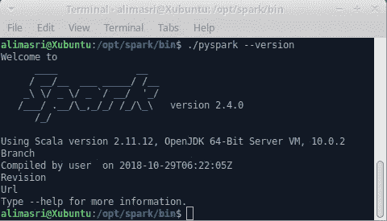
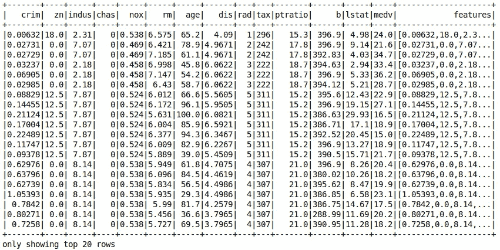
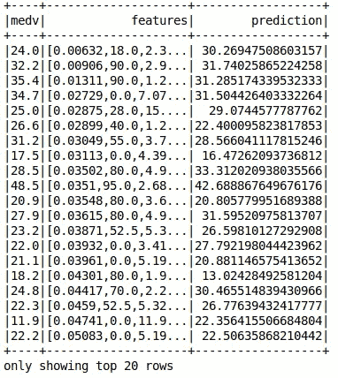

# 线性回归

> 原文：<https://towardsdatascience.com/apache-spark-mllib-tutorial-ec6f1cb336a9?source=collection_archive---------8----------------------->

## Apache Spark ML 教程

## 介绍 Spark ML 以及如何使用它来训练线性回归模型

注意:本文是系列文章的一部分。查看完整系列: ***第 1 部分:回归*** *，* [*第 2 部分:特征转化*](https://medium.com/@alimasri1991/apache-spark-mllib-tutorial-7aba8a1dce6e) *，* [*第 3 部分:分类*](/apache-spark-mllib-tutorial-part-3-complete-classification-workflow-a1eb430ad069) *，第 4 部分及以上即将推出。*


本系列的目标是帮助您开始使用 Apache Spark 的 ML 库。我们将一起探索如何以一种结构良好的方式解决各种有趣的机器学习用例。最后，您将能够满怀信心地使用 Spark ML，并学会为您未来的项目实现一个有组织且易于维护的工作流

在本系列的第一部分，我们将重点关注 Spark ML 的基础知识。我们将介绍创建回归模型来预测房价的必要步骤。更复杂的 Spark ML 特性和功能将在本系列的后续文章中发布。

在进一步讨论之前，让我们从一些定义开始。

# 定义

## 阿帕奇火花

Apache Spark 是一个开源的集群计算框架。Spark 代码库最初是由加州大学伯克利分校的 AMPLab 开发的，后来被捐赠给了 Apache Software Foundation，该基金会一直维护着它。Spark 提供了一个接口，通过隐式数据并行和容错对整个集群进行编程。

## 火花毫升

[Apache Spark](https://spark.apache.org/mllib/) ML 是由常用学习算法和实用程序组成的机器学习库，包括分类、回归、聚类、协同过滤、降维以及底层优化原语。

## 为什么选择 Spark ML？

迈向大数据时代需要对非常大的数据集进行大量迭代计算。机器学习算法的标准实现需要非常强大的机器才能运行。依赖高端机器并不有利，因为它们价格高昂，而且不适合扩大规模。使用分布式计算引擎的想法是将计算分布到多个低端机器(商用硬件)，而不是一个高端机器。这无疑加速了学习阶段，并允许我们创建更好的模型。

# 软件要求

为了继续学习本教程，您必须安装以下软件:

*   计算机编程语言
*   阿帕奇火花
*   findspark 库
*   Numpy
*   朱皮特

## 阿帕奇火花

安装 Apache Spark 是如此简单。你只要从[官网](https://spark.apache.org/downloads.html)下载包就可以了。

要测试您的实现:

1.  解压缩文件
2.  转到 ***bin*** 目录
3.  运行以下命令

```
% ./pyspark --version
```

输出应该如下所示:



Testing Apache Spark version

## findspark 库

为了更容易到达 Apache Spark，我们将使用 [findspark](https://github.com/minrk/findspark) 。这是一个非常简单的库，可以自动设置开发环境来导入 Apache Spark 库。

要安装 findspark，请在 shell 中运行以下命令:

```
% pip install findspark
```

## Numpy

Numpy 是 Python 中著名的数值计算库。Spark ML 在内部使用它进行计算。

使用以下命令安装它:

```
% pip install numpy
```

**Jupyter**

[Jupyter Notebook](https://jupyter.org)是一个开源的网络应用程序，允许你创建和共享包含实时代码、公式、可视化和叙述性文本的文档。用途包括:数据清理和转换、数值模拟、统计建模、数据可视化、机器学习等等。

要安装 Jupyter:

```
% pip install jupyter
```

# 问题定义

这个系列的第一个问题是 ***回归*** 。我们将训练一个模型来预测著名的 [*波士顿房屋*](https://www.cs.toronto.edu/~delve/data/boston/bostonDetail.html) 数据集(从[这里下载](https://drive.google.com/open?id=1-zxrKH1T0fM1Oi1mZzCWNtzHzeM4OsKt))。

该数据集包含由美国人口普查局收集的有关马萨诸塞州波士顿地区住房的信息。它是从 [StatLib 档案](http://lib.stat.cmu.edu/datasets/boston)中获得的，并在整个文献中被广泛用于基准算法。

数据集很小，只有 506 个案例。它包含 14 个特征，描述如下:

1.  CRIM:城镇人均犯罪率
2.  ZN:面积超过 25，000 平方英尺的住宅用地比例
3.  印度河流域:每个城镇非零售商业英亩数的比例。
4.  CHAS: Charles River 虚拟变量(如果区域边界为河流，则为 1；否则为 0)
5.  NOX:氮氧化物浓度(百万分之一)
6.  RM:每个住宅的平均房间数
7.  年龄:1940 年以前建造的自有住房的比例
8.  DIS:到五个波士顿就业中心的加权距离
9.  RAD:放射状公路可达性指数
10.  税收:每 1 万美元的全价值财产税税率
11.  PTRATIO:按城镇分列的师生比率
12.  B: 1000(Bk — 0.63)，其中 Bk 是按城镇划分的黑人比例
13.  LSTAT: %人口的较低地位
14.  MEDV:以千美元为单位的自有住房中值

**目标是使用这 13 个特征来预测 MEDV 的价值(代表房价)。**

是时候把手弄脏了。让我们跳跃到火花和火花中。

# 履行

## 设置 Apache Spark

准备好你的开发环境午餐 ***Jupyter*** 并创建一个新的笔记本。

```
% jupyter notebook
```

我们首先导入 ***findspark*** 库，并通过传递 Apache Spark 文件夹的路径来初始化它。

```
import findspark
findspark.init('/opt/spark')
```

每个 Spark 应用程序都需要一个 ***SparkSession*** 。

为了创建一个 ***SparkSession*** 我们写:

```
from pyspark.sql import SparkSession
spark = SparkSession.builder.getOrCreate()
```

## 加载数据

```
data = spark.read.csv('./boston_housing.csv', header=True, inferSchema=True)
```

*   header=True 表示第一行包含标题
*   inferSchema=True 启用底层数据模式的自动检测

要显示数据:

```
data.show()
```


Top 20 rows of the data

## 设置功能

现在是有趣的部分… Spark ML 的算法期望数据以两列表示:**特征**和**标签**。Features 是用于预测的所有特征的数据点数组。标签包含每个数据点的输出标签。

在我们的例子中，特性是从 1 → 13 的列，标签是包含价格的 *MEDV* 列。

> 目标是从特征中预测标签。

创建特征数组非常简单。您只需导入***vector assembler***类，并传入一个特性列名列表。

```
feature_columns = data.columns[:-1] # here we omit the final columnfrom pyspark.ml.feature import VectorAssemblerassembler = VectorAssembler(inputCols=feature_columns,outputCol="features")
```

*   outputCol="features "定义组合所有值的输出向量的名称

现在我们使用汇编程序来创建特性列:

```
data_2 = assembler.transform(data)
```

就是这样！如果打印 data_2 的值，您会注意到一个名为“features”的新列，它包含所有组合在一个列表中的值:

```
data_2.show()
```



Data after VectorAssembler

## 训练\测试分割

正如在任何机器学习工作流程中一样，我们将数据分为训练集和测试集。这里我们把它分成 70%的训练样本和 30%的测试样本。

```
train, test = data_2.randomSplit([0.7, 0.3])
```

## 训练机器学习算法

我们转到另一个有趣的部分，让我们根据我们的数据训练一个简单的 ***线性回归*** 模型。首先，我们导入必要的类。

```
from pyspark.ml.regression import LinearRegression
```

接下来我们定义 ***算法*** 变量。我们需要指定特性列和标签列的名称。

```
algo = LinearRegression(featuresCol="features", labelCol="medv")
```

训练时间…我们调用 ***fit*** 方法，开始在训练集上训练我们的模型。

```
model = algo.fit(train)
```

瞧啊。您已经使用 Spark ML 训练了您的第一个模型！

## 评估模型性能

完成培训阶段是不够的。我们必须计算我们的模型有多好。幸好模型对象有一个 ***求值*** 的方法:

```
evaluation_summary = model.evaluate(test)
```

使用***evaluation _ summary***对象访问大量指标:

```
evaluation_summary.meanAbsoluteError
# Output: 3.39
evaluation_summary.rootMeanSquaredError
# Output: 5.16
evaluation_summary.r2
# Output: 0.58
```

嗯，对于一个简单的模型来说还不错。

## 预测值

为了预测未标记数据的输出，在传递 DataFrame 时调用***model . transform***函数。

例如，让我们从测试集中预测值:

```
predictions = model.transform(test)
```

***预测*** 是一个数据帧，包含:模型生成的原始列、特征列和预测列。

```
predictions.select(predictions.columns[13:]).show() # here I am filtering out some columns just for the figure to fit
```



Predictions

# 完整代码

Full Code

# 最后的想法

我知道这是一篇很长的文章，但我希望它值得你花时间。我们介绍了 Apache Spark 及其令人惊叹的 ML 库。我们在一个回归问题上使用了 Spark ML 来预测房价。接下来，我将介绍其他用例的更多特性。敬请关注…

如果你喜欢这篇文章，请点击“鼓掌”按钮，我将不胜感激👏所以可能会传染给他人。也可以在 [*推特*](https://twitter.com/alimasri1991) *，* [*脸书*](https://www.facebook.com/alimasri91) *，* [*上关注我直接发邮件给我*](mailto:alimasri1991@gmail.com) *或者在*[*LinkedIn*](https://www.linkedin.com/in/alimasri/)*上找我。*